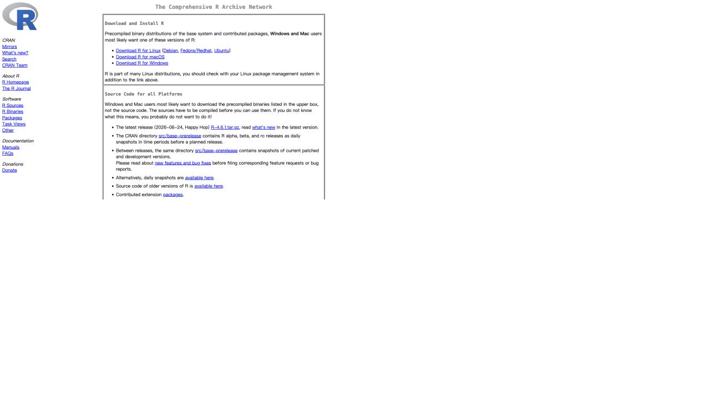
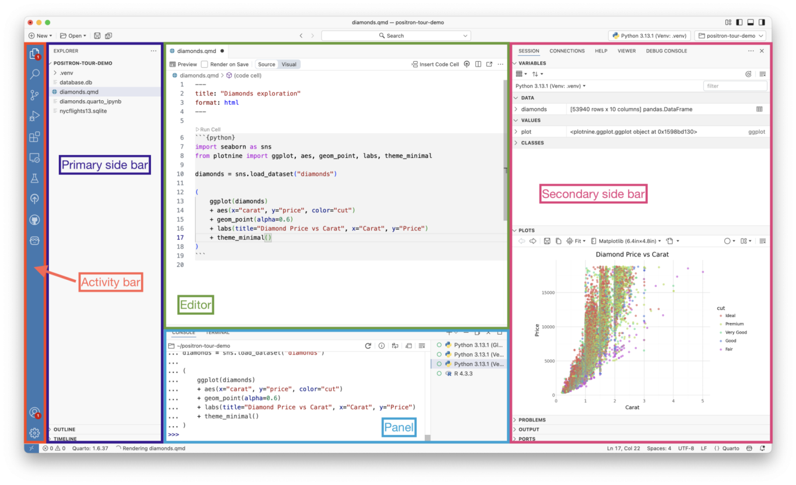
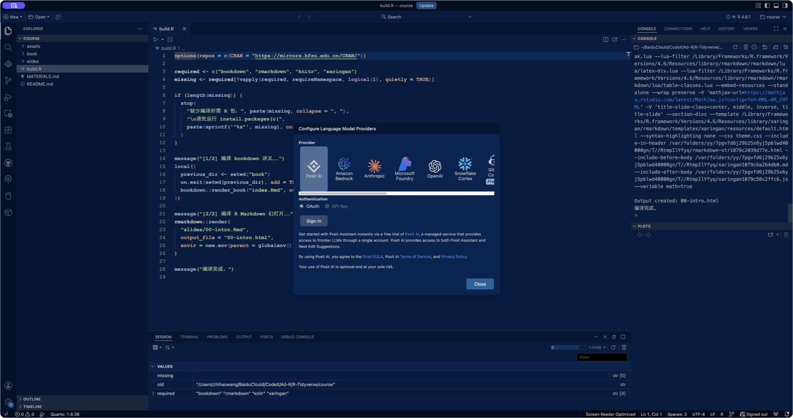
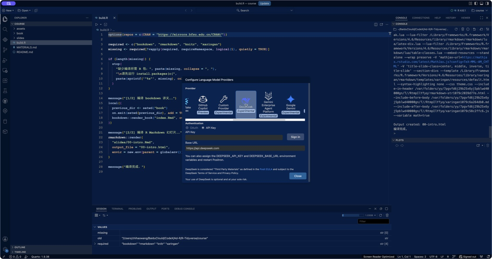

# 第 0 章 导语：从问题到代码 {#intro .unnumbered}

## 学习目标 {-}

完成本章后，你应该能够：

- 解释 R、RStudio 与 Positron 的关系，而不是把三者混为一谈；
- 按操作系统完成 R 与 IDE 的安装，并能验证安装是否成功；
- 用“分解问题—实例梳理—翻译与调试”组织一次编程任务；
- 识别 R 的面向对象、面向函数和向量化思想；
- 在 Positron 中安全地配置 Posit Assistant 与 DeepSeek，并验证其可用性；
- 判断 AI 生成的 R 代码是否值得信任。

::: {.callout}
**本章定位**：软件安装只是准备工作。真正的主线是建立“从问题到算法、从算法到代码”的思维链。
:::

## 怎么学习编程语言

编程语言是人与计算机沟通的形式语言。它要求我们使用约定的数据结构、控制结构与函数，把“想做什么”准确地表达为计算机可以逐步执行的指令。

教材给出的关键方法可以概括为：

1. **理解核心思想**：R 既面向对象，也面向函数，并倡导向量化计算；
2. **掌握基础语法**：数据结构、分支与循环、函数、文件读写、可视化；
3. **在真实问题中迁移**：查帮助、做小实验、逐段调试、解释结果。

### 跨过“能看懂”到“能写出”的门槛

```text
真实问题
  ↓  分解
可逐步解决的小问题
  ↓  用简单实例梳理
明确的算法步骤
  ↓  逐片段翻译与调试
可运行的代码
  ↓  检查中间结果与边界情况
可信的结论
```

不要试图一步从题目跳到完整代码。每完成一小步，就检查对象的类型、形状和值是否符合预期。

### 微型案例：把一句需求翻译成代码

需求：计算半径为 2、4、7 的圆的面积。

```{r circle}
area_circle <- function(r) {
  pi * r^2
}

radii <- c(2, 4, 7)
areas <- area_circle(radii)
data.frame(radius = radii, area = round(areas, 2))
```

这段代码同时体现了：函数封装、对象赋值、向量化输入与可检查的表格输出。

<details>
<summary>课堂思考：为什么不写三次面积公式？</summary>

函数把“如何计算一个圆”封装为可复用规则；向量化让同一规则一次应用到多个半径。数据规模变化时，代码结构无需改变。
</details>

## R 语言、数据科学与 tidyverse

数据科学把统计学、计算机科学与领域知识结合起来。典型工作流是：

> 导入 → 整理 → 变换 → 可视化 → 建模 → 沟通

R 是为统计计算、数据分析与图形表达设计的开源语言。它的优势包括：

- 统计方法与数据科学扩展包丰富；
- 图形语法成熟，适合探索与发表级制图；
- 交互分析与可复现报告可以在同一工作流中完成；
- 社区活跃，CRAN、Bioconductor 与 GitHub 构成丰富生态。

tidyverse 是一组共享设计理念、语法与数据结构的 R 包。它让导入、整理、变换、可视化和函数式迭代形成一致的表达方式。

### tidyverse 的核心：管道流与泛函流

教材把 tidyverse 的特点概括为“整洁流、管道流、泛函流”。其中，最值得在导语阶段建立的不是某个函数名，而是两种组织计算的方式：

- **管道流**：把数据依次交给多个函数，代码阅读顺序与分析步骤一致；
- **泛函流**：把“要重复做的事”封装成函数，再把这个函数依次应用到一组输入。

#### 管道符：让代码按数据流阅读

下面两段代码做同一件事：按气缸数分组，计算平均油耗。嵌套写法必须从内向外读；管道写法可以从上向下读。

```r
# 嵌套写法：从最里面开始读
dplyr::summarise(
  dplyr::group_by(mtcars, cyl),
  mean_mpg = mean(mpg)
)

# 原生管道：把左边结果交给右边第一个参数
mtcars |>
  dplyr::group_by(cyl) |>
  dplyr::summarise(mean_mpg = mean(mpg), .groups = "drop")
```

可以把管道理解为一句完整的话：

> **从 `mtcars` 开始，然后按 `cyl` 分组，然后计算每组的平均 `mpg`。**

tidyverse 早期广泛使用 magrittr 的 `%>%`；现代 R 课程优先使用 R 4.1 起提供的原生管道 `|>`。两者在常见数据处理中非常相似，但并不完全等价。阅读旧教材时要认识 `%>%`，自己写新代码时优先使用 `|>`。

::: {.callout}
**管道使用原则**：一行只完成一个清晰动作；当管道过长、需要反复回看，或中间结果值得命名和检查时，就拆开并保存中间对象。
:::

#### 泛函式编程：函数也是可以传递的数据

“泛函”是**接收函数作为输入，或返回函数作为输出的函数**。`purrr::map_*()` 家族接收“一组输入 + 一个函数”，完成迭代并约束输出类型。

```{r functional-map}
area_circle <- function(r) pi * r^2
radii <- c(2, 4, 7)

purrr::map_dbl(radii, area_circle)
```

这里的思维顺序是：

1. 先把“一个输入怎样处理”写成 `area_circle()`；
2. 再用 `map_dbl()` 把它应用到每个半径；
3. 函数名后缀 `_dbl` 明确承诺返回双精度数值向量。

常用映射如下：

| 函数 | 期望输出 | 典型用途 |
|---|---|---|
| `map()` | 列表 | 每次结果结构复杂或不一致 |
| `map_dbl()` | 数值向量 | 批量计算统计量 |
| `map_chr()` | 字符向量 | 批量生成标签或文件名 |
| `map_lgl()` | 逻辑向量 | 批量做条件判断 |
| `map2()` / `pmap()` | 列表 | 同时迭代两组或多组参数 |

#### 管道与泛函式如何配合

管道负责表达“一个分析要经过哪些阶段”，泛函负责表达“同一规则怎样作用于多个对象”。例如，对不同气缸组分别拟合模型：

```{r pipe-functional, eval=FALSE}
models <- mtcars |>
  dplyr::group_split(cyl) |>
  purrr::map(\(df) lm(mpg ~ wt, data = df))

purrr::map_dbl(models, \(model) summary(model)$r.squared)
```

这正是 tidyverse 的关键优势：**用一致的语法，把数据流、函数封装与批量迭代连成一条可读、可组合、可检查的工作流。**

### 三种重要编程思想

#### 面向对象

R 中的数据、函数和模型都是对象；对象带有类型或类，决定适用的操作。

```{r objects}
x <- 1:5
model <- lm(mpg ~ wt, data = mtcars)
c(class(x), class(model))
```

#### 面向函数

R 的日常工作可以理解为“把函数应用到数据”。先学会阅读帮助：

```r
?mean
args(mean)
example(mean)
```

自定义函数时，要明确输入、输出与边界情况。

#### 向量化编程

向量化是对一组数据整体表达相同操作。它通常比逐元素循环更简洁，也更贴近统计计算语言。

```{r vectorization}
scores <- c(72, 85, 91, 64)
scores + 5
scores >= 60
mean(scores)
```

## R、RStudio 与 Positron：三层关系

::: {.relation-grid}

::: {}
#### R：计算引擎 {-}

解释并执行 R 代码，管理对象，调用扩展包，完成统计计算与绘图。
:::

::: {}
#### RStudio：经典 R IDE {-}

围绕 R 工作流设计的集成开发环境，提供编辑器、控制台、环境、绘图、帮助与项目管理。
:::

::: {}
#### Positron：新一代数据科学 IDE {-}

基于 VS Code 技术路线，原生面向 R 与 Python，强调解释器、数据浏览、Notebook/Quarto 与 AI 协作。
:::

:::

**关键关系**：先安装 R，再由 RStudio 或 Positron 调用 R。IDE 不是 R 本身；删除 IDE 不等于删除 R，安装两个 IDE 也不会复制两套 R。

| 维度 | R | RStudio | Positron |
|---|---|---|---|
| 角色 | 语言与运行时 | 经典 R IDE | R/Python 数据科学 IDE |
| 是否执行 R 代码 | 是 | 调用 R | 调用 R |
| 强项 | 统计计算、包生态 | 纯 R 教学、R Project、成熟工作流 | R/Python 混合、数据浏览、现代编辑器、AI |
| 更适合 | 所有 R 用户的底座 | 初学者与以 R 为主的分析 | 多语言项目与现代数据科学工作流 |

::: {.callout}
**课程建议**：两者都认识，课堂主环境使用 Positron；遇到教材中的 RStudio 截图时，能把相同功能映射到 Positron。
:::

## 安装 R

安装顺序：**R → IDE → R 包 → 项目验证**。

```{r cran-shot, echo=FALSE, fig.cap="CRAN 官方首页：先按操作系统选择 R 安装入口（网页截图，2026-08）", out.width="100%"}

```

图中最重要的是顶部三个入口：**Download R for Linux**、**Download R for macOS** 和 **Download R for Windows**。CRAN 是 R 本体与扩展包的官方分发网络；RStudio 与 Positron 的下载不在这里。

### Windows

1. 打开 [CRAN](https://cran.r-project.org/)，选择 **Download R for Windows**；
2. 进入 `base`，下载当前稳定版安装程序；
3. 使用默认的 64 位安装选项；建议使用无中文、无特殊字符的项目路径；
4. 打开 R，运行 `R.version.string` 验证。

如需编译含 C/C++/Fortran 的 R 包，再按当前 R 版本安装匹配的 Rtools。普通课程初期不必先安装 Rtools。

### macOS

1. 在 CRAN 选择 **Download R for macOS**；
2. 根据芯片选择 Apple Silicon (`arm64`) 或 Intel (`x86_64`) 安装包；
3. 完成 `.pkg` 安装后启动 R，运行 `R.version.string`。

可在“关于本机”查看芯片类型。不要把 Intel 与 Apple Silicon 安装包混用。

### Linux（Ubuntu / Debian）

优先按 CRAN 对应发行版页面配置软件源，然后通过系统包管理器安装 `r-base`。课程机房如由管理员维护，应使用统一版本，避免学生自行更换系统源。

### 验证 R 与安装常用包

```{r installation-check, eval=FALSE}
R.version.string
Sys.info()[c("sysname", "release", "machine")]

install.packages(c("tidyverse", "rmarkdown", "bookdown", "xaringan"))
library(tidyverse)
```

国内网络可临时指定 CRAN 镜像：

```r
options(repos = c(CRAN = "https://mirrors.bfsu.edu.cn/CRAN/"))
```

## 安装与认识 RStudio

1. 先确认 R 已安装；
2. 从 [Posit 下载页](https://posit.co/downloads/) 获取 RStudio Desktop；
3. 按系统安装程序完成安装；
4. 启动 RStudio，在 Console 中运行 `R.version.string`。

```{r rstudio-shot, echo=FALSE, fig.cap="RStudio 当前界面示例（窗格可在 Tools → Global Options → Pane Layout 中调整）", out.width="100%"}
knitr::include_graphics("assets/screenshots/rstudio-panes-official.jpeg")
```

界面功能映射：

1. **Source**：编写并保存 `.R`、`.Rmd`、`.qmd`；
2. **Console**：交互执行短命令，查看错误与输出；
3. **Environment / History**：查看会话对象与命令历史；
4. **Output**：Files、Plots、Packages、Help、Viewer；
5. **Sidebar / Posit Assistant**：新版可放置辅助工具，具体能力取决于版本与账户配置。

RStudio 的优势是 R 教学路径成熟、窗格概念清晰、R Project 与包开发支持稳定。其局限是多语言与现代编辑器扩展体验不如 Positron 统一。

上图来自 [RStudio User Guide: Get Started](https://docs.posit.co/ide/user/ide/get-started/)，官方已直接标出四个核心窗格。初学阶段先掌握 **Source → Console → Environment → Output** 的信息流，不必一次记住所有标签页。

## 安装与认识 Positron

1. 从 [Positron 官方安装页](https://positron.posit.co/install) 下载对应系统版本；
2. 按系统常规方式安装并启动；
3. 打开课程文件夹；
4. 点击右上角 **Start Session**，选择已安装的 R；
5. 在 Console 执行 `R.version.string` 与 `getwd()` 验证解释器和项目路径。

```{r positron-shot, echo=FALSE, fig.cap="Positron 当前界面示例；打开项目并启动 R 会话后，各数据科学窗格会显示内容", out.width="100%"}

```

主要区域：

1. **Activity Bar / Explorer**：项目文件、搜索、版本控制、扩展；
2. **Editor**：R 脚本、R Markdown、Quarto 与 Notebook；
3. **Console / Terminal / Problems / Output**：交互会话、系统终端与诊断；
4. **Variables / Data Explorer**：查看对象、筛选和检查表格数据；
5. **Plots / Viewer / Help / Connections**：图形、HTML 结果、帮助与连接；
6. **Posit Assistant**：结合当前文件、会话对象、图形与控制台历史辅助分析。

Positron 的优势是 R 与 Python 的统一体验、现代代码编辑能力、解释器管理、数据浏览和 AI 上下文；对于只使用 R 的入门者，按钮与命令入口较多，需要先掌握最小工作流。

上图来自 Posit 官方文章 [A quick tour of Positron](https://posit.co/blog/a-quick-tour-of-positron)。与 RStudio 对照时，不要强求窗格位置一一相同，而要找功能：编辑器对应 Source，Console 对应 Console，Variables 对应 Environment，Plots/Viewer/Help 对应 Output。

## 配置 Posit Assistant + DeepSeek

> **版本提示（2026-08）**：Positron 2026.07 起默认提供 **Posit Assistant**，它取代旧称 **Positron Assistant**。新版已经提供原生的 **DeepSeek (Experimental)** 提供商；旧版教程中的 Custom Provider 仍可作为兼容方案。

### 准备 API Key

1. 登录 [DeepSeek 开放平台](https://platform.deepseek.com/)；
2. 在 API Keys 页面创建密钥并充值或确认额度；
3. 创建后立即存入密码管理器。不要截图、粘贴到讲义、写入 R 脚本或提交到 Git。

### 推荐：使用 Positron 原生 DeepSeek 提供商

1. 在 Positron 按 `Ctrl/⌘ + Shift + P` 打开命令面板；
2. 运行 **Authentication: Configure Language Model Providers**；
3. 选择 **DeepSeek (Experimental)**；
4. 按提示粘贴 API Key；
5. 运行 **View: Show Posit Assistant** 打开侧栏；
6. 在模型选择器中选 `deepseek-v4-flash` 或 `deepseek-v4-pro`；
7. 发送测试问题，例如：“解释当前 R 文件中 `summarise()` 的输入与输出，不要修改文件。”

```{r provider-list-shot, echo=FALSE, fig.cap="Positron 的 Language Model Providers 列表；DeepSeek 已作为 Experimental 提供商出现（本机截图，2026-08）", out.width="100%"}

```

```{r deepseek-auth-shot, echo=FALSE, fig.cap="选择 DeepSeek 后的认证入口：只在安全输入框粘贴密钥，Base URL 默认为 https://api.deepseek.com（截图中未输入任何真实密钥）", out.width="100%"}

```

也可在启动 Positron 前设置系统环境变量 `DEEPSEEK_API_KEY`。不要把真实密钥写进项目的 `.Renviron`；若教学演示必须使用环境文件，应放到用户级文件并确保不被同步或提交。

### 兼容旧版：Custom Provider

旧版 Positron 若没有 DeepSeek 选项：

1. 选择 **Custom Provider (Experimental)**；
2. Base URL 填写 `https://api.deepseek.com`；
3. 输入 DeepSeek API Key；
4. 如模型列表无法自动加载，在用户 `settings.json` 中配置：

```json
{
  "positron.assistant.models.overrides.customProvider": [
    {"name": "DeepSeek V4 Flash", "identifier": "deepseek-v4-flash"},
    {"name": "DeepSeek V4 Pro", "identifier": "deepseek-v4-pro"}
  ]
}
```

截至 2026-08，旧模型名 `deepseek-chat` 与 `deepseek-reasoner` 已进入弃用迁移阶段，课堂示例使用 V4 模型名。

### 安全与验证清单

- Assistant 会把提示、选中的代码与允许的上下文发送给所选模型提供商；先阅读提供商的数据政策；
- 不发送未脱敏的学生信息、成绩、身份证号或研究敏感数据；
- 首次练习保持 sandbox mode 开启；
- 要求 AI 解释假设、包版本和预期输出；
- 逐段运行，检查对象结构与异常输入；
- AI 生成结果不是证据，统计结论仍需人工复核。

::: {.task}
**课堂验证任务**：让 Assistant 生成一个 `mtcars` 的散点图，然后检查它是否使用正确变量、是否加载了需要的包、坐标轴是否有意义。故意删掉一个右括号，再让 Assistant 只解释错误并给出最小修改。
:::

## 最小项目工作流

### 第一步：用 RStudio 图形界面建立项目边界

在 RStudio 点击右上角 **Project: (None)** 或工具栏的项目按钮，选择 **New Project**。项目向导提供三条路径：

```{r project-wizard-shot, echo=FALSE, fig.cap="RStudio New Project Wizard：新目录、现有目录、版本控制三种入口（本机截图，2026-08）", out.width="100%"}
knitr::include_graphics("assets/screenshots/rstudio-project-wizard.png")
```

1. **New Directory**：课程新作业最常用；RStudio 新建文件夹并创建 `.Rproj`；
2. **Existing Directory**：已有数据和脚本时使用；把现有文件夹变成项目；
3. **Version Control**：从 Git 仓库开始，适合团队协作与版本管理。

创建或打开项目后，右上角会显示项目名，Files 窗格以项目根目录为起点，Console 的工作目录也随项目切换。此时 `getwd()` 应指向项目目录。

### 第二步：用四窗格完成一次可复现循环

```{r rstudio-workflow-shot, echo=FALSE, fig.cap="RStudio 图形界面中的最小循环：Source 编写 → Console 运行 → Environment/Plots 检查 → Files 保存", out.width="100%"}
knitr::include_graphics("assets/screenshots/rstudio-interface.png")
```

在界面上按以下顺序操作：

1. 在 **Files** 新建 `R/`、`analysis/`、`output/` 等目录；
2. 在 **Source** 新建并保存脚本，不把长期代码只留在 Console；
3. 用 `Ctrl/⌘ + Enter` 将当前行或选区发送到 **Console**；
4. 在 **Environment** 检查对象名、类型与大小，在 **Plots/Viewer** 检查图形或 HTML；
5. 保存源文件，重启 R 后从头运行；只有完整成功才算可复现。

### 第三步：让目录结构支持相对路径

建议每个分析任务使用独立项目目录：

```text
my-project/
├── data/          # 原始数据（原则上只读）
├── R/             # 可复用函数
├── analysis/      # Rmd/Qmd 分析文件
├── output/        # 图、表与报告
├── README.md
└── my-project.Rproj（使用 RStudio 时）
```

1. 打开项目目录；
2. 启动 R 会话并确认 `getwd()`；
3. 使用相对路径；
4. 在脚本或 R Markdown 中保存可复现代码；
5. 从空会话重新运行，确认结果可以复现。

## 本章小结

- R 是计算引擎；RStudio 与 Positron 是调用 R 的开发环境；
- RStudio 强在成熟、聚焦的 R 工作流，Positron 强在 R/Python、现代编辑和 AI 数据科学体验；
- 学编程要把问题拆解为算法步骤，再逐片段翻译与调试；
- 函数、对象与向量化是理解 R 的三把钥匙；
- Posit Assistant 可以接入 DeepSeek，但密钥安全、数据边界与结果验证不能交给 AI。

## 课后练习

1. 完成 R、RStudio、Positron 安装，并提交三条验证结果：`R.version.string`、`getwd()`、`sessionInfo()`；
2. 用自己的话画出 R—IDE—R 包三层关系图；
3. 把“计算一组成绩的优秀率”分解为不少于四个算法步骤，再翻译成 R 代码；
4. 使用 Posit Assistant 请求代码解释，记录一处你发现并修正的 AI 问题；
5. 思考：什么时候应该关闭 Assistant 或不给它读取当前项目？

## 本章来源与延伸阅读 {-}

- 张敬信：《R 语言编程：基于 tidyverse》，导语与第 1.1 节。
- [The R Project / CRAN](https://cran.r-project.org/)
- [RStudio User Guide: Get Started](https://docs.posit.co/ide/user/ide/get-started/)
- [Install Positron](https://positron.posit.co/install)
- [Posit Assistant: Get started](https://positron.posit.co/assistant-getting-started)
- [Posit Assistant providers](https://positron.posit.co/assistant-providers.html)
- [DeepSeek API: Your First API Call](https://api-docs.deepseek.com/quick_start/pricing-details-cny/)
