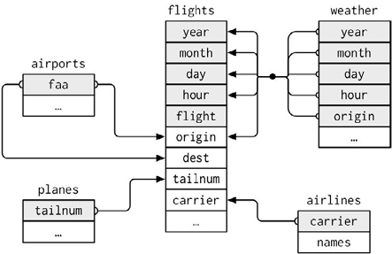
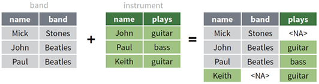
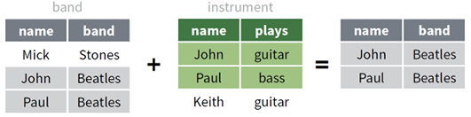
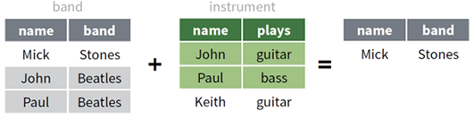

# 数据操作 {#data-manipulation}

```{r ch02-setup, echo=TRUE}
library(tidyverse)
set.seed(2023)

# 本章示例均为教学用合成数据，不对应任何真实个人。
students <- tribble(
  ~student_id, ~class, ~name, ~gender, ~chinese, ~math, ~english,
  "S01", "A班", "晨曦", "女", 86, 92, 88,
  "S02", "A班", "远航", "男", 79, 75, NA,
  "S03", "A班", "星河", "女", 91, 89, 95,
  "S04", "B班", "青禾", "男", 68, 72, 74,
  "S05", "B班", "知夏", "女", 88, NA, 90,
  "S06", "B班", "景明", "男", 77, 81, 79
)

majors <- tribble(
  ~student_id, ~major,
  "S01", "统计学",
  "S02", "经济学",
  "S03", "数据科学",
  "S05", "统计学",
  "S07", "数学"
)

sales_wide <- tribble(
  ~store, ~`2024_Q1`, ~`2024_Q2`, ~`2024_Q3`,
  "东区", 120, 138, 145,
  "西区", 105, 111, 126,
  "南区", 98, 114, 119
)
```

上一章把向量化与函数式编程用于向量、列表和函数；本章按照教材第 2 章的顺序，把这些思想提升到数据框：先认识 tidyverse 与管道，再学习数据读写、连接、重塑和五类基本操作，继而处理按行、窗口、滑窗与整洁计算，最后用 data.table 建立另一套高性能数据语法。

> **教材主线**：复杂的数据任务通常不是由一个“万能函数”完成，而是先被拆成若干可以验证的基本操作，再通过管道连接起来。

## 本章学习目标 {-}

完成本章后，你应当能够：

1. 用管道把数据操作写成从输入到输出的可读流程；
2. 根据文件格式、编码和数据规模选择读写函数；
3. 先检查键及其关系，再安全地连接多个数据表；
4. 识别整洁数据，并在长表、宽表和嵌套结构之间转换；
5. 熟练组合 `select()`、`mutate()`、`filter()`、`arrange()`、`summarise()` 与 `group_by()`；
6. 理解按行计算、窗口函数、滑窗迭代和整洁计算的适用边界；
7. 读懂 data.table 的 `DT[i, j, by]` 语法，并理解按引用修改。

<div class="callout">
<strong>本章的读代码约定</strong>：代码注释重点解释“为什么做这一步”“数据形状怎样变化”和“结果怎样检查”。先读注释预测输出，再运行代码；不要把注释当作跳过思考的答案。
</div>

## tidyverse 简介与管道

### tidyverse 包简介

tidyverse 不是单个函数包，而是一组遵循相近设计原则的 R 包。核心包覆盖数据导入、整理、转换、可视化和函数式迭代。

| 任务 | 主要包 | 本章常用函数 |
|---|---|---|
| 数据导入 | readr | `read_csv()`, `write_csv()`, `read_rds()` |
| 数据整理 | tidyr | `pivot_longer()`, `pivot_wider()`, `separate()` |
| 数据转换 | dplyr | `filter()`, `mutate()`, `summarise()`, `*_join()` |
| 字符处理 | stringr | `str_*()` |
| 函数式迭代 | purrr | `map_*()`, `walk_*()`, `reduce()` |
| 数据可视化 | ggplot2 | `ggplot()`, `geom_*()` |

教材把 tidyverse 的优势概括为统一的数据结构、相对一致的接口，以及可以由管道组织的整洁流程。更深一层，它把两种思维结合起来：

- **向量化**：一次处理一整列，而不是手工遍历每个单元格；
- **函数式编程**：把“要重复的动作”表示为函数，再交给 `across()`、`map()` 或分组机制批量应用。

```{r ch02-functional-core}
# 目标：对每个班级的三门成绩使用同一汇总规则。
class_summary <- students |>
  group_by(class) |>                         # 先把数据拆成 A班、B班两个组
  summarise(
    across(
      chinese:english,                       # 同时选择三门数值列
      \(x) mean(x, na.rm = TRUE),            # 同一个函数作用于每一列、每一组
      .names = "avg_{.col}"                 # 让结果列名说明统计量和原列
    ),
    .groups = "drop"                         # 汇总后解除分组，避免影响后续操作
  )

class_summary
```

这段代码没有写六次 `mean()`。`group_by()`负责“按组拆分”，`across()`负责“按列拆分”，匿名函数只描述一个小单元应怎样计算，最后由 dplyr 自动合并结果。这正是教材所强调的“分解—分别操作—重新组合”。

### 管道操作

管道把左侧对象传给右侧函数。课程以 R 自带的 `|>` 为主，同时要求能够识别教材和旧项目中常见的 `%>%`。

```{r ch02-pipe-basics}
# 目标：从 mtcars 中找出各气缸组平均油耗最高的组。
best_group <- mtcars |>
  as_tibble(rownames = "model") |>           # 行名转为普通列，便于后续保留车型名
  group_by(cyl) |>                            # 后续汇总分别在每个气缸组内进行
  summarise(
    n = n(),
    avg_mpg = mean(mpg),
    .groups = "drop"
  ) |>
  arrange(desc(avg_mpg))                     # 最后把平均油耗从高到低排列

best_group
```

读管道时从上到下读成一句话：“取 `mtcars`，转成 tibble，按气缸数分组，计算样本量和平均油耗，再按平均油耗降序排列。”每一步都返回下一步可以接收的数据框。

#### 参数不是第一个位置时

R 原生管道默认把左侧结果放到右侧函数的第一个参数。若目标位置不是第一个参数，可用匿名函数明确说明。

```{r ch02-pipe-position}
letters[1:4] |>
  (\(x) stringr::str_c("变量：", x))()       # x 明确进入 str_c() 的第二个位置
```

使用 `%>%` 时，教材中的占位符 `.` 可以把数据放到其他参数位置；原生 `|>` 不把 `.` 当作通用占位符。因此课程代码优先使用小型匿名函数，它的输入位置最清楚。

#### 调试长管道

不要等到管道最后才看结果。可以给关键中间结果命名，或临时在中间插入 `glimpse()`。

```{r ch02-pipe-debug}
# 先单独检查筛选是否符合预期，再继续汇总。
complete_scores <- students |>
  filter(if_all(chinese:english, \(x) !is.na(x)))

glimpse(complete_scores)

# 在确认行数和列类型后，再计算每位学生的均分。
complete_scores |>
  mutate(avg_score = rowMeans(pick(chinese:english))) |>
  select(student_id, name, avg_score)
```

## 数据读写

### 用于数据读写的包与函数

教材按格式介绍了常见数据导入包。选择工具时先问“文件是什么格式”，再问“是否需要保留标签、公式或工作表结构”。

| 格式 | 推荐包 | 读取函数示例 | 说明 |
|---|---|---|---|
| CSV/TSV/分隔文本 | readr | `read_csv()`, `read_tsv()` | 返回 tibble，列类型诊断清楚 |
| Excel | readxl | `read_excel()`, `read_xlsx()` | 可指定工作表和单元格范围 |
| SPSS/Stata/SAS | haven | `read_sav()`, `read_dta()`, `read_sas()` | 尽量保留标签信息 |
| JSON | jsonlite | `fromJSON()` | 常需要后续方形化 |
| Word/PDF/纯文本集合 | readtext | `readtext()` | 面向文本语料导入 |
| R 单对象 | readr/base R | `read_rds()`, `readRDS()` | 保留 R 类型和属性 |

安装扩展包只做一次；分析脚本中使用 `library()` 或 `包名::函数名()`。对于不一定每台课堂电脑都安装的包，本章示例用 `包名::函数名()` 标明来源。

### 数据读写实例

#### 读取 CSV：先描述缺失值与列类型

```{r ch02-read-csv}
# 目标：模拟读取一个含中文、日期和缺失标记的 CSV 文件。
csv_text <- I(
  "student_id,name,exam_date,score\nS01,晨曦,2024-06-01,92\nS02,远航,2024-06-01,缺考"
)

exam <- read_csv(
  csv_text,
  na = "缺考",                                # 明确业务中的缺失值标记
  col_types = cols(
    student_id = col_character(),             # 学号不是用于运算的数值
    name = col_character(),
    exam_date = col_date(format = "%Y-%m-%d"),
    score = col_double()
  )
)

glimpse(exam)                                 # 检查解析后的类型，而不只看打印值
```

现实数据中，身份证号、邮编、带前导零的编码通常应读为字符。自动猜测很方便，但关键字段应显式指定类型。

#### 批量读取

当前 readr 可以直接接收多个同结构文件路径，并用 `id` 记录来源文件。

```{r ch02-batch-read, eval=FALSE}
# 目标：把 data/monthly/ 下所有月度 CSV 纵向合并。
files <- fs::dir_ls("data/monthly", glob = "*.csv")

monthly <- readr::read_csv(
  files,
  id = "source_file",                         # 保留来源，便于追踪异常记录
  show_col_types = FALSE
)

count(monthly, source_file)                   # 检查每个文件贡献了多少行
```

Excel 批量导入通常先列出文件或工作表，再用 `map_dfr()`逐个读取并按行合并。

```{r ch02-batch-excel, eval=FALSE}
# 多个工作簿：每个文件结构相同。
excel_files <- fs::dir_ls("data/monthly", glob = "*.xlsx")

excel_data <- excel_files |>
  set_names(path_file(excel_files)) |>         # 名称将在 .id 中成为来源标签
  map_dfr(readxl::read_xlsx, .id = "source_file")

# 一个工作簿的多个工作表：先取得工作表名称，再逐表读取。
book_path <- "data/sales.xlsx"
sheet_data <- readxl::excel_sheets(book_path) |>
  set_names() |>
  map_dfr(\(sheet) readxl::read_xlsx(book_path, sheet = sheet),
          .id = "sheet")
```

#### 写出 CSV、Excel 与 RDS

```{r ch02-write-files, eval=FALSE}
# CSV 适合与其他软件交换；write_excel_csv() 会写入 UTF-8 BOM，
# 在部分桌面版 Excel 中直接打开中文时更稳妥。
write_csv(class_summary, "output/class_summary.csv")
write_excel_csv(class_summary, "output/class_summary_excel.csv")

# RDS 适合保存一个 R 对象，并保留日期、因子、列表列等 R 类型。
write_rds(class_summary, "output/class_summary.rds")
class_summary_again <- read_rds("output/class_summary.rds")

# 多工作表 Excel 需要 writexl 或 openxlsx 等扩展包。
writexl::write_xlsx(
  list("班级汇总" = class_summary, "学生明细" = students),
  "output/teaching_report.xlsx"
)
```

<div class="warning">
<strong>写文件前的三项检查</strong>：输出目录是否存在；文件是否会覆盖已有结果；导出后能否重新读入并保持行数、列名和关键类型。
</div>

### 连接数据库

教材以 MySQL 展示 DBI 与 dbplyr 的工作流。课堂用 SQLite 内存数据库复现同一思想：连接、写表、延迟查询、收集结果、断开连接。这样不需要服务器，也不会在讲义中暴露账号或密码。

```{r ch02-database}
# 1. 建立只存在于当前 R 会话中的 SQLite 数据库。
con <- DBI::dbConnect(RSQLite::SQLite(), ":memory:")

# 2. 写入教学数据；overwrite 只针对这个临时数据库中的同名表。
DBI::dbWriteTable(con, "students", students, overwrite = TRUE)

# 3. tbl() 创建远程表引用；下面的动词先被翻译成 SQL，不立刻取回全部数据。
remote_students <- dplyr::tbl(con, "students")
query <- remote_students |>
  filter(math >= 80) |>
  select(student_id, class, name, math)

show_query(query)                              # 检查 dbplyr 生成的 SQL
db_result <- collect(query)                    # 到这里才把结果取回本地 R

db_result
DBI::dbDisconnect(con)                         # 用完连接后主动释放资源
```

真实数据库的凭据不应写在 Rmd、脚本或 Git 仓库中。可以从环境变量读取，并只在本地设置：

```{r ch02-database-secret, eval=FALSE}
con <- DBI::dbConnect(
  RMariaDB::MariaDB(),
  host = Sys.getenv("DB_HOST"),
  user = Sys.getenv("DB_USER"),
  password = Sys.getenv("DB_PASSWORD")        # 不把密码字面量写入代码
)
```

### 关于中文编码

编码是“字符与字节之间的映射规则”。同一组字节若用错误规则解释，就会出现乱码。UTF-8 是跨平台项目的首选；GBK/GB18030 仍常见于历史中文文件。

```{r ch02-encoding, eval=FALSE}
# 文件本身是 GBK 时，要在读取阶段告诉 readr 正确的解码规则。
legacy <- read_csv(
  "data/legacy_gbk.csv",
  locale = locale(encoding = "GB18030")
)

# 不确定时可先抽取字节样本做启发式检测，再用业务常识核对。
readr::guess_encoding("data/legacy_gbk.csv")
```

处理乱码按以下顺序排查：

1. 确认文件实际编码，不要只看扩展名；
2. 在读取函数中指定与文件一致的 `locale(encoding = ...)`；
3. 读入后检查关键中文字段和行数；
4. 项目内部统一转为 UTF-8；
5. 导出给 Excel 时，根据接收环境选择 `.xlsx` 或带 BOM 的 CSV。

## 数据连接

多个数据表通过“键”建立关系。连接前必须回答三个问题：**用哪些列匹配、这些列在每张表中是否唯一、未匹配记录应怎样处理。**

教材用纽约航班数据展示了一个典型的关系数据模型：`flights` 是中心事实表，机场、飞机、航空公司和天气分别保存在其他表中。图中的连线不是“表看起来有关”，而是指出了可用于匹配的键。

```{r ch02-relational-model-figure, echo=FALSE, fig.align='center', out.width='68%', fig.cap='教材中的关系数据模型：多张表通过单键或复合键与航班事实表关联（原书图 2.10）', fig.alt='纽约航班关系数据模型，中心为 flights 表，周围为 airports、planes、weather 和 airlines 表，箭头连接相应键列'}

```

阅读这张图时，应把注意力放在“键由哪些列组成”：

- `flights$tailnum` 与 `planes$tailnum` 连接，补充飞机属性；
- `flights$carrier` 与 `airlines$carrier` 连接，补充航空公司名称；
- `flights$origin`、`flights$dest` 可分别与 `airports$faa` 连接；
- 航班与天气需要用 `year + month + day + hour + origin` 组成复合键。只用日期或机场中的某一列，通常无法唯一定位一条天气记录。

这说明连接键不一定只有一列，而且同一张表中的不同列可以分别指向另一张表的同一个主键。

```{r ch02-key-check}
# 检查键是否唯一：结果为 0 行，说明 majors 中 student_id 没有重复。
majors |>
  count(student_id) |>
  filter(n > 1)

# 检查左表中有哪些键在右表找不到；这往往是连接前最有价值的诊断。
students |>
  anti_join(majors, by = join_by(student_id)) |>
  select(student_id, name)
```

一对多连接会让左表某一行复制成多行，这不一定是错误。例如“一个学生选多门课”本来就是一对多关系。危险的是在不知道关系的情况下意外制造行数膨胀。

### 合并行与合并列

```{r ch02-bind}
spring <- tibble(student_id = c("S01", "S02"), term = "春季", score = c(88, 79))
autumn <- tibble(student_id = c("S01", "S03"), term = "秋季", score = c(91, 95))

# bind_rows() 根据列名纵向堆叠；行数相加，列的含义必须一致。
all_terms <- bind_rows(spring, autumn, .id = "source_table")
all_terms

# bind_cols() 只按当前位置横向拼接，不根据键匹配。
# 只有两边行数和行序都已经确认一致时才使用。
bind_cols(
  students |> select(student_id, name),
  students |> transmute(total_known = rowSums(pick(chinese:english), na.rm = TRUE))
)
```

若数据来自不同业务实体，优先使用连接而不是 `bind_cols()`；行序很容易在筛选或排序后改变。

### 根据值匹配合并数据框

#### 六种连接的保留规则

| 函数 | 保留哪些行 | 是否增加右表列 | 典型问题 |
|---|---|---:|---|
| `left_join()` | 左表全部 | 是 | 给主表补充属性 |
| `right_join()` | 右表全部 | 是 | 以右表为主表补属性 |
| `full_join()` | 两表并集 | 是 | 汇总所有出现过的键 |
| `inner_join()` | 两表交集 | 是 | 只分析两边都有的对象 |
| `semi_join()` | 左表中匹配者 | 否 | 谁在名单里 |
| `anti_join()` | 左表中未匹配者 | 否 | 谁没有匹配成功 |

#### 如何阅读教材中的六种连接图

下面沿用教材中的 `band_members` 与 `band_instruments` 两张小表。图中灰色区域来自左表 `band`，绿色区域来自右表 `instrument`；结果表中的 `<NA>` 表示该键在另一张表没有匹配记录。

```{r ch02-join-figure-data}
# 教材图中的两张表：name 是连接键。
band <- dplyr::band_members
instrument <- dplyr::band_instruments

band
instrument
```

##### 左连接：以左表为观察名单

`left_join()` 保留左表的全部行。Mick 在右表中没有乐器记录，因此结果中的 `plays` 为 `NA`；右表独有的 Keith 不会进入结果。

```{r ch02-join-left-example}
band |>
  left_join(instrument, by = join_by(name))
```

```{r ch02-join-left-figure, echo=FALSE, fig.align='center', out.width='84%', fig.cap='左连接：保留左表全部成员，并把右表中匹配的 plays 列补到结果中（原书图 2.11）', fig.alt='左连接示意图，结果保留 Mick、John 和 Paul，Mick 的 plays 为缺失值'}
knitr::include_graphics("assets/textbook/ch02/join-left.png")
```

##### 右连接：以右表为观察名单

`right_join()` 保留右表的全部行。Keith 在左表中没有乐队信息，所以结果中的 `band` 为 `NA`；左表独有的 Mick 不会进入结果。

```{r ch02-join-right-example}
band |>
  right_join(instrument, by = join_by(name))
```

```{r ch02-join-right-figure, echo=FALSE, fig.align='center', out.width='84%', fig.cap='右连接：保留右表全部成员，并把左表中匹配的 band 列补到结果中（原书图 2.12）', fig.alt='右连接示意图，结果保留 John、Paul 和 Keith，Keith 的 band 为缺失值'}
knitr::include_graphics("assets/textbook/ch02/join-right.png")
```

##### 全连接：保留两张表出现过的所有键

`full_join()` 取两表键的并集。Mick 和 Keith 都被保留，但各自在另一张表中没有的信息显示为 `NA`。

```{r ch02-join-full-example}
band |>
  full_join(instrument, by = join_by(name))
```

```{r ch02-join-full-figure, echo=FALSE, fig.align='center', out.width='84%', fig.cap='全连接：保留两张表中出现过的全部 name（原书图 2.13）', fig.alt='全连接示意图，结果包含 Mick、John、Paul 和 Keith，未匹配的 band 或 plays 为缺失值'}

```

##### 内连接：只保留两张表共有的键

`inner_join()` 取两表键的交集。只有 John 和 Paul 同时存在于两张表，因此 Mick 与 Keith 都被排除。

```{r ch02-join-inner-example}
band |>
  inner_join(instrument, by = join_by(name))
```

```{r ch02-join-inner-figure, echo=FALSE, fig.align='center', out.width='84%', fig.cap='内连接：只保留两张表中都能匹配的 name（原书图 2.14）', fig.alt='内连接示意图，结果只包含 John 和 Paul 及其乐队与乐器信息'}
knitr::include_graphics("assets/textbook/ch02/join-inner.png")
```

##### 半连接：用右表判断是否保留左表行

`semi_join()` 只返回左表的列。它用右表回答“左表的哪些对象存在匹配”，不会把 `plays` 添加到结果中。

```{r ch02-join-semi-example}
band |>
  semi_join(instrument, by = join_by(name))
```

```{r ch02-join-semi-figure, echo=FALSE, fig.align='center', out.width='84%', fig.cap='半连接：保留左表中能够在右表找到匹配的行，但不增加右表列（原书图 2.15）', fig.alt='半连接示意图，结果只保留左表中的 John 和 Paul 两行，不包含 plays 列'}

```

##### 反连接：把未匹配记录变成检查清单

`anti_join()` 也只返回左表的列，但保留的是右表中找不到匹配的行。它特别适合检查漏填、编码错误和主数据缺口。

```{r ch02-join-anti-example}
band |>
  anti_join(instrument, by = join_by(name))
```

```{r ch02-join-anti-figure, echo=FALSE, fig.align='center', out.width='84%', fig.cap='反连接：保留左表中无法在右表找到匹配的行（原书图 2.16）', fig.alt='反连接示意图，结果只保留左表中的 Mick 一行'}

```

六幅图可以压缩为两个判断：修改连接先决定保留左表、右表、并集还是交集；过滤连接只决定左表的哪些行留下，并不添加右表的列。

#### 将连接规则迁移到学生数据

```{r ch02-joins}
# 左连接：保留 students 的 6 行，为能匹配的学生补上 major。
student_profile <- students |>
  left_join(majors, by = join_by(student_id))

student_profile |>
  select(student_id, name, major)

# 内连接：只保留两张表都出现的 student_id。
students |>
  inner_join(majors, by = join_by(student_id)) |>
  select(student_id, name, major)

# 半连接只筛行、不添列；适合取得“已有专业信息的学生”。
students |>
  semi_join(majors, by = join_by(student_id)) |>
  select(student_id, name)
```

当前 dplyr 的 `join_by()` 还支持不等连接、滚动连接和区间重叠连接。本章先掌握等值连接。若键列名不同，可以写 `join_by(left_id == right_id)`。

#### 主动检查连接结果

```{r ch02-join-audit}
before_n <- nrow(students)

joined <- students |>
  left_join(majors, by = join_by(student_id))

tibble(
  stage = c("连接前", "连接后"),
  rows = c(before_n, nrow(joined)),
  unique_ids = c(n_distinct(students$student_id),
                 n_distinct(joined$student_id))
)
```

若预期一对一，连接后行数却增加，应立即检查左右键的重复值。当前 dplyr 会对意外的多对多等值连接发出警告；确认多对多确为业务事实后，才显式声明相应关系。

#### 多表依次连接

```{r ch02-reduce-join}
contact <- tibble(student_id = c("S01", "S03", "S06"), city = c("北京", "上海", "广州"))

# reduce() 把同一个二元连接函数依次应用到表列表。
list(students, majors, contact) |>
  reduce(full_join, by = join_by(student_id)) |>
  select(student_id, name, major, city) |>
  arrange(student_id)
```

### 集合运算

集合运算把整行当作集合元素，要求两张表具有兼容的列。

```{r ch02-set-ops}
x <- tibble(id = c("A", "B", "C"))
y <- tibble(id = c("B", "C", "D"))

intersect(x, y)   # 两边都有
union(x, y)       # 任一边出现，自动去重
setdiff(x, y)     # x 有、y 没有；方向不能交换
setequal(x, y)    # 忽略行序后判断集合是否相同
```

## 数据重塑

### 什么是整洁的数据

整洁数据的三个规则是：每个变量一列、每个观测一行、每个值一个单元格。判断“变量”和“观测”必须结合研究问题；同一张表在不同分析目标下可能需要不同形状。

<div class="callout">
<strong>识别宽表中的隐藏变量</strong>：如果列名中出现年份、季度、组别或指标名称，这些列名很可能本应是一列中的“值”。
</div>

```{r ch02-wide-data}
sales_wide
```

这里 `2024_Q1`、`2024_Q2`、`2024_Q3` 不是三个变量，而是“年份”和“季度”的取值；单元格中的数才是销售额。

### 宽表变长表

```{r ch02-pivot-longer}
# 目标：把季度藏在列名中的宽表整理成长表。
sales_long <- sales_wide |>
  pivot_longer(
    cols = starts_with("2024_"),               # 只重塑季度列，store 保持不动
    names_to = c("year", "quarter"),          # 列名按下划线拆成两个变量
    names_sep = "_",
    values_to = "sales"                        # 原单元格值统一进入 sales 列
  ) |>
  mutate(year = as.integer(year))              # 重塑后年份是字符，再转为整数

sales_long
```

重塑前是 3 行 × 4 列；重塑后是 9 行 × 4 列。行数增加不是数据重复，而是每一行现在只表示“一个门店在一个季度的一次观测”。

当列名同时包含多个测量变量时，可以在 `names_to` 中使用特殊标记 `.value`。

```{r ch02-pivot-dot-value}
survey_wide <- tribble(
  ~site, ~A_count, ~A_height, ~B_count, ~B_height,
  "北区", 7, 100, 2, 110,
  "南区", 5, 95, 8, 90
)

survey_tidy <- survey_wide |>
  pivot_longer(
    -site,
    names_to = c("species", ".value"),         # count/height 继续成为结果列名
    names_sep = "_"
  )

survey_tidy
```

### 长表变宽表

```{r ch02-pivot-wider}
# 目标：让每个季度回到独立列，便于制作横向报表。
sales_report <- sales_long |>
  unite(period, year, quarter, sep = "_") |>  # 先构造将要成为列名的 period
  pivot_wider(
    names_from = period,
    values_from = sales
  )

sales_report
```

`pivot_wider()` 要求“ID 列 + 新列名”能够唯一识别一个值。如果同一门店同一季度有多笔交易，需要先保留交易编号，或通过 `values_fn` 汇总。

```{r ch02-pivot-duplicate}
sales_detail <- tribble(
  ~store, ~quarter, ~sales,
  "东区", "Q1", 50,
  "东区", "Q1", 70,
  "东区", "Q2", 138
)

sales_detail |>
  pivot_wider(
    names_from = quarter,
    values_from = sales,
    values_fn = sum,                             # 明确同一单元格出现多值时如何合并
    values_fill = 0
  )
```

### 拆分列与合并列

```{r ch02-separate-unite}
events <- tibble(
  event_id = 1:3,
  location = c("北京-海淀", "上海-浦东", "广州-天河")
)

events_split <- events |>
  separate(
    location,
    into = c("city", "district"),
    sep = "-"
  )

events_split

# unite() 是相反方向：把多列合并为一列。
events_split |>
  unite(location, city, district, sep = "-")
```

tidyr 当前还提供含义更明确的 `separate_wider_delim()` 与 `separate_longer_delim()`；教材中的 `separate()`、`separate_rows()` 仍常见，阅读旧项目时需要掌握。

```{r ch02-separate-rows}
course_tags <- tibble(
  course = c("R语言", "数据可视化"),
  topics = c("对象,管道,函数", "图层,标度")
)

course_tags |>
  separate_rows(topics, sep = ",")             # 一个单元格含多个观测时，拆成多行
```

### 方形化

方形化把 JSON/XML 常见的深层列表整理成规则行列。教材介绍 `unnest_longer()`、`unnest_wider()`、`unnest_auto()` 与 `hoist()`。

```{r ch02-rectangle}
# 每位教师的 profile 是一个命名列表，courses 又是一个长度不等的列表列。
nested <- tibble(
  profile = list(
    list(name = "甲", dept = "统计系"),
    list(name = "乙", dept = "数据科学系")
  ),
  courses = list(c("R语言", "统计计算"), "数据可视化")
)

rectangled <- nested |>
  unnest_wider(profile) |>                      # 命名成分横向展开为 name、dept 两列
  unnest_longer(courses)                       # 每个课程纵向展开为一行

rectangled
```

如果只需要嵌套对象中的少数成分，使用 `hoist()` 可以避免把全部字段展开。

## 基本数据操作

dplyr 的五个核心动词可以回答五类问题：要哪些列、要哪些行、如何排序、怎样产生新列、怎样压缩成摘要。它们都以数据框为第一个参数，返回新的数据框，并可由管道组合。

### 选择列

```{r ch02-select}
# 目标：创建一张仅含身份信息和三门成绩的分析表。
score_data <- students |>
  select(
    student_id:name,                            # 按列位置连续选择
    class,
    chinese:english                             # 三门成绩也是连续列
  ) |>
  relocate(class, .after = student_id)          # 调整列序，不改变数据值

score_data
```

常用选择助手包括 `starts_with()`、`ends_with()`、`contains()`、`matches()`、`where()`、`all_of()` 和 `any_of()`。字符向量给出列名时，应使用 `all_of()`，避免把环境变量与数据列混淆。

```{r ch02-select-helpers}
score_cols <- c("chinese", "math", "english")

students |>
  select(student_id, name, all_of(score_cols))

students |>
  rename(student_name = name) |>
  select(student_id, student_name, where(is.numeric))
```

`all_of()` 遇到不存在的列会报错；`any_of()` 会忽略不存在的列。需要严格保证输入模式时用前者，需要容忍可选字段时才用后者。

### 修改列

```{r ch02-mutate}
# 目标：计算每人的已知科目数、总分、均分和等级。
student_scores <- students |>
  mutate(
    known_subjects = rowSums(!is.na(pick(chinese:english))),
    total_score = rowSums(pick(chinese:english), na.rm = TRUE),
    avg_score = total_score / known_subjects,
    level = case_when(
      avg_score >= 90 ~ "优秀",
      avg_score >= 80 ~ "良好",
      avg_score >= 60 ~ "及格",
      TRUE ~ "需改进"
    )
  )

student_scores |>
  select(student_id, name, known_subjects, avg_score, level)
```

这里没有把缺失成绩当作 0 分：`known_subjects` 记录分母，`na.rm = TRUE` 只让总分忽略缺失值。这是一项业务选择，真实项目中应与数据负责人确认。

#### 用 across 同时修改多列

```{r ch02-mutate-across}
students |>
  mutate(
    across(
      chinese:english,
      \(x) replace_na(x, 0),                    # 匿名函数内明确传递额外参数
      .names = "filled_{.col}"
    )
  ) |>
  select(student_id, starts_with("filled_"))
```

当前 `across()` 推荐把额外参数写入匿名函数，如 `\(x) mean(x, na.rm = TRUE)`，而不是通过 `...` 传入。原列保留还是覆盖由 `.names` 和赋值位置决定。

#### 缺失值与重新编码

```{r ch02-missing-recode}
students |>
  mutate(
    english = replace_na(english, 0),           # 仅作演示：真实成绩缺失未必等于 0
    gender_label = if_else(gender == "女", "F", "M"),
    math_band = case_when(
      is.na(math) ~ "缺失",
      math >= 85 ~ "高",
      math >= 70 ~ "中",
      TRUE ~ "低"
    )
  ) |>
  select(name, english, gender_label, math_band)
```

### 筛选行

```{r ch02-filter}
# 目标：筛选数学不缺失且至少为 80 分的学生。
students |>
  filter(!is.na(math), math >= 80) |>
  select(student_id, name, math)

# 所有三门成绩都达到 75 分；NA 不被当作 TRUE。
students |>
  filter(if_all(chinese:english, \(x) !is.na(x) & x >= 75)) |>
  select(student_id, name, chinese:english)

# 任意一门达到 90 分。
students |>
  filter(if_any(chinese:english, \(x) x >= 90)) |>
  select(student_id, name, chinese:english)
```

`filter()` 按条件判断；`slice_*()` 按位置、大小或随机规则取行。

```{r ch02-slice-distinct}
students |>
  slice_max(math, n = 2, with_ties = FALSE) |>
  select(name, math)

students |>
  distinct(class, gender)                      # 每种班级×性别组合只保留一次
```

### 对行排序

```{r ch02-arrange}
# 先按班级升序，再按数学降序；缺失值默认排在最后。
students |>
  arrange(class, desc(math)) |>
  select(class, name, math)
```

排序只改变行序，不改变行数。时间序列使用 `lag()`、累计值或滑窗前，必须先确认排序变量。

### 分组操作

`group_by()` 不会立即改变数值；它改变后续动词的作用范围。分组后的 `mutate()` 仍返回每个原始观测，分组后的 `summarise()` 通常把每组压缩为一行。

```{r ch02-group-mutate}
# 每位学生与本班数学均值比较；结果仍然是一人一行。
students |>
  group_by(class) |>
  mutate(
    class_math_avg = mean(math, na.rm = TRUE),
    math_diff = math - class_math_avg
  ) |>
  ungroup() |>
  select(class, name, math, class_math_avg, math_diff)
```

```{r ch02-group-summary}
# 每班汇总为一行，并同时计算三门课的均值和标准差。
students |>
  group_by(class) |>
  summarise(
    n_students = n(),
    across(
      chinese:english,
      list(
        mean = \(x) mean(x, na.rm = TRUE),
        sd = \(x) sd(x, na.rm = TRUE)
      ),
      .names = "{.col}_{.fn}"
    ),
    .groups = "drop"
  )
```

只做一次分组汇总时，当前 dplyr 也可用 `.by`：

```{r ch02-summary-by}
students |>
  summarise(
    n = n(),
    avg_math = mean(math, na.rm = TRUE),
    .by = class                                # 只在这一次 summarise 中生效
  )
```

分组计数可用 `count()`；它等价于常见的 `group_by(...) |> summarise(n = n())`。

```{r ch02-count}
students |>
  count(class, gender, name = "n_students")
```

## 其他数据操作

### 按行汇总

列式数据操作通常更快，应优先考虑 `rowSums()`、`rowMeans()` 等向量化函数。只有每一行需要返回不同结构或调用复杂函数时，才使用 `rowwise()`。

```{r ch02-rowwise}
# 向量化方案：每行三门成绩的均值。
students |>
  mutate(avg_score = rowMeans(pick(chinese:english), na.rm = TRUE)) |>
  select(name, avg_score)

# rowwise 方案：c_across() 把当前行所选列组合成向量。
students |>
  rowwise(student_id) |>
  mutate(
    best_subject_score = max(c_across(chinese:english), na.rm = TRUE)
  ) |>
  ungroup() |>
  select(student_id, name, best_subject_score)
```

`rowwise()` 可以理解为“每一行是一组”。使用完后显式 `ungroup()`，避免后续代码继续逐行工作。

### 窗口函数

汇总函数接收 n 个值、返回 1 个值；窗口函数接收 n 个值、返回 n 个值，因此很适合在 `mutate()` 中创建排名、前后期差值和累计量。

```{r ch02-window}
daily_sales <- tibble(
  day = as.Date("2024-01-01") + 0:5,
  store = rep(c("东区", "西区"), each = 3),
  sales = c(10, 14, 13, 8, 12, 18)
)

sales_window <- daily_sales |>
  arrange(store, day) |>                       # lag 与 cumsum 都依赖当前行序
  group_by(store) |>
  mutate(
    previous_sales = lag(sales),               # 同一门店上一期销售额
    change = sales - previous_sales,
    cumulative_sales = cumsum(sales),
    rank_in_store = min_rank(desc(sales))
  ) |>
  ungroup()

sales_window
```

`lag()` 默认按当前行序移动；如果没有先排序，代码可能运行成功但含义错误。累计条件还可以用 `cumany()` 和 `cumall()` 表达“从首次发生之后”与“直到首次发生之前”。

### 滑窗迭代

教材使用 slider 包的 `slide_*()` 系列。它把“逐元素迭代”改为“逐窗口迭代”。由于 slider 不是 tidyverse 核心依赖，本段代码在安装后运行。

```{r ch02-slider, eval=FALSE}
library(slider)

daily_sales |>
  arrange(store, day) |>
  group_by(store) |>
  mutate(
    moving_avg_3 = slide_dbl(
      sales,
      \(x) mean(x, na.rm = TRUE),              # 每个窗口内部执行的函数
      .before = 2,                              # 当前值及前两个值，共 3 个位置
      .complete = TRUE                          # 窗口不足 3 个时返回 NA
    )
  ) |>
  ungroup()
```

`slide_dbl()` 按行位置滑动；日期不连续时，要计算真正的“过去 7 天”而不是“过去 7 行”，应使用 `slide_index_dbl(.i = date, ...)`。

```{r ch02-slider-index, eval=FALSE}
events_by_day |>
  arrange(day) |>
  mutate(
    avg_last_7_days = slide_index_dbl(
      .x = value,
      .i = day,
      .f = mean,
      .before = 6,
      .complete = TRUE
    )
  )
```

### 整洁计算

dplyr 在数据屏蔽环境中允许直接写列名，在整洁选择参数中允许使用选择助手。编写自定义函数时，需要明确参数传入的是“裸列名”“选择表达式”还是“字符串列名”。

#### 裸列名：使用 `{{ }}`

```{r ch02-tidy-eval-curly}
# 目标：让调用者像使用 dplyr 一样传入不加引号的分组列和汇总列。
group_mean <- function(data, group_var, value_var) {
  data |>
    summarise(
      n = sum(!is.na({{ value_var }})),
      mean = mean({{ value_var }}, na.rm = TRUE),
      .by = {{ group_var }}
    )
}

group_mean(students, class, math)
```

#### 字符串列名：使用 `.data[[...]]`

```{r ch02-tidy-eval-data}
# 字符串通常来自 Shiny 输入、配置文件或循环变量。
mean_from_string <- function(data, value_name) {
  data |>
    summarise(mean = mean(.data[[value_name]], na.rm = TRUE))
}

mean_from_string(students, "english")
```

#### 多列选择：使用 `{{ }}` 或 `all_of()`

```{r ch02-tidy-eval-select}
summarise_selected <- function(data, columns) {
  data |>
    summarise(
      across({{ columns }}, \(x) mean(x, na.rm = TRUE))
    )
}

summarise_selected(students, chinese:english)

score_names <- c("chinese", "math", "english")
students |>
  summarise(across(all_of(score_names), \(x) mean(x, na.rm = TRUE)))
```

#### 可变参数：使用 `...`

`...` 读作“dots”，表示**调用者可以再传入零个、一个或多个参数**。它本身不是一个普通对象；自定义函数需要决定这些参数由谁接收、何时计算，以及是否原样转交给下游函数。

教材中的 `...` 主要承担两类工作：

1. **转交表达式**：让包装函数接收任意数量的筛选条件、分组列或汇总表达式；
2. **转交普通参数**：把 `na.rm`、`trim` 等参数继续传给内部调用的函数。

##### 用 `...` 接收任意数量的筛选条件

```{r ch02-dots-filter}
# 目标：给 filter() 做一层薄包装，但不限制调用者写几个条件。
filter_students <- function(.data, ...) {
  .data |>
    filter(...)                                # 将所有条件原样交给 dplyr::filter()
}

# 两个条件会在 filter() 中按“且”组合。
filter_students(
  students,
  class == "A班",
  !is.na(math),
  math >= 80
) |>
  select(student_id, name, class, math)
```

这里的 `class == "A班"` 和 `math >= 80` 不是先在全局环境计算后再传入，而是由 `filter()` 在 `.data` 的数据屏蔽环境中解释。因此包装函数仍然保留了 dplyr 直接使用列名的书写体验。

##### 用 `...` 接收任意数量的分组列

```{r ch02-dots-group}
# .value 是必须提供的汇总列；... 接收一个或多个分组列。
grouped_mean_dots <- function(.data, .value, ...) {
  .data |>
    group_by(...) |>                           # class、gender 等分组变量从这里进入
    summarise(
      n = sum(!is.na({{ .value }})),
      mean = mean({{ .value }}, na.rm = TRUE),
      .groups = "drop"
    )
}

# 只传 class，得到“每班一行”。
grouped_mean_dots(students, math, class)

# 同时传 class 与 gender，得到“每个班级×性别组合一行”。
grouped_mean_dots(students, math, class, gender)
```

把固定参数写成 `.data`、`.value` 这类带点名称，可以降低它们与数据列名或 `...` 中命名参数发生冲突的概率。函数签名中通常把 `...` 放在需要扩展的位置；若它后面还有参数，后面的参数应要求按名称传递。

##### 把普通参数继续转交给内部函数

```{r ch02-dots-forward}
# .fun 决定使用哪个统计函数；... 继续传给该函数。
summarise_with <- function(.data, .var, .fun, ...) {
  .data |>
    summarise(
      result = .fun({{ .var }}, ...)            # 例如 mean(math, na.rm = TRUE)
    )
}

summarise_with(
  students,
  math,
  mean,
  na.rm = TRUE                                # 由 ... 转交给 mean()
)
```

这类写法的关键是明确“`...` 最终属于哪个函数”。不要让同一组 `...` 同时承担筛选条件和统计函数参数，否则调用者很难判断一个参数会被谁接收。常用的重要参数应显式写进函数签名，只有确实需要扩展的部分才交给 `...`。

##### 需要检查或改写参数时：`enquos()` 与 `!!!`

如果只是原样转交，直接写 `filter(...)` 或 `group_by(...)` 即可。如果要在转交前查看、命名或修改这些表达式，教材进一步使用 `enquos()` 将 `...` 捕获为表达式列表，再用 `!!!` 一次展开。

```{r ch02-dots-capture}
grouped_mean_named <- function(.data, .value, ...) {
  group_vars <- rlang::enquos(..., .named = TRUE) # 捕获所有分组表达式并补全名称

  .data |>
    group_by(!!!group_vars) |>                    # 将表达式列表展开回多个参数
    summarise(
      mean = mean({{ .value }}, na.rm = TRUE),
      .groups = "drop"
    )
}

grouped_mean_named(students, math, class, gender)
```

可以把这组符号对应起来记忆：`enquo()` / `!!` 处理一个表达式，`enquos()` / `!!!` 处理多个表达式。初学阶段先掌握“直接转交 `...`”，只有需要操作表达式本身时再进入引用与反引用。

<div class="warning">
<strong><code>...</code> 的常见风险</strong>：参数名拼写错误可能直到下游函数才报错；同一个参数被多个下游函数争用会让接口含糊；把所有参数都塞进 <code>...</code> 会让帮助文档和自动补全失去作用。函数接口应保持“常用参数显式、扩展参数进 dots”。
</div>

进一步阅读：[Programming with dplyr](https://dplyr.tidyverse.org/articles/programming.html) 与 [rlang dynamic dots](https://rlang.r-lib.org/reference/dyn-dots.html)。

初学阶段优先掌握 `{{ }}`、`.data[[...]]`、`all_of()` 和直接转交 `...` 四种模式。教材进一步介绍的 `enquo()`、`!!`、`enquos()` 与 `!!!` 适合需要检查、修改或批量注入表达式的元编程场景。

## 数据处理神器：data.table 包

data.table 与 tidyverse 不是“谁取代谁”的关系。前者强调紧凑语法、按引用修改和大数据性能；后者强调一致的动词、整洁选择和生态协作。可靠的数据分析者应先写对、验证清楚，再根据规模和团队维护成本选择工具。

### 通用语法

data.table 的核心可以记作：`DT[i, j, by]`。

- `i`：选择哪些行；
- `j`：选择、计算或修改哪些列；
- `by`：按哪些变量分组。

```{r ch02-datatable-core}
DT <- data.table::as.data.table(students)

# i：只保留数学至少 80 分且非缺失的行。
# j：返回姓名、数学成绩和三科总分。
# by：分别在班级内执行 j。
DT[!is.na(math) & math >= 80,
   .(name, math, total = rowSums(.SD, na.rm = TRUE)),
   by = class,
   .SDcols = c("chinese", "math", "english")]
```

### 数据读写

```{r ch02-datatable-io, eval=FALSE}
# fread() 自动检测常见分隔符和列类型，也能只读部分列。
DT <- data.table::fread(
  "data/large.csv",
  select = c("student_id", "class", "math")
)

# fwrite() 适合快速写出分隔文件；写完仍应重新读取检查。
data.table::fwrite(DT, "output/large_clean.csv")
```

### 数据连接

```{r ch02-datatable-join}
DT_students <- data.table::as.data.table(students)
DT_majors <- data.table::as.data.table(majors)

# merge(..., all.x = TRUE) 表示左连接，语义接近 dplyr::left_join()。
merge(
  DT_students,
  DT_majors,
  by = "student_id",
  all.x = TRUE
)[, .(student_id, name, major)]
```

data.table 也支持 `y[x, on = ...]` 的连接写法。学习初期使用 `merge()` 更容易把“保留哪张表”写清楚；对大表优化时再掌握 `on`、键和索引。

### 数据重塑

```{r ch02-datatable-reshape}
DT_sales <- data.table::as.data.table(sales_wide)

# melt()：宽表变长表。measure.vars 是要收拢的季度列。
DT_long <- data.table::melt(
  DT_sales,
  id.vars = "store",
  measure.vars = patterns("^2024_"),
  variable.name = "period",
  value.name = "sales"
)

# dcast()：长表变宽表。公式左边是行 ID，右边提供新列名。
data.table::dcast(DT_long, store ~ period, value.var = "sales")
```

### 数据操作

```{r ch02-datatable-mutate}
# copy() 创建独立副本；否则 := 会按引用直接修改原对象。
DT_scores <- data.table::copy(DT_students)

DT_scores[
  , avg_score := rowMeans(.SD, na.rm = TRUE),  # := 就地新增列，不复制整张表
  .SDcols = c("chinese", "math", "english")
]

DT_scores[order(class, -avg_score),
          .(student_id, class, name, avg_score)]
```

<div class="warning">
<strong>按引用修改是优势，也是风险</strong>：<code>DT2 &lt;- DT1</code> 不会得到完全独立的数据副本；若不想让后续 <code>:=</code> 同时影响原对象，先写 <code>DT2 &lt;- copy(DT1)</code>。
</div>

### 分组操作

```{r ch02-datatable-group}
DT_students[
  , .(
    n = .N,                                      # 当前分组的行数
    avg_math = mean(math, na.rm = TRUE),
    top_math = max(math, na.rm = TRUE)
  ),
  by = .(class, gender)
][order(class, gender)]
```

`.SD` 表示当前分组中除分组列之外的数据子集，`.SDcols` 决定其中包含哪些列，`.N` 是当前分组行数。把 `i`、`j`、`by` 合在一起读，就是“对 `i` 选中的行，按 `by` 分组，执行 `j`”。

## 综合练习：把数据操作连成工作流

现有 `students` 与 `majors` 两表。目标是制作“各专业已知成绩概览”，同时保留无法匹配专业的学生用于数据质量检查。

```{r ch02-capstone}
# 第 1 步：先审计未匹配键，不让连接问题悄悄进入统计结果。
unmatched <- students |>
  anti_join(majors, by = join_by(student_id)) |>
  select(student_id, name)

# 第 2 步：以学生表为主表补充专业，并计算个人层面的均分。
student_analysis <- students |>
  left_join(majors, by = join_by(student_id)) |>
  mutate(
    known_subjects = rowSums(!is.na(pick(chinese:english))),
    avg_score = rowSums(pick(chinese:english), na.rm = TRUE) / known_subjects,
    major = replace_na(major, "专业信息缺失")
  )

# 第 3 步：从“一人一行”压缩为“一专业一行”。
major_summary <- student_analysis |>
  summarise(
    n_students = n(),
    avg_score = mean(avg_score),
    min_score = min(avg_score),
    max_score = max(avg_score),
    .by = major
  ) |>
  arrange(desc(avg_score))

unmatched
major_summary
```

请回答：

1. 为什么先用 `anti_join()`，而不是直接 `left_join()` 后开始汇总？
2. `student_analysis` 与 `major_summary` 的观测单位分别是什么？
3. 若同一个学生在 `majors` 中出现两次，连接后的行数会怎样变化？
4. 把缺失专业改为“专业信息缺失”会怎样影响分组结果？

## 本章小结

- 管道将复杂任务组织为可以逐步检查的数据流；
- 向量化负责整列运算，`group_by()`、`across()` 与 `map_*()`负责把同一规则推广到组、列或对象集合；
- 数据读写首先要处理格式、类型、缺失值、来源和编码；
- 连接前检查键和关系，连接后检查行数、唯一键与未匹配记录；
- 重塑的核心不是“转置”，而是正确区分变量、观测和值；
- dplyr 的五个基本动词可以组合出大多数数据操作；
- 窗口函数返回与输入等长的结果，滑窗函数对相邻窗口重复运算；
- 整洁计算让自定义函数可以安全接收裸列名、选择表达式或字符串列名；
- data.table 的核心是 `DT[i, j, by]`，使用 `:=` 前要理解按引用修改。

## 版本说明与延伸阅读 {-}

本章沿用教材第 2 章的结构，并按当前接口补充了 `join_by()`、`summarise(.by = ...)` 和现代 `across()` 写法。进一步阅读：

- [dplyr：across 多列操作](https://dplyr.tidyverse.org/reference/across.html)
- [dplyr：join_by 连接条件](https://dplyr.tidyverse.org/reference/join_by.html)
- [dplyr：mutating joins](https://dplyr.tidyverse.org/reference/mutate-joins.html)
- [dplyr：自定义函数与整洁计算](https://dplyr.tidyverse.org/articles/programming.html)
- [rlang：dynamic dots](https://rlang.r-lib.org/reference/dyn-dots.html)
- [readr：分隔文本读取与多文件 id](https://readr.tidyverse.org/reference/read_delim.html)
- [tidyr：pivot_longer](https://tidyr.tidyverse.org/reference/pivot_longer.html)
- [tidyr：pivot_wider](https://tidyr.tidyverse.org/reference/pivot_wider.html)
- [data.table：官方入门文档](https://rdatatable.gitlab.io/data.table/)
