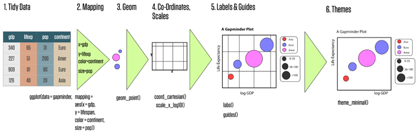
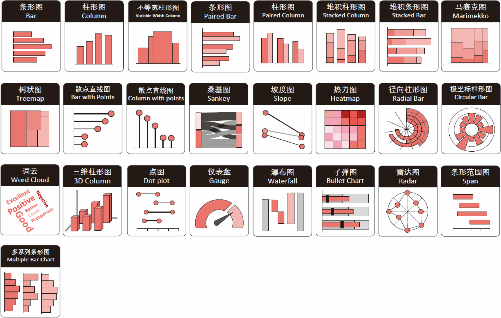
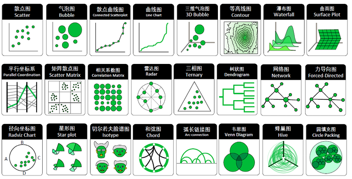
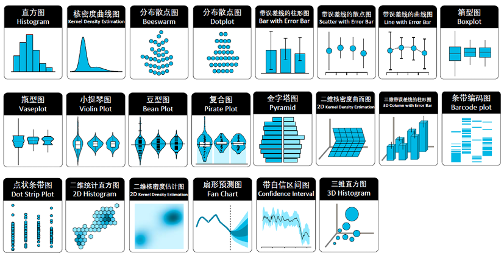
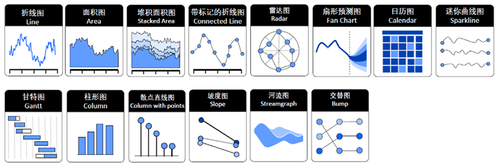
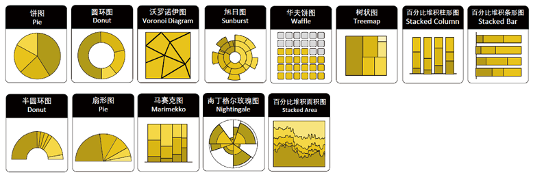
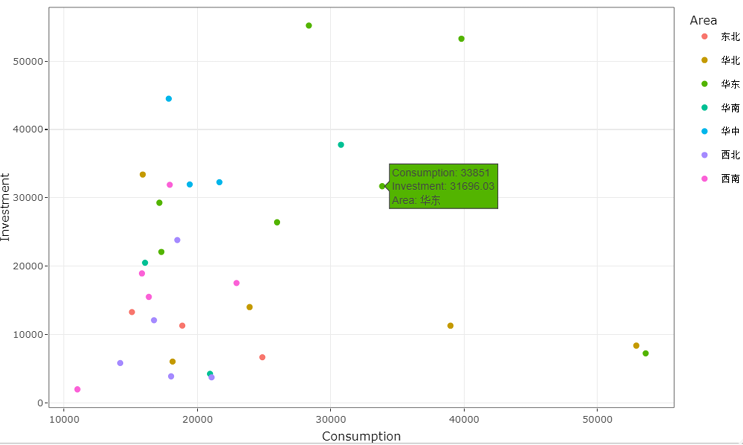
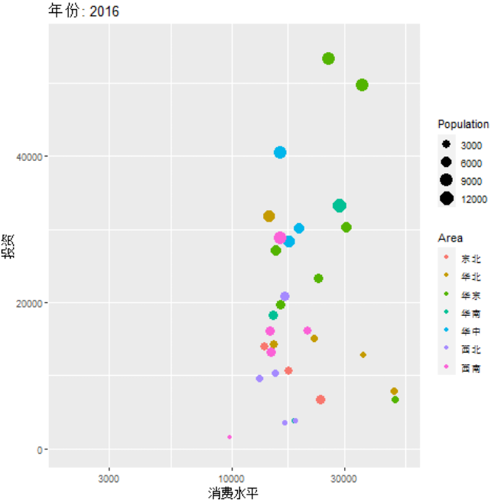
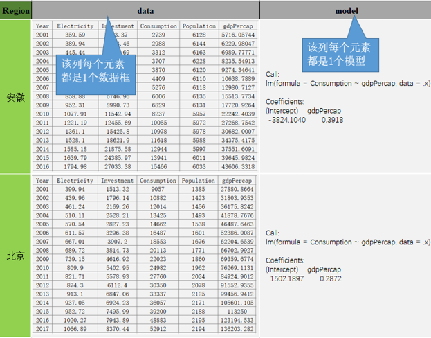

# 可视化与建模技术 {#visualization-modeling}

本章沿用教材的三条主线：先理解 `ggplot2` 的图层化语法，再按信息表达目的选择图形，最后把统计模型的结果整理成数据并进行批量建模。可视化和建模并不是两个孤立环节：图形帮助我们提出模型问题、诊断模型，而整洁的模型结果又可以继续进入数据管道和图形系统。

## 本章学习目标 {-}

完成本章后，你应当能够：

1. 用“数据—映射—几何对象—标度—坐标系—分面—主题”解释一张 `ggplot2` 图；
2. 区分美学映射与常量设置、全局映射与局部映射；
3. 根据比较、关系、分布、时间、局部整体和空间等任务选择图形；
4. 使用 `showtext::showtext_auto()` 保证中文标题、坐标轴和标注能够稳定显示；
5. 用 `broom::tidy()`、`glance()`、`augment()`把模型输出变成整洁数据；
6. 用嵌套数据框与 `purrr::map_*()`完成分组批量建模；
7. 解释训练集、测试集、交叉验证和滚动回归的基本工作流。

```{r ch03-setup, include=FALSE}
required_ch03 <- c(
  "tidyverse", "patchwork", "broom", "modelr", "lubridate"
)
missing_ch03 <- required_ch03[
  !vapply(required_ch03, requireNamespace, logical(1), quietly = TRUE)
]
if (length(missing_ch03)) {
  stop("第 3 章缺少 R 包：", paste(missing_ch03, collapse = ", "))
}

library(tidyverse)
library(patchwork)
library(broom)
library(modelr)
library(lubridate)

source("../R/chinese-font.R")
chinese_font <- setup_course_chinese_font(quiet = TRUE)

theme_set(
  theme_minimal(base_family = chinese_font, base_size = 12) +
    theme(
      plot.title.position = "plot",
      plot.caption.position = "plot",
      legend.position = "bottom",
      panel.grid.minor = element_blank()
    )
)

load("../data/ch03/ecostats.rda")
load("../data/ch03/stocks.rda")
load("../data/ch03/gapminder.rda")
```

## 解决图形中的中文字体 {- #ch03-chinese-font}

图形中的中文变成方框、空白或乱码，通常不是数据编码问题，而是**绘图设备没有找到包含中文字形的字体**。教材采用 `showtext` 与 `sysfonts` 解决这个问题：先注册中文字体，再调用 `showtext_auto()`，让之后打开的绘图设备自动使用 `showtext` 渲染文字。

本课程把跨平台检测封装在 `R/chinese-font.R` 中。它只使用计算机已有字体，不联网下载字体；在 macOS、Windows 和常见 Linux 环境中依次寻找 Arial Unicode、苹方、微软雅黑、黑体或 Noto Sans CJK 等字体。

```{r ch03-font-setup, eval=FALSE}
source("../R/chinese-font.R")

# 内部会注册字体并执行 showtext::showtext_auto(enable = TRUE)。
chinese_font <- setup_course_chinese_font(quiet = FALSE)

# 把字体写入全局主题，后续每张 ggplot 都能继承。
theme_set(theme_minimal(base_family = chinese_font))
```

```{r ch03-font-demo, fig.cap="使用 showtext 自动渲染中文标题、坐标轴与图内标注。"}
ggplot(mpg, aes(displ, hwy, color = drv)) +
  geom_point(alpha = 0.72, size = 2.2) +
  annotate(
    "label", x = 6.2, y = 39,
    label = "中文标注可正常显示",
    family = chinese_font, color = "#b04a3f"
  ) +
  labs(
    title = "发动机排量与高速燃油效率",
    subtitle = "颜色表示驱动方式",
    x = "发动机排量（升）",
    y = "高速燃油效率（mpg）",
    color = "驱动方式"
  )
```

> **导出前检查**：在屏幕中正常显示并不保证 PDF 一定正常。应当显式保存一次，再打开文件检查标题、图例、坐标轴和注释。推荐把图形对象传给 `ggsave(plot = ...)`，避免误存上一张图。

```{r ch03-font-save, eval=FALSE}
p <- last_plot()
ggsave(
  filename = "output/ch03-font-check.pdf",
  plot = p,
  width = 8, height = 5, units = "in",
  device = cairo_pdf
)
```

## ggplot2 基础语法

### ggplot2 概述

`ggplot2` 的关键不是“记住很多绘图函数”，而是用统一语法把图形逐层构造出来：选择整洁数据，把变量映射到图形属性，用几何对象表达数据，再按需要调整标度、坐标、分面、主题和输出。

```{r ch03-grammar-flow, echo=FALSE, fig.cap="教材图 3.1：从整洁数据、映射和几何对象逐步形成完整图形。"}

```

教材列出十个部件，其中数据、映射和几何对象是最基本的三项。

| 部件 | 课堂问题 | 常见函数 |
|---|---|---|
| 数据 data | 要画哪张整洁数据表？ | `ggplot(data = ...)` |
| 映射 mapping | 哪个变量控制位置、颜色、大小？ | `aes()` |
| 几何对象 geom | 用点、线、柱还是区域表达？ | `geom_point()`、`geom_line()` |
| 标度 scale | 数据值怎样变成刻度、颜色或大小？ | `scale_*()` |
| 统计变换 stat | 图层需要先计算频数、均值或拟合吗？ | `stat_*()` |
| 坐标系 coord | 图层怎样投影到画布？ | `coord_*()` |
| 位置调整 position | 重叠元素怎样堆叠、并排或抖动？ | `position_*()` |
| 分面 facet | 是否按类别拆成多张小图？ | `facet_wrap()`、`facet_grid()` |
| 主题 theme | 非数据元素怎样排版？ | `theme_*()`、`theme()` |
| 输出 output | 以什么尺寸和格式保存？ | `ggsave()` |

基本模板如下。加号表示“继续添加图层”，应放在上一行的末尾。

```{r ch03-template, eval=FALSE}
ggplot(data = <DATA>, mapping = aes(<MAPPINGS>)) +
  <GEOM_FUNCTION>(
    mapping = aes(<LOCAL_MAPPINGS>),
    stat = <STAT>,
    position = <POSITION>
  ) +
  <SCALE_FUNCTION> +
  <COORDINATE_FUNCTION> +
  <FACET_FUNCTION> +
  <THEME_FUNCTION>
```

### 数据、映射、几何对象

#### 从空画布到可解释图形

```{r ch03-data-mapping-geom, fig.cap="数据提供变量，映射建立变量与图形属性的联系，几何对象真正绘制标记。"}
base_mpg <- ggplot(
  data = mpg,
  mapping = aes(x = displ, y = hwy)
)

base_mpg +
  geom_point(aes(color = drv), alpha = 0.72) +
  labs(
    x = "发动机排量（升）",
    y = "高速燃油效率（mpg）",
    color = "驱动方式"
  )
```

#### 映射与设置不能混淆

- `aes(color = drv)` 是**映射**：颜色随变量 `drv` 改变，因此会自动生成图例；
- `color = "#2d719b"` 是**设置**：所有点使用同一个常量颜色，不需要图例。

```{r ch03-map-vs-set, fig.width=8, fig.height=3.8, fig.cap="左图把颜色映射到变量；右图把颜色设置为常量。"}
p_map <- ggplot(mpg, aes(displ, hwy, color = drv)) +
  geom_point() +
  labs(title = "映射：随 drv 改变", color = "驱动方式")

p_set <- ggplot(mpg, aes(displ, hwy)) +
  geom_point(color = "#2d719b") +
  labs(title = "设置：所有点同色")

p_map | p_set
```

#### 全局映射与局部映射

放在 `ggplot()` 中的映射会被后续图层继承；放在某个 `geom_*()` 中的映射只对该图层有效。

```{r ch03-global-local, fig.width=8, fig.height=3.8, fig.cap="左图的颜色映射被平滑线继承，因此分组拟合；右图只有散点分组，平滑线使用全体数据。"}
p_group <- ggplot(mpg, aes(displ, hwy, color = drv)) +
  geom_point(alpha = 0.55) +
  geom_smooth(se = FALSE, linewidth = 0.8) +
  labs(title = "全局 color：分组拟合", color = "驱动方式")

p_overall <- ggplot(mpg, aes(displ, hwy)) +
  geom_point(aes(color = drv), alpha = 0.55) +
  geom_smooth(se = FALSE, color = "#b04a3f", linewidth = 0.9) +
  labs(title = "局部 color：整体拟合", color = "驱动方式")

p_group | p_overall
```

#### 折线图需要明确分组

`geom_line()`必须知道哪些点属于同一条线。教材的 `ecostats` 示例中，每个地区是一组；若不写 `group = Region`，不同地区会被错误地串联。

```{r ch03-group-aesthetic, fig.cap="每个地区一条浅色折线，粗线表示所有地区的总体平滑趋势。"}
ecostats |>
  ggplot(aes(Year, gdpPercap)) +
  geom_line(aes(group = Region), alpha = 0.18, color = "#2d719b") +
  geom_smooth(se = FALSE, linewidth = 1.1, color = "#d89512") +
  labs(x = "年份", y = "人均 GDP", title = "地区轨迹与总体趋势")
```

### 标度：控制坐标轴与图例

标度负责把数据空间转换到视觉空间。`x`、`y`标度生成坐标轴，`color`、`fill`、`size`等标度通常生成图例。

```{r ch03-scale-anatomy, echo=FALSE, fig.cap="教材图：坐标轴与图例都是标度的可视化结果。", out.width="72%"}
knitr::include_graphics("assets/textbook/ch03/axes-legends-anatomy.png")
```

```{r ch03-scales, fig.cap="离散轴标签、连续轴刻度与图例名称都由标度或 labs 控制。"}
ggplot(mpg, aes(drv, fill = drv)) +
  geom_bar(width = 0.68) +
  scale_x_discrete(labels = c("4" = "四驱", "f" = "前驱", "r" = "后驱")) +
  scale_fill_brewer(
    palette = "Dark2",
    labels = c("4" = "四驱", "f" = "前驱", "r" = "后驱")
  ) +
  labs(x = "驱动方式", y = "车型数量", fill = "驱动方式")
```

#### 缩放视野与删除数据不同

`coord_cartesian(xlim = ..., ylim = ...)`像相机变焦，只改变显示范围；`scale_x_continuous(limits = ...)`会在统计变换前删除范围外的数据，可能改变拟合线、箱线图等统计结果。

```{r ch03-coord-vs-limits, fig.width=8, fig.height=3.8, fig.cap="课堂推荐：只想放大局部时优先使用坐标系缩放。"}
p_full <- ggplot(mpg, aes(displ, hwy)) +
  geom_point(alpha = 0.45) +
  geom_smooth(se = FALSE, color = "#b04a3f")

(p_full + coord_cartesian(xlim = c(4, 6), ylim = c(15, 35)) +
   labs(title = "coord_cartesian：只缩放")) |
  (p_full + scale_x_continuous(limits = c(4, 6)) +
     labs(title = "scale limits：先删数据"))
```

#### 对数标度用于跨度很大的变量

```{r ch03-log-scale, fig.cap="对人均 GDP 使用对数标度后，不同数量级的国家更容易比较。"}
gapminder |>
  filter(year == max(year)) |>
  ggplot(aes(gdpPercap, lifeExp, color = continent, size = pop)) +
  geom_point(alpha = 0.68) +
  scale_x_log10(labels = scales::label_dollar(scale_cut = scales::cut_short_scale())) +
  scale_size(range = c(1.5, 8), guide = "none") +
  labs(
    x = "人均 GDP（对数标度）",
    y = "预期寿命",
    color = "洲",
    title = "收入与预期寿命"
  )
```

#### 标题、图例与文字标注

```{r ch03-labels, fig.cap="先准备需要标记的数据，再把 label 映射到相应变量。"}
best_in_class <- mpg |>
  group_by(class) |>
  slice_max(hwy, n = 1, with_ties = FALSE) |>
  ungroup()

ggplot(mpg, aes(displ, hwy)) +
  geom_point(aes(color = class), alpha = 0.38) +
  geom_label(
    data = best_in_class,
    aes(label = model),
    family = chinese_font,
    size = 2.7,
    check_overlap = TRUE,
    show.legend = FALSE
  ) +
  labs(
    title = "各车型中高速燃油效率最高的汽车",
    subtitle = "复杂标注可选用 ggrepel::geom_label_repel()",
    x = "发动机排量（升）",
    y = "高速燃油效率（mpg）",
    color = "车型"
  )
```

### 统计变换、坐标系与位置调整

`geom_bar()`默认先统计频数，`geom_histogram()`先分箱，`geom_boxplot()`先计算分位数；这说明图形常常不是“直接画原始值”，而是先执行统计变换。

```{r ch03-stat-summary, fig.cap="小提琴图展示分布形状，红色点区间表示均值加减一个标准差。"}
ggplot(mpg, aes(class, hwy)) +
  geom_violin(trim = FALSE, fill = "#b9ded8", color = "#168f84") +
  stat_summary(
    fun = mean,
    fun.min = \(x) mean(x) - sd(x),
    fun.max = \(x) mean(x) + sd(x),
    geom = "pointrange",
    color = "#b04a3f"
  ) +
  labs(x = "车型", y = "高速燃油效率（mpg）")
```

```{r ch03-coord-position, fig.width=8, fig.height=3.8, fig.cap="翻转坐标与并排柱形解决不同的表达问题。"}
p_flip <- ggplot(mpg, aes(class, hwy)) +
  geom_boxplot(fill = "#b9ded8") +
  coord_flip() +
  labs(title = "coord_flip：水平比较")

p_dodge <- ggplot(mpg, aes(class, fill = drv)) +
  geom_bar(position = "dodge") +
  labs(title = "position_dodge：并排比较", fill = "驱动")

p_flip | p_dodge
```

### 分面、主题与输出

分面是在同一套标度和图形语法下，把数据按类别拆成小图。与把多张互不相关的图拼在一起不同，分面强调可比较性。

```{r ch03-facet, fig.cap="按驱动方式分面后，可以比较各组内部的排量—燃油效率关系。"}
ggplot(mpg, aes(displ, hwy)) +
  geom_point(color = "#2d719b", alpha = 0.62) +
  geom_smooth(se = FALSE, color = "#d89512", linewidth = 0.8) +
  facet_wrap(vars(drv), nrow = 1) +
  labs(x = "发动机排量（升）", y = "高速燃油效率（mpg）")
```

主题只控制标题、字体、网格、图例背景等**非数据元素**，不应改变数据含义。课堂中推荐先选择完整主题，再用 `theme()`做少量局部调整。

```{r ch03-theme-output, fig.cap="完整主题提供整体样式，局部主题设置再调整图例与网格。"}
# 第一步：先用数据、映射和几何对象完成图形主体。
p_theme <- ggplot(mpg, aes(displ, hwy, color = drv)) +
  geom_point() +
  labs(
    title = "主题只改变非数据元素",
    x = "发动机排量（升）",
    y = "高速燃油效率（mpg）",
    color = "驱动方式"
  ) +
  # 第二步：选择一个完整主题，并指定支持中文的字体。
  theme_bw(base_family = chinese_font) +
  # 第三步：只对确有必要的元素做局部修改。
  theme(legend.position = "top")

# 在保存之前先打印对象，检查标题、坐标轴、图例与中文字体。
p_theme
```

```{r ch03-save-output, eval=FALSE}
# PNG 用于网页和一般文档；300 dpi 适合印刷。
ggsave(
  "output/mpg.png", plot = p_theme,
  width = 8, height = 5, units = "in", dpi = 300
)

# PDF 是矢量格式；cairo_pdf 能更稳定地处理中文字体。
ggsave(
  "output/mpg.pdf", plot = p_theme,
  width = 8, height = 5, device = cairo_pdf
)
```

## ggplot2 图形示例

教材按照图形要回答的问题，把常见可视化分为类别比较、数据关系、数据分布、时间序列、局部与整体、地理空间和动态交互七类。选图时不要先问“哪个图最漂亮”，而应依次确认：

1. 要比较、解释或寻找的关系是什么？
2. 变量是连续型、类别型、时间型还是空间对象？
3. 读者最需要看见的是位置、长度、方向、面积还是颜色差异？
4. 静态图是否已经足够；交互和动画是否真正增加信息？

### 类别比较：条形图与热图

```{r ch03-category-gallery, echo=FALSE, fig.cap="教材中的类别比较图形：点图、棒棒糖图、坡度图、哑铃图和热图等。"}

```

类别较少时，条形图和点图通常最容易比较；类别形成二维组合时，热图能把频数映射到颜色。下面先用 `count()`得到车型与驱动方式的交叉频数，再用 `geom_tile()`绘制。

```{r ch03-heatmap, fig.cap="车型与驱动方式的组合频数；深色表示该组合中的车型更多。"}
heat_df <- mpg |>
  count(class, drv, name = "车型数", .drop = FALSE)

ggplot(heat_df, aes(drv, class, fill = 车型数)) +
  geom_tile(color = "white", linewidth = 0.7) +
  geom_text(aes(label = 车型数), family = chinese_font, size = 3.4) +
  scale_fill_gradient(low = "#e7f3f1", high = "#11796f") +
  labs(x = "驱动方式", y = "车型", fill = "车型数", title = "二维类别比较") +
  theme(panel.grid = element_blank())
```

> **不要用条形图表示原始连续值**：若数据表中的每一行就是一个观测值，应先明确需要统计频数、求和还是求均值，再决定使用 `geom_bar()`或 `geom_col()`。

### 数据关系：散点图与网络图

```{r ch03-relationship-gallery, echo=FALSE, fig.cap="教材中的关系图形：散点图、气泡图、相关矩阵、平行坐标和网络图。"}

```

两个连续变量的关系首先考虑散点图；第三个变量可以映射到颜色或大小，但同时加入过多通道会增加阅读负担。关系数据若由“节点表 + 边表”组成，则适合网络图。

```{r ch03-relationship, fig.cap="颜色显示驱动方式，平滑线显示各组的整体趋势。"}
ggplot(mpg, aes(displ, hwy, color = drv)) +
  geom_point(alpha = 0.52) +
  geom_smooth(method = "lm", se = FALSE, linewidth = 0.8) +
  labs(
    x = "发动机排量（升）", y = "高速燃油效率（mpg）",
    color = "驱动方式", title = "排量越大，燃油效率通常越低"
  )
```

教材的通话网络示例由节点表和边表组成。即使没有安装网络图扩展包，也可以先用 `ggplot2`绘制可检查的静态结果：圆点大小表示节点权重，连线粗细表示关系权重。

```{r ch03-network-static, fig.cap="教材通话关系数据的静态网络图；节点大小和连线粗细分别表示节点、关系权重。"}
load("../data/ch03/phone_call.rda")

# 第一步：把 16 个节点均匀放在单位圆上，得到绘图坐标。
network_nodes <- nodes |>
  mutate(
    angle = 2 * pi * (row_number() - 1) / n(),
    x = cos(angle),
    y = sin(angle)
  )

# 第二步：把起点和终点的坐标分别连接到边表。
network_edges <- edges |>
  left_join(
    network_nodes |> select(from = id, x, y),
    by = "from"
  ) |>
  left_join(
    network_nodes |> select(to = id, xend = x, yend = y),
    by = "to"
  )

# 第三步：先画边，再画节点和标签，避免连线遮住文字。
ggplot() +
  geom_segment(
    data = network_edges,
    aes(x, y, xend = xend, yend = yend, linewidth = value),
    color = "#9cb4c1", alpha = 0.75
  ) +
  geom_point(
    data = network_nodes,
    aes(x, y, size = value),
    color = "#11796f", fill = "#b9ded8", shape = 21
  ) +
  geom_text(
    data = network_nodes,
    aes(x, y, label = label),
    family = chinese_font, size = 2.8, nudge_y = 0.09
  ) +
  scale_linewidth(range = c(0.3, 2.2), guide = "none") +
  scale_size(range = c(3, 10), guide = "none") +
  coord_equal(clip = "off") +
  labs(title = "节点表 + 边表 → 网络图") +
  theme_void(base_family = chinese_font) +
  theme(plot.margin = margin(20, 36, 20, 36))
```

安装 `visNetwork`后，同一份节点表与边表可以直接转换成可缩放、可选择节点的交互网络：

```{r ch03-network-interactive-code, eval=FALSE}
# nodes 描述实体及其权重，edges 描述起点、终点和关系权重。
visNetwork::visNetwork(nodes, edges) |>
  visNetwork::visOptions(
    highlightNearest = TRUE,  # 选中节点时突出显示相邻关系
    nodesIdSelection = TRUE   # 增加节点下拉选择器
  )
```

### 数据分布：直方图、箱线图与人口金字塔

```{r ch03-distribution-gallery, echo=FALSE, fig.cap="教材中的分布图形：直方图、密度图、箱线图、小提琴图和人口金字塔。"}

```

人口金字塔本质上是“左右镜像的条形图”：把男性人口改为负值，通过 `coord_flip()`让年龄组纵向排列，再用绝对值恢复坐标轴标签。

```{r ch03-population-pyramid, fig.height=6, fig.cap="黑龙江省分年龄与性别人口金字塔；横轴标签显示绝对值。"}
population_long <- read_csv(
  "../data/ch03/hljPops.csv",
  show_col_types = FALSE
) |>
  pivot_longer(c(男, 女), names_to = "性别", values_to = "人口") |>
  mutate(绘图人口 = if_else(性别 == "男", -人口, 人口))

ggplot(population_long, aes(Age, 绘图人口, fill = 性别)) +
  geom_col(width = 0.86) +
  coord_flip() +
  scale_y_continuous(labels = function(x) abs(x)) +
  scale_fill_manual(values = c("男" = "#2d719b", "女" = "#d86d8c")) +
  labs(x = "年龄组", y = "人口", fill = "性别", title = "人口金字塔")
```

### 时间序列：折线图与面积图

```{r ch03-time-gallery, echo=FALSE, fig.cap="教材中的时间序列图形：折线图、面积图、日历热图、时间线和极坐标时间图。"}

```

时间应放在横轴并保持先后顺序。折线图适合看变化方向；面积图更强调总量，但基线会放大视觉差异，不适合精确比较多条序列。

```{r ch03-time-series, fig.width=8, fig.height=6, fig.cap="同一失业人数序列的折线表达与面积表达。"}
economics_recent <- economics |>
  filter(date >= as.Date("2000-01-01"))

p_line <- ggplot(economics_recent, aes(date, unemploy / 1000)) +
  geom_line(color = "#2d719b", linewidth = 0.8) +
  labs(title = "折线：突出变化方向", x = NULL, y = "失业人数（百万）")

p_area <- ggplot(economics_recent, aes(date, unemploy / 1000)) +
  geom_area(fill = "#76b7b2", alpha = 0.72) +
  labs(title = "面积：突出总量", x = NULL, y = "失业人数（百万）")

p_line / p_area
```

### 局部与整体：饼图还是排序条形图

```{r ch03-part-whole-gallery, echo=FALSE, fig.cap="教材中的局部—整体图形：饼图、环图、华夫图、树图和旭日图。"}

```

饼图利用角度和面积表达占比，适合类别很少、差异很大并且只需粗略判断的场景。若要准确比较，按占比排序的条形图通常更有效。

```{r ch03-part-to-whole, fig.width=8, fig.height=4, fig.cap="同一份车型占比：饼图强调构成，排序条形图便于精确比较。"}
class_share <- mpg |>
  count(class, name = "车型数") |>
  mutate(占比 = 车型数 / sum(车型数)) |>
  arrange(desc(占比)) |>
  mutate(class = forcats::fct_reorder(class, 占比))

p_pie <- ggplot(class_share, aes(x = "", y = 占比, fill = class)) +
  geom_col(width = 1, color = "white") +
  coord_polar(theta = "y") +
  labs(title = "饼图：看构成", fill = "车型") +
  theme_void(base_family = chinese_font)

p_bar <- ggplot(class_share, aes(占比, class, fill = class)) +
  geom_col(show.legend = FALSE) +
  scale_x_continuous(labels = scales::label_percent()) +
  labs(title = "排序条形图：做比较", x = "占比", y = NULL)

p_pie | p_bar
```

### 地理空间图

地理空间图是在地图上展示数据关系，即与地理位置信息联系起来绘图，地理位置通常是用经度、纬度表示。常见的地理空间图包括普通地图、等值区间地图、等位图、带散点/气泡/条形/饼图/链接线的地图、流量地图、向量地图、道林地图等。

现在的 GIS 类软件广泛使用简单要素（Simple Features）标准，主要是用二维几何图形对象（点、线、多边形、点族、线族、多边形族等）表示地理矢量数据，还可以包含坐标参照系统和用于描述对象的属性（如名称、值、颜色等）。

`sf` 包实现了将简单要素表示成 R 中的 `data.frame`，并提供了一系列处理此类数据的工具。在 `sf` 格式数据框中，属性要素是正常的列，几何要素（`geometry`）存放为列表列。

`geometry` 列是最重要的列，它指定了每个地理区域的空间几何，每个元素都是一个多边形族，即包含一个或多个多边形的顶点的数据，它们能确定多边形区域的边界。

有了 `sf` 格式的数据，就可以用 `geom_sf()` 和 `coord_sf()` 函数绘制地图，甚至无须设定任何参数和美学映射。

### 动态交互图

`plotly` 包能够在 `ggplot2` 的基础上生成动态可交互图形。只要对 `ggplot2` 绘制的图形对象嵌套 `ggplotly()`，图形就会变成可交互状态；鼠标移动到图形元素上时，会自动显示对应数值。

```{r ch03-plotly-code, eval=FALSE}
# 加载 plotly，使用 ggplotly() 将 ggplot 图转换为交互图。
library(plotly)

# 教材数据已经在本章开头载入为 ecostats。
# 根据省级地区名称，将观测划分为东北、华北、华中、华南、
# 西北、西南和华东七个区域。
ecostats <- ecostats |>
  mutate(
    Area = case_when(
      Region %in% c("黑龙江", "吉林", "辽宁") ~ "东北",
      Region %in% c("北京", "天津", "河北", "山西", "内蒙古") ~ "华北",
      Region %in% c("河南", "湖北", "湖南") ~ "华中",
      Region %in% c("广东", "广西", "海南") ~ "华南",
      Region %in% c("陕西", "甘肃", "宁夏", "青海", "新疆") ~ "西北",
      Region %in% c("四川", "贵州", "云南", "重庆", "西藏") ~ "西南",
      TRUE ~ "华东"
    )
  )

# 只保留 2017 年数据；横轴表示消费水平，纵轴表示投资，
# 点的颜色表示所属区域。
p <- ecostats |>
  filter(Year == 2017) |>
  ggplot(aes(Consumption, Investment, color = Area)) +
  geom_point() +
  theme_bw()

# 把静态 ggplot 对象 p 转换为可缩放、可悬停查看数值的交互图。
ggplotly(p)
```

```{r ch03-plotly-result, echo=FALSE, fig.cap="教材图 3.47：用 plotly 绘制动态可交互图形。", out.width="78%"}

```

`gganimate` 包是基于 `ggplot2` 的动态可视化扩展包，能让图形元素随时间等逐帧变化，所生成的动态图可以导出为 `.gif` 格式。教材用下面的代码绘制动态散点图，反映不同地区投资与消费水平随年份的变化。

```{r ch03-animation-code, eval=FALSE}
# 加载 gganimate，为 ggplot2 图形增加逐帧动画。
library(gganimate)

# 横轴表示消费水平，纵轴表示投资；圆点大小表示人口。
ggplot(ecostats, aes(Consumption, Investment, size = Population)) +
  geom_point() +
  # 再把区域映射到颜色，使七个区域能够区分。
  geom_point(aes(color = Area)) +
  # 消费水平跨度较大，因此把横轴转换为以 10 为底的对数标度。
  scale_x_log10() +
  # frame_time 会在每一帧标题中显示当前年份。
  labs(title = "年份: {frame_time}", x = "消费水平", y = "投资") +
  # 以 Year 作为时间变量，让圆点随年份逐帧移动。
  transition_time(Year)

# 将上面生成的动画保存为 GIF 文件。
anim_save("output/ecostats.gif")
```

```{r ch03-animation-result, echo=FALSE, fig.cap="教材图 3.48：用 gganimate 绘制动态可视化图形。", out.width="78%"}

```

## 统计建模技术

本节不追求罗列模型，而是建立“模型也是数据分析管道中的对象”这一观念：准备数据、拟合模型、整理输出、评估误差、批量执行，最后再把结果画出来。

### 用 broom 整理模型结果

基础 R 的模型摘要适合阅读，却不便继续计算。`broom`提供三个互补函数：

| 函数 | 一行代表什么 | 典型用途 |
|---|---|---|
| `tidy()` | 一个模型项或系数 | 提取估计值、标准误、置信区间和 p 值 |
| `glance()` | 一个模型 | 提取拟合优度、样本量、AIC 等总体指标 |
| `augment()` | 一个原始观测 | 把拟合值、残差等附回数据 |

```{r ch03-broom-output}
mt_model <- lm(mpg ~ wt, data = mtcars)

# 每个系数一行，并计算 95% 置信区间。
tidy(mt_model, conf.int = TRUE)

# 整个模型一行，选择课堂常用的评价指标。
glance(mt_model) |>
  select(r.squared, adj.r.squared, sigma, AIC, nobs)
```

```{r ch03-augment, fig.width=8, fig.height=3.8, fig.cap="augment() 让拟合值和残差重新成为可视化的数据列。"}
mt_augmented <- augment(mt_model, data = mtcars)

p_fit <- ggplot(mt_augmented, aes(wt, mpg)) +
  geom_point(color = "#2d719b") +
  geom_line(aes(y = .fitted), color = "#b04a3f", linewidth = 0.9) +
  labs(title = "拟合关系", x = "车重", y = "燃油效率")

p_resid <- ggplot(mt_augmented, aes(.fitted, .resid)) +
  geom_hline(yintercept = 0, color = "grey55") +
  geom_point(color = "#d89512") +
  labs(title = "残差诊断", x = "拟合值", y = "残差")

p_fit | p_resid
```

### 用 modelr 划分数据并评估模型

训练集用于估计模型参数，测试集用于模拟模型遇到新数据时的表现。必须先划分数据，再拟合模型；如果先看测试集再调整模型，测试误差就会变得过于乐观。

```{r ch03-train-test}
set.seed(20230824)

# 约 80% 用于训练，其余用于测试。
split_mpg <- resample_partition(mtcars, c(train = 0.8, test = 0.2))
train_data <- as_tibble(split_mpg$train)
test_data  <- as_tibble(split_mpg$test)

train_model <- lm(mpg ~ wt + hp, data = train_data)

# modelr 的指标函数需要模型与待评价数据。
tibble(
  指标 = c("RMSE", "MAE", "R²"),
  数值 = c(
    rmse(train_model, test_data),
    mae(train_model, test_data),
    rsquare(train_model, test_data)
  )
)
```

单次划分受随机性影响。K 折交叉验证把数据分成 K 份，轮流把其中一份作为验证集，其余作为训练集，最后汇总 K 次评估结果。

```{r ch03-cross-validation-image, echo=FALSE, fig.cap="教材图：10 折交叉验证，每一轮使用不同的一折作为测试数据。", out.width="78%"}
knitr::include_graphics("assets/textbook/ch03/cross-validation-10fold.png")
```

```{r ch03-cross-validation}
set.seed(20230824)
cv10 <- crossv_kfold(mtcars, k = 10)

cv_result <- cv10 |>
  mutate(
    model = map(train, function(split) lm(mpg ~ wt + hp, data = split)),
    rmse = map2_dbl(model, test, rmse)
  )

cv_result |>
  summarise(
    平均RMSE = mean(rmse),
    标准差 = sd(rmse),
    最小值 = min(rmse),
    最大值 = max(rmse)
  )
```

> `modelr`很好地展示了建模思想；在更完整的现代工作流中，可以继续学习 `rsample`、`parsnip`、`recipes`和 `yardstick`组成的 tidymodels 生态。

### 分组嵌套与批量建模

批量建模的关键是让“每组数据”成为列表列中的一个元素，再用 `map()`对每个元素执行同一个建模函数。这样可以避免复制粘贴几十次 `lm()`。

```{r ch03-nested-model-image, echo=FALSE, fig.cap="教材图：嵌套数据框把每个组的数据框保存在列表列中，再附加模型和整理结果。", out.width="86%"}

```

```{r ch03-batch-model}
region_models <- ecostats |>
  group_nest(Region) |>
  mutate(
    # 对每个地区拟合同一公式。
    model = map(data, function(df) lm(Consumption ~ gdpPercap, data = df)),
    # 每个模型的系数表仍是一个小数据框。
    coefficients = map(model, function(fit) tidy(fit, conf.int = TRUE)),
    fit_stats = map(model, glance)
  )

region_slopes <- region_models |>
  select(Region, coefficients) |>
  unnest(coefficients) |>
  filter(term == "gdpPercap") |>
  arrange(estimate)

region_slopes |>
  select(Region, estimate, conf.low, conf.high) |>
  slice_head(n = 6)
```

```{r ch03-batch-model-plot, fig.height=7, fig.cap="各地区消费—人均 GDP 回归斜率及其 95% 置信区间。"}
ggplot(
  region_slopes,
  aes(estimate, forcats::fct_reorder(Region, estimate))
) +
  geom_vline(xintercept = 0, color = "grey65") +
  geom_errorbar(
    aes(xmin = conf.low, xmax = conf.high),
    orientation = "y", width = 0.22, color = "#76b7b2"
  ) +
  geom_point(color = "#b04a3f", size = 2) +
  labs(x = "人均 GDP 系数", y = "地区", title = "同一模型公式在不同地区的结果")
```

`nest_by()`也能建立“每组一行”的数据框，并与 `rowwise()`语义配合。它适合逐行调用返回单个对象的函数；若要同时生成多个整洁结果，`group_nest() + map()`通常更直观。

```{r ch03-nest-by, eval=FALSE}
ecostats |>
  nest_by(Region) |>
  mutate(model = list(lm(Consumption ~ gdpPercap, data = data))) |>
  summarise(tidy(model), .groups = "drop")
```

### 滚动回归：让模型随时间移动

滚动分析把一个固定宽度的时间窗口沿序列移动，每个位置拟合一次模型。它能显示局部关系怎样变化，但窗口越短，估计越不稳定；窗口越长，局部变化越容易被平滑掉。

```{r ch03-stocks, fig.cap="Amazon 与 Google 的日收盘价；先把长数据转换为每只股票一列。"}
stocks_wide <- stocks |>
  pivot_wider(names_from = Stock, values_from = Close) |>
  arrange(Date)

stocks |>
  ggplot(aes(Date, Close, color = Stock)) +
  geom_line(linewidth = 0.7) +
  labs(x = NULL, y = "收盘价", color = "股票", title = "两只股票的价格序列")
```

教材使用滑动窗口函数。为了让结果不依赖可选包，下面先用行号明确构造 5 个交易日窗口，再计算 `Amazon ~ Google`的滚动斜率。序列首尾没有完整窗口，因此保留为 `NA`。

```{r ch03-rolling-model, fig.cap="5 个交易日窗口中的滚动回归斜率；首尾缺少完整窗口，因此不连线。"}
# 每个中心位置 i 对应 i-2 至 i+2，共 5 个交易日。
window_centers <- seq_len(nrow(stocks_wide))

rolling_slope <- stocks_wide |>
  mutate(
    slope = map_dbl(
      window_centers,
      function(i) {
        # 首尾不足 5 天时不拟合，避免不同窗口宽度混在一起。
        if (i < 3 || i > nrow(stocks_wide) - 2) {
          return(NA_real_)
        }

        window_data <- stocks_wide[(i - 2):(i + 2), ]
        fit <- lm(Amazon ~ Google, data = window_data)

        # 只提取 Google 的回归系数，形成可直接绘图的数值列。
        unname(coef(fit)[["Google"]])
      }
    )
  )

# 输出检查：中间日期应有斜率，首尾两行应为 NA。
rolling_slope |>
  select(Date, Amazon, Google, slope) |>
  slice(c(1:3, (nrow(rolling_slope) - 2):nrow(rolling_slope)))

# 把每个窗口的局部关系画成随时间变化的系数曲线。
ggplot(rolling_slope, aes(Date, slope)) +
  geom_hline(yintercept = 0, color = "grey65") +
  geom_line(color = "#2d719b") +
  labs(x = NULL, y = "Google 的滚动系数", title = "局部关系会随时间变化")
```

如果已经安装 `slider`，同一算法可以更简洁地表达为“把建模函数滑过整张数据表”：

```{r ch03-slider-extension, eval=FALSE}
rolling_fit <- slider::slide(
  stocks_wide,
  .f = function(window) lm(Amazon ~ Google, data = window),
  .before = 2,     # 当前日期之前取 2 天
  .after = 2,      # 当前日期之后取 2 天
  .complete = TRUE # 只有完整的 5 天窗口才拟合
)
```

## 综合练习：从图形问题走向模型问题

1. 使用 `mpg`比较三种驱动方式的 `hwy`分布。先画箱线图，再叠加抖动点，并解释为什么要使用透明度。
2. 在 `gapminder`中选取 2007 年数据，画出人均 GDP 与预期寿命的关系。分别使用普通横轴和对数横轴，比较结论是否改变。
3. 用 `economics`画失业率 `uempmed`的时间序列，在图中标出最大值所在日期。
4. 对 `mtcars`模型 `mpg ~ wt + hp`运行 5 折交叉验证。更换随机种子后，平均 RMSE 发生了多大变化？
5. 用 `ecostats`按地区拟合 `Investment ~ gdpPercap`，整理每个地区的斜率与调整后 R²，并画出排序点图。
6. 自选一张本章图形，同时导出 PNG 与 PDF。检查中文标题、图例、坐标轴和标注是否完整，并记录所用字体。

## 本章小结

- `ggplot2`把图形拆为数据、映射、几何对象、标度、统计变换、坐标、位置、分面和主题等部件；
- 选图应从分析任务和变量类型出发，避免为了形式而增加颜色、动画或交互；
- `showtext::showtext_auto()`配合系统中文字体，可以稳定处理屏幕图、PNG 和 PDF 中的中文；
- `broom`让模型结果回到整洁数据，`modelr`把划分、预测和评估组织进数据管道；
- 嵌套数据框与 `purrr::map()`把“对每组重复同一模型”变成清晰、可检查的函数式工作流；
- 建模不是可视化之后的终点：图形用于提出问题、检查假设、比较结果和沟通不确定性。

## 参考资料与延伸阅读

- 张敬信（2023）《R 语言编程：基于 tidyverse》第 3 章及配套源代码；`ggplot2`、`broom`、`modelr`、`showtext`与 `sf`包文档。
