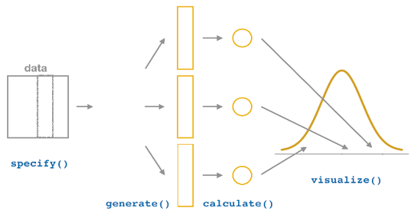
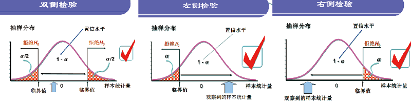
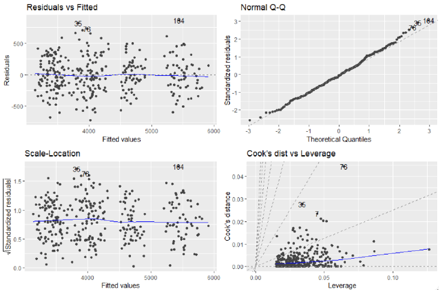

# 应用统计 {#applied-statistics}

R 语言因统计分析而生，可以方便地完成统计计算、统计模拟与统计建模。本章依照教材第四章，从描述性统计出发，依次讨论参数估计、假设检验和回归分析。

统计学是关于数据的科学，涉及数据收集与整理、描述统计以及分析推断。进入具体方法之前，先区分几个基本概念。

- **随机变量**：表示随机现象一组可能结果的变量。
- **概率分布**：用数学形式描述随机变量表现出的规律性；同一分布可由不同参数值决定不同形状。
- **总体与样本**：总体包含研究对象的全部数据，样本是从总体中抽取的一部分数据。
- **参数与统计量**：参数描述总体特征，通常是未知常数；统计量由样本计算，用于推断总体参数。
- **数据类型**：不同数据类型适用的统计方法不同，分析之前必须先识别变量类型。

```{r ch04-setup, include=FALSE}
required_ch04 <- c(
  "tidyverse", "rstatix", "infer", "readxl", "car",
  "modelr", "lmtest", "broom", "patchwork"
)
missing_ch04 <- required_ch04[
  !vapply(required_ch04, requireNamespace, logical(1), quietly = TRUE)
]
if (length(missing_ch04)) {
  stop("第 4 章缺少 R 包：", paste(missing_ch04, collapse = ", "))
}

library(tidyverse)
library(rstatix)
library(infer)
library(readxl)
library(modelr)
library(broom)
library(patchwork)

source("../R/chinese-font.R")
chinese_font <- setup_course_chinese_font(quiet = TRUE)

theme_set(
  theme_minimal(base_family = chinese_font, base_size = 12) +
    theme(
      plot.title.position = "plot",
      legend.position = "bottom",
      panel.grid.minor = element_blank()
    )
)
```

```{r ch04-normal-distribution, fig.cap="不同均值和标准差对应的正态分布。"}
# 在 -4 到 4 之间生成等距横坐标，用于计算概率密度。
tibble(
  x = seq(-4, 4, length.out = 100),
  `μ=0, σ=0.5` = dnorm(x, 0, 0.5),
  `μ=0, σ=1` = dnorm(x, 0, 1),
  `μ=0, σ=2` = dnorm(x, 0, 2),
  `μ=-2, σ=1` = dnorm(x, -2, 1)
) |>
  # 把四组密度值整理成长表，便于映射到颜色。
  pivot_longer(-x, names_to = "参数", values_to = "p(x)") |>
  ggplot(aes(x, `p(x)`, color = 参数)) +
  # 每组参数绘制一条概率密度曲线。
  geom_line(linewidth = 0.9) +
  labs(x = "x", y = "概率密度")
```

```{r ch04-data-types, echo=FALSE, fig.cap="教材图 4.2：常见的数据类型。", out.width="82%"}

```

## 描述性统计

描述性统计通过汇总统计量和统计图概括样本数据，并为后续统计推断提供基础。

### 统计量

#### 数据位置的统计量

- **均值**：$\bar{x}=\frac{1}{n}\sum_{i=1}^{n}x_i$，用于度量数据分布的中心位置。
- **中位数**：排序后位于中间位置的数，对极端值较稳健。
- **分位数**：$p$ 分位数把数据分成比例为 $p$ 和 $1-p$ 的两部分；$Q_1$、$Q_2$、$Q_3$ 分别是 0.25、0.50、0.75 分位数。
- **众数**：出现次数最多的取值，尤其适合分类数据。

对应的 R 函数是 `mean()`、`median()`、`quantile()` 和 `rstatix::get_mode()`。

#### 数据分散程度的统计量

- **极差**：最大值与最小值之差。
- **四分位距**：$IQR=Q_3-Q_1$。
- **样本方差**：$s^2=\frac{1}{n-1}\sum_{i=1}^{n}(x_i-\bar{x})^2$。
- **样本标准差**：$s=\sqrt{s^2}$，量纲与原数据一致。
- **变异系数**：$CV=100\%\times s/\bar{x}$，可比较不同量纲数据的分散程度。

对应的 R 实现是 `max(x)-min(x)`、`IQR(x)`、`var(x)`、`sd(x)` 和 `100*sd(x)/mean(x)`。

#### 数据分布形状的统计量

偏度刻画分布是否对称：对称分布偏度为 0，右拖尾为正偏，左拖尾为负偏。峰度以标准正态分布为基准，用于刻画分布是否尖峰。

```{r ch04-skewness, echo=FALSE, fig.cap="教材图 4.3：数据的三种偏度。", out.width="84%"}
knitr::include_graphics("assets/textbook/ch04/tx21697.png")
```

教材使用 `rstatix::get_summary_stats()` 对多个变量进行分组描述汇总。

```{r ch04-summary-stats}
# 按鸢尾花种类分组；每组包含四个连续测量变量。
iris |>
  group_by(Species) |>
  # type = "full" 返回样本量、位置、分散程度和置信区间等统计量。
  get_summary_stats(type = "full") |>
  # 讲义中只打印前几行，完整对象仍包含所有变量和种类。
  slice_head(n = 8)
```

### 统计图

#### 分类数据的统计图

条形图以条形高度或长度表示分类变量的频数或频率。原始数据使用 `geom_bar()`，已经汇总的数据使用 `geom_col()`。

```{r ch04-bar-data}
# 合并出现次数较少的皮肤颜色类别，只保留频数最高的五类。
skin_summary <- starwars |>
  mutate(skin_color = fct_lump(skin_color, n = 5)) |>
  # 统计各类别频数，并按频数从高到低排列。
  count(skin_color, sort = TRUE) |>
  # 将频数转换为占比。
  mutate(p = n / sum(n))

skin_summary
```

```{r ch04-bar-plot, fig.cap="标记频率的水平条形图。"}
ggplot(skin_summary, aes(fct_reorder(skin_color, p), p)) +
  # 数据已经汇总为 p，因此使用 geom_col() 直接绘制列值。
  geom_col(fill = "steelblue") +
  scale_y_continuous(labels = scales::label_percent()) +
  labs(x = "皮肤颜色", y = "占比") +
  # 把每类占比转换为百分数字符，标在条形末端。
  geom_text(
    aes(y = p + 0.04, label = str_c(round(p * 100, 1), "%")),
    size = 4, color = "red"
  ) +
  # 翻转坐标轴，形成教材中的水平条形图。
  coord_flip()
```

克利夫兰点图适合比较多个类别的汇总值。教材按年份计算 `economics` 中失业持续时间的均值，再按均值排序。

```{r ch04-cleveland, fig.cap="2000 年以来平均失业持续时间的克利夫兰点图。"}
economics |>
  # 从日期中提取年份并按年分组。
  group_by(year = lubridate::year(date)) |>
  # 每一年计算 uempmed 的平均值。
  summarise(uempmed = mean(uempmed), .groups = "drop") |>
  filter(year >= 2000) |>
  ggplot(aes(reorder(year, uempmed), uempmed)) +
  geom_point(size = 4, shape = 21, fill = "steelblue", color = "black") +
  # 从教材设定的基线 y=5 连接到各圆点。
  geom_segment(aes(xend = after_stat(x), yend = 5)) +
  xlab("year") +
  coord_flip()
```

#### 连续数据的统计图

直方图用于展示连续变量的分布。若在频数直方图上叠加概率密度曲线，需要把密度乘以“组距 × 样本量”。

```{r ch04-histogram, fig.cap="频数直方图及其对应的正态概率密度曲线。"}
set.seed(123)

# 按教材参数模拟 10,000 个身高数据。
height_data <- tibble(heights = rnorm(10000, 170, 2.5))

ggplot(height_data, aes(heights)) +
  geom_histogram(
    fill = "steelblue", color = "black", binwidth = 0.5
  ) +
  # 0.5 是组距，10,000 是样本量；乘积把密度换算到频数尺度。
  stat_function(
    fun = function(x) dnorm(x, mean = 170, sd = 2.5) * 0.5 * 10000,
    color = "red", linewidth = 0.9
  ) +
  labs(x = "身高", y = "频数")
```

箱线图由上下四分位数、中位数、延长线和异常点构成，可用于识别异常值、判断偏态和比较组间差异。

```{r ch04-boxplot, fig.cap="不同驱动方式下高速燃油效率的箱线图。"}
ggplot(mpg, aes(drv, hwy)) +
  # x 为分组变量 drv，y 为连续变量 hwy。
  geom_boxplot(fill = "#76b7b2", alpha = 0.72) +
  labs(x = "驱动方式", y = "高速燃油效率")
```

教材还以 `ToothGrowth` 演示均值线与误差棒图。下面保留教材汇总函数的计算顺序。

```{r ch04-errorbar-data}
my_summary <- function(data, .summary_var, ...) {
  # 捕获需要汇总的变量名，供后续 tidy evaluation 使用。
  summary_var <- enquo(.summary_var)

  data |>
    # ... 接收一个或多个分组变量，本例为 supp 和 dose。
    group_by(...) |>
    # !! 把捕获的变量放回 mean() 和 sd() 中求值。
    summarise(
      mean = mean(!!summary_var, na.rm = TRUE),
      sd = sd(!!summary_var, na.rm = TRUE)
    ) |>
    # 按教材代码，根据当前分组行数计算 se。
    mutate(se = sd / sqrt(n()))
}

tooth_summary <- my_summary(ToothGrowth, len, supp, dose)
tooth_summary
```

```{r ch04-errorbar-plot, fig.cap="ToothGrowth 的均值线与误差棒图。"}
# 同组线和点使用相同的水平错位宽度，避免彼此遮挡。
pd <- position_dodge(0.1)

ggplot(tooth_summary, aes(dose, mean, color = supp, group = supp)) +
  geom_errorbar(
    aes(ymin = mean - se, ymax = mean + se),
    color = "black", width = 0.1, position = pd
  ) +
  geom_line(position = pd) +
  geom_point(position = pd, size = 3, shape = 21, fill = "white") +
  xlab("剂量 (mg)") +
  ylab("牙齿生长") +
  scale_color_hue(
    name = "喂养类型",
    breaks = c("OJ", "VC"),
    labels = c("橘子汁", "维生素C"),
    l = 40
  ) +
  scale_y_continuous(breaks = 0:20 * 5)
```

### 列联表

列联表用于汇总一个或多个分类变量的频数和占比。教材使用 `janitor::tabyl()` 及 `adorn_*()` 系列函数。

```{r ch04-contingency-code, eval=FALSE}
# janitor 当前不是本项目的必需包；安装后可原样运行教材代码。
library(janitor)

# 一维列联表：统计 drv 的频数和占比，并添加合计行。
mpg |>
  tabyl(drv) |>
  adorn_totals("row") |>
  adorn_pct_formatting()

# 二维列联表：列内计算百分比，再附加原始频数。
mpg |>
  tabyl(drv, cyl) |>
  adorn_percentages("col") |>
  adorn_pct_formatting(digits = 2) |>
  adorn_ns()
```

教材的一维结果为：四驱 103 辆（44.0%）、前驱 106 辆（45.3%）、后驱 25 辆（10.7%），合计 234 辆。

## 参数估计

参数估计是在抽样分布的基础上，用样本统计量推断总体参数。点估计给出一个数，区间估计给出可能包含总体参数的范围。

### 点估计与区间估计

置信区间的精度同时受置信水平与样本量影响：置信水平越高，区间越宽；样本量越大，标准误越小，区间越窄。

#### 用标准误计算置信区间

均值的标准误为 $SE(\bar{x})=s/\sqrt{n}$。大样本下，95% 置信区间可写为 $\bar{x}\pm z_{0.975}SE(\bar{x})$；小样本时应考虑使用相应的 $t$ 分位数。

```{r ch04-standard-error-ci}
# 教材给出的 20 名学生身高样本。
height_sample <- tibble(
  height = c(
    167, 155, 166, 161, 168, 163, 179, 164, 178, 156,
    161, 163, 168, 163, 163, 169, 162, 174, 172, 172
  )
)

# 样本均值是总体均值的点估计。
mu_hat <- mean(height_sample$height)

# 样本标准差除以样本量平方根，得到均值的标准误。
se_hat <- sd(height_sample$height) / sqrt(nrow(height_sample))

# qnorm(0.975) 给出双侧 95% 区间所需的标准正态分位数。
ci_normal <- mu_hat + c(-1, 1) * qnorm(1 - 0.05 / 2) * se_hat

tibble(点估计 = mu_hat, 下限 = ci_normal[1], 上限 = ci_normal[2])
```

#### Bootstrap 法估计置信区间

Bootstrap 把原始样本视作经验总体，重复进行有放回抽样并计算统计量，以模拟统计量的抽样分布。`infer` 的流程是 `specify()` → `generate()` → `calculate()` → `get_ci()` / `visualize()`。

```{r ch04-infer-workflow, echo=FALSE, fig.cap="教材图 4.9：infer 实现 Bootstrap 置信区间的一般流程。", out.width="86%"}

```

```{r ch04-bootstrap}
set.seed(123)

boot_means <- height_sample |>
  # 指定要估计均值的响应变量 height。
  specify(response = height) |>
  # 从原始样本有放回地生成 1,000 个 Bootstrap 样本。
  generate(reps = 1000, type = "bootstrap") |>
  # 每个重抽样样本都计算一次均值。
  calculate(stat = "mean")

# 用 1,000 个均值的 2.5% 和 97.5% 分位数构造 95% 区间。
boot_ci <- boot_means |>
  get_ci(level = 0.95, type = "percentile")

boot_ci
```

```{r ch04-bootstrap-plot, fig.cap="Bootstrap 样本均值分布及其 95% 置信区间。"}
visualize(boot_means) +
  # 将 boot_ci 的两个端点之间区域标出。
  shade_ci(endpoints = boot_ci)
```

### 最小二乘估计

最小二乘估计通过最小化实际值与模型预测值的残差平方和来确定参数。对于一元线性回归，目标是

$$
(\hat\beta_0,\hat\beta_1)=\arg\min_{\beta_0,\beta_1}
\sum_{i=1}^{n}\left[y_i-(\beta_0+\beta_1x_i)\right]^2.
$$

```{r ch04-sales-ols, fig.cap="广告费用与销售额的一元线性回归。"}
# 教材中的 10 组广告费用与销售额数据。
sales <- tibble(
  cost = c(30, 40, 40, 50, 60, 70, 70, 70, 80, 90),
  sale = c(143.5, 192.2, 204.7, 266, 318.2, 457, 333.8, 312.1, 386.4, 503.9)
)

# lm() 用最小二乘法估计 sale = β0 + β1 × cost。
sales_model <- lm(sale ~ cost, data = sales)

# 选取教材标示的第 6、9 个样本，再单独计算对应拟合值。
sales_marked <- sales[c(6, 9), ]
sales_marked$predicted <- predict(
  sales_model,
  newdata = sales_marked
)

ggplot(sales, aes(cost, sale)) +
  geom_point() +
  geom_smooth(method = "lm", se = FALSE) +
  # 竖直虚线表示观测值与拟合值之间的残差。
  geom_segment(
    data = sales_marked,
    aes(xend = cost, yend = predicted),
    linetype = 2, color = "red"
  ) +
  labs(x = "广告费用", y = "销售额")
```

教材进一步用 `nls()` 对 2003—2019 年累计电影票房进行 Logistic 曲线拟合。非线性拟合依赖合理的参数初始值，教材先用 Logit 变换获得初值。

```{r ch04-logistic-fit, fig.cap="我国历年累计电影票房的 Logistic 曲线拟合。"}
# 读取教材 Excel 数据，并把 2003 年编码为第 1 年。
box_office <- read_xlsx("../data/ch04/历年累计票房.xlsx") |>
  mutate(年份 = 年份 - 2002)

# 先绘制原始散点。
p_box <- ggplot(box_office, aes(年份, 累计票房)) +
  geom_point(color = "red", size = 1.5) +
  labs(x = "年份（第几年）", y = "累计票房（亿元）")

# 假定上限约为 800，对 累计票房/800 做 Logit 变换，估计初始截距和斜率。
initial_fit <- lm(car::logit(累计票房 / 800) ~ 年份, data = box_office)

# 把线性模型给出的近似参数作为 nls() 的初始值。
logistic_fit <- nls(
  累计票房 ~ phi1 / (1 + exp(-(phi2 + phi3 * 年份))),
  data = box_office,
  start = list(
    phi1 = 800,
    phi2 = unname(coef(initial_fit)[1]),
    phi3 = unname(coef(initial_fit)[2])
  )
)

logistic_coefs <- coef(logistic_fit)

# 根据估计参数定义拟合曲线函数，供 geom_function() 调用。
logistic_curve <- function(x) {
  logistic_coefs[1] /
    (1 + exp(-(logistic_coefs[2] + logistic_coefs[3] * x)))
}

p_box +
  geom_function(fun = logistic_curve, color = "steelblue", linewidth = 1.2)
```

```{r ch04-logistic-coefficients}
# 输出教材模型的三个参数估计值。
tibble(
  参数 = names(logistic_coefs),
  估计值 = unname(logistic_coefs)
)
```

### 最大似然估计

最大似然估计选择最能使当前样本出现的参数值。若独立同分布样本为 $x_1,\ldots,x_n$，则对数似然函数为

$$
\ell(\theta)=\sum_{i=1}^{n}\log f(x_i\mid\theta),\qquad
\hat\theta=\arg\max_\theta\ell(\theta).
$$

教材先以 10 次抛硬币出现 3 次正面为例，再估计 `mtcars$mpg` 正态分布的均值和标准差。

```{r ch04-maxlik-code, eval=FALSE}
# 伯努利情形：忽略与 p 无关的组合数常量。
loglik_bernoulli <- function(p) {
  3 * log(p) + 7 * log(1 - p)
}

library(maxLik)

# 从 p=0.5 开始寻找对数似然函数最大值。
coin_fit <- maxLik(loglik_bernoulli, start = 0.5)
coef(coin_fit)   # 教材结果：0.3
stdEr(coin_fit)  # 参数估计的标准误

# 正态情形：theta[1] 是均值 μ，theta[2] 是标准差 σ。
loglik_normal <- function(theta) {
  mu <- theta[1]
  sigma <- theta[2]
  n <- nrow(mtcars)
  -n * log(sigma) -
    sum((mtcars$mpg - mu)^2) / (2 * sigma^2)
}

normal_fit <- maxLik(
  loglik_normal,
  start = c(mu = 30, sigma = 10)
)
coef(normal_fit)  # 教材结果：μ=20.090624，σ=5.932029
stdEr(normal_fit)
```

```{r ch04-mle-plot, fig.cap="mtcars$mpg 的直方图及最大似然正态拟合。"}
ggplot(mtcars, aes(mpg)) +
  geom_histogram(binwidth = 1, fill = "steelblue", color = "white") +
  # 使用教材给出的最大似然估计值；乘以 32 转换到频数尺度。
  stat_function(
    fun = function(x) dnorm(x, mean = 20.09, sd = 5.93) * 32,
    color = "red", linewidth = 1.2
  ) +
  labs(x = "mpg", y = "频数")
```

在线性回归的正态误差假设下，最大化对数似然函数等价于最小化残差平方和，因此回归系数的最大似然估计与最小二乘估计等价。

## 假设检验

### 假设检验原理

假设检验采用小概率反证法：先提出原假设 $H_0$，在 $H_0$ 为真的条件下计算检验统计量及其概率分布。如果观察到当前或更极端结果的概率（P 值）很小，则拒绝 $H_0$；否则只能说“不能拒绝 $H_0$”。

```{r ch04-hypothesis-diagram, echo=FALSE, fig.cap="教材图 4.16：双侧、左侧和右侧假设检验示意图。", out.width="88%"}

```

#### 假设检验的两类错误

| 真实情况 | 不拒绝 $H_0$ | 拒绝 $H_0$ |
|---|---|---|
| $H_0$ 为真 | 正确 | Ⅰ型错误，概率为 $\alpha$ |
| $H_1$ 为真 | Ⅱ型错误，概率为 $\beta$ | 正确 |

#### 假设检验的功效

功效为 $1-\beta$，表示备择假设为真时正确拒绝原假设的概率。教材通常要求功效不低于 80%，并用 `pwr` 包根据效应量、显著水平和样本量求功效或反求样本量。

```{r ch04-power-code, eval=FALSE}
library(pwr)

# 已知每组样本量、效应量和显著水平，计算右侧 t 检验功效。
pwr.t.test(
  n = 50, d = 0.5, sig.level = 0.05,
  alternative = "greater"
)

# 已知目标功效为 0.8，反求每组所需样本量。
pwr.t.test(
  power = 0.8, d = 0.5, sig.level = 0.05,
  alternative = "greater"
)
```

### 基于理论的假设检验

参数检验依赖总体分布假设，能够充分利用数据信息；非参数检验不依赖特定总体分布，适用范围更广，但功效通常较低。教材总结的选择原则是：先检查参数检验条件，满足时优先使用参数检验，否则考虑相应的非参数检验。

```{r ch04-test-summary, echo=FALSE, fig.cap="教材图 4.17：常用假设检验方法汇总。", out.width="92%"}
knitr::include_graphics("assets/textbook/ch04/tx23107.png")
```

#### 方差分析

方差分析检验多个分组均值是否有差异，通常要求各组数据近似正态且方差齐。教材使用 `ToothGrowth` 检验喂食方法 `supp`、剂量 `dose` 及其交互作用。

```{r ch04-anova-assumptions}
# 将 dose 转为因子，使其三个取值作为实验因素水平。
tooth_data <- ToothGrowth |>
  mutate(dose = factor(dose))

# H0：len 服从正态分布；P 值大于 0.05 时不能拒绝正态性。
normality_result <- shapiro_test(tooth_data, len)

# H0：六个 supp × dose 组合的方差相等。
variance_result <- levene_test(tooth_data, len ~ supp * dose)

normality_result
variance_result
```

```{r ch04-anova}
# supp * dose 展开为 supp + dose + supp:dose，包含两个主效应和交互效应。
anova_result <- anova_test(tooth_data, len ~ supp * dose)
anova_result

# Tukey HSD 对显著因素的水平组合进行多重比较并校正 P 值。
tukey_hsd(tooth_data, len ~ supp * dose) |>
  slice_head(n = 8)
```

教材还演示了重复测量方差分析：在公式中通过 `Error(ID / (supp * dose))` 指明个体及组内重复测量结构。

```{r ch04-repeated-anova}
tooth_data |>
  # 按教材设置生成 10 个个体标识，每个个体重复出现 6 次。
  mutate(ID = rep(1:10, 6)) |>
  anova_test(len ~ supp * dose + Error(ID / (supp * dose)))
```

#### 卡方检验

卡方检验用于无序分类变量，可检验拟合优度、独立性或同质性。理论频数过小时应合并单元格、校正卡方统计量或考虑 Fisher 精确检验。

```{r ch04-chisq-code, eval=FALSE}
# 读取教材的 Titanic 个体级数据。
titanic <- read_rds("../data/ch04/titanic.rds")

library(janitor)

# 生成是否生存 × 船舱等级的二维列联表。
titanic_table <- titanic |>
  tabyl(Survived, Pclass)
titanic_table

# H0：是否生存与船舱等级相互独立。
rstatix::chisq_test(titanic$Survived, titanic$Pclass)

# 对三个船舱等级的生存比例进行两两比较。
pairwise_prop_test(as.matrix(titanic_table[, -1]))
```

教材的独立性检验结果为 $\chi^2=102.9$、$df=2$、$p<0.001$，因此拒绝“是否生存与船舱等级相互独立”的原假设。

### 基于重排的假设检验

基于重排的检验沿用 `infer` 工作流，但增加 `hypothesize()` 设定原假设，并用 `generate(type="permute")` 在原假设下重排分组标签。

```{r ch04-permutation-workflow, echo=FALSE, fig.cap="教材图 4.18：infer 实现重排假设检验的一般流程。", out.width="88%"}
knitr::include_graphics("assets/textbook/ch04/tx23146.png")
```

教材比较 IMDb 样本中爱情片与动作片的平均评分。

```{r ch04-movies-summary}
# load() 将教材对象 movies_sample 载入当前环境。
load("../data/ch04/movies_sample.rda")

# 先按电影类型汇总样本量、平均评分和标准差。
movies_sample |>
  group_by(genre) |>
  summarise(
    n = n(),
    avg_rat = mean(rating),
    sd_rat = sd(rating),
    .groups = "drop"
  )
```

```{r ch04-permutation-test}
set.seed(123)

null_distribution <- movies_sample |>
  # 指定响应变量 rating 与解释变量 genre 的关系。
  specify(rating ~ genre) |>
  # H0：评分与电影类型相互独立，即两类电影均值没有差异。
  hypothesize(null = "independence") |>
  # 随机重排 genre 标签 1,000 次，构造原假设下的数据。
  generate(reps = 1000, type = "permute") |>
  # 每次计算 Romance 均值减去 Action 均值。
  calculate(
    stat = "diff in means",
    order = c("Romance", "Action")
  )

# 教材样本观测到的均值差约为 1.047。
observed_difference <- tibble(stat = 1.047)

# 从双侧零分布中计算达到或超过观测差异的比例。
permutation_p <- null_distribution |>
  get_p_value(obs_stat = observed_difference, direction = "both")

permutation_p
```

```{r ch04-permutation-plot, fig.cap="重排零分布、观测均值差及双侧 P 值区域。"}
visualize(null_distribution, bins = 15) +
  shade_p_value(obs_stat = observed_difference, direction = "both")
```

教材结果的 P 值约为 0.006，小于 0.05，因此拒绝两类电影平均评分相同的原假设。

## 回归分析

回归分析用样本数据拟合自变量与因变量之间的函数关系，可用于解释影响因素、刻画影响方式和预测。模型关系可写为

$$
y=f(\mathbf{x})+\varepsilon,
$$

其中 $f(\mathbf{x})$ 是从数据中提取的系统关系，$\varepsilon$ 是残差。成功模型希望残差近似均值为 0、方差较小且不再包含系统关系。

### 线性回归

一元线性回归为 $y_i=\beta_0+\beta_1x_i+\varepsilon_i$；多元线性回归为

$$
\mathbf{y}=\mathbf{X}\boldsymbol\beta+\boldsymbol\varepsilon.
$$

最小二乘正规方程在 $\mathbf{X}^{\mathsf T}\mathbf{X}$ 可逆时给出

$$
\hat{\boldsymbol\beta}=
(\mathbf{X}^{\mathsf T}\mathbf{X})^{-1}\mathbf{X}^{\mathsf T}\mathbf{y}.
$$

```{r ch04-regression-plane, echo=FALSE, fig.cap="教材图 4.20：多元线性回归寻找最接近样本点的超平面。", out.width="66%"}
knitr::include_graphics("assets/textbook/ch04/tx23379.png")
```

### 回归诊断

教材列出的线性回归假设包括线性关系、随机抽样、无完全共线性、严格外生性、同方差与无自相关，以及用于统计推断的正态性。常用诊断指标包括：

- $R^2$ 与调整 $R^2$：评价模型解释的变异比例；
- MSE 与 RMSE：评价预测值与真实值的平均偏离；
- 残差图与正态性、独立性、异方差检验；
- 方差膨胀因子 VIF：识别多重共线性；
- 回归系数的 F 检验或 t 检验；
- `predict()` 给出预测值及区间。

```{r ch04-residual-patterns, echo=FALSE, fig.cap="教材图 4.21：不同残差形态及其诊断含义。", out.width="90%"}
knitr::include_graphics("assets/textbook/ch04/tx23628.png")
```

### 多元线性回归实例

教材使用 333 只企鹅的数据，研究体重 `body_mass` 与种类、岛屿、嘴长、嘴深、鳍长和性别之间的关系。

#### 准备数据与简单探索

```{r ch04-penguins-data}
# 读取教材清理后的企鹅数据，并把 species 明确转换为因子。
penguins <- read_csv(
  "../data/ch04/penguins.csv",
  show_col_types = FALSE
) |>
  mutate(species = factor(species))

penguins
```

```{r ch04-penguins-histogram, fig.cap="企鹅体重的直方图。"}
ggplot(penguins, aes(body_mass)) +
  geom_histogram(bins = 20, fill = "steelblue", color = "black") +
  labs(x = "体重", y = "频数")
```

#### 构建模型、诊断共线性与逐步回归

```{r ch04-penguins-model}
# 点号表示除 body_mass 外的全部变量都进入初始模型。
mdl0 <- lm(body_mass ~ ., data = penguins)

# VIF 用于诊断自变量间的多重共线性。
car::vif(mdl0)

# 从完整模型开始逐步剔除变量；trace=0 避免打印每一步搜索过程。
mdl1 <- step(
  mdl0,
  direction = "backward",
  trace = 0
)

# broom::glance() 把模型整体评价指标整理为一行。
glance(mdl1) |>
  select(r.squared, adj.r.squared, sigma, AIC, nobs)
```

```{r ch04-penguins-coefficients}
# tidy() 输出每个回归系数、标准误、检验统计量、P 值及 95% 区间。
tidy(mdl1, conf.int = TRUE)

# 教材用训练数据计算模型 RMSE。
rmse(mdl1, penguins)
```

#### 回归模型中的分类变量

分类变量进入 `lm()` 时会自动转换为虚拟变量。含 $k$ 个水平的分类变量通常使用 $k-1$ 个虚拟变量，未显示的一组作为参照组。

```{r ch04-dummy-variables}
# 不含截距时，三个物种各生成一列 0-1 指示变量。
model_matrix(penguins, ~ species - 1) |>
  slice_head(n = 6)

# 含截距时，以第一个水平 Adelie 为参照，只保留另外两列。
model_matrix(penguins, ~ species) |>
  slice_head(n = 6)
```

#### 模型改进与比较

教材向模型加入数值变量二次项和 `sex:island` 交互项，再用逐步回归筛选变量。

```{r ch04-improved-model}
mdl2 <- lm(
  body_mass ~ species + sex * island +
    bill_length + I(bill_length^2) +
    bill_depth + I(bill_depth^2) +
    flipper_length + I(flipper_length^2),
  data = penguins
) |>
  step(direction = "backward", trace = 0)

# 比较两个嵌套模型；P 值小于 0.05 表示复杂模型带来显著改进。
anova(mdl1, mdl2)
```

#### 残差检验与预测

```{r ch04-diagnostics}
# H0：残差服从正态分布。
shapiro.test(residuals(mdl2))

# H0：残差不存在一阶正自相关。
lmtest::dwtest(mdl2)

# H0：残差不存在异方差。
lmtest::bptest(mdl2)
```

```{r ch04-diagnostic-figure, echo=FALSE, fig.cap="教材图 4.23：回归诊断图。", out.width="88%"}

```

```{r ch04-prediction}
set.seed(123)

# 从去掉因变量 body_mass 的自变量表中随机抽取 5 行新数据。
new_penguins <- penguins[, -6] |>
  slice_sample(n = 5)

# interval="confidence" 返回条件均值预测及其置信区间。
predict(mdl2, newdata = new_penguins, interval = "confidence")
```

### 梯度下降法

梯度下降法通过反复沿损失函数负梯度方向更新参数，使损失逐步减小：

$$
\boldsymbol\beta^{(t+1)}=
\boldsymbol\beta^{(t)}-
\eta\nabla J(\boldsymbol\beta^{(t)}),
$$

其中 $\eta$ 是学习率。教材提醒：学习率过大会越过最小值，过小则收敛缓慢；自变量量级差异较大时应先进行缩放。

```{r ch04-gradient-diagram, echo=FALSE, fig.cap="教材图 4.24：梯度下降法示意图。", out.width="62%"}
knitr::include_graphics("assets/textbook/ch04/tx24237.jpg")
```

```{r ch04-gradient-function}
gd <- function(
  X, y, init,
  eta = 1e-3, err = 1e-3,
  maxit = 1000, adapt = FALSE
) {
  # X：自变量矩阵；y：因变量向量；init：回归系数初值。
  # eta：学习率；err：收敛阈值；maxit：最大迭代次数。

  # 添加截距列，使参数向量同时包含截距和各自变量系数。
  X <- cbind(Intercept = 1, X)

  # 初始化参数名、损失、收敛差异和迭代计数。
  beta <- init
  names(beta) <- colnames(X)
  loss <- as.numeric(crossprod(X %*% beta - y))
  tol <- 1
  iter <- 1

  while (tol > err && iter < maxit) {
    # 计算当前线性预测值和损失函数梯度。
    linear_predictor <- X %*% beta
    gradient <- t(X) %*% (linear_predictor - y)

    # 沿负梯度方向走一步。
    beta_candidate <- beta - eta * gradient

    # 参数最大变化量用于判断是否收敛。
    tol <- max(abs(beta_candidate - beta))
    beta <- beta_candidate

    # 保存每一步的残差平方和，供后面绘制收敛曲线。
    current_loss <- as.numeric(crossprod(X %*% beta - y))
    loss <- append(loss, current_loss)
    iter <- iter + 1

    # 教材的自适应策略：损失下降时放大学习率，否则缩小。
    if (adapt) {
      eta <- ifelse(loss[iter] < loss[iter - 1], eta * 1.2, eta * 0.8)
    }
  }

  fitted <- X %*% beta

  list(
    beta = beta,
    loss = loss,
    iter = iter,
    fitted = fitted,
    RMSE = sqrt(
      as.numeric(crossprod(fitted - y)) /
        (nrow(X) - ncol(X))
    )
  )
}
```

```{r ch04-gradient-test}
set.seed(123)
n <- 1000

# 按教材设定生成两个标准正态自变量。
x1 <- rnorm(n)
x2 <- rnorm(n)

# 真实模型为 y = 1 + 0.6*x1 - 0.2*x2 + 随机误差。
y <- 1 + 0.6 * x1 - 0.2 * x2 + rnorm(n)
X <- cbind(x1, x2)

# 从三个 0 系数开始，使用自适应学习率迭代到收敛。
gd_result <- gd(
  X, y, rep(0, 3),
  err = 1e-8, eta = 1e-4, adapt = TRUE
)

# 将梯度下降估计与 lm() 的最小二乘结果并排比较。
rbind(
  gd = round(as.numeric(gd_result$beta), 5),
  lm = coef(lm(y ~ x1 + x2))
)

gd_result$iter
```

```{r ch04-gradient-loss, fig.cap="梯度下降法的损失函数收敛过程。"}
plot(
  gd_result$loss,
  type = "l", lwd = 2, col = "steelblue",
  xlab = "迭代次数", ylab = "损失"
)
```

教材最后指出，线性回归可以推广为广义线性模型。`glm()` 通过 `family` 参数选择因变量分布和连接函数；Logistic 回归、泊松回归、负二项回归等都是广义线性模型的特例。
