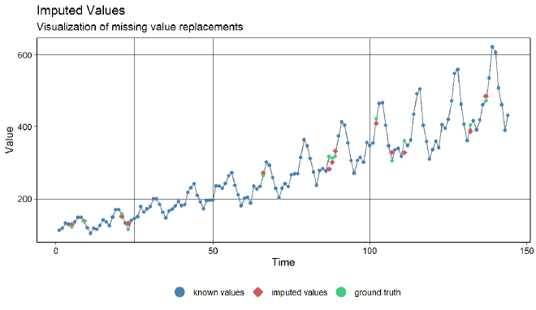
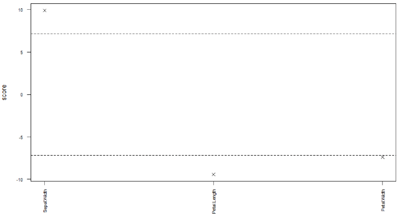
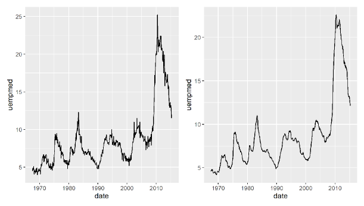
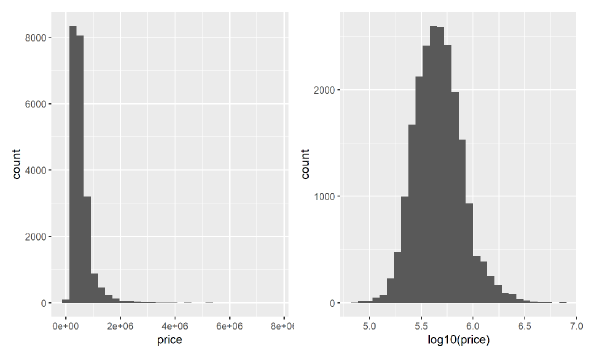
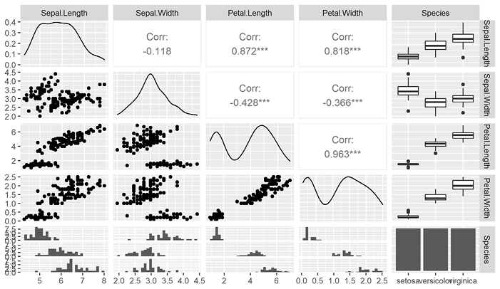

# 探索性数据分析 {#eda}

探索性数据分析（Exploratory Data Analysis，EDA）注重数据的真实分布，通过可视化、变换和建模探索数据，发现数据中隐含的规律，并据此寻找适合数据的模型。

教材把 EDA 概括为一个迭代循环：

1. 拟定关于数据的问题；
2. 通过可视化、变换和建模寻找问题答案；
3. 根据结果改进原问题，或提出新的问题。

本章严格按照教材第五章，依次讨论数据清洗、特征工程和变量关系探索。数据清洗与特征工程也是机器学习中的数据预处理环节。

```{r ch05-setup, include=FALSE}
required_ch05 <- c(
  "tidyverse", "naniar", "rstatix", "patchwork", "readxl"
)
missing_ch05 <- required_ch05[
  !vapply(required_ch05, requireNamespace, logical(1), quietly = TRUE)
]
if (length(missing_ch05)) {
  stop("第 5 章缺少 R 包：", paste(missing_ch05, collapse = ", "))
}

library(tidyverse)
library(naniar)
library(rstatix)
library(patchwork)
library(readxl)

source("../R/chinese-font.R")
chinese_font <- setup_course_chinese_font(quiet = TRUE)
theme_set(
  theme_minimal(base_family = chinese_font, base_size = 12) +
    theme(
      plot.title.position = "plot",
      legend.position = "bottom",
      panel.grid.minor = element_blank()
    )
)
```

## 数据清洗

数据清洗用于处理缺失、重复、异常、逻辑错误、不一致数据和冗余变量等质量问题。教材指出，数据质量会直接影响模型效果，数据清洗常常占据数据挖掘或机器学习工作的大部分时间。

### 缺失值

R 用 `NA` 表示缺失值。`NA` 占据一个元素位置，但该位置的值未知；`NULL` 表示空值，不占据元素位置。若数据用 `9999` 等特殊值代替缺失，应先用 `naniar::replace_with_na()` 转换成 `NA`。

```{r ch05-na-propagation}
# NA 参与一般数值计算时，结果仍然是 NA。
mean(c(1, 2, NA, 4))

# na.rm = TRUE 表示计算前移除缺失值。
mean(c(1, 2, NA, 4), na.rm = TRUE)
```

#### 探索缺失值

##### 缺失模式

教材区分三种缺失模式：

- **完全随机缺失（MCAR）**：缺失是否发生与自身变量和其他变量都无关；
- **随机缺失（MAR）**：缺失与自身变量无关，但与其他变量有关；
- **非随机缺失（MNAR）**：缺失是否发生与变量自身有关。

`naniar::mcar_test()` 实现 Little’s MCAR 检验，原假设为数据属于 MCAR。

```{r ch05-mcar-test}
# airquality 是教材使用的空气质量数据。
# mcar_test() 检验其缺失是否可视为完全随机缺失。
mcar_result <- mcar_test(airquality)
mcar_result
```

教材结果的 P 值约为 0.00142，小于 0.05，因此拒绝 MCAR 原假设。

```{r ch05-vis-miss, fig.cap="教材图 5.1：airquality 数据框的缺失情况。"}
# 每列代表一个变量，每行代表一个观测；深色单元格表示缺失。
vis_miss(airquality)
```

##### 缺失值统计

```{r ch05-missing-overview}
# 分别计算教材列出的四个总体缺失指标。
tibble(
  指标 = c("缺失值总数", "完整值总数", "含缺失行占比", "含缺失列占比"),
  结果 = c(
    n_miss(airquality),
    n_complete(airquality),
    prop_miss_case(airquality),
    prop_miss_var(airquality)
  )
)
```

```{r ch05-missing-case-summary}
# 按每一行的缺失个数从多到少排序；讲义显示前 8 行。
miss_case_summary(airquality) |>
  slice_head(n = 8)

# 汇总“每行缺失几个值”的行数和比例。
miss_case_table(airquality)
```

```{r ch05-missing-var-summary}
# 逐列统计缺失个数和缺失比例。
miss_var_summary(airquality)

# 汇总具有相同缺失个数的变量数量。
miss_var_table(airquality)
```

```{r ch05-gg-miss-var, fig.cap="教材图 5.2：airquality 各变量的缺失值个数。"}
# 横轴是变量，纵轴是缺失个数。
gg_miss_var(airquality)
```

##### 对比缺失与非缺失数据

影子矩阵与原数据维数相同，用 `NA` 和 `!NA` 标记相应元素是否缺失。`bind_shadow()` 将影子矩阵并到原数据右侧，使缺失状态可以参与分组与绘图。

```{r ch05-shadow-matrix}
# 为每个原始变量增加对应的缺失标记变量。
aq_shadow <- bind_shadow(airquality)

# 展示前 6 行，观察 Ozone_NA、Solar.R_NA 等影子变量。
aq_shadow |>
  slice_head(n = 6)
```

```{r ch05-shadow-summary}
aq_shadow |>
  # 根据 Ozone 是否缺失分成两组。
  group_by(Ozone_NA) |>
  # 比较两组 Solar.R 的均值、标准差、方差、最小值和最大值。
  summarise(
    mean = mean(Solar.R, na.rm = TRUE),
    sd = sd(Solar.R, na.rm = TRUE),
    var = var(Solar.R, na.rm = TRUE),
    min = min(Solar.R, na.rm = TRUE),
    max = max(Solar.R, na.rm = TRUE),
    .groups = "drop"
  )
```

```{r ch05-shadow-density, fig.cap="教材图 5.3：根据 Ozone 是否缺失，对比 Temp 的分布。"}
aq_shadow |>
  ggplot(aes(Temp, color = Ozone_NA)) +
  # 两条曲线分别表示 Ozone 缺失与非缺失观测的温度分布。
  geom_density(linewidth = 1) +
  labs(x = "温度", y = "概率密度", color = "Ozone 是否缺失")
```

#### 插补缺失值

若样本数据足够且缺失样本比例较小，可以删除缺失观测；否则需要根据变量类型和缺失机制选择插补方法。

```{r ch05-drop-na-feedback}
# 删除 airquality 中任意变量存在缺失的行。
airquality_complete <- airquality |>
  drop_na()

# 对比删除前后的行数，让删除操作产生可核对结果。
tibble(
  数据 = c("原始数据", "删除缺失行后"),
  行数 = c(nrow(airquality), nrow(airquality_complete))
)
```

教材还给出按缺失比例删除行或列的通用写法。下面仍使用教材的 `airquality` 数据执行相同规则。

```{r ch05-drop-by-proportion}
# 仅保留缺失比例低于 60% 的行。
rows_under_60 <- airquality %>%
  filter(pmap_lgl(., ~ mean(is.na(c(...))) < 0.6))

# 仅保留缺失比例低于 60% 的列。
cols_under_60 <- airquality |>
  select(where(~ mean(is.na(.x)) < 0.6))

# 输出保留后的维度，作为筛选结果反馈。
tibble(
  操作 = c("按行筛选", "按列筛选"),
  保留行数 = c(nrow(rows_under_60), nrow(cols_under_60)),
  保留列数 = c(ncol(rows_under_60), ncol(cols_under_60))
)
```

##### 单重插补

教材先介绍均值、中位数和众数插补，再介绍 `simputation` 的模型插补语法 `impute_<模型>(dat, formula, ...)`。

```{r ch05-mean-imputation}
aq_mean_imputed <- airquality |>
  group_by(Month) |>
  # 在每个月内部，用该月 Ozone 均值替换 Ozone 缺失值。
  mutate(Ozone = naniar::impute_mean(Ozone)) |>
  ungroup()

# 输出插补前后的 Ozone 缺失个数。
tibble(
  数据 = c("插补前", "分组均值插补后"),
  Ozone缺失数 = c(
    sum(is.na(airquality$Ozone)),
    sum(is.na(aq_mean_imputed$Ozone))
  )
)
```

```{r ch05-simputation-code, eval=FALSE}
library(simputation)

# 按 Month 分组，用组内中位数插补 Ozone。
impute_median(airquality, Ozone ~ Month)

# 用 Solar.R、Wind 和 Temp 建立线性模型预测 Ozone；
# add_residual = "normal" 在预测值上增加正态随机误差。
impute_lm(
  airquality,
  Ozone ~ Solar.R + Wind + Temp,
  add_residual = "normal"
)

# 用决策树模型插补 Ozone，并区分原始值与插补值。
airquality |>
  bind_shadow() |>
  as.data.frame() |>
  impute_cart(Ozone ~ Solar.R + Wind + Temp) |>
  add_label_shadow() |>
  ggplot(aes(Solar.R, Ozone, color = any_missing)) +
  geom_point() +
  theme(legend.position = "top")
```

```{r ch05-cart-result, echo=FALSE, fig.cap="教材图 5.4：决策树插补及插补效果。", out.width="82%"}
knitr::include_graphics("assets/textbook/ch05/tx25247.png")
```

##### 多重插补

多重插补创建多个数据副本，分别完成插补，再综合多个数据集上的分析结果。教材使用 `mice()` 的预测均值匹配方法生成 5 个插补数据集。

```{r ch05-mice-code, eval=FALSE}
library(mice)

# m = 5 生成 5 个插补数据集；maxit = 10 表示最多迭代 10 次；
# method = "pmm" 使用预测均值匹配；print = FALSE 关闭过程输出。
aq_imp <- mice(
  airquality,
  m = 5, maxit = 10, method = "pmm",
  seed = 1, print = FALSE
)

# complete() 从多重插补对象中提取完整数据。
aq_dat <- mice::complete(aq_imp)

# 完整数据的总缺失数应为 0。
naniar::n_miss(aq_dat)
```

##### 插值法插补

`imputeTS` 提供时间序列插补方法。教材用样条插值补齐 `tsAirgap`，并与真实值对比。

```{r ch05-imputets-code, eval=FALSE}
library(imputeTS)

# option = "spline" 使用样条插值。
imp <- na_interpolation(tsAirgap, option = "spline")

# 同时显示缺失序列、插补值与完整真实序列。
ggplot_na_imputations(tsAirgap, imp, tsAirgapComplete)
```

```{r ch05-imputets-result, echo=FALSE, fig.cap="教材图 5.5：样条插值后的时间序列及真实值对比。", out.width="80%"}

```

### 异常值

异常值是与其他取值或观测相距较远的数据点。它们可能来自记录错误，也可能正是研究目标，例如异常交易。教材给出的常见处理方式是直接剔除，或替换为 `NA` 后再插补。

#### 单变量的异常值

教材使用三种规则：

- **标准差法**：近似正态时，将均值正负 3 个标准差之外的值视为异常；
- **百分位数法**：将指定上下百分位数之外的值视为异常；
- **箱线图法**：将 $Q_1-1.5IQR$ 与 $Q_3+1.5IQR$ 之外的值视为异常。

```{r ch05-univ-outlier-function}
univ_outliers <- function(
  x, method = "boxplot", k = NULL,
  coef = NULL, lp = NULL, up = NULL
) {
  # 根据 method 选择教材中的一种阈值计算规则。
  switch(
    method,
    "sd" = {
      if (is.null(k)) k <- 3
      mu <- mean(x, na.rm = TRUE)
      sigma <- sd(x, na.rm = TRUE)
      LL <- mu - k * sigma
      UL <- mu + k * sigma
    },
    "boxplot" = {
      if (is.null(coef)) coef <- 1.5
      Q1 <- quantile(x, 0.25, na.rm = TRUE)
      Q3 <- quantile(x, 0.75, na.rm = TRUE)
      iqr <- Q3 - Q1
      LL <- Q1 - coef * iqr
      UL <- Q3 + coef * iqr
    },
    "percentiles" = {
      if (is.null(lp)) lp <- 0.025
      if (is.null(up)) up <- 0.975
      LL <- quantile(x, lp, na.rm = TRUE)
      UL <- quantile(x, up, na.rm = TRUE)
    }
  )

  # 找出低于下限或高于上限的元素位置。
  idx <- which(x < LL | x > UL)

  # 同时返回异常值、索引和数量。
  list(
    outliers = x[idx],
    outlier_idx = idx,
    outlier_num = length(idx)
  )
}
```

```{r ch05-univ-outlier-results}
# 教材以 mpg$hwy 为例，分别运行三种异常值规则。
x <- mpg$hwy

boxplot_outliers <- univ_outliers(x)
sd_outliers <- univ_outliers(x, method = "sd")
percentile_outliers <- univ_outliers(x, method = "percentiles")

# 整理成一张表，比较异常值个数、取值和位置。
tibble(
  方法 = c("箱线图法", "标准差法", "百分位数法"),
  异常值个数 = c(
    boxplot_outliers$outlier_num,
    sd_outliers$outlier_num,
    percentile_outliers$outlier_num
  ),
  异常值 = c(
    toString(boxplot_outliers$outliers),
    toString(sd_outliers$outliers),
    toString(percentile_outliers$outliers)
  ),
  索引 = c(
    toString(boxplot_outliers$outlier_idx),
    toString(sd_outliers$outlier_idx),
    toString(percentile_outliers$outlier_idx)
  )
)
```

#### 多变量的异常值

##### 局部异常因子法与聚类法

局部异常因子（LOF）比较样本与邻近样本的局部密度；聚类法根据样本在聚类结构中的异常程度排序。

```{r ch05-dmwr-code, eval=FALSE}
library(DMwR2)

# 使用 iris 的前 4 个连续变量计算 LOF；k = 10 表示使用 10 个邻居。
lofs <- lofactor(iris[, 1:4], k = 10)

# 按 LOF 从大到小选择最异常的 5 个样本索引。
order(lofs, decreasing = TRUE)[1:5]
# 教材结果：42, 107, 23, 16, 99。

# 用聚类算法给出异常概率，并查看概率最高的 5 个样本。
rlt <- outliers.ranking(iris[, 1:4])
sort(rlt$prob.outliers, decreasing = TRUE)[1:5]
```

教材的聚类异常概率最高的样本依次为 36、42、107、58 和 61。

##### 基于模型的异常值

```{r ch05-model-outlier}
# 教材以 mtcars 建立 mpg 关于 wt 的一元线性回归。
outlier_model <- lm(mpg ~ wt, data = mtcars)

# outlierTest() 对学生化残差执行 Bonferroni 异常值检验。
car::outlierTest(outlier_model)
```

教材结果没有发现 Bonferroni 校正后 P 值小于 0.05 的学生化残差。

##### 随机森林法检测异常值

`outForest` 根据每个变量的袋外预测误差构造异常得分，并可以用非异常观测的预测值替换异常值。

```{r ch05-outforest-code, eval=FALSE}
library(outForest)

# 在 iris 中按 2% 的比例随机生成异常值。
iris_with_out <- generateOutliers(iris, p = 0.02, seed = 123)

# 检测 Sepal.Length 之外数值变量中的异常值，每列最多报告 3 个。
out <- outForest(
  iris_with_out,
  . - Sepal.Length ~ .,
  max_n_outliers = 3,
  verbose = 0
)

# 输出异常值位置、观测值、预测值、RMSE、得分与替换值。
outliers(out)

# 绘制各变量的异常值得分。
plot(out, what = "scores")
```

```{r ch05-outforest-result, echo=FALSE, fig.cap="教材图 5.6：各变量的随机森林异常值得分。", out.width="86%"}

```

## 特征工程

特征工程通过缩放、变换或降维，把原始变量转换为更适合分析或建模的特征。本节保留教材中的特征缩放、非线性与正态性变换、连续变量离散化和主成分分析。

### 特征缩放

#### 标准化

标准化为 $z=(x-\bar{x})/s$，使变量均值约为 0、标准差约为 1。`scale(x, scale = FALSE)` 只做中心化。

```{r ch05-scale-feedback}
# 继续使用教材前面定义的 mpg$hwy。
x <- mpg$hwy

# scale() 默认先中心化再除以标准差；只显示前 6 个结果。
standardized_x <- scale(x)
head(standardized_x)

# scale = FALSE 只减去均值，不除以标准差。
centered_x <- scale(x, scale = FALSE)
head(centered_x)
```

```{r ch05-scale-check}
# 用均值和标准差验证标准化结果。
tibble(
  指标 = c("均值", "标准差"),
  标准化结果 = c(mean(standardized_x), sd(standardized_x))
)
```

#### 归一化

正向归一化把数据线性映射到区间 $[a,b]$；负向归一化映射到同一区间，但反转大小顺序。

```{r ch05-rescale-function}
rescale <- function(x, type = "pos", a = 0, b = 1) {
  # 计算原变量的最小值和最大值，忽略缺失值。
  rng <- range(x, na.rm = TRUE)

  # 正向映射保留次序；负向映射反转次序。
  switch(
    type,
    "pos" = (b - a) * (x - rng[1]) / (rng[2] - rng[1]) + a,
    "neg" = (b - a) * (rng[2] - x) / (rng[2] - rng[1]) + a
  )
}
```

```{r ch05-rescale-result}
iris_rescaled <- as_tibble(iris) |>
  # 将全部数值变量归一化到 [0, 100]，Species 保持因子类型。
  mutate(across(where(is.numeric), rescale, b = 100))

# 输出前 6 行作为归一化结果。
iris_rescaled |>
  slice_head(n = 6)
```

#### 行规范化

行规范化把每个样本的连续特征向量除以自身的 $L_2$ 范数，使每行向量长度为 1。

```{r ch05-row-normalization}
iris_row_normalized <- iris[1:3, -5] |>
  # pmap_dfr() 每次把一行的 4 个数传给匿名函数。
  pmap_dfr(~ {
    row_values <- c(...)
    # 用该行的 L2 范数除整行。
    row_values / norm(as.matrix(row_values), "2")
  })

iris_row_normalized
```

```{r ch05-row-normalization-check}
# 再计算每行的 L2 范数；结果应接近 1。
iris_row_normalized %>%
  mutate(L2范数 = pmap_dbl(., ~ norm(as.matrix(c(...)), "2")))
```

#### 数据平滑

教材对 `economics$uempmed` 做五点移动平均，即当前位置前后各取两个观测计算均值。

```{r ch05-smoothing-code, eval=FALSE}
library(slider)
library(patchwork)

p1 <- economics |>
  ggplot(aes(date, uempmed)) +
  geom_line()

p2 <- economics |>
  # .before = 2、.after = 2 构成以当前观测为中心的五点窗口。
  mutate(uempmed = slide_dbl(uempmed, mean, .before = 2, .after = 2)) |>
  ggplot(aes(date, uempmed)) +
  geom_line()

# 并排显示原始序列和平滑序列。
p1 | p2
```

```{r ch05-smoothing-result, echo=FALSE, fig.cap="教材图 5.7：原始序列与五点移动平均后的序列。", out.width="84%"}

```

### 特征变换

#### 非线性特征

多项式特征把原变量的平方或更高次幂加入数据，为模型表达非线性关系提供新的输入。

```{r ch05-polynomial-code, eval=FALSE}
library(tidymodels)

polynomial_features <- recipe(hwy ~ displ + cty, data = mpg) |>
  # 对两个预测变量生成二次多项式特征；raw = TRUE 使用原始幂次。
  step_poly(all_predictors(), degree = 2, options = list(raw = TRUE)) |>
  prep() |>
  # 返回训练数据转换后的特征表。
  bake(new_data = NULL)

polynomial_features
```

教材输出包含 `hwy`、`displ_poly_1`、`displ_poly_2`、`cty_poly_1` 和 `cty_poly_2` 五列；第一行的 `displ` 为 1.8，其二次项为 3.24。

#### 正态性变换

教材比较 `kc_housing$price` 原始分布与 `log10(price)` 分布。若原始数据包含零或负数，不能直接取对数或平方根，需要先按教材公式平移。

```{r ch05-log-transform-code, eval=FALSE}
# kc_housing 来自 mlr3data；教材用直方图对比变换前后的价格分布。
housing <- mlr3data::kc_housing

p1 <- ggplot(housing, aes(price)) +
  geom_histogram()

p2 <- ggplot(housing, aes(log10(price))) +
  geom_histogram()

p1 | p2
```

```{r ch05-log-transform-result, echo=FALSE, fig.cap="教材图 5.8：房价原始分布与对数变换后的分布。", out.width="82%"}

```

Box–Cox 变换适用于正值数据；Yeo–Johnson 也允许零和负值。教材用最大似然选择 Yeo–Johnson 变换参数 $\lambda$。

```{r ch05-yeojohnson-code, eval=FALSE}
library(bestNormalize)
set.seed(123)

# 从 Gamma 分布生成教材示例数据。
x <- rgamma(100, 1, 1)

# 自动选择 Yeo–Johnson 变换的最佳 lambda。
yj_obj <- yeojohnson(x)
yj_obj$lambda
# 教材结果约为 -1.0336。

# predict() 完成正向变换；inverse = TRUE 再变换回原尺度。
p <- predict(yj_obj)
x2 <- predict(yj_obj, newdata = p, inverse = TRUE)
```

#### 连续变量离散化

教材以 `hyper.xlsx` 的年龄变量为例，用等距分箱生成 3 个年龄区间，再把分组转换为虚拟变量。

```{r ch05-rbin-code, eval=FALSE}
library(rbin)

# 读取教材高血压数据。
hyper <- read_xlsx("../data/ch05/hyper.xlsx")

# 按 age 的取值范围等距分成 3 组。
bins <- hyper |>
  rbin_equal_length(hyper, age, bins = 3)

# 创建离散变量与对应虚拟变量，并查看前 3 行。
rbin_create(hyper, age, bins) |>
  head(3)
```

教材前三行的年龄分别为 58、50、56；离散化后同时得到年龄组和三个 0–1 指示变量。

### 特征降维

主成分分析把多个相关连续变量线性组合为少数互不相关的主成分。教材先标准化 `iris` 的数值变量，再保留累计解释比例达到 85% 的主成分。

```{r ch05-pca-code, eval=FALSE}
library(tidymodels)

iris_pca <- recipe(~ ., data = iris) |>
  # PCA 对变量尺度敏感，因此先标准化全部数值变量。
  step_normalize(all_numeric()) |>
  # 保留累计解释方差达到 85% 的主成分。
  step_pca(all_numeric(), threshold = 0.85) |>
  prep() |>
  bake(new_data = NULL)

iris_pca
```

教材结果保留 `Species`、`PC1` 和 `PC2` 三列，即四个连续测量变量被压缩为两个主成分。

## 探索变量间的关系

教材根据变量类型选择探索方法：两个分类变量使用复式条形图、列联表和卡方检验；分类变量与连续变量使用分组分布、汇总和方差分析；两个连续变量使用相关系数与散点图矩阵。

### 两个分类变量

教材研究 Titanic 乘客的船舱等级 `Pclass` 与是否生存 `Survived` 的关系。

```{r ch05-titanic-data}
# 读取教材的 Titanic 个体级数据，并查看变量结构。
titanic <- read_rds("../data/ch05/titanic.rds")
glimpse(titanic)
```

```{r ch05-titanic-bar, fig.cap="教材图 5.9：不同船舱等级的生存与未生存人数。"}
titanic |>
  ggplot(aes(Pclass, fill = Survived)) +
  # position = "dodge" 把生存和未生存条形并排显示。
  geom_bar(position = "dodge") +
  labs(x = "船舱等级", y = "人数", fill = "是否生存")
```

```{r ch05-categorical-tests}
# 构造船舱等级 × 是否生存的二维列联表。
titanic_table <- table(titanic$Pclass, titanic$Survived)
titanic_table

# Cramer's V 衡量两个分类变量关联强度。
rstatix::cramer_v(titanic_table)

# 比例检验和卡方检验判断不同船舱等级的生存比例是否相同。
rstatix::prop_test(titanic_table)
rstatix::chisq_test(titanic_table)
```

教材得到 Cramer’s V 约为 0.340，卡方检验 P 值远小于 0.05，说明船舱等级与是否生存存在统计关联。

### 分类变量与连续变量

教材比较 `mpg` 中不同驱动方式 `drv` 的发动机排量 `displ`。

```{r ch05-group-density, fig.cap="教材图 5.10：不同驱动方式下发动机排量的概率密度。"}
mpg |>
  ggplot(aes(displ, color = drv)) +
  # 每个 drv 水平绘制一条概率密度曲线。
  geom_density(linewidth = 1) +
  labs(x = "发动机排量", y = "概率密度", color = "驱动方式")
```

```{r ch05-group-summary}
mpg |>
  group_by(drv) |>
  # 五数汇总返回最小值、Q1、中位数、Q3 和最大值。
  get_summary_stats(displ, type = "five_number")
```

```{r ch05-group-anova}
mpg |>
  # 检验三种驱动方式的平均发动机排量是否相同。
  anova_test(displ ~ drv)
```

教材结果的 P 值约为 $3.03\times10^{-34}$，拒绝三组均值相同的原假设。

### 两个连续变量

相关系数用于衡量两个连续变量的线性相关程度。取值范围为 $[-1,1]$：符号表示方向，绝对值表示线性相关强弱。相关系数接近 0 只表示缺少线性相关，不能据此断言两个变量毫无关系。

```{r ch05-correlation-table}
iris_correlations <- iris[-5] |>
  # 计算四个连续变量两两之间的相关系数和 P 值。
  cor_mat() |>
  # 去掉对角线和重复的下三角部分。
  replace_triangle(by = NA) |>
  # 从矩阵形式整理为每行一对变量的长表。
  cor_gather() |>
  # 按相关系数绝对值从大到小排列。
  arrange(-abs(cor))

iris_correlations
```

`Petal.Length` 与 `Petal.Width` 的线性相关最强，教材结果约为 0.96；`Sepal.Length` 与 `Sepal.Width` 的相关系数约为 -0.12，P 值约为 0.152。

```{r ch05-ggpairs-code, eval=FALSE}
library(GGally)

# 对角线显示单变量分布，非对角线显示散点、相关系数或分类比较。
ggpairs(iris, columns = names(iris))
```

```{r ch05-ggpairs-result, echo=FALSE, fig.cap="教材图 5.11：iris 数据的散点图矩阵。", out.width="88%"}

```

本章按照教材顺序完成了缺失值与异常值处理、特征缩放与变换、特征降维，以及三类变量关系探索。EDA 的结果应继续反馈到问题本身，推动下一轮探索。
