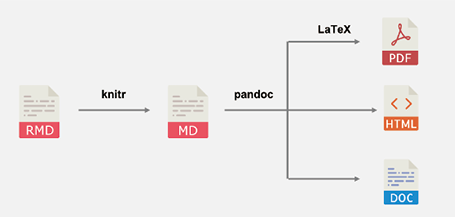
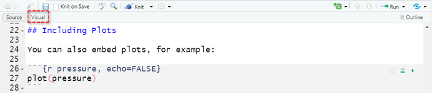
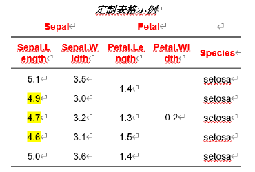
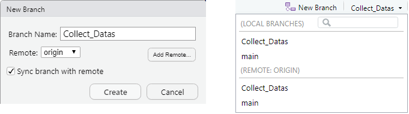
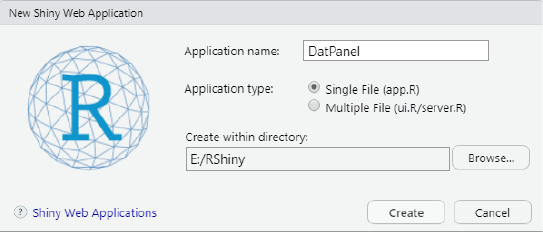
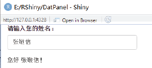
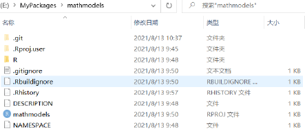

# 文档沟通 {#communication}

R 在研究工作中的重要优势，是把数据、分析代码、运行结果和文字叙述组织在同一份文档中。教材将这一能力概括为“文档沟通”，并从可重复研究、网页交互和开发 R 包三个方向展开；Git 则负责记录分析过程中的改动并支持协作。

```{r ch06-setup, include=FALSE}
required_ch06 <- c("tidyverse", "knitr", "rmarkdown", "shiny", "testthat")
missing_ch06 <- required_ch06[
  !vapply(required_ch06, requireNamespace, logical(1), quietly = TRUE)
]
if (length(missing_ch06)) {
  stop("第 6 章缺少 R 包：", paste(missing_ch06, collapse = ", "))
}
library(tidyverse)

# 三个链接由教材 Shiny 代码生成，并在 Shinylive 官方环境中通过
# WebAssembly 直接运行；服务器不会执行课程代码。
shinylive_greeting_url <- paste0(
  "https://shinylive.io/r/app/#code=",
  "NobwRAdghgtgpmAXGKAHVA6ASmANGAYwHsIAXOMpMAGwEsAjAJykYE8AKAZwAtaJWAlAB0IIgMQACQJqmgBXNAf2oSAbBgDMAFkBY-4GT4wKaKgZc1AsCqA4FUAw-4EZXCZziMAbtYmB8V0AIRoDvUwJgKgW+jAQAwiArrQkAHgBaCQAzan8AEwAFKABzOHYRCQlyAA9SAEkIVF9SZMhYOCE8CVLAd+jdQAqDQBC3Qw1SgVwUtLhMgHl8vILS+MY4OFI+eKaRYVEIK1t7EPDfCAJhknY+HtwJIm78jatOTloSAQkQVq3SHoASfsHhiHig0IGIKOsAFXaC04hU1NQoTjkAAMhWqgF9NcplNb5S7QeAbUqAQH+xj8JABfCZokQiHh8VgAQXQ7H8EgAvBJ-LtrHZGGTLNTrBM8GBSKxUAhkBlSGA0QBdIA",
  "&h=0"
)
shinylive_clt_url <- paste0(
  "https://shinylive.io/r/app/#code=",
  "NobwRAdghgtgpmAXGKAHVA6ASmANGAYwHsIAXOMpMAGwEsAjAJykYE8AKAZwAtaJWAlAB0IdJiw4BzSampFSAJmEQRAYgAEgTVNACuaA-tXUA2DAGYDgLH-AWAmBx+MCcpoA3lQGBKgYD1AMSqBCK0D7RoCHlQA6mgIcjAfe1AWjlAYf1AQPNABTTALO1AMBdAIAYRAFdadQAeAFp1ADNqZIATAAUoSTh2EXV1UlpSajgiiDhqMrBAFHtALk9QyNihMAFccvVOWjy4ehYAGShWIkTSMogKitQiIaqSdQBedR7GWkluUh7+hcWhkbHGesb5xdPGuAJSAEkIVFnmvNpOUkYj7bBnGY-gRmoBxdUAAMp-HqAGLlAJ4ZULAgCmbQB+5gjAODGPh6Aj6A1unDoI0YLzecx6nFgsjgnARgHi0wBc5nZAPOJPiBeHUAEZcByAAzcrns7k4k54glwImvd49CBDGAIzyAdgtADTmjNZ-N5fJ56rVvK53zgqE2mqFtwq+OGYuJkrA9D41LZPUAhuaAI30WX8BdquQBWQW49TGxYwKB8K5NWTyADysxJzTDh16ygqymUIk4YoAbmK0pksokII9aCR2HwSVyZqQSQJ1CABgANC5Z9SMOBQfMZ9jV4XqDSANeVAOn69KZgCo5HzuDxKxkJTsLDLqYuzAAk5JglOpnZgDbnpHn0tospUnY0gEhjQAUroB2I0AkAmAS6NACFuzkA+K6ABCN1OuAOvqBaD+k+Se3AAenAbTgAHdqgIbgbhNTd50+b5GGOE1-ghHpDUYXNaCydh1wAKnfLkNXZf1bhheEwBQm0ICIGBMPUHCIDVPCTEIxYehRZCtkYZYvmo2ivSYioegxNjGzgX9UG43COQTRZkwPdRAHnrd91E-BlGUAIRtQUAHgVABh-3tAAYlZ8lKVTSf0WPIoFIKAMCyZh4HYX8UKIICAFlm2lTDzN2X87M4Lk8yIahDQgbEpIAXxkioyxJedYwbJsIEJAo5DmDtbmkWN2DrFh2D6dQoCpOzsXUABqX0KhKSiAH1eG+IhJBsiCEKgahUG4KBDW5DAFC5ciAK2KCevghDsloagAq2MlyEaehcjgYF-KIRhDR6aaWwAax6Uq-QGMKRBCkQU14fgAEF0HYZJDWSXV00zLZU0YDNGGUPAwFIVhUAQZByF-UgwBCgBdIA",
  "&h=0"
)
shinylive_dashboard_url <- paste0(
  "https://shinylive.io/r/app/#code=",
  paste(readLines("../apps/ch06-dashboard/shinylive-code.txt"), collapse = ""),
  "&h=0"
)
```

## R Markdown

### Markdown 简介

Markdown 是用纯文本书写的轻量级标记语言。`.md` 源文件易读、易修改，也可以转换为 HTML、Word、PDF 或 LaTeX 等格式。

#### Markdown 语法

标题用一个或多个 `#` 表示层级；列表使用 `-`、`*` 或连续数字；引用使用 `>`。教材以“左侧语法、右侧预览”的方式展示这些规则。

```{r ch06-markdown-basic, echo=FALSE, fig.cap="教材图 6.1—6.5：标题、列表、引用和文字格式。", out.width="96%"}
knitr::include_graphics(c(
  "assets/textbook/ch06/tx25941.png", "assets/textbook/ch06/tx25949.png",
  "assets/textbook/ch06/tx25957.png", "assets/textbook/ch06/tx25966.png",
  "assets/textbook/ch06/tx25977.png"
))
```

Markdown 支持 LaTeX 数学公式和多种语言的高亮代码块。行内公式放在一对 `$` 中，行间公式放在一对 `$$` 中；代码块由三枚反引号包围，并可在开头指定语言。

```{r ch06-markdown-math-code, echo=FALSE, fig.cap="教材图 6.6—6.7：数学公式与高亮代码块。", out.width="96%"}
knitr::include_graphics(c(
  "assets/textbook/ch06/tx25988.png", "assets/textbook/ch06/tx25997.png"
))
```

图片需要提供路径或网址；链接由方括号中的说明文字和圆括号中的地址组成。

```markdown
{width=80%}
[超链接描述](https://example.com)
```

表格、交叉引用和脚注也可以直接写在 Markdown 中。

```{r ch06-markdown-table-ref, echo=FALSE, fig.cap="教材图 6.8—6.10：表格、交叉引用与脚注。", out.width="96%"}
knitr::include_graphics(c(
  "assets/textbook/ch06/tx26005.png", "assets/textbook/ch06/tx26013.png",
  "assets/textbook/ch06/tx26020.png"
))
```

### R Markdown 基础

R Markdown 在普通 Markdown 中加入可执行代码块。它可以制作数据分析报告、期刊论文、书籍、简历、网站、幻灯片和交互报表。`knitr` 先执行代码块并生成包含结果的 Markdown 文件，Pandoc 再转换为最终格式。

```{r ch06-rmd-pipeline, echo=FALSE, fig.cap="教材图 6.11：R Markdown 文件的编译过程。", out.width="88%"}

```

#### 创建与编译文档

教材在 RStudio 中选择 **New File → R Markdown…**，填写标题和作者，再选择 HTML、PDF 或 Word。默认模板已经包含 YAML、正文和代码块。

```{r ch06-rmd-create, echo=FALSE, fig.cap="教材图 6.12—6.13：新建 R Markdown 与默认模板。", out.width="96%"}
knitr::include_graphics(c(
  "assets/textbook/ch06/tx26036.png", "assets/textbook/ch06/tx26044.png"
))
```

从 `.Rmd` 到目标文档的过程称为 knit。除了点击 **Knit**，也可以运行：

```{r ch06-render-command, eval=FALSE}
# 指定源文件与目标格式，编译一份 HTML 文档。
rmarkdown::render("rmddemo.Rmd", "html_document")
```

#### YAML

YAML 位于文件开头的一对 `---` 之间，由“键: 值”组成，控制标题、作者、日期、参数与输出格式。

```yaml
---
title: "R Markdown 示例"
author: "王芝皓"
date: "`r Sys.Date()`"
output:
  html_document:
    toc: true
    toc_depth: 2
---
```

教材列出的输出包括 HTML、Markdown、PDF、Word、PowerPoint、Beamer、ioslides 与 slidy。还可以设置浮动目录、章节编号、代码折叠、图形尺寸和标题、数据框样式、语法高亮、主题、是否保留中间文件及 Word 参考模板。

```yaml
output:
  word_document:
    reference_docx: "template.docx"
```

与 Office 交互的相关包包括：`officer` 生成 Word/PowerPoint，`officedown` 编译 Office 文档，`flextable` 定制表格，`mschart` 绘制 Office 风格图形，`rvg` 生成可编辑矢量图。

#### 代码块

R 代码块写在 ```` ```{r} ```` 与 ```` ``` ```` 之间。代码块名称便于导航和缓存管理，块选项负责控制代码、消息、警告和结果。

| 选项 | 作用 |
|:---|:---|
| `eval = FALSE` | 显示代码但不运行 |
| `echo = FALSE` | 运行代码但不显示代码 |
| `include = FALSE` | 运行代码，但代码和结果都不显示 |
| `message = FALSE`、`warning = FALSE` | 隐藏消息或警告 |
| `error = TRUE` | 出错后继续编译 |
| `collapse = TRUE` | 合并代码与文本结果 |
| `cache = TRUE` | 缓存结果 |
| `results = "hide"` | 隐藏文本结果 |
| `fig.width`、`fig.height` | 设置图形尺寸 |
| `fig.align`、`fig.cap` | 设置图形对齐与标题 |

全局选项通常放在文档开头的设置块中，个别代码块再覆盖所需选项。

    ```{r ch06-example-setup, eval=FALSE}
    # 让所有后续代码块默认显示代码。
    knitr::opts_chunk$set(echo = TRUE)
    ```

R Markdown 还支持行内 R 代码。教材先拟合 `mtcars` 的线性回归模型，再由编译过程把系数自动写入正文。

```{r ch06-inline-model, include=FALSE}
# 建立 mpg 关于 disp 的线性回归模型。
mdl_ch06 <- lm(mpg ~ disp, data = mtcars)

# 提取截距和斜率，供正文中的行内代码使用。
b_ch06 <- coef(mdl_ch06)
```

该模型斜率为 `r round(b_ch06[2], 4)`，回归方程为
$mpg = `r round(b_ch06[1], 4)` + (`r round(b_ch06[2], 4)`)\,disp$。当数据变化时，正文数值会在重新编译后同步更新。

#### 插入图片和表格

R 生成的图形可以直接保留为代码块输出；现成图片可使用 Markdown 或 `knitr::include_graphics()`。RStudio 的可视化编辑器则允许通过菜单插入图片和表格。

```{r ch06-visual-editor, echo=FALSE, fig.cap="教材图 6.14：启用可视化 Markdown 编辑器。", out.width="86%"}

```

`knitr::kable()` 可以把数据框或矩阵生成简单表格。下面执行教材中的 `mtcars` 示例并显示结果。

```{r ch06-kable-result}
# 选取 mtcars 的前 3 行、前 7 列。
mtcars_table <- mtcars[1:3, 1:7]

# 设置对齐、小数位、列名和表题。
knitr::kable(
  mtcars_table,
  align = c("l", "c", "c", "r", "r", "r", "r"),
  digits = 2,
  col.names = stringr::str_c("x", 1:7),
  caption = "教材表 6.1：mtcars 部分数据"
)
```

### 表格输出

教材介绍 `kableExtra`、`huxtable`、`flextable`、`gt`、`DT` 与 `reactable` 等表格包。它们都能控制背景、边框、对齐、颜色与数字格式，但支持的输出格式有所不同。

#### 导出三线表到 Word

教材用 `flextable` 增加标题和分组表头，设置对齐、颜色、粗体、合并与条件高亮，最后写入 Word。该操作创建外部文件，因此构建时不执行。

```{r ch06-flextable-code, eval=FALSE}
library(flextable)

iris[1:5, ] |>
  # 把数据框转换为 flextable 对象。
  flextable() |>
  set_caption("定制表格示例") |>
  # 增加跨列分组表头。
  add_header_row(colwidths = c(2, 2, 1), values = c("Sepal", "Petal", "")) |>
  # 设置全表居中、表头红色并加粗。
  align(align = "center", part = "all") |>
  color(color = "red", part = "header") |>
  bold(bold = TRUE, part = "header") |>
  merge_v(j = 3:4) |>
  # 高亮 Sepal.Length 小于 5 的单元格。
  highlight(i = ~ Sepal.Length < 5, j = 1, color = "yellow") |>
  # 保存为 Word 文件。
  save_as_docx(path = "output/threelinetable.docx")
```

```{r ch06-flextable-figure, echo=FALSE, fig.cap="教材图 6.15：自动生成三线表。", out.width="88%"}

```

#### 整理统计模型结果

教材用 `modelsummary` 接收多个模型对象，并修改参数名称、显著性星号、小数位、标题和拟合优度统计量。示例数据 `Guerry.csv` 未包含在当前配套资料中，因此保留教材方法但不执行。

```{r ch06-modelsummary, eval=FALSE}
# 读取教材使用的数据。
df <- readr::read_csv("data/Guerry.csv")

# 建立 OLS 与 Poisson 两个模型。
models <- list(
  "OLS" = lm(Donations ~ Literacy + Clergy, data = df),
  "Poisson" = glm(
    Donations ~ Literacy + Commerce,
    family = poisson, data = df
  )
)

# 建立模型项原名与显示名的对应关系。
cm <- c(
  "(Intercept)" = "Constant", "Literacy" = "Literacy (%)",
  "Clergy" = "Priests/capita"
)

library(modelsummary)
library(huxtable)

modelsummary(
  models, output = "huxtable", coef_map = cm,
  stars = TRUE, fmt = "%.2f",
  title = "Regression Tables with modelsummary",
  gof_omit = "IC|Log|Adj"
) |>
  # 修改指定行的字体颜色和背景色。
  set_text_color(row = 4, col = 1:ncol(.), value = "red") |>
  set_background_color(row = 6, col = 1:ncol(.), value = "lightblue") |>
  quick_pdf(file = "output/tablepdf.pdf")
```

```{r ch06-modelsummary-figures, echo=FALSE, fig.cap="教材图 6.16—6.17：模型表导出为 PDF 与 LaTeX。", out.width="96%"}
knitr::include_graphics(c(
  "assets/textbook/ch06/tx26189.png", "assets/textbook/ch06/tx26200.png"
))
```

#### 参数化报告与批量编译

参数化报告在 YAML 的 `params` 中设置数据集名称，正文通过 `params$name` 取得参数。教材再用 `purrr::walk()` 对多个名称重复调用 `render()`。

    ---
    title: "数据概览：（此处使用行内 R 代码读取 params$name）"
    params:
      name: "input your data name"
    output: html_document
    ---

    ```{r ch06-parameter-template, eval=FALSE}
    # 根据 YAML 参数取得相应数据对象，并输出概要。
    df <- get(params$name)
    summary(df)
    ```

```{r ch06-batch-render, eval=FALSE}
# 教材要求用同一模板分析三个内置数据集。
names <- c("iris", "mtcars", "CO2")

purrr::walk(names, \(data_name) {
  # 每次传入一个数据集名称，并设置对应输出文件名。
  rmarkdown::render(
    "Reproducible.Rmd",
    params = list(name = data_name),
    output_file = paste0(data_name, "分析报告.html")
  )
})
```

## R 与 LaTeX 交互

LaTeX 擅长数学公式、书籍、期刊论文和学术报告排版。教材给出的 PDF 路径是 `.Rmd → .md → .tex → .pdf`，R Markdown 把代码结果嵌入这一流程。

### LaTeX 开发环境

教材推荐 R 用户采用 TinyTeX 与 RStudio。TinyTeX 保留 LaTeX 核心组件，并能补充编译所需宏包；`tinytex` 包提供 R 中的管理函数。

#### Windows 与 macOS 安装路线（课程补充）

LaTeX 不是一个单独的编辑器，而是一套排版系统。要让 R Markdown 生成 PDF，计算机上必须存在一个 LaTeX **发行版**，其中包含 `xelatex`、`pdflatex`、宏包管理器和常用字体支持。对本课程而言，选择一种发行版即可，不建议初学者同时安装多套发行版，以免 IDE 找到错误的可执行文件。

| 使用情形 | Windows | macOS | 特点 |
|:---|:---|:---|:---|
| 本课程中文 LaTeX 教学 | **CTeX 中文套装** | MacTeX | Windows 课程环境优先采用 CTeX，已集成 MiKTeX 与常用中文支持 |
| 轻量编译 R Markdown | TinyTeX | TinyTeX | 体积较小，`tinytex` 包可协助安装缺失宏包 |
| 希望安装完整 TeX Live | TeX Live | MacTeX | 宏包较齐全，但下载和占用空间较大 |
| 单独使用 MiKTeX | MiKTeX | — | Windows 上可通过 MiKTeX Console 管理与按需安装宏包 |

上述入口均来自项目官方页面，已于 2026 年 8 月核对：

- **TinyTeX（Windows 与 macOS）**：[TinyTeX 官方安装页](https://yihui.org/tinytex/)；
- **Windows · CTeX 中文套装（本课程推荐）**：[CTeX 套装官方页面](https://ctex.org/CTeX/)及其[下载中心](https://ctex.org/ctex/download/)；
- **Windows · TeX Live**：[TeX Live on Windows](https://tug.org/texlive/windows.html)，也可直接下载官方网络安装器 [`install-tl-windows.exe`](https://mirror.ctan.org/systems/texlive/tlnet/install-tl-windows.exe)；
- **Windows · MiKTeX**：[MiKTeX 官方下载页](https://miktex.org/download)；
- **macOS · MacTeX**：[MacTeX 官方下载页](https://tug.org/mactex/mactex-download.html)。

##### Windows 安装步骤

**路线 A：CTeX 中文套装（本课程 Windows 环境推荐）**

CTeX 官方说明，该中文套装以 Windows 下的 MiKTeX 为基础，同时集成 WinEdt、Ghostscript、GSview、中文宏包与模板，并支持 CJK、xeCJK 等中文处理方式。官方页面当前列出的最新版为 v3.1；下载中心提供基础版、完整版和更新文件。

1. 打开 [CTeX 套装官方页面](https://ctex.org/CTeX/)，进入[下载中心](https://ctex.org/ctex/download/)；
2. 选择“最新版本”。一般 64 位 Windows 可选择文件名带 `_x64.exe` 的基础版；基础版已经包含 MiKTeX 基本安装和中文常用宏包；
3. 如果选择完整版，需要同时下载同名的 `_Full.exe` 和 `_Full.nsisbin`，并把两个文件放在同一目录后再运行安装程序；
4. 若计算机仍安装 CTeX 2.9.2 或更旧版本，官方说明不能直接升级到 3.0 及以上版本，应先卸载旧版，再安装新版；
5. 按安装向导完成安装。安装后可打开 MiKTeX Console 检查更新和宏包状态；
6. 完全退出并重新打开 RStudio 或 Positron，然后执行 `Sys.which("xelatex")`；
7. 使用本节的 `latex-check.Rmd` 编译测试中文和数学公式。

CTeX 官方版权说明限定该套装用于科研与学术目的，不得用于商业目的。本课程属于教学使用；若学生后续用于商业项目，应改用许可证适合该场景的 TeX Live、MiKTeX 或 TinyTeX，并自行核对相关软件许可证。

**路线 B：TinyTeX（轻量替代）**

1. 先安装 R，并打开 RStudio 或 Positron 的 R Console；
2. 安装 `tinytex` R 包；
3. 调用 `install_tinytex()` 下载并安装 TinyTeX；
4. 安装完成后重启 RStudio 或 Positron，让 IDE 重新读取系统路径；
5. 用本节后面的验证命令检查 `xelatex`，再编译最小 PDF。

```{r ch06-tinytex-install-r, eval=FALSE}
# 安装用于管理 TinyTeX 的 R 包；通常只需执行一次。
install.packages("tinytex")

# 下载并安装 TinyTeX 发行版。
# 该命令会写入用户目录并下载文件，因此课程讲义构建时不执行。
tinytex::install_tinytex()

# 若以后需要卸载，应显式运行：
# tinytex::uninstall_tinytex()
```

**路线 C：TeX Live**

1. 打开 [TeX Live Windows 官方页面](https://tug.org/texlive/windows.html)；
2. 下载并运行 `install-tl-windows.exe`；
3. 初学者可以保留默认方案，也可以在 **Advanced** 中调整安装集合和目录；
4. 等待宏包下载与安装完成。官方安装器通常会在 Windows 中配置 TeX Live 菜单、文件关联和可执行文件路径；
5. 重启 IDE 后运行 `Sys.which("xelatex")`。

**路线 D：单独安装 MiKTeX**

1. 打开 [MiKTeX 官方下载页](https://miktex.org/download)，下载 Windows Basic Installer；
2. 运行安装程序并选择仅当前用户或所有用户；没有集中运维需求时，个人安装通常更简单；
3. 安装后打开 **MiKTeX Console**，先执行更新；
4. 在 Settings 中确认缺失宏包的安装策略；
5. 重启 IDE 并验证 `xelatex`。

##### macOS 安装步骤

**路线 A：TinyTeX（本课程推荐）**

TinyTeX 在 macOS 和 Windows 中使用相同的 R 安装命令。官方说明其默认安装在用户的 `~/Library/TinyTeX` 中。安装完成后应重启 RStudio 或 Positron。

```{r ch06-tinytex-install-macos, eval=FALSE}
# 在 macOS 的 R Console 中安装管理包和 TinyTeX。
install.packages("tinytex")
tinytex::install_tinytex()
```

**路线 B：MacTeX**

1. 打开 [MacTeX 官方下载页](https://tug.org/mactex/mactex-download.html)；
2. 下载 `MacTeX.pkg`。安装包较大，下载前应预留足够磁盘空间；
3. 双击安装包并按照 macOS 安装向导完成安装；
4. MacTeX 会安装 TeX Live，同时提供 TeXShop、TeX Live Utility 等 macOS 工具；
5. 安装完成后重启 IDE。MacTeX 通常通过 `/Library/TeX/texbin` 向应用程序提供 LaTeX 命令。

##### 安装后验证

无论选择哪一种发行版，都应先确认 R 能找到 LaTeX 引擎，再编译一份最小文档。若 `Sys.which()` 返回空字符串，先完全退出并重启 IDE；仍为空时，再检查发行版是否安装完成以及 `PATH` 是否正确。

```{r ch06-latex-verify, eval=FALSE}
# 查看 R 当前能够找到的 LaTeX 可执行文件位置。
Sys.which(c("xelatex", "pdflatex"))

# 如果安装的是 TinyTeX，此函数应返回 TRUE。
tinytex::is_tinytex()

# 查看 XeLaTeX 版本，确认命令能够真正启动。
system2("xelatex", "--version", stdout = TRUE) |>
  head(1)
```

可建立如下最小文件 `latex-check.Rmd`：

```yaml
---
title: "LaTeX 安装检查"
output:
  pdf_document:
    latex_engine: xelatex
---
```

正文输入一行中文和公式 $E=mc^2$，然后执行：

```{r ch06-latex-check-render, eval=FALSE}
# 编译最小测试文档；成功时会生成 latex-check.pdf。
rmarkdown::render("latex-check.Rmd")
```

若错误信息提示缺少某个 `.sty` 文件，TinyTeX 用户通常可再次用 `rmarkdown::render()` 或 `tinytex::xelatex()` 编译，由 `tinytex` 协助安装缺失宏包；TeX Live 用户可用 `tlmgr` 查找并安装宏包；MiKTeX 用户可在 MiKTeX Console 中安装或启用按需安装。

#### 安装 TinyTeX

安装、卸载和镜像设置会改变本机环境，因此以下教材命令不在讲义构建时执行。

```{r ch06-tinytex-install, eval=FALSE}
library(tinytex)

# 从本地压缩包安装 TinyTeX。
tinytex:::install_prebuilt(pkg = "D:/TinyTeX.zip")
# tinytex::uninstall_tinytex()

# 查看安装路径与已安装宏包。
tinytex_root()
tl_pkgs()

# 切换到教材使用的镜像地址。
tlmgr_repo(url = "http://mirrors.tuna.tsinghua.edu.cn/CTAN/")
```

#### 编译 LaTeX

英文文档通常可用 `pdflatex`；涉及系统中文字体时可用 `xelatex`。若日志提示缺少宏包，可以解析日志并安装宏包。

```{r ch06-tinytex-compile, eval=FALSE}
# 从日志识别缺少的 LaTeX 宏包。
tinytex::parse_packages("test.log")

# 安装 ctex 中文宏包并编译 test.tex。
tinytex::tlmgr_install("ctex")
tinytex::xelatex("test.tex")
```

```{r ch06-latex-editor, echo=FALSE, fig.cap="教材图 6.18：在 RStudio 中编写 LaTeX 文件。", out.width="88%"}
knitr::include_graphics("assets/textbook/ch06/tx26209.png")
```

### LaTeX 嵌入 R Markdown

#### 数学公式

教材用梯形公式演示多行对齐：

$$
\begin{aligned}
\int_a^b f(x)\,\mathrm{d}x
&\approx \sum_{k=1}^n \frac{h}{2}[f(x_{i-1})+f(x_i)] \\
&= \frac{h}{2}[f(a)+f(b)] + h\sum_{k=1}^{n-1}f(x_i).
\end{aligned}
$$

#### LaTeX 选项

PDF 输出可在 YAML 中指定 XeLaTeX、参考文献宏包、是否保留 `.tex`，以及导言区和正文前插入的文件。

```yaml
output:
  pdf_document:
    latex_engine: xelatex
    citation_package: natbib
    keep_tex: true
    includes:
      in_header: preamble.tex
      before_body: doc-prefix.tex
```

### 期刊论文、幻灯片和书籍模板

教材介绍 `rticles` 期刊论文模板；`xaringan`、PowerPoint 和 Beamer 幻灯片模板；以及把多个 R Markdown 文件组织成书籍的 `bookdown`。

```{r ch06-article-bookdown, echo=FALSE, fig.cap="教材图 6.19—6.20：期刊模板与 bookdown 源文件。", out.width="96%"}
knitr::include_graphics(c(
  "assets/textbook/ch06/tx26225.png", "assets/textbook/ch06/tx26233.png"
))
```

bookdown 用 `_bookdown.yml` 控制章节顺序，用 `_output.yml` 控制输出格式。图、表、章节及定理环境可以编号和交叉引用；中文 PDF 通常使用 `xelatex` 与 `ctexbook`。

```{r ch06-render-book, eval=FALSE}
# 从 index.Rmd 开始，按 _bookdown.yml 编译整本书。
bookdown::render_book("index.Rmd")
```

## R 与 Git 版本控制

### Git 版本控制

Git 用提交记录保存项目在不同时间点的状态，可以比较修改、恢复历史版本并支持协作。GitHub、GitLab、Gitee 等平台在 Git 仓库之上提供远程托管与拉取请求。R Markdown 的纯文本源文件很适合纳入版本控制。

### RStudio 与 Git/GitHub 交互

#### 安装并配置 Git

安装 Git 后先设置用户名和邮箱。教材使用 `usethis::use_git_config()`；该命令会写入 Git 配置，因此不执行。

```{r ch06-git-config, eval=FALSE}
# 写入提交者身份信息，请替换为自己的姓名和邮箱。
usethis::use_git_config(
  user.name = "your-name",
  user.email = "your-email@example.com"
)
```

教材随后演示创建 RSA Key 并在 GitHub 添加公钥。密钥属于凭据，不应复制到课程文档或公开仓库。

```{r ch06-git-key, echo=FALSE, fig.cap="教材图 6.21—6.23：创建 RSA Key 并添加公钥。", out.width="96%"}
knitr::include_graphics(c(
  "assets/textbook/ch06/tx26240.png", "assets/textbook/ch06/tx26248.png",
  "assets/textbook/ch06/tx26256.png"
))
```

#### 创建仓库

教材先在 GitHub 创建远程仓库并复制 HTTPS 或 SSH 地址，再在 RStudio 中选择 **New Project → Version Control → Git** 建立本地项目。

```{r ch06-git-repository, echo=FALSE, fig.cap="教材图 6.24—6.25：复制仓库地址并创建带 Git 的 R 项目。", out.width="96%"}
knitr::include_graphics(c(
  "assets/textbook/ch06/tx26263.png", "assets/textbook/ch06/tx26272.png",
  "assets/textbook/ch06/tx26282.png"
))
```

#### 分支与合并

分支让协作者在不直接改动主分支的情况下工作。教材建立 `Collect_Datas` 分支，再依次完成暂存、提交和推送。

```{r ch06-git-branch, echo=FALSE, fig.cap="教材图 6.26：创建与查看分支。", out.width="86%"}

```

1. **Staged**：勾选需要纳入下一次提交的文件；
2. **Commit**：填写能够说明改动的提交信息；
3. **Push**：把本地分支提交推送到远程仓库。

```{r ch06-git-stage-commit-push, echo=FALSE, fig.cap="教材图 6.27—6.29：暂存、提交与推送。", out.width="96%"}
knitr::include_graphics(c(
  "assets/textbook/ch06/tx26302.png", "assets/textbook/ch06/tx26311.png",
  "assets/textbook/ch06/tx26319.png"
))
```

#### 拉取请求与项目工作流

分支推送后，可在远程平台建立 pull request，请协作者检查改动并合并到主分支。教材的一般流程包括取得远程更新、建立分支、修改、暂存、提交、推送、拉取请求与合并。

```{r ch06-git-workflow, echo=FALSE, fig.cap="教材图 6.30—6.31：Git 工作流与提交历史。", out.width="96%"}
knitr::include_graphics(c(
  "assets/textbook/ch06/tx26327.png", "assets/textbook/ch06/tx26334.png"
))
```

## R Shiny

Shiny 使用 R 创建浏览器中的交互应用。教材把应用分为用户界面 `ui` 和服务器逻辑 `server`：前者定义控件与输出位置，后者定义输入变化后如何更新输出。

### Shiny 基本语法

```{r ch06-shiny-create, echo=FALSE, fig.cap="教材图 6.32：创建 Shiny 应用。", out.width="78%"}

```

#### Shiny app 基本结构

```{r ch06-shiny-structure, eval=FALSE}
library(shiny)

# ui 定义浏览器中的输入控件和输出区域。
ui <- fluidPage(
  # ...界面元素...
)

# server 根据 input 计算结果，并写入 output。
server <- function(input, output, session) {
  # ...响应逻辑...
}

# 组合 ui 与 server 并运行应用。
shinyApp(ui = ui, server = server)
```

`fluidPage()` 建立页面；`titlePanel()` 设置标题；`sidebarLayout()` 组合侧边栏与主面板；输入控件用唯一 `inputId` 标识；`plotOutput()`、`textOutput()` 等函数预留输出位置。

教材用按钮、选择框、日期、数值、滑块和文本框演示控件。该示例会启动持续运行的应用，因此构建时不执行。

```{r ch06-shiny-controls, eval=FALSE}
library(shiny)

ui <- fluidPage(
  titlePanel("常用控件"),
  fluidRow(
    column(3, actionButton("action", "点击"), submitButton("提交")),
    column(3, checkboxInput("checkbox", "选项A", value = TRUE)),
    column(3, checkboxGroupInput(
      "checkGroup", "多选框",
      choices = list("选项1" = 1, "选项2" = 2, "选项3" = 3),
      selected = 1
    )),
    column(3, dateInput("date", "输入日期", value = "2021-01-01"))
  ),
  fluidRow(
    column(3, numericInput("num", "输入数值", value = 1)),
    column(3, radioButtons(
      "radio", "单选按钮",
      choices = list("选项1" = 1, "选项2" = 2, "选项3" = 3),
      selected = 1
    )),
    column(3, sliderInput("slider1", "滑动条", 0, 100, 50)),
    column(3, textInput("text", "文本输入", value = "输入文本..."))
  )
)

# 空 server 表示控件暂时不产生输出。
server <- function(input, output) {}
shinyApp(ui = ui, server = server)
```

```{r ch06-shiny-controls-figure, echo=FALSE, fig.cap="教材图 6.33：Shiny 常用控件面板。", out.width="88%"}
knitr::include_graphics("assets/textbook/ch06/tx26353.png")
```

#### server 后端

`input$name` 取得控件值，`output$greeting` 对应界面输出位置，`renderText()` 声明如何生成文本。输入改变时，Shiny 自动重算受影响的输出。

```{r ch06-shiny-greeting, eval=FALSE}
ui <- shiny::fluidPage(
  # input$name 对应这个输入框。
  shiny::textInput("name", "请输入您的姓名："),
  shiny::textOutput("greeting")
)

server <- function(input, output, session) {
  output$greeting <- shiny::renderText({
    # 输入变化后自动重新生成问候语。
    paste0("您好 ", input$name, "！")
  })
}

shiny::shinyApp(ui = ui, server = server)
```

HTML 讲义中的应用由浏览器直接运行；PDF 讲义仍使用教材截图。

```{r ch06-shiny-greeting-figure, echo=FALSE, results='asis', fig.cap="教材图 6.34：简单姓名交互应用。", out.width="76%"}
if (knitr::is_html_output()) {
  knitr::asis_output(paste0(
    '<figure class="interactive-example">',
    '<iframe class="shinylive-frame greeting-frame" ',
    'src="', gsub("&", "&amp;", shinylive_greeting_url, fixed = TRUE), '" ',
    'title="教材图 6.34：简单姓名交互应用" loading="lazy" credentialless></iframe>',
    '<figcaption>教材图 6.34：简单姓名交互应用（可直接输入姓名）。</figcaption>',
    '</figure>'
  ))
} else {
  
}
```

### 响应表达式

`reactive()` 把一段计算声明为随输入变化的响应对象，使用时写成函数调用形式，例如 `Xbar()`。教材用中心极限定理说明“输入 → 响应数据 → 输出图形”的依赖关系。

```{r ch06-shiny-reactive-diagram, echo=FALSE, fig.cap="教材图 6.35：中心极限定理应用的响应关系。", out.width="72%"}
knitr::include_graphics("assets/textbook/ch06/tx26618.png")
```

```{r ch06-shiny-clt, eval=FALSE}
ui <- shiny::fluidPage(
  shiny::titlePanel("演示中心极限定理"),
  shiny::sidebarLayout(
    position = "right",
    shiny::sidebarPanel(
      shiny::selectInput("distr", "分布：", c("均匀", "二项", "泊松", "指数")),
      shiny::sliderInput("samples", "随机变量数：", 1, 100, 10),
      shiny::sliderInput("nsim", "模拟样本量：", 1000, 10000, 1000, step = 100),
      shiny::sliderInput("bins", "条形数：", 10, 100, 50)
    ),
    shiny::mainPanel(shiny::plotOutput("plot"))
  )
)

server <- function(input, output) {
  Xbar <- shiny::reactive({
    # 取得随机变量个数和模拟样本量。
    n <- input$samples
    m <- input$nsim

    # 按用户选择的分布生成 m × n 个随机数。
    xs <- switch(
      input$distr,
      "均匀" = runif(m * n, 0, 1),
      "二项" = rbinom(m * n, 10, 0.3),
      "泊松" = rpois(m * n, 5),
      "指数" = rexp(m * n, 1)
    )

    # 每 n 个随机变量求均值，得到 m 个样本均值。
    data.frame(x = rowMeans(matrix(xs, ncol = n)))
  })

  output$plot <- shiny::renderPlot({
    ggplot(Xbar(), aes(x)) +
      geom_histogram(
        alpha = 0.2, bins = input$bins,
        fill = "steelblue", color = "black"
      )
  })
}

shiny::shinyApp(ui = ui, server = server)
```

HTML 讲义中可以改变分布、随机变量数、模拟样本量和条形数；PDF 讲义仍使用教材截图。

```{r ch06-shiny-clt-figure, echo=FALSE, results='asis', fig.cap="教材图 6.36：中心极限定理 Shiny 应用。", out.width="88%"}
if (knitr::is_html_output()) {
  knitr::asis_output(paste0(
    '<figure class="interactive-example">',
    '<iframe class="shinylive-frame clt-frame" ',
    'src="', gsub("&", "&amp;", shinylive_clt_url, fixed = TRUE), '" ',
    'title="教材图 6.36：中心极限定理 Shiny 应用" loading="lazy" credentialless></iframe>',
    '<figcaption>教材图 6.36：中心极限定理 Shiny 应用（可调整参数）。</figcaption>',
    '</figure>'
  ))
} else {
  knitr::include_graphics("assets/textbook/ch06/tx26634.png")
}
```

### 案例：探索性数据展板

教材把 `ecostats` 数据、地区下拉框、Plotly 折线图和 DT 数据表组合为展板。`selected()` 只返回当前地区数据，两个输出共同依赖该响应对象。

```{r ch06-shiny-dashboard, eval=FALSE}
# 载入教材配套数据，并准备地区列表。
load("data/ecostats.rda")
countries <- unique(ecostats$Region)

ui <- shiny::fluidPage(
  shiny::titlePanel("交互探索 ecostats 数据"),
  shiny::sidebarLayout(
    shiny::sidebarPanel(shiny::selectInput(
      "name", "选择地区：", choices = countries, selected = "黑龙江"
    )),
    shiny::mainPanel(shiny::tabsetPanel(
      shiny::tabPanel("人均 GDP 图", plotly::plotlyOutput("eco_plot")),
      shiny::tabPanel("数据表", DT::dataTableOutput("eco_data"))
    ))
  )
)

server <- function(input, output) {
  selected <- shiny::reactive({
    # 每次地区改变时，只保留相应观测。
    ecostats |> filter(Region == input$name)
  })

  output$eco_plot <- plotly::renderPlotly({
    # 绘制当前地区的人均 GDP 时间趋势。
    p <- ggplot(selected(), aes(Year, gdpPercap)) +
      geom_line(color = "red", linewidth = 1.2) +
      labs(title = paste0(input$name, "人均 GDP 变化趋势"), x = "年份", y = "人均 GDP")
    plotly::ggplotly(p)
  })

  output$eco_data <- DT::renderDataTable({
    # 建立带导出按钮的交互表格。
    DT::datatable(
      selected(), extensions = "Buttons",
      caption = paste0(input$name, "数据"),
      options = list(dom = "Bfrtip", buttons = c("copy", "csv", "excel", "pdf", "print"))
    )
  })
}

shiny::shinyApp(ui = ui, server = server)
```

HTML 讲义中的展板可以选择地区、缩放和悬停查看 Plotly 图形，也可以切换到数据表进行搜索、排序和导出；PDF 讲义仍使用教材截图。

```{r ch06-shiny-dashboard-figures, echo=FALSE, results='asis', fig.cap="教材图 6.37—6.38：数据展板的图形页与数据表页。", out.width="96%"}
if (knitr::is_html_output()) {
  knitr::asis_output(paste0(
    '<figure class="interactive-example">',
    '<iframe class="shinylive-frame dashboard-frame" ',
    'src="', gsub("&", "&amp;", shinylive_dashboard_url, fixed = TRUE), '" ',
    'title="教材图 6.37—6.38：交互探索 ecostats 数据" ',
    'loading="lazy" credentialless></iframe>',
    '<figcaption>教材图 6.37—6.38：交互探索 ecostats 数据（可选择地区并切换图形与数据表）。</figcaption>',
    '</figure>'
  ))
} else {
  knitr::include_graphics(c(
    "assets/textbook/ch06/tx26642.png", "assets/textbook/ch06/tx26649.png"
  ))
}
```

## 开发 R 包

R 包规定函数、数据、文档、测试和元数据的结构，使成熟代码更容易复用、检查和分享。

### 准备开发环境

教材要求安装 Rtools（Windows）或相应系统编译工具，并用 `devtools::has_devel()` 或 `Sys.which("make")` 检查。开发工具安装会改变系统环境，因此不自动执行。

```{r ch06-package-toolchain, eval=FALSE}
# 检查是否具备 R 包源码编译工具。
devtools::has_devel()
Sys.which("make")
```

### 编写 R 包工作流

#### 创建 R 包

```{r ch06-create-package, eval=FALSE}
# 在当前路径建立 R 包源码项目。
devtools::create_package(getwd())
```

```{r ch06-package-files, echo=FALSE, fig.cap="教材图 6.39：R 包源码文件结构。", out.width="84%"}

```

#### 添加函数

教材在 `R/AHP.R` 中编写层次分析法函数，返回权重、最大特征值、一致性指标和一致性比率。

```{r ch06-ahp-function}
# 输入 A：成对比较矩阵。
AHP <- function(A) {
  # 计算特征值和特征向量。
  rlt <- eigen(A)
  Lmax <- Re(rlt$values[1])

  # 归一化最大特征值对应的特征向量。
  W <- Re(rlt$vectors[, 1]) / sum(Re(rlt$vectors[, 1]))

  # 计算一致性指标 CI 和一致性比率 CR。
  n <- nrow(A)
  CI <- (Lmax - n) / (n - 1)
  RI <- c(0, 0, 0.58, 0.90, 1.12, 1.24, 1.32, 1.41, 1.45, 1.49, 1.51)
  CR <- CI / RI[n]

  # 返回教材规定的四个结果。
  list(W = W, CR = CR, Lmax = Lmax, CI = CI)
}

# 用教材测试矩阵运行函数并显示反馈。
A_test <- matrix(c(1, 1 / 2, 2, 1), byrow = TRUE, nrow = 2)
AHP(A_test)
```

函数前的 roxygen2 注释说明标题、用途、参数、返回值、导出规则和示例。`document()` 据此生成帮助页和 `NAMESPACE`。

```{r ch06-roxygen-code, eval=FALSE}
#' @title AHP: Analytic Hierarchy Process
#' @description Calculate AHP weights and consistency measures.
#' @param A A numeric pairwise comparison matrix.
#' @return A list containing W, CR, Lmax and CI.
#' @export
#' @examples
#' A <- matrix(c(1, 1/2, 2, 1), byrow = TRUE, nrow = 2)
#' AHP(A)

# 生成函数文档并更新 NAMESPACE。
devtools::document()
```

```{r ch06-function-help, echo=FALSE, fig.cap="教材图 6.40：文档化后的函数帮助页面。", out.width="84%"}
knitr::include_graphics("assets/textbook/ch06/tx26665.png")
```

#### 编辑元数据

`DESCRIPTION` 记录包名、标题、版本、作者、说明、许可证、网址、编码和依赖。教材用 `use_package()` 增加 Imports 或 Suggests，用 `use_agpl3_license()` 写入许可证。

```{r ch06-package-metadata, eval=FALSE}
# 添加运行时依赖、建议依赖和许可证。
usethis::use_package("deSolve")
usethis::use_package("deSolve", "Suggests")
usethis::use_agpl3_license()
```

#### 使用数据集

`use_data()` 把对象保存到 `data/`；数据集也需要 roxygen2 文档。内部数据设置 `internal = TRUE`，原始文件通常放在 `inst/extdata/`。

```{r ch06-package-data, eval=FALSE}
# 保存公开数据集，并建立数据文档源文件。
usethis::use_data(penguins)
usethis::use_r("penguins")

# 保存内部数据；定位安装包中的原始数据文件。
usethis::use_data(penguins, internal = TRUE)
system.file("extdata", "mtcars.csv", package = "readr", mustWork = TRUE)
```

#### 单元测试

教材用 `testthat` 检查 `AHP()` 的权重数值与返回类型。下面直接运行相同断言并显示测试反馈。

```{r ch06-ahp-test}
testthat::test_that("AHP weights and type", {
  A <- matrix(c(1, 1 / 2, 2, 1), byrow = TRUE, nrow = 2)
  rlt <- AHP(A)

  # 权重应在给定容差内等于 1/3 与 2/3。
  testthat::expect_equal(rlt$W, c(0.3333, 0.6667), tolerance = 0.001)

  # 返回对象应为列表。
  testthat::expect_type(rlt, "list")
})
```

完成函数、文档、数据和测试后，教材依次使用 `document()`、`test()`、`check()` 与 `install()`。这些操作会改写或安装包，因此不在讲义构建时执行。

```{r ch06-package-check, eval=FALSE}
devtools::document() # 更新文档和 NAMESPACE。
devtools::test()     # 运行单元测试。
devtools::check()    # 执行完整 R CMD check。
devtools::install()  # 安装检查通过的源码包。
```

### 发布到 CRAN

教材的发布流程包括远程跨平台检测、编写 `cran-comments.md`、准备 README 与 NEWS、捆绑源码包，最后在 CRAN 提交页面上传。

```{r ch06-cran-workflow, eval=FALSE}
# 验证邮箱并运行远程 CRAN 检查。
rhub::validate_email("your-email@example.com")
results <- rhub::check_for_cran()
results$cran_summary()

# 创建提交说明、README 和 NEWS。
usethis::use_cran_comments()
usethis::use_readme_rmd()
usethis::use_news_md()

# 捆绑为可提交的 .tar.gz 文件。
devtools::build()
```

```{r ch06-cran-figures, echo=FALSE, fig.cap="教材图 6.41—6.43：CRAN 检测、捆绑与提交。", out.width="96%"}
knitr::include_graphics(c(
  "assets/textbook/ch06/tx26672.png", "assets/textbook/ch06/tx26681.png",
  "assets/textbook/ch06/tx26691.png"
))
```

### 推广包（可选）

教材最后建议编写 vignette 作为长篇使用指南，并用 pkgdown 创建包网站。

```{r ch06-package-promotion, eval=FALSE}
# 建立 vignette，并根据文档生成 pkgdown 网站。
usethis::use_vignette("Evaluation-Algorithm")
pkgdown::build_site()
```

本章主线从分析文档延伸到协作、交互和软件发布：R Markdown 固化“数据—代码—结果—叙述”，Git 记录变化，Shiny 把分析转为网页交互，R 包把成熟方法组织成可测试、可安装和可分享的软件。
