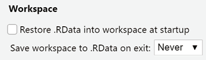
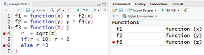
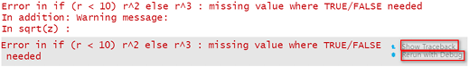
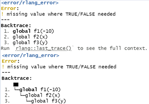
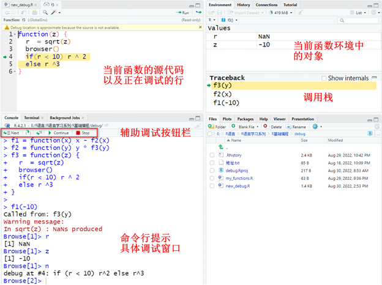
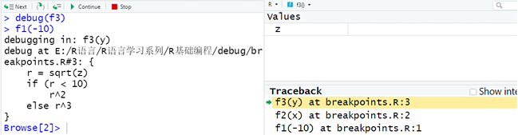
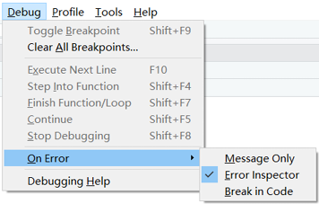

# 错误与调试 {#appendix-debugging}

调试代码和修正错误往往很耗时。本附录按照教材的顺序，介绍解决报错的一般策略、定位错误的交互式工具，以及让函数更加稳健的异常处理方法。

## 解决报错的一般策略

遇到报错时，可以依次采取以下做法：

1. 仔细阅读报错信息，并用完整的错误消息搜索解决方案；
2. 在搜索引擎、RStudio Community 或 Stack Overflow 中检索关键词；
3. 重启 R 会话，排除工作空间中旧对象造成的干扰；
4. 使用 `reprex` 包构造最小可重复示例，再向他人提问。

为了避免每次启动 R 时自动恢复旧工作空间，可在 RStudio 中依次打开 **Tools → Global Options → General → Workspace**，将启动时恢复 `.RData` 设为“Never”，并取消退出时保存工作空间。

```{r appendix-b-workspace-settings, echo=FALSE, fig.cap="设置启动时不保存和恢复历史工作空间", out.width="82%"}

```

## 错误调试技术

当我们不知道错误来自哪一行时，一般需要先运行代码，在可疑位置暂停，然后逐句执行并检查中间对象。虽然插入 `print()` 或 `cat()` 也能查看中间结果，但调用栈和交互式调试工具通常更高效。

### 设置断点

在 RStudio 源代码编辑器中，单击行号左侧即可设置断点。保存并 Source 文件后，函数对象会被注入跟踪代码；程序运行到断点处时进入调试模式。

```{r appendix-b-breakpoint, echo=FALSE, fig.cap="在 RStudio 编辑器中设置断点", out.width="92%"}

```

### 使用 `traceback()` 查看调用栈

下面的三个函数形成 `f1()` → `f2()` → `f3()` 的调用链。输入负数后，`sqrt()` 产生 `NaN`，随后 `if` 无法获得明确的逻辑值，因此程序报错。

```{r appendix-b-traceback-example, eval=FALSE}
# f1() 调用 f2()
f1 <- function(x) x - f2(x)

# f2() 再调用 f3()
f2 <- function(y) y * f3(y)

# 错误最终发生在 f3() 的计算过程中
f3 <- function(z) {
  r <- sqrt(z)
  if (r < 10) r^2 else r^3
}

# 负数开平方会触发后续错误
f1(-10)
```

```{r appendix-b-code-error, echo=FALSE, fig.cap="函数调用链中的报错", out.width="92%"}

```

报错后立即运行 `traceback()`，可以查看错误发生前的函数调用序列。调用栈通常从下向上阅读：

```{r appendix-b-traceback-call, eval=FALSE}
# 必须在报错后立即运行
traceback()

# 3: f3(y) at #1
# 2: f2(x) at #1
# 1: f1(-10)
```

教材还介绍了 `rlang` 提供的增强型错误回溯：

```{r appendix-b-rlang-trace, eval=FALSE}
# 让 rlang 保存错误调用栈
options(error = rlang::entrace)

# 重新触发错误
f1(-10)

# 查看最近一次错误及其完整调用栈
rlang::last_error()
rlang::last_trace()
```

```{r appendix-b-rlang-image, echo=FALSE, fig.cap="rlang 提供的错误信息与调用回溯", out.width="92%"}

```

### 使用 `browser()` 在指定位置暂停

把 `browser()` 插入函数内部，程序运行到该位置时会进入调试模式：

```{r appendix-b-browser-code, eval=FALSE}
f3 <- function(z) {
  r <- sqrt(z)

  # 程序运行到这里时暂停，便于查看 r 和 z
  browser()

  if (r < 10) r^2 else r^3
}

f1(-10)
```

```{r appendix-b-browser-image, echo=FALSE, fig.cap="browser() 调试模式及界面说明", out.width="92%"}

```

进入调试模式后，控制台提示符变为 `Browse[1]>`。常用命令包括：

- `n`（Next）：执行下一条语句；
- `c`（Continue）：继续运行到下一断点；
- `s`（Step into）：进入函数调用；
- `f`（Finish）：完成当前循环或函数；
- `where`：显示调用位置；
- `Q`（Stop）：退出调试器。

### 使用 `debug()` 进入函数内部

对于不便直接修改的函数，可以用 `debug()` 标记函数，在下次调用时自动进入调试模式。

```{r appendix-b-debug-code, eval=FALSE}
# 标记 f3()，下一次调用时进入调试模式
debug(f3)
f1(-10)

# 调试结束后取消标记，否则每次调用都会进入调试模式
undebug(f3)

# 如果只想调试下一次调用，也可以使用 debugonce(f3)
```

```{r appendix-b-debug-image, echo=FALSE, fig.cap="debug() 调试模式", out.width="92%"}

```

RStudio 还可以在发生错误时自动进入调试模式。依次打开 **Debug → On Error**，将选项改为 **Break in Code**。

```{r appendix-b-auto-debug, echo=FALSE, fig.cap="设置遇到错误时自动进入调试模式", out.width="78%"}

```

如果希望按错误的方式调试警告，可以临时设置 `options(warn = 2)`，把警告转换为错误。完成调试后应恢复原选项。

## 异常处理

异常处理的目标，是让函数更稳健，并把清楚的信息传递给使用者。R 中常见的条件包括：

- **错误（Error）**：由 `stop()` 或 `rlang::abort()` 触发并中止执行；
- **警告（Warning）**：由 `warning()` 或 `rlang::warn()` 提示潜在问题；
- **消息（Message）**：由 `message()` 或 `rlang::inform()` 输出说明信息。

### 使用 `tryCatch()` 捕获异常

教材以除法函数为例：非数值输入触发错误，分母为 0 时触发警告。

```{r appendix-b-div-function}
# 定义一个带输入检查的除法函数
div <- function(m, n) {
  # 分子或分母不是数值时，中止执行
  if (!is.numeric(m) | !is.numeric(n)) {
    stop("错误：分子或分母不是数值！")
  } else if (n == 0) {
    # 分母为 0 时发出警告，并返回 Inf
    warning("警告：分母是 0！")
    Inf
  } else {
    # 输入正常时执行除法
    m / n
  }
}

div(3, 2)
```

`tryCatch()` 的 `expr` 是需要执行的表达式；`error` 和 `warning` 分别指定捕获错误与警告后的处理函数；`finally` 指定无论是否出现异常都要执行的表达式。

```{r appendix-b-trycatch}
# 正常输入：直接返回计算结果
tryCatch(
  div(3, 2),
  error = function(err) err,
  warning = function(warn) cat(paste0(warn, "小心结果是 Inf！"))
)

# 非数值输入：捕获错误对象，而不中断整份文档的运行
tryCatch(
  div("3", 2),
  error = function(err) err,
  warning = function(warn) cat(paste0(warn, "小心结果是 Inf！"))
)

# 分母为 0：捕获警告并追加提示
tryCatch(
  div(3, 0),
  error = function(err) err,
  warning = function(warn) cat(paste0(warn, "小心结果是 Inf！"))
)
```

### 使用 `rlang` 构造带类别的错误

下面的例子先生成随机数，再计算对数。如果随机数不是正数，就用 `rlang::abort()` 抛出带有类别和原始数值的错误对象。

```{r appendix-b-rlang-condition, eval=FALSE}
# 生成随机数；若结果不是正数，则抛出自定义错误
sim_value <- function() {
  val <- rnorm(1)
  if (val <= 0) {
    rlang::abort(
      message = "返回值不是正数！",
      class = "模拟值错误",
      val = val
    )
  } else {
    val
  }
}

# 根据错误类别生成更具体的信息
sim_value_handler <- function(err) {
  msg <- "无法计算值！"
  if (inherits(err, "模拟值错误")) {
    msg <- paste0(msg, "`sim_value()` 函数生成的数值为 ", err$val)
  }
  rlang::abort(msg, class = "模拟值错误")
}

# 捕获随机数生成阶段的异常，再计算对数
log_value <- function() {
  x <- tryCatch(sim_value(), error = sim_value_handler)
  log(x)
}

# 固定随机种子，使示例稳定触发负值异常
set.seed(123)
log_value()
```

带类别的错误便于处理器识别错误来源，也可以在错误对象中保存额外信息。

### 在 `purrr` 迭代中处理错误

`purrr` 提供三个用于包装函数的“副词”：

- `safely()`：同时返回 `result` 与 `error`；
- `quietly()`：返回结果、输出、消息与警告；
- `possibly()`：出错时返回预先指定的替代值。

下面用 `safely()` 包装 `log()`。即使第一个输入无法取对数，后续输入仍会继续计算。

```{r appendix-b-purrr-safely}
# 包装 log()：出错时以 NA_real_ 作为结果
safe_log <- purrr::safely(log, otherwise = NA_real_)

# 逐个计算，并把嵌套列表整理为 result 与 error 两部分
list("a", 10, 100) |>
  purrr::map(safe_log) |>
  purrr::transpose() |>
  purrr::simplify_all()
```
