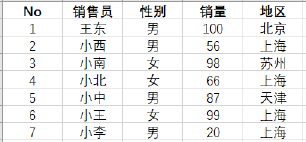
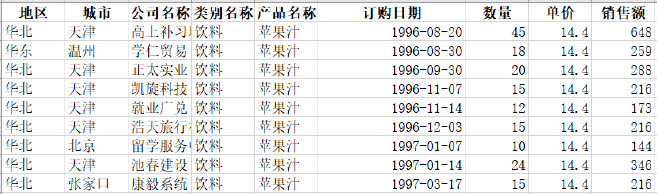

# 用 R 实现 Excel 中的 VLOOKUP 与透视表 {#appendix-excel}

日常办公中，重复的数据查询和汇总工作可以用 R 编写为可重复执行的流程。本附录按照教材案例，分别用数据筛选、连接和分组汇总实现 Excel 中的 VLOOKUP 与数据透视表。

## VLOOKUP 查询

从数据处理的角度看，VLOOKUP 的核心是筛选行、选择列和数据连接；若查询后还要修改结果，再增加列变换即可。

```{r appendix-c-vlookup-image, echo=FALSE, fig.cap="Excel 查询示例数据", out.width="82%"}

```

教材数据可按下面的方式读入：

```{r appendix-c-read-vlookup, eval=FALSE}
# 加载数据处理与 Excel 读取包
library(tidyverse)
library(readxl)

# 读取教材配套工作簿
df <- read_xlsx("data/VLOOKUP综合.xlsx")
```

### 单条件与多条件查询

```{r appendix-c-vlookup-filters, eval=FALSE}
# 单条件查询：先找到销售员“王东”，再保留姓名和销量
df |>
  filter(销售员 == "王东") |>
  select(销售员, 销量)

# 多条件查询：条件之间用逗号分隔，表示同时满足
df |>
  filter(销售员 == "王东", 地区 == "北京") |>
  select(销售员, 地区, 销量)

# 多列查询：不使用 select()，即可保留该销售员的全部信息
df |>
  filter(销售员 == "王东")
```

若要查询多个姓名，可以使用 `%in%`。如果待查询的姓名保存在另一张表 `df2` 中，则可以通过右连接完成批量查询：

```{r appendix-c-vlookup-join, eval=FALSE}
# 让 df2 中每位销售员都保留在结果中，再从 df 匹配销量
df |>
  right_join(df2, by = "销售员") |>
  select(销售员, 销量)
```

### 反向查询、文本匹配与区间划分

```{r appendix-c-vlookup-more, eval=FALSE}
# 根据销量反查销售员；在 R 中不受“从左向右查询”的限制
df |>
  filter(销量 == 66) |>
  select(销量, 销售员)

# 查找姓名中包含“中”字的销售员
df |>
  filter(stringr::str_detect(销售员, "中")) |>
  select(销售员, 销量)

# 按销量所在区间生成等级变量
df |>
  mutate(
    销量等级 = case_when(
      销量 < 60  ~ "不及格",
      销量 < 85  ~ "及格",
      销量 < 95  ~ "良好",
      销量 < 100 ~ "优秀",
      TRUE       ~ "满分"
    )
  )
```

需要把结果写回 Excel 时，可在管道末尾调用 `writexl::write_xlsx("filename.xlsx")`。

## 数据透视表

数据透视表本质上是分组汇总。教材案例要求计算各年份、各地区的销售额。

```{r appendix-c-pivot-image, echo=FALSE, fig.cap="Excel 数据透视表示例", out.width="82%"}

```

### 方法一：分组汇总后转为宽表

```{r appendix-c-pivot-dplyr, eval=FALSE}
# 读取数据并加载日期处理包
df <- readxl::read_xlsx("data/数据透视表.xlsx")
library(lubridate)

# 从订购日期提取年份，并按年份、地区分组求和
pt <- df |>
  group_by(年份 = year(订购日期), 地区) |>
  summarise(销售额 = sum(销售额), .groups = "drop")

# 把地区的取值展开为列，得到 Excel 风格的宽表
pt <- pt |>
  tidyr::pivot_wider(names_from = 地区, values_from = 销售额)

pt
```

```{r appendix-c-pivot-total, eval=FALSE}
# 同时增加行合计与列合计
pt |>
  janitor::adorn_totals(where = c("row", "col"))
```

### 方法二：`tidyquant::pivot_table()`

`pivot_table()` 把分组、汇总和长表转宽表合并为一步：

```{r appendix-c-pivot-tidyquant, eval=FALSE}
library(tidyquant)

df |>
  pivot_table(
    .rows = ~ YEAR(订购日期),
    .columns = 地区,
    .values = ~ SUM(销售额)
  ) |>
  janitor::adorn_totals(where = c("row", "col"))
```

### 方法三：`pivottabler` 包

```{r appendix-c-pivottabler, eval=FALSE}
library(pivottabler)

# 按年份生成行、按地区生成列，并汇总销售额
df |>
  mutate(年份 = lubridate::year(订购日期)) |>
  qpvt(
    rows = "年份",
    columns = "地区",
    calculations = "sum(销售额)"
  )
```

该方法默认增加行、列合计。进一步的格式定制和 Excel 导出可借助 `openxlsx` 包完成。
