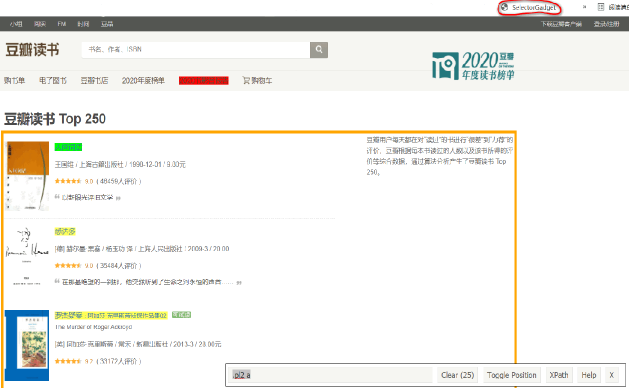
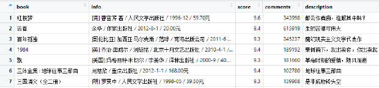
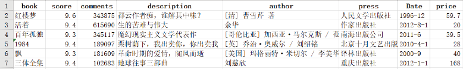
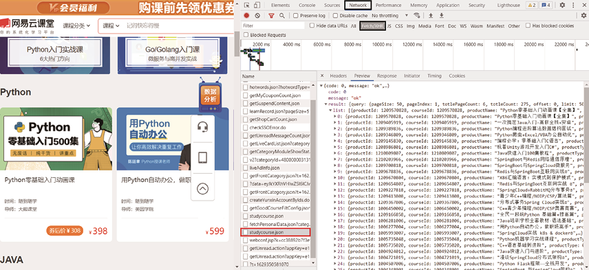
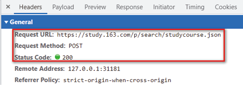
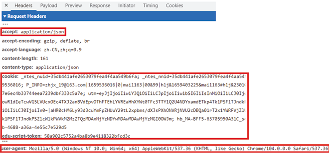
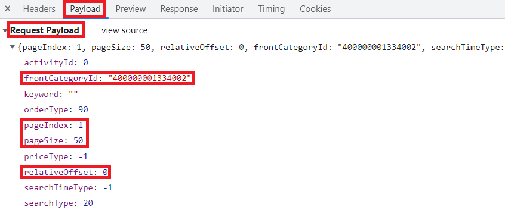
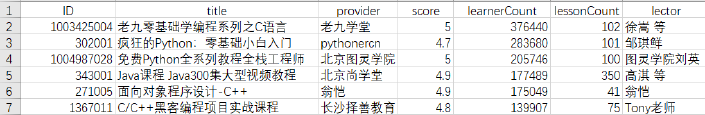

# R 与网络爬虫 {#appendix-web}

网络爬虫通常包括三个步骤：请求目标网页、解析并提取数据、保存结果。本附录按照教材案例介绍 `rvest` 对静态网页的处理，以及 `httr` 对动态网页请求的处理。运行爬虫时应遵守网站服务条款、robots 协议和数据使用规范，并控制访问频率。

## `rvest` 爬取静态网页

静态网页中的目标内容可以直接在 HTML 源代码中找到。`rvest` 的常用函数包括 `read_html()`、`html_elements()`、`html_text2()`、`html_attr()` 和 `html_table()`。

教材以豆瓣读书 Top 250 为例。首先根据分页规律构造 10 个网址：

```{r appendix-e-static-urls, eval=FALSE}
library(tidyverse)
library(rvest)

# 分页地址从 25 开始，每页增加 25
suffix <- stringr::str_c("?start=", seq(25, 225, by = 25))

# 首页没有分页后缀，因此把空字符串放在最前面
urls <- stringr::str_c(
  "https://book.douban.com/top250",
  c("", suffix)
)
```

### 批量下载并解析网页

```{r appendix-e-static-read, eval=FALSE}
# 每次请求前随机等待，避免短时间内连续访问
read_url <- function(url) {
  Sys.sleep(sample(5, 1))
  read_html(url)
}

# 对全部网址执行相同的读取函数
htmls <- purrr::map(urls, read_url)
```

### 定位并提取网页元素

教材借助 SelectorGadget 识别 CSS 选择器。选中书名后，工具给出的 `.pl2 a` 就是相应节点。

```{r appendix-e-selector-image, echo=FALSE, fig.cap="用 SelectorGadget 识别网页元素", out.width="92%"}

```

```{r appendix-e-one-field, eval=FALSE}
# 从单个网页中定位书名节点，并提取文本
book <- html |>
  html_elements(".pl2 a") |>
  html_text2()
```

把一个页面的提取步骤封装为函数，再对所有页面迭代：

```{r appendix-e-static-extract, eval=FALSE}
get_html <- function(html) {
  tibble(
    # 书名
    book = html |> html_elements(".pl2 a") |> html_text2(),

    # 作者、出版社、日期和价格组成的原始文本
    info = html |> html_elements("p.pl") |> html_text2(),

    # 评分和评价数转为数值
    score = html |> html_elements(".rating_nums") |>
      html_text2() |> readr::parse_number(),
    comments = html |> html_elements(".star .pl") |>
      html_text2() |> readr::parse_number(),

    # 描述可能缺失，因此先从较大的 td 节点提取再清理
    description = html |> html_elements("td") |>
      html_text2() |> stringi::stri_remove_empty() |>
      stringr::str_extract("(?<=\\)\n\n).*")
  )
}

# 提取每一页，并按行合并为一个数据框
books_douban <- purrr::map_dfr(htmls, get_html)
```

```{r appendix-e-raw-result, echo=FALSE, fig.cap="豆瓣读书 Top 250 爬虫数据（未清洗）", out.width="92%"}

```

### 清洗并保存结果

```{r appendix-e-static-clean, eval=FALSE}
books_douban <- books_douban |>
  mutate(
    # 根据字段周围的斜杠和年份模式拆分信息
    author = str_extract(info, ".*(?=/.*/ \\d{4})"),
    press = str_extract(info, "(?<=/ )[^/]*(?=/ \\d{4})"),
    Date = str_extract(info, "(?<=/ )[\\d-].*(?= /)"),
    price = str_extract(info, "(?<=/)[^/]*$") |>
      readr::parse_number()
  ) |>
  select(-info)

# 保存为 CSV 文件
readr::write_csv(books_douban, "豆瓣读书TOP250.csv")
```

```{r appendix-e-clean-result, echo=FALSE, fig.cap="豆瓣读书 Top 250 数据（已清洗）", out.width="92%"}

```

## 用 `httr` 爬取动态网页

动态网页通过 AJAX 等技术加载数据，目标内容不一定出现在初始 HTML 中。教材以网易云课堂课程信息为例，演示如何在浏览器开发者工具中观察网络请求，再用 `httr` 重现 POST 请求。

### 找到数据请求

在开发者工具的 Network 面板中刷新网页，在 Fetch/XHR 请求中定位返回课程数据的请求，并在 Preview 中检查返回结构。

```{r appendix-e-network, echo=FALSE, fig.cap="在 Network 面板中定位数据请求", out.width="92%"}

```

随后依次查看 General、Request Headers 和 Request Payload。

```{r appendix-e-general, echo=FALSE, fig.cap="Headers 中的 General 信息", out.width="92%"}

```

```{r appendix-e-headers, echo=FALSE, fig.cap="Request Headers 信息", out.width="92%"}

```

```{r appendix-e-payload, echo=FALSE, fig.cap="Request Payload 信息", out.width="92%"}

```

### 构造并发送 POST 请求

Cookie 属于登录凭证，具有时效性且不应写入讲义、代码仓库或公开日志。下面保留教材的请求结构，但使用占位符。

```{r appendix-e-post-request, eval=FALSE}
library(httr)

# 从当前浏览器会话中取得凭证；不要把真实值提交到 Git
my_cookie <- "<填写当前会话的 Cookie>"
my_user_agent <- "<填写浏览器的 User-Agent>"

# 构造请求头
headers <- c(
  accept = "application/json",
  `edu-script-token` = "<填写当前 token>",
  `User-Agent` = my_user_agent,
  cookie = my_cookie
)

# 教材案例中的数据接口与第一页请求参数
url <- "https://study.163.com/p/search/studycourse.json"
payload <- list(
  pageIndex = 1,
  pageSize = 50,
  relativeOffset = 0,
  frontCategoryId = "480000003131009"
)

# 发送 POST 请求，并以 JSON 编码请求体
result <- POST(
  url,
  add_headers(.headers = headers),
  body = payload,
  encode = "json"
)
```

### 解析返回结果

```{r appendix-e-post-extract, eval=FALSE}
# 取出本页的课程列表
lessons <- content(result)$result$list

# 从每个课程对象中提取相同字段
df <- tibble(
  ID = map_chr(lessons, "courseId"),
  title = map_chr(lessons, "productName"),
  provider = map_chr(lessons, "provider"),
  score = map_dbl(lessons, "score"),
  learnerCount = map_dbl(lessons, "learnerCount"),
  lessonCount = map_dbl(lessons, "lessonCount"),
  lector = map_chr(lessons, "lectorName", .null = NA_character_)
)
```

### 批量处理所有页面

```{r appendix-e-post-pages, eval=FALSE}
get_html <- function(p) {
  # 控制访问频率
  Sys.sleep(sample(5, 1))

  # 根据页码计算本页偏移量
  payload <- list(
    pageIndex = p,
    pageSize = 50,
    relativeOffset = 50 * (p - 1),
    frontCategoryId = "480000003131009"
  )

  # 请求并解析本页数据
  result <- POST(
    url,
    add_headers(.headers = headers),
    body = payload,
    encode = "json"
  )
  lessons <- content(result)$result$list

  tibble(
    ID = map_chr(lessons, "courseId"),
    title = map_chr(lessons, "productName"),
    provider = map_chr(lessons, "provider"),
    score = map_dbl(lessons, "score"),
    learnerCount = map_dbl(lessons, "learnerCount"),
    lessonCount = map_dbl(lessons, "lessonCount"),
    lector = map_chr(lessons, "lectorName", .null = NA_character_)
  )
}

# 抓取 11 页并按学习人数降序排列
wy_lessons <- map_dfr(1:11, get_html) |>
  arrange(desc(learnerCount))

write.csv(wy_lessons, "网易云课堂编程开发类课程.csv")
```

```{r appendix-e-post-result, echo=FALSE, fig.cap="网易云课堂编程与开发类课程的爬虫结果", out.width="92%"}

```

动态网页还可以使用 `RSelenium` 模拟浏览器行为，或使用 `V8` 执行 JavaScript 后再提取数据。
