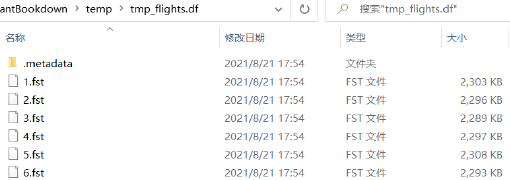
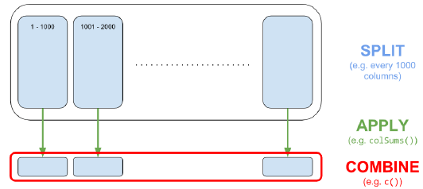

# R 与高性能计算 {#appendix-hpc}

R 代码具有较高的开发效率，但在计算密集型任务或超大数据场景中需要专门的提速方法。本附录按照教材介绍并行计算、调用 C++、处理超出内存容量的数据集，以及大型矩阵运算。

## 并行计算

`future` 为 R 提供统一的并行与分布式计算接口。

```{r appendix-f-future, eval=FALSE}
library(future)

# 查看当前环境可用的处理核心数
availableCores()

# 启用多会话并行；workers 可指定工作进程数
plan(multisession)

# 把需要并行执行的表达式放入 future()
f <- future({
  # 此处放置耗时计算
})

# 等待并取得并行计算结果
value(f)

# 使用完毕后恢复顺序执行
plan(sequential)
```

`furrr` 为 `purrr` 的映射函数提供并行版本，只需给函数名增加 `future_` 前缀。

```{r appendix-f-furrr, eval=FALSE}
library(furrr)
library(purrr)

# 启用 6 个工作进程
plan(multisession, workers = 6)

# 并行计算 iris 前四列的均值
future_map_dbl(iris[1:4], mean)

# 结束后释放并行工作进程
plan(sequential)
```

## 运行 C++ 代码

把耗时的 R 函数改写为 C++，可以通过 `Rcpp` 在 R 中编译调用。Windows 需要 Rtools，macOS 需要 Xcode Command Line Tools，Linux 可安装 `r-base-dev`。

```{r appendix-f-rcpp-function}
library(Rcpp)

# 在 R 代码块中定义并编译一个 C++ 加法函数
cppFunction('
int add(int x, int y) {
  int sum = x + y;
  return sum;
}
')

# 像普通 R 函数一样调用编译后的函数
add(1, 2)
```

也可以把以下代码保存为 `test.cpp`，再使用 `sourceCpp("test.cpp")` 编译运行：

```cpp
#include <Rcpp.h>
using namespace Rcpp;

// [[Rcpp::export]]
double meanC(NumericVector x) {
  int n = x.size();
  double total = 0;
  for (int i = 0; i < n; ++i) {
    total += x[i];
  }
  return total / n;
}

/*** R
# 比较 R 内置 mean() 与 C++ 函数 meanC() 的速度
x <- runif(1e5)
bench::mark(mean(x), meanC(x))
*/
```

## 处理超出内存容量的数据集

若数据仍可放入内存，教材建议优先使用 `data.table`。当数据超出内存但未超过硬盘容量时，`disk.frame` 可以把数据分块存储到硬盘，并使用类似 `dplyr` 的语法操作。

```{r appendix-f-diskframe, eval=FALSE}
library(disk.frame)

# 启用 disk.frame 的并行设置
setup_disk.frame()
options(future.globals.maxSize = Inf)

# 把内存数据框转换为硬盘分块对象
flights <- as.disk.frame(nycflights13::flights)
```

```{r appendix-f-diskframe-image, echo=FALSE, fig.cap="disk.frame 分割后的数据集", out.width="84%"}

```

`disk.frame` 使用懒惰计算，调用 `collect()` 后才真正执行并把结果取回内存。

```{r appendix-f-diskframe-query, eval=FALSE}
flights |>
  # 筛选指定日期与航空公司
  filter(
    month == 5,
    day == 17,
    carrier %in% c("UA", "WN", "AA", "DL")
  ) |>
  # 保留分析所需字段
  select(carrier, dep_delay, air_time, distance) |>
  # 将飞行时间由分钟换算为小时
  mutate(air_time_hours = air_time / 60) |>
  # 执行计算并把结果读回内存
  collect() |>
  # 排序应放在 collect() 之后
  arrange(carrier) |>
  head()
```

真正的多机分布式计算，可以使用 `sparklyr` 连接 Apache Spark。

## 大型矩阵运算

`bigstatsr` 的 FBM（文件后端大矩阵）把数据存储在硬盘上，通过内存映射访问。`big_apply()` 采用“分割—应用—合并”机制，并支持并行计算。

```{r appendix-f-bigapply-image, echo=FALSE, fig.cap="大型矩阵的“分割—应用—合并”机制", out.width="86%"}

```

```{r appendix-f-bigstatsr, eval=FALSE}
library(bigstatsr)

# 创建 10000 × 1000 的文件后端大矩阵
X <- FBM(
  10000,
  1000,
  init = rnorm(10000 * 1000),
  backingfile = "temp/test"
)

# 比较 R 对象本身与硬盘后端文件的大小
object.size(X)
file.size(X$backingfile)
typeof(X)

# 每 500 列为一块，使用 2 个核心计算各列之和
sums <- big_apply(
  X,
  a.FUN = function(X, ind) colSums(X[, ind]),
  a.combine = "c",
  block.size = 500,
  ncores = 2
)

sums[1:5]
```

`bigstatsr` 还提供大规模回归、SVD、矩阵乘法、转置、读写和列统计等函数。
