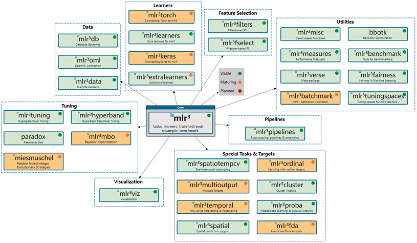
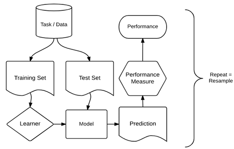
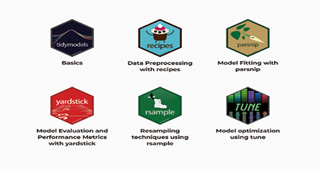

# R 机器学习框架 {#appendix-ml}

本附录按照教材介绍两个 R 机器学习框架：基于 R6 与 `data.table` 的 `mlr3verse`，以及延续 tidyverse 工作流风格的 `tidymodels`。

## `mlr3verse`

`mlr3verse` 为机器学习任务提供统一接口，并支持并行计算、特征工程、调参和图学习器。

```{r appendix-g-mlr3-ecosystem, echo=FALSE, fig.cap="mlr3verse 机器学习框架生态", out.width="92%"}

```

核心组件包括 `mlr3`、`mlr3db`、`mlr3filters`、`mlr3learners`、`mlr3pipelines`、`mlr3tuning`、`mlr3viz` 与 `paradox`。一个基本工作流由任务、学习器、度量、重抽样和管道构成。

```{r appendix-g-mlr3-workflow, echo=FALSE, fig.cap="mlr3verse 机器学习基本工作流", out.width="92%"}

```

- **任务（Task）**：封装数据及目标变量等元信息；
- **学习器（Learner）**：封装算法与超参数；
- **度量（Measure）**：评价预测结果；
- **重抽样（Resampling）**：生成训练集和测试集；
- **管道（Pipelines）**：组合预处理、特征选择与模型步骤。

教材用 `iris` 数据建立决策树分类模型：

```{r appendix-g-mlr3-example, eval=FALSE}
library(mlr3verse)

# 创建分类任务，并指定 Species 为目标变量
task <- as_task_classif(iris, target = "Species")

# 选择决策树学习器，并设置最大深度和最小分支节点数
learner <- lrn("classif.rpart", maxdepth = 3, minsplit = 10)

# 按 70% : 30% 划分训练集与测试集
set.seed(123)
split <- partition(task, ratio = 0.7)

# 使用训练部分拟合模型
learner$train(task, row_ids = split$train)

# 对测试部分进行预测
predictions <- learner$predict(task, row_ids = split$test)

# 查看混淆矩阵与分类准确率
predictions$confusion
predictions$score(msr("classif.acc"))
```

## `tidymodels`

`tidymodels` 提供统一的统计建模与机器学习接口。其核心包包括：用于模型拟合的 `parsnip`、预处理的 `recipes`、重抽样的 `rsample`、评价的 `yardstick`、调参空间的 `dials`、调参的 `tune` 和工作流的 `workflows`。

```{r appendix-g-tidymodels-ecosystem, echo=FALSE, fig.cap="tidymodels 核心包及其功能", out.width="92%"}

```

下面仍以 `iris` 决策树分类为例：

```{r appendix-g-tidymodels-example, eval=FALSE}
library(tidymodels)

# 按 Species 分层划分训练集与测试集
set.seed(123)
split <- initial_split(iris, prop = 0.7, strata = Species)
train <- training(split)
test <- testing(split)

# 指定决策树模式、超参数和底层 rpart 引擎，然后拟合模型
model <- decision_tree(
  mode = "classification",
  tree_depth = 3,
  min_n = 10
) |>
  set_engine("rpart") |>
  fit(Species ~ ., data = train)

# 预测测试集类别，并拼接真实类别
pred <- predict(model, test) |>
  bind_cols(select(test, Species))

# 用混淆矩阵和准确率评价模型
pred |>
  conf_mat(truth = Species, estimate = .pred_class)

pred |>
  accuracy(truth = Species, estimate = .pred_class)
```

进一步学习可参考教材列出的 *mlr3book*、*mlr3gallery* 与 *Tidy Modeling with R*。
