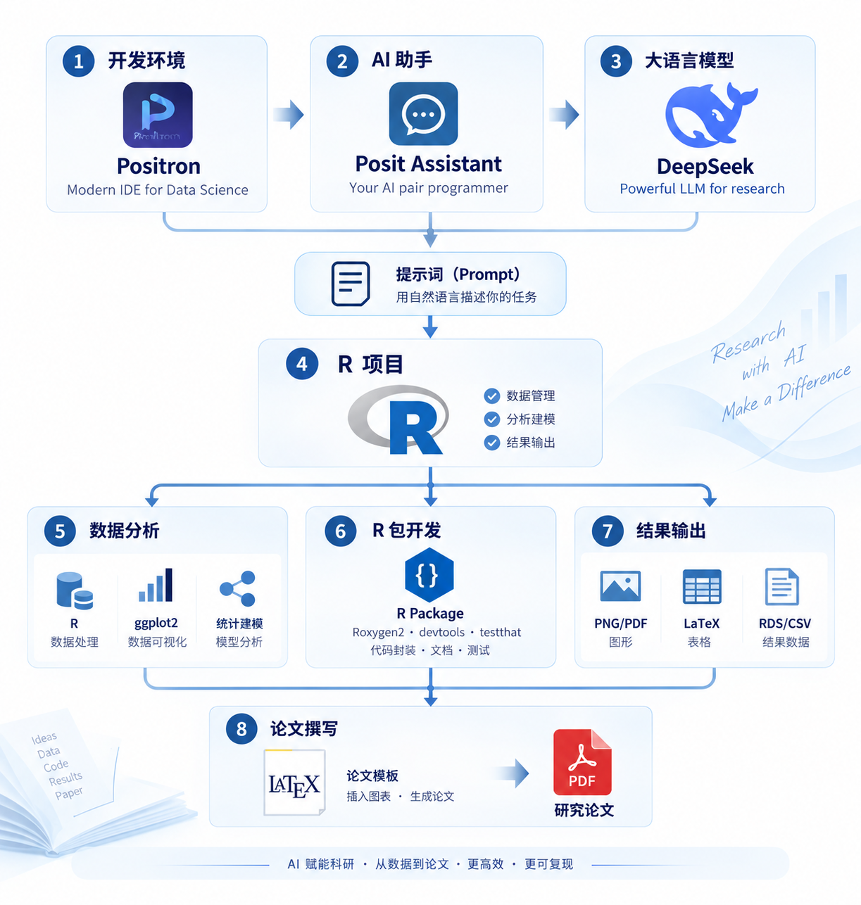

# Positron：从 R 项目到自动更新的 LaTeX 论文 {#appendix-positron}

本附录只完成一件事：在 Positron 中建立一个 R 项目，让 AI 助手协助写代码，由 R 生成图、表和结果数字，再由 LaTeX 通过**相对路径**读取这些文件。修改数据、模型或图形代码后，重新运行一次入口，论文中的图表和数字自动更新。

贯穿案例位于 `examples/positron-workflow/`，使用 R 自带的 `mtcars` 数据拟合 `mpg ~ wt + hp`。它用于演示工作流，不作因果解释。

```{r ph-workflow, echo=FALSE, fig.cap="一条可重复运行的工作流：修改 R 代码后重新生成图表，再编译中英文 LaTeX。", out.width="92%"}

```

## 最终目标

完成后的项目有一条清楚的更新链：

```text
修改数据或 R 代码
        ↓
运行 run.R
        ↓
更新 outputs/figures、outputs/tables、outputs/results
        ↓
编译 LaTeX
        ↓
英文 PDF 和中文 PDF 自动使用最新图表与数字
```

关键原则是：**R 负责计算和生成文件，LaTeX 只负责引用和排版。** 不从 Plots 截图，不把回归系数手工抄进论文，也不使用个人电脑的绝对路径。

## 第一步：打开 R 项目并连接 AI 助手

在 Positron 中用 **File → Open Folder** 打开 `examples/positron-workflow/`。在 R Console 中运行：

```{r ph-check-project, eval=FALSE}
R.version.string
getwd()
file.exists("run.R")
```

第三行应返回 `TRUE`。如果是 `FALSE`，说明打开的不是示例项目根目录。

需要 AI 助手时，在命令面板运行 `Authentication: Configure Language Model Providers`，选择当前可用的 DeepSeek 服务并填入自己的 API Key；随后用 `View: Show Posit Assistant` 打开助手。模型名称会更新，以当前界面为准。API Key 只放在凭据输入框，不写入 R 文件、截图或 Git。

AI 助手适合帮助完成三类工作：

1. 阅读项目结构，说明哪个脚本生成哪个结果；
2. 按要求修改 R 或 LaTeX 文件；
3. 运行后检查图、表和正文是否来自同一次分析。

可以直接使用下面的提示词：

```text
请检查当前 R 项目。保持所有文件使用相对路径，不使用 setwd() 和个人绝对路径。
R 负责生成 outputs/ 中的 PDF 图、LaTeX 表格和结果宏；
LaTeX 只用 \includegraphics 和 \input 引用这些文件。
修改完成后运行 R 入口并编译中英文论文，逐项报告实际结果。
不要写入或显示 API Key。
```

## 第二步：理解项目目录

```text
positron-workflow/
├── run.R                       # 生成全部分析结果
├── build_papers.R              # 先运行 R，再编译中英文论文
├── R/
│   ├── analysis.R              # 数据检查与模型
│   └── export.R                # 输出图、表和结果数字
├── outputs/
│   ├── figures/                # R 生成的 PNG/PDF 图片
│   ├── tables/                 # R 生成的 CSV/LaTeX 表格
│   └── results/                # 模型对象和 LaTeX 数值宏
└── paper/templates/
    ├── arxiv-english/          # 英文 IMS/Annals of Statistics 风格
    └── arxiv-chinese/          # 同版式的中文版本
```

所有路径都相对于项目根目录或当前 LaTeX 文件。项目换到另一台电脑或另一个文件夹后，目录结构不变，代码仍然可以运行。

## 第三步：由 R 生成图片、表格和数字

在 R Console 运行：

```{r ph-run-r, eval=FALSE}
source("run.R")
```

也可以在 Terminal 运行：

```sh
Rscript run.R
```

入口脚本拟合模型，并更新下列文件：

| R 生成的文件 | 论文中的用途 |
|---|---|
| `outputs/figures/observed-fitted.pdf` | LaTeX 矢量图 |
| `outputs/figures/observed-fitted.png` | 网页或快速预览 |
| `outputs/tables/coefficients.tex` | 回归系数表 |
| `outputs/results/numbers.tex` | 样本量、$R^2$、系数等数值宏 |
| `outputs/results/analysis.rds` | 可重新读取的 R 分析对象 |

图片由 R 图形设备直接写入项目：

```{r ph-export-figure, eval=FALSE}
pdf("outputs/figures/observed-fitted.pdf", width = 7, height = 4.8)
plot(fitted(fit), dat$mpg,
     xlab = "Fitted fuel economy (mpg)",
     ylab = "Observed fuel economy (mpg)")
abline(0, 1, lty = 2)
dev.off()
```

表格也由 R 生成 `.tex` 片段。主论文不再保存另一份手工录入的系数，因此修改模型后不会出现“图已经更新、表还是旧结果”的问题。

## 第四步：用相对路径插入 LaTeX

模板位于 `paper/templates/arxiv-english/` 和 `paper/templates/arxiv-chinese/`，所以从模板目录返回项目根目录需要三级 `../`。

图片使用：

```latex
\includegraphics[width=0.82\textwidth]{../../../outputs/figures/observed-fitted.pdf}
```

表格使用：

```latex
\begin{table}[htbp]
  \centering
  \caption{Regression coefficients generated by R.}
  \input{../../../outputs/tables/coefficients.tex}
\end{table}
```

结果数字使用：

```latex
% 在导言区读取 R 生成的命令。
\input{../../../outputs/results/numbers.tex}

% 正文直接使用，不手工录入数值。
The analysis contains \SampleSize{} observations and has
$R^2=\ModelRsquared$.
```

这里没有 `/Users/...` 或 `C:\Users\...`。只要保留项目目录结构，文件移动到其他电脑仍能找到。

## 第五步：使用统计学 arXiv 模板

英文和中文版本采用 IMS 的 `imsart` 模板。模板取自 arXiv:2412.06766 的公开源码；该论文已录用到 *The Annals of Statistics*，源码包含 `imsart.cls`、`imsart.sty` 和作者—年份格式 `imsart-nameyear.bst`。课程示例保留这些样式文件原样，只在 `main.tex` 中加入本项目的图表和内容。

参考文献放在各模板目录的 `references.bib` 中：

```latex
\RequirePackage[authoryear]{natbib}

\citet{gelman2020}      % Gelman et al. (2020)
\citep{wickham2014}     % (Wickham, 2014)

\bibliographystyle{imsart-nameyear}
\bibliography{references}
```

英文模板使用 IMS/Annals of Statistics 版式；中文模板沿用相同统计论文结构，并增加 `ctex` 中文支持。二者读取同一套 R 输出，所以结果一致，仅写作语言不同。

## 第六步：一次运行自动更新两篇论文

在项目根目录运行：

```sh
Rscript build_papers.R
```

脚本依次完成：

1. 运行 `run.R`，更新图片、表格、模型和数值宏；
2. 编译英文 `main.tex`；
3. 运行 BibTeX 生成作者—年份参考文献；
4. 编译中文 `main.tex`；
5. 再运行两次 XeLaTeX，更新交叉引用和文献引用。

最终得到：

```text
paper/templates/arxiv-english/main.pdf
paper/templates/arxiv-chinese/main.pdf
```

如果只修改论文文字，可以在对应模板目录运行：

```sh
xelatex main.tex
bibtex main
xelatex main.tex
xelatex main.tex
```

如果修改了数据、模型、图片或表格，应重新运行 `Rscript build_papers.R`，让整个链条一起更新。

## 做一次更新实验

为了确认流程真的自动更新，可以在项目副本中改变 `R/export.R` 的图形标题或颜色，然后运行：

```sh
Rscript build_papers.R
```

打开中英文 PDF，检查两篇论文中的图是否同时改变。再把模型由 `mpg ~ wt + hp` 改为 `mpg ~ wt`，重新运行后检查：

- `coefficients.tex` 的行数是否改变；
- `numbers.tex` 中的 $R^2$ 是否改变；
- 中英文 PDF 的表格和结果文字是否一起改变；
- LaTeX 源文件中是否仍然没有手工抄写的结果数字。

完成这些检查，才说明“R 分析—图表输出—LaTeX 编译”的自动更新链路已经建立。

## 验收清单

- 在 Positron 中打开的是项目根目录，`file.exists("run.R")` 返回 `TRUE`；
- `source("run.R")` 显示 `WORKFLOW_OK`；
- 图、表、数值宏都位于 `outputs/`；
- LaTeX 只使用相对路径引用 R 输出；
- `Rscript build_papers.R` 能生成英文和中文 PDF；
- 修改 R 图形或模型后，两篇 PDF 都使用最新结果；
- API Key、个人绝对路径和敏感数据没有写入项目。

## 来源

- [Positron 官方文档](https://positron.posit.co/)与[模型服务商配置](https://positron.posit.co/assistant-providers.html)
- [DeepSeek API 文档](https://api-docs.deepseek.com/)
- [arXiv:2412.06766](https://arxiv.org/abs/2412.06766)：统计论文及 IMS 模板来源
- [Institute of Mathematical Statistics LaTeX support](https://imstat.org/publications/latex-support/)

模板用于教学和 arXiv 草稿。正式投稿时，应以目标期刊当前提供的模板和作者指南为准。
