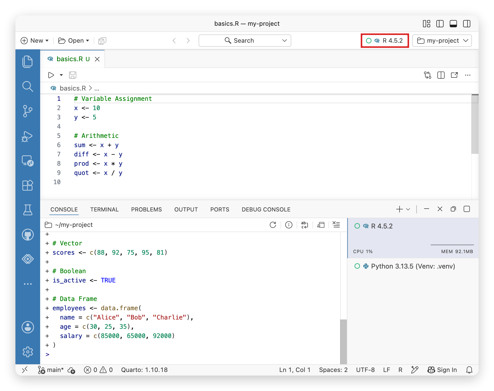
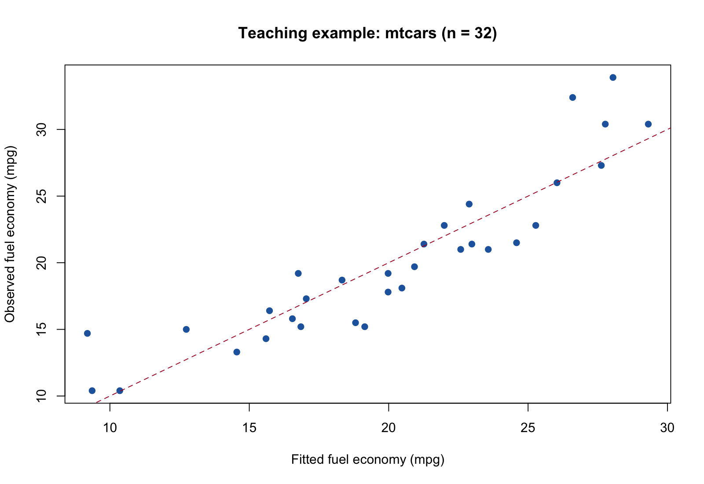

# Positron 与 AI 辅助的 R 科研项目全流程 {#appendix-positron}

本附录是新增的实践拓展，不属于原教材附录。你将完成一条可检查的链路：**安装 R 与 Positron → 连接 Posit Assistant → 用提示词开发项目 → 分析数据 → 保存图片和结果 → 生成 LaTeX 表格 → 封装 R 包 → 编写工作说明 → 在论文模板中引用结果 → 从干净会话重跑**。

贯穿案例使用 R 自带的 `mtcars` 数据，回答“在控制发动机马力后，汽车重量与每加仑行驶里程有什么统计关联”。数据规模小、无需下载，也不涉及个人信息，适合把注意力放在工作流程上。本例用于软件流程教学，不能据此作因果解释或当作新研究发现。

```{r, echo=FALSE, fig.cap="图片说明"}
knitr::include_graphics("images/Codex 图像.png")
```

## 先明确最终交付物

操作软件之前，先定义“完成”：另一个人在新 R 会话中，依据 README 运行入口脚本，能够重新得到相同的数值结果、图形、表格和论文输入文件。

| 阶段 | 要回答的问题 | 可检查的产物 |
|---|---|---|
| 环境 | R 是否真的能执行？ | 版本、解释器路径、最小绘图 |
| AI | 连接是否可用，回答是否正确？ | 无敏感数据的测试问答与本地验证 |
| 项目 | 文件各放哪里？ | 入口脚本、数据目录、函数目录 |
| 分析 | 计算了什么，结果可靠吗？ | 模型对象、系数表、诊断图 |
| 软件 | 方法能否重复调用？ | R 包源码、帮助页、测试 |
| 写作 | 文字和图表是否来自同一结果？ | 工作报告、表格与结果片段、论文 |
| 复现 | 从零开始是否仍能成功？ | 重跑记录、环境信息、检查结论 |

附带项目位于课程目录的 `examples/positron-workflow/`。先把这个文件夹作为一个独立项目在 Positron 中打开。正文中的项目相对路径均以它为根目录；不要在 Bookdown 源目录里逐段创建示例文件。安装、联网和改写文件的教学代码不随讲义编译自动执行。

## 安装 Positron 与 R

### 先分清 R、IDE 和 AI

**目的。** 知道出错时该检查哪一层。R 负责执行计算，Positron 是编辑和运行代码的集成开发环境，Posit Assistant 是其中调用语言模型的辅助功能。安装 IDE 不等于已经安装 R；AI 给出代码也不等于代码已经成功运行。

**操作。** 先访问 [CRAN](https://cran.r-project.org/) 安装适合系统的 R（官方当前要求 R 4.2 或更高），再从 [Positron 官方下载页](https://positron.posit.co/download.html) 获取安装程序。macOS 要区分 Apple silicon（arm64）和 Intel（x86_64）；在“关于本机”检查芯片类型，再选择对应安装包。按安装器提示安装，首次启动按系统的正常安全提示操作。Windows 使用对应的 R 安装程序和 Positron 安装程序，安装后重新启动 Positron，让它重新扫描解释器。

**检查。** 打开 Positron 后，能进入工作台并选择 R 会话才算完成了安装环节。此时不需要先创建 API Key。

**常见问题。** 找不到 R 时先确认 R 已独立安装，再检查 Positron 的解释器选择；更换 R 版本后重启 IDE。不要把“Terminal 中找不到 R 命令”和“IDE 未发现 R”当作同一个问题，前者还可能是 PATH 设置问题。编译含 C/C++ 的 R 包才涉及额外系统工具：macOS 通常用 Xcode Command Line Tools，Windows 使用与 R 版本匹配的 Rtools；本附录的最小包只含 R 代码。

### 认识工作台：代码在哪里运行，结果在哪里看

**目的。** 建立“编辑 → 执行 → 查看对象 → 保存结果”的循环。界面布局可以拖动，学习时按面板名称寻找功能，不依赖截图中的固定位置。

| 面板或入口 | 你在这里做什么 | 本节检查 |
|---|---|---|
| Explorer | 浏览当前打开的项目文件夹 | 能找到 `run.R` |
| Editor | 编辑脚本，保留可重跑代码 | 保存一个 `.R` 文件 |
| Console / R Session | 执行 R 表达式 | `1 + 1` 返回 `2` |
| Variables / Data Explorer | 查看对象与数据表 | 出现数据框 `cars` |
| Plots | 查看绘图结果 | 出现散点图 |
| Help | 阅读 R 帮助 | 显示 `lm` 文档 |
| Terminal | 执行系统命令 | 区分 shell 与 R 提示符 |
| Command Palette | 搜索命令 | 能搜索解释器或模型配置命令 |

```{r ph-layout-image, echo=FALSE, fig.cap="Positron 官方工作台截图，2026-09-22 获取。对照编辑器、Console、Variables 与 Plots，按功能寻找面板。来源：Positron Layout 文档。", out.width="100%"}
knitr::include_graphics("images/positron/install/positron-interface-official.jpeg")
```


macOS 用 `Cmd+Shift+P`，Windows 用 `Ctrl+Shift+P` 打开命令面板。打开项目使用 **File → Open Folder**；新项目可先建立空文件夹再打开。已有 `.Rproj` 文件可以保留，但教学流程的项目边界是当前打开的文件夹。

## 配置 R 环境并做最小检查

通过解释器选择器创建会话，或在命令面板执行 `Interpreter: Start New Console Session`；切换已有会话用 `Interpreter: Select Session`。选择 R 解释器后，在 **R Console** 中逐行执行：

```{r ph-interpreter-image, echo=FALSE, fig.cap="Positron 官方 R 解释器选择器截图，2026-09-22 获取。关注红框中的会话选择器；图中的版本是示例。来源：Positron Managing interpreters。", out.width="92%"}

```

```{r ph-environment, eval=FALSE}
# 确认当前进程的 R 版本和安装位置。
R.version.string
R.home()
# 确认读写文件时采用的当前目录。
getwd()
# 创建一个可在 Variables 中展开的小对象。
cars <- datasets::mtcars
head(cars[, c("mpg", "wt", "hp")])
# 在 Plots 中查看结果，随后打开函数帮助。
plot(cars$wt, cars$mpg, xlab = "Weight (1000 lb)", ylab = "MPG")
help("lm")
# 查看当前解释器能够使用的包，而不是另一个 R 安装目录的包。
head(installed.packages()[, c("Package", "Version")])
.libPaths()
```


**结果与解释。** `cars` 有 32 行，`wt` 的单位是千磅，`mpg` 是英里/加仑，数值越高通常表示同样燃油能行驶更远。Plots 中应出现重量和里程的散点图。变量查看器中的对象在退出会话后可能消失；保存在硬盘的脚本才是重跑依据。

**常见问题。** `install.packages()` 应在 R Console 执行；`R CMD check` 应在 Terminal 执行。找不到已安装包时先比较 `R.home()` 和 `.libPaths()`，不要立刻重复安装。安装包是一次性的环境准备，分析脚本不应每次运行都联网安装。

本例的核心计算只使用 R 自带包。需要在自己的扩展项目中使用 `here`、`ggplot2`、`knitr`、`renv` 或 `devtools` 时，再单独安装所需包。采用 `here` 的项目可在入口第一行声明定位点：

```{r ph-here, eval=FALSE}
here::i_am("run.R")
# 无论脚本位于哪个子目录，都从项目根目录定位文件。
here::here("outputs", "tables", "coefficients.csv")
```


## 连接 Posit Assistant 与 DeepSeek

### 连接之前先明确数据边界

**目的。** 让模型帮助解释和修改项目，同时由你掌握运行和审核的责任。模型服务可能按用量收费，API 使用权限与网页聊天订阅不是同一件事。先使用公开的 `mtcars` 数据测试；不要把 API Key、学生身份信息或未获准外发的研究数据加入聊天上下文。

API Key 由你在 [DeepSeek 开放平台](https://platform.deepseek.com/) 创建，并填入应用的凭据输入框。不要写进 `.R`、`.Rmd`、`.Renviron` 示例文本、截图或 Git 仓库。对教学截图应使用空输入框。

### 配置与连接验收

下面的入口和服务商支持应以本机版本及[官方模型服务商文档](https://positron.posit.co/assistant-providers.html)为准。软件升级可能改变标签与选项。

1. 在命令面板搜索 `Authentication: Configure Language Model Providers`。
2. 若提供 `DeepSeek`，选择该服务商并按向导配置。实验性功能的可用性和模型能力可能随版本变化。
3. 按向导要求在专用凭据输入框填入自己的 API Key，然后选择可用模型。
4. 若没有原生 DeepSeek 选项，先检查版本和官方文档；只有界面提供 OpenAI Compatible 时才使用兼容服务商方式。DeepSeek 官方 API 文档列出的基本地址是 `https://api.deepseek.com`，也支持兼容地址 `https://api.deepseek.com/v1`。模型标识以当时官方文档和账户可用列表为准，不从旧教程照抄。
5. 用命令 `View: Show Posit Assistant` 打开 Posit Assistant，发出下面的最小提示词，再在本地 R 会话验证。

```text
请解释 R 中 mean(c(1, 2, 3)) 的结果。
只回答结果和一行 R 验证代码，不读取项目文件，不修改文件，不运行命令。
```

应得到均值 `2`。本地运行返回相同结果，才完成一次基本连接与答案核验。普通聊天成功只说明文本请求可用；是否支持文件编辑或工具调用，需要在后续小任务中单独检查。

**常见问题。** `401` 优先检查 Key 和服务商是否匹配；`429` 查看额度或限流提示；模型不存在时检查模型标识及权限；超时检查网络和服务状态。不要通过把真实 Key 粘贴给 AI 来“排查认证”。服务商配置文件和密钥存储不是一回事，也不应把整份用户配置复制到讲义中。

## 用提示词把任务分成可验收的小步骤

好提示词不是“帮我做科研”，而是明确**目标、输入、约束、产物、验证**。每次只推进一个可检查阶段，阅读差异后再继续。AI 无法执行时，让它清楚标注“建议代码、尚未运行”，由你在 Positron 中执行。

### 第一步：理解项目与设计文件

```text
请先只读检查当前打开的项目。目标是用 mtcars 分析 mpg 与 wt、hp 的关系，
采用 lm(mpg ~ wt + hp)。请说明变量单位和模型解释边界。
列出建议目录、每个脚本的输入输出、运行顺序和验收方法。
本阶段不修改文件，不安装包；不要读取项目之外的文件或凭据。
```

读完方案后，你应能回答：数据从哪里来？系数表写到哪里？论文引用的是哪个文件？如果回答不出，先要求 AI 补齐这些关系。

### 第二步：生成最小可运行版本

```text
按已确认的目录实现最小版本。使用 R 自带 mtcars，不联网下载。
函数放 R/，入口为 run.R；原始数据与生成结果分开。
拟合 mpg ~ wt + hp，保存模型 RDS、系数 CSV、散点图和残差诊断图。
添加中文注释解释输入、参数、返回值及结果用途。
不要自动安装包或把工作区保存为 .RData。完成后列出实际执行命令、
检查结果和未执行环节；不能以“预计成功”替代运行证据。
```

### 第三步：核验而不是反复要求“优化”

```text
请独立检查已有实现：样本量是否为 32，公式是否正确，单位是否注明，
CSV 系数是否等于 coef(model)，所有声明的输出是否存在。
检查缺失值、非数值输入和缺列时的行为。
只修复有证据的问题，给出文件变更和验证结果，不改变分析问题。
```

## 建立标准项目目录

目录把责任写出来：`data/` 保存输入，`R/` 保存函数，`outputs/` 保存可以重新生成的结果，`paper/` 保存写作源文件，`workflowdemo/` 保存供别人安装的软件。不要让分析、论文和包各自复制一套不同的统计计算。

```text
positron-workflow/
├── run.R                 # 从这里开始
├── R/                    # 可复用计算与输出函数
├── data/                 # 数据及来源说明
├── outputs/
│   ├── figures/          # PNG 阅读用，PDF 排版用
│   ├── tables/           # CSV 与 LaTeX 表格
│   └── ...               # 模型、结果片段、报告与会话信息
├── workflowdemo/              # 可安装的小型 R 包
├── paper/                # 教学模板、论文源文件与使用说明
└── README.md             # 环境、步骤和验收标准
```

这张目录树表达职责，具体文件名以附带项目 README 为准。完整项目使用 `outputs/results/analysis.rds` 保存分析对象、`outputs/results/numbers.tex` 保存数值宏、`outputs/figures/observed-fitted.png` 保存观测值与拟合值对照图。下面逐步代码中的散点图是独立练习，不替代完整入口。开发过程中避免 `setwd("/Users/某人/Desktop/...")` 这样的个人绝对路径。入口必须明确工作目录要求，缺少必需文件时立即给出解释，不能悄悄读到其他项目的数据。

## 读取数据与完成分析

### 从数据问题写出模型

**目的。** 把口头问题变成可复查的公式。令 $Y_i$ 为 `mpg`，$W_i$ 为 `wt`，$H_i$ 为 `hp`，模型为

\[
Y_i = \beta_0 + \beta_1 W_i + \beta_2 H_i + \varepsilon_i.
\]

$\beta_1$ 表示在马力相同的模型比较下，重量增加 1000 磅时平均 `mpg` 的变化。这里的“控制”是回归调整，不是随机实验。

```{r ph-model, eval=FALSE}
# 内置数据不需要账户，也不会在构建时下载外部文件。
dat <- datasets::mtcars
stopifnot(nrow(dat) == 32L)
stopifnot(all(c("mpg", "wt", "hp") %in% names(dat)))
stopifnot(!anyNA(dat[, c("mpg", "wt", "hp")]))
fit <- stats::lm(mpg ~ wt + hp, data = dat)
summary(fit)
coef(fit)
stats::confint(fit)
```


**结果与解释。** 截距约为 `37.227`，重量系数约为 `-3.878`，马力系数约为 `-0.0318`。这些是该固定数据和公式的核对值，正式报告应读取实际保存的模型结果，不手工抄写近似值。截距对应重量、马力均为零，不适合作现实车辆解释。

### 不省略诊断

查看残差对拟合值图，检查是否有明显曲线或方差变化；查看正态 Q–Q 图，留意尾部偏离。小样本回归的标准误和区间依赖模型假设，不能只因 p 值小就宣称模型可靠。

```{r ph-diagnostics, eval=FALSE}
# 诊断图是检查线索，不是自动通过的证明。
plot(fit, which = 1)
plot(fit, which = 2)
```


若更换为自己的 CSV，先检查字段、编码、单位、重复和缺失，再调用同一函数。不要让 `lm()` 静默删除缺失观测后仍在文字中声称用了全部样本。

## 保存本地图片、表格与模型对象

**目的。** 把屏幕中的临时结果变成能被论文引用的文件。PNG 适合网页预览，PDF 适合 LaTeX 中缩放的矢量图；CSV 方便检查数值，RDS 保留 R 对象结构。

```{r ph-save, eval=FALSE}
dir.create("outputs/figures", recursive = TRUE, showWarnings = FALSE)
dir.create("outputs/tables", recursive = TRUE, showWarnings = FALSE)
# 开启图形设备以后，必须关闭它，文件才写完整。
png("outputs/figures/weight-mpg.png", width = 1600, height = 1100, res = 180)
plot(dat$wt, dat$mpg, xlab = "Weight (1000 lb)", ylab = "MPG")
dev.off()
saveRDS(fit, "outputs/model.rds")
# row.names=FALSE 前先把行名变成显式字段，避免变量名丢失。
coefs <- data.frame(term = rownames(coef(summary(fit))),
                    coef(summary(fit)), row.names = NULL, check.names = FALSE)
write.csv(coefs, "outputs/tables/coefficients.csv", row.names = FALSE)
```


以上演示单个步骤；完整项目应使用 `run.R` 的统一输出约定。图上若叠加简单的二元回归线，不能把它说成控制 `hp` 后的调整效应。要画调整后的线，应通过 `predict()` 固定 `hp` 后计算预测值，并在图注写出固定值。

常见的空白图片来自忘记 `dev.off()` 或绘图发生在设备开启之前。写文件失败时检查目标目录是否已创建。相对路径中的大小写在不同系统上可能有不同表现，文件名应保持一致。

## 自动生成 LaTeX 表格

**目的。** 让论文表格和 CSV 来自同一张数值表，避免复制粘贴后数值不同。CSV 保存完整精度；显示用的小数位仅在排版时设置。

已有 `knitr` 的项目可以这样生成一个 **tabular 片段**：

```{r ph-latex-table, eval=FALSE}
# escape=TRUE 处理变量名中的下划线等 LaTeX 特殊字符。
latex_table <- knitr::kable(coefs, format = "latex", booktabs = TRUE,
                            digits = 3, row.names = FALSE, escape = TRUE)
writeLines(as.character(latex_table), "outputs/tables/coefficients.tex")
```


`booktabs=TRUE` 需要论文导言区加载 `\usepackage{booktabs}`。附带项目使用 base R 生成固定字段的表格，不强制安装 `knitr`。扩展到任意变量名时，要专门处理 `&`、`%`、`_` 等特殊字符。

```latex
% 如果 coefficients.tex 只有 tabular，可由主文件添加浮动体。
\begin{table}[htbp]
  \centering
  \caption{Regression coefficients}
  \label{tab:coefficients}
  \input{../outputs/tables/coefficients.tex}
\end{table}
```

如果输出文件已经包含 `\begin{table}`，主文件只写 `\input{...}`，不能再套一层 table。先打开生成文件看首行，再决定引用方式。这也是让 AI 改写现有模板时必须检查的接口。

## 把稳定的分析函数封装成 R 包

### 从脚本到函数，再到包

**目的。** 把“只能顺序执行的脚本”变成有输入、返回值和文档的接口。包内函数负责计算并返回对象，项目入口负责决定写到哪个文件夹。不要让导出的拟合函数每次调用都写文件或改变工作目录。

```{r ph-function, eval=FALSE}
fit_mpg <- function(data) {
  required <- c("mpg", "wt", "hp")
  if (!is.data.frame(data) || !all(required %in% names(data))) {
    stop("data 必须是包含 mpg、wt、hp 的数据框")
  }
  if (!all(vapply(data[required], is.numeric, logical(1))) ||
      any(!is.finite(as.matrix(data[required])))) {
    stop("模型变量必须为有限数值且没有缺失")
  }
  stats::lm(mpg ~ wt + hp, data = data)
}
fit_mpg(datasets::mtcars)
```


这个函数演示接口与输入检查；附带包包含实际使用的版本及帮助文件。一般函数还需考虑样本量不足、设计矩阵秩亏、异常值等情况，不能把“没有报错”视作统计适用性已经通过。

### 最小包的文件职责

| 文件 | 作用 | 最容易漏掉的检查 |
|---|---|---|
| `DESCRIPTION` | 包名、版本、作者、依赖和许可 | 依赖是否声明、元数据是否为自己填写 |
| `NAMESPACE` | 声明对外提供的函数 | 想调用的函数是否 export |
| `R/*.R` | 函数实现 | 是否依赖全局对象 |
| `man/*.Rd` | 参数、返回值、例子的帮助页 | 文档与实际接口是否一致 |
| `tests/` | 检查数值和失败行为 | 不只测试“可以加载” |

安装开发工具后可用 `usethis::create_package()` 建立骨架，再用 roxygen 注释和 `devtools::document()` 生成文档。附带教学包已经提供这些基础文件，可先用 R 自带命令学习包的构建与安装，再学习自动生成工具。

```text
请将已经验证的拟合函数封装为一个最小 R 包。
计算只保留一个权威实现，项目入口调用这个实现。
明确函数参数、返回值、错误行为、依赖与帮助示例。
为正确数值、缺列、缺失值、非数值输入设计检查；不要只测试文件存在。
运行 R CMD build 和 R CMD check，报告 ERROR、WARNING、NOTE 的实际数量。
不要自动提交 CRAN，不发布到远程仓库。
```

检查通过后才安装并调用 `包名::函数名()`。`R CMD check` 通过检验的是软件规范与给定测试，不等于研究结论正确。包作者、许可和版本需要在正式共享前改成真实信息。

## 编写项目工作说明文档

**目的。** 让接手的人知道“做了什么、怎么重跑、结果在哪里、还有什么限制”。README 面向使用者；运行报告记录某次执行；方法文档解释统计决策。三者可以简短，但职责要清楚。

```text
请依据当前文件和实际运行记录撰写 README 与工作报告。
包括：分析目的、数据来源及单位、模型公式、目录说明、环境依赖、
从新会话开始的运行命令、每个输出文件的含义、检查结果、解释限制。
数值从生成结果读取，不凭记忆填写；未执行的步骤标为未执行。
区分软件检查、模型诊断和科学结论，不把 check 通过写成模型有效。
```

一份可交接的工作报告至少说明：“用了多少观测”“哪些变量进入模型”“图表文件的相对路径”“是否完成残差检查”“本次 R 版本”。通过 `capture.output(sessionInfo())` 保存环境信息；如果只有环境信息而没有运行入口，仍不能保证复现。

## 使用已有 LaTeX 模板生成论文

### 先检查模板，再插入内容

本项目没有提供指定期刊的论文模板，因此附带一个使用标准 `article` 文档类的**教学模板**。它用于跑通技术链路，不代表任何期刊格式。拿到真实模板后先复制模板目录，在副本中工作，保留原有 `.cls`、`.sty`、参考文献样式、作者区、章节命令和说明。

```text
请先只读检查 paper/template 中的已有 LaTeX 模板。
识别主文件、编译引擎、文档类、图表规范、参考文献系统及可编辑区域。
列出分析结果对应的插入位置，不改 cls/sty，不覆盖原模板。
随后在副本中写入经核验的方法和结果，所有数值读取生成文件。
不能依据现有结果支持的论断不要写，参考文献只能使用我提供或已核实的来源。
```

如果模板是 Word 文件，它不能直接作为 LaTeX 的文档类；需要按 Word 模板规则单独写作。这里讲的是已有 **LaTeX 模板**的复用。

### 图片、表格与结果文字自动连接

主文件引用磁盘文件，而不是从 Plots 截屏或手动重新打一份数字：

```latex
\documentclass{article}
\usepackage{graphicx}
\usepackage{booktabs}
\input{../outputs/results/numbers.tex}
\begin{document}
\section{Methods}
We fit a linear model for mpg using weight and horsepower.
\section{Results}
% 数字宏由本次 R 分析自动生成。
The model has $R^2=\ModelRsquared$.
\begin{figure}[htbp]
  \centering
  \includegraphics[width=0.8\linewidth]{../outputs/figures/observed-fitted.pdf}
  \caption{Observed and fitted fuel economy in the mtcars data.}
  \label{fig:observed-fitted}
\end{figure}
% 表格的完整引用方式取决于输出是否已经包含 table 环境。
\end{document}
```

这段示意代码的路径需与实际输出一致。附带项目提供已经匹配输出文件名的主文件。结果片段可以是完整句子，也可以是 `\newcommand` 数值宏；选择一种约定并在 README 中说明。生成宏时先 `\input` 定义文件再使用宏。

从 `paper/` 目录编译时，`../outputs/` 指向项目结果目录。从项目根目录直接执行 LaTeX 可能改变相对路径的解析位置，按附带 README 的命令执行。中文正文需要适合中文的模板、字体与编译引擎；不要强行把 `pdflatex` 用到要求 XeLaTeX 的模板上。

**检查。** 打开编译 PDF，确认图形没有被裁切、表格没有超宽、交叉引用不是 `??`。编译成功后也要检查内容：图注是否说明单位，文字是否与表中系数一致，是否混用了旧输出。工作报告是交接材料，论文应提炼其中的相关方法和结果，而不是把运行日志全文贴入正文。

## 从干净会话重跑整个流程

关闭并重新启动 R，在 Positron 打开示例项目根目录，运行：

```{r ph-run-project, eval=FALSE}
source("run.R")
# 检查实际落盘的文件。
list.files("outputs", recursive = TRUE)
result <- readRDS("outputs/results/analysis.rds")
str(result, max.level = 1)
```


Terminal 中构建和检查示例包（在项目根目录运行）：

```sh
R CMD build workflowdemo
R CMD check --no-manual workflowdemo_0.1.0.tar.gz
```

检查成功后在 R Console 安装到自己的 R 包库并调用：

```{r ph-install-local-package, eval=FALSE}
install.packages("workflowdemo_0.1.0.tar.gz", repos = NULL, type = "source")
workflowdemo::fit_mpg_model(datasets::mtcars)
```


如已有 LaTeX，在 Terminal 中进入论文目录后编译：

```sh
cd paper
pdflatex -interaction=nonstopmode -halt-on-error main.tex
```

不要依赖之前 Console 中已经存在的 `fit` 或 `dat`。顺序是：**检查输入 → 拟合 → 输出图表和结果 → 生成报告 → 编译论文**。论文编译所需的 TeX 环境应单独准备，不能把分析成功说成 PDF 已生成。

有包依赖的真实项目可以使用 `renv::init()` 和 `renv::snapshot()` 保存依赖版本，复现者用 `renv::restore()` 恢复。`restore()` 会安装包，应先阅读依赖与下载来源。锁文件不包含操作系统、系统库、字体和 TeX，README 仍需记录这些条件。随机模拟或抽样应在入口固定种子；本例确定性线性回归无需为形式而添加随机种子。

```text
请从全新 R 会话重跑入口，并检查：
1. 模型、CSV、LaTeX 表格和结果文字使用同一次计算；
2. 图片实际存在且能打开，论文引用路径有效；
3. 包的数值测试和错误输入测试通过；
4. 报告中的样本量、系数与保存的模型一致；
5. 如果已安装 TeX，编译论文并检查图表及引用。
逐项报告已验证、失败或未执行，附恢复步骤；不要用旧文件冒充本次输出。
```

### 配套示例的实际运行记录

配套示例已于 2026-09-22 在本地通过 Rscript 执行（R 4.6.1），输出 `n=32; R2=0.826785; wt=-3.877831; hp=-0.031773`。`R CMD check --no-manual` 最终为 `Status: OK`；教学论文已通过 `pdflatex` 编译。此记录是命令行验证，不代表已在读者的 Positron 或 DeepSeek 账户中完成连接。

```{r ph-example-output, echo=FALSE, fig.cap="配套项目实际生成的观测值与拟合值图。虚线表示两者相等；这张图不能替代残差诊断。", out.width="85%"}

```


## 练习与验收

**练习一：解释系数。** 重量系数约为 `-3.878`，重量增加 0.5 个单位时，预测 `mpg` 改变多少？答案：在马力固定的模型比较下约为 $0.5\times(-3.878)=-1.939$；这里 0.5 个单位是 500 磅，不能说成 0.5 千克。

**练习二：检查文件责任。** 论文里某个系数与 CSV 不同，应该直接改论文数字吗？答案：先定位它是否来自旧输出或手工抄写，统一改为引用同一次运行生成的结果片段，再重跑和重新编译。

**练习三：做一次受控变更。** 在项目副本中把模型改为 `mpg ~ wt`。先让 AI 列出需要同步修改的函数、文档、测试、图注与论文方法，再实际修改。验收时检查新模型公式和输出，不能继续使用三系数模型的旧核对值。

**最终验收。** 能解释 R、Positron 和 AI 的区别；能完成一次无敏感数据的 AI 问答；能从新会话运行示例；能安装并调用示例包；能指出每张图和每个表的生成代码；能依据现有模板重建论文；能区分“代码运行成功”和“统计解释有证据”。

## 官方资料与图像来源

软件相关说明于 2026-09-22 整理。升级后应重新核对配置入口和支持的服务商。

- [Positron 官方文档](https://positron.posit.co/)与[下载页面](https://positron.posit.co/download.html)：安装和界面。
- [Positron 模型服务商配置](https://positron.posit.co/assistant-providers.html)：服务商与认证入口。
- [DeepSeek API 文档](https://api-docs.deepseek.com/)：API 地址、当前模型与兼容性。
- [CRAN](https://cran.r-project.org/)与 [Writing R Extensions](https://cran.r-project.org/doc/manuals/r-release/R-exts.html)：R 安装、包结构、构建与检查。
- [R Packages](https://r-pkgs.org/)：函数接口、文档、测试与开发工作流。
- [renv 文档](https://rstudio.github.io/renv/)：项目依赖记录与恢复。


本地官方截图及原图网址记录在 `images/positron/sources.md`；实际生成的项目图来自附带示例，均使用本地文件。DeepSeek 配置页未提供可引用的专用对话框截图，因此本节用准确命令与逐步说明指导，不把示意图当作实机截图。