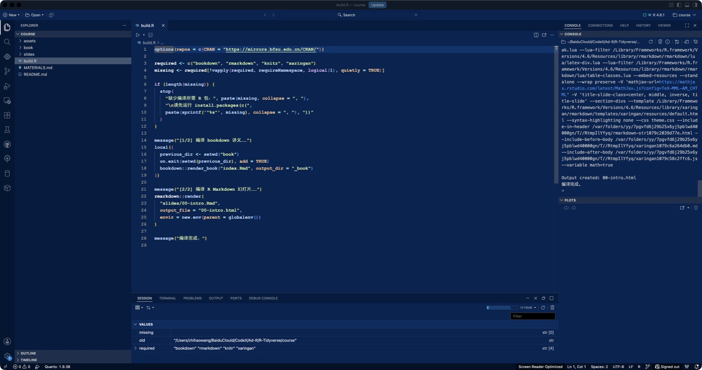
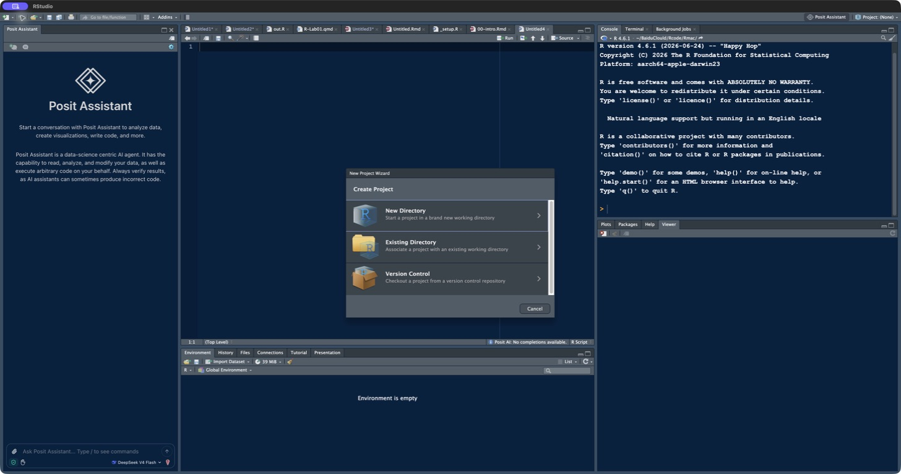
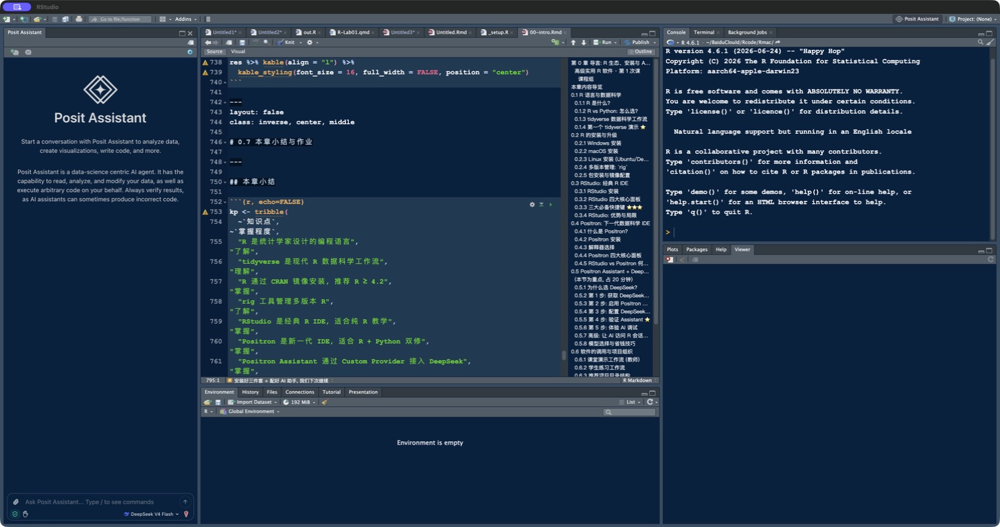

```{r setup, include=FALSE}
knitr::opts_chunk$set(
  echo = TRUE, collapse = TRUE, comment = "#>",
  fig.width = 8, fig.height = 4.5, fig.align = "center",
  warning = FALSE, message = FALSE
)
library(tidyverse)
```

class: inverse, center, middle

# 今天只解决一个问题

## 怎样从“看懂代码”走到“自己写代码”？

<p class="big">工具是起点，<span class="gold">编程思维</span>才是主线。</p>

???
开场提问：有没有同学能看懂示例，却面对空白脚本不知道第一行写什么？

---

# 学习目标

完成本章后，你能：

- 解释 .accent[R、RStudio、Positron] 的三层关系
- 独立完成 R 与 IDE 安装并验证
- 用“分解—梳理—翻译—调试”解决小问题
- 识别对象、函数与向量化思想
- 安全配置 .accent[Posit Assistant + DeepSeek]
- 质疑并验证 AI 生成的代码

---

# 教材主线

<div class="flow">
<span>基本语法</span><b>→</b><span>看懂并调试</span><b>→</b><span>自己写代码</span>
</div>

<div class="warning" style="margin-top:1.4em">
真正的门槛，在第二步与第三步之间。
</div>

<div class="warning" style="margin-top:2.5em; font-size:1.2em">
课程讲义请阅读: <a href="https://wzh621.github.io/R-Tidyverse/" target="_blank" rel="noopener">https://wzh621.github.io/R-Tidyverse/</a>
</div>


???
教材导语明确反对只照抄代码。课堂上先把思维步骤说完整，再展示完整程序。

---

# 从问题到代码

<div class="flow" style="font-size:.78em">
<span>真实问题</span><b>→</b><span>拆成小问题</span><b>→</b><span>简单实例</span><b>→</b><span>算法步骤</span><b>→</b><span>翻译与调试</span>
</div>

<div class="callout" style="margin-top:1.3em">
不要一步跳到完整代码。每走一步，都检查对象的类型、形状和值。
</div>

---

# 课堂热身：圆的面积

.two[
.card[
**需求**

计算半径 2、4、7 的圆面积。

**先说算法**

1. 输入半径
2. 应用公式
3. 返回面积
4. 批量计算并检查
]

.card[
```{r circle}
area_circle <- function(r) {
  pi * r^2
}

r <- c(2, 4, 7)
round(area_circle(r), 2)
```
]
]

---

# 一段代码，三种思想

<div class="three">
<div class="card"><h3>对象</h3><p><code>r</code> 与函数都是对象；类型决定能做什么。</p></div>
<div class="card"><h3>函数</h3><p>把“如何计算”封装为可复用规则。</p></div>
<div class="card"><h3>向量化</h3><p>一次把规则应用到整组半径。</p></div>
</div>

<div class="callout">R 的日常工作：把函数应用到数据。</div>

---

# 教材案例：ROC 不是“一行画图”

给定真实类别与预测概率，要画 ROC 曲线，至少要回答：

<div class="process-line">
<div><strong>1</strong>选阈值</div>
<div><strong>2</strong>转成类别</div>
<div><strong>3</strong>列混淆矩阵</div>
<div><strong>4</strong>算 TPR / FPR</div>
<div><strong>5</strong>遍历并连线</div>
</div>

<div class="warning small" style="margin-top:1.25em">难点不是语法，而是先把统计定义翻译成可以重复执行的步骤。</div>

---

# 先解决“一个阈值”

```{r roc-data}
roc_data <- tibble(
  truth = c("Pos", "Pos", "Pos", "Neg", "Neg", "Neg"),
  prob  = c(.92, .73, .55, .61, .34, .08)
)

calc_roc <- function(threshold) {
  pred <- roc_data$prob >= threshold
  tibble(
    threshold = threshold,
    TPR = mean(pred[roc_data$truth == "Pos"]),
    FPR = mean(pred[roc_data$truth == "Neg"])
  )
}

calc_roc(.60)
```

<p class="small muted">函数把“阈值 → 一个 ROC 点”的规则封装起来。</p>

---

# 再把函数应用到一组阈值

```{r roc-map}
thresholds <- seq(1, 0, by = -.05)

roc_points <- thresholds |>
  map_dfr(calc_roc)

roc_points |> slice_head(n = 5)
```

<div class="callout small"><code>map_dfr()</code> 接收“一组输入 + 一个函数”，并把每次返回的数据框按行合并。</div>

---

# 结果必须可视化，也必须解释

```{r roc-plot, echo=FALSE, fig.height=4.6, fig.width=7.6}
ggplot(roc_points, aes(FPR, TPR)) +
  geom_abline(linetype = 2, colour = "#8aa0ad") +
  geom_path(linewidth = 1.5, colour = "#18a999") +
  geom_point(size = 2.7, colour = "#12304a") +
  coord_equal() +
  labs(x = "假阳性率 FPR", y = "真阳性率 TPR") +
  theme_minimal(base_size = 15)
```

<p class="caption">改变阈值，得到一系列 TPR/FPR；连线后才形成 ROC 曲线。</p>

---

class: inverse, center, middle

# R 与数据科学

## 统计学 × 计算机科学 × 领域知识

---

# 数据科学工作流

<div class="flow" style="font-size:.72em">
<span>导入</span><b>→</b><span>整理</span><b>→</b><span>变换</span><b>→</b><span>可视化</span><b>→</b><span>建模</span><b>→</b><span>沟通</span>
</div>

<div class="card" style="margin-top:1.4em">
tidyverse 让这些阶段共享一致的数据结构、命名与表达方式。
</div>

---

# tidyverse 的优势不只是“包很多”

<div class="three">
<div class="card"><h3>整洁流</h3><p>统一数据结构与函数接口，输入输出容易预测。</p></div>
<div class="card"><h3>管道流</h3><p>代码顺序就是数据处理顺序：从左到右、从上到下。</p></div>
<div class="card"><h3>泛函流</h3><p>把规则封装成函数，再安全地批量应用到多个输入。</p></div>
</div>

<div class="callout">教材的核心主张：用一致、可组合的语法表达完整数据科学流程。</div>

---

# 管道符把嵌套改写成“分析句子”

.two[
<div>
<p class="badge">嵌套：从内向外读</p>

</div>

```{}
summarise(
  group_by(mtcars, cyl),
  mean_mpg = mean(mpg)
)
```

<div>
<p class="badge">管道：从上向下读</p>


</div>

```{}
mtcars |>
  group_by(cyl) |>
  summarise(
    mean_mpg = mean(mpg)
  )
```

]

<div class="warning small"><code>%&gt;%</code> 是 tidyverse 传统写法；新代码优先使用 R 4.1+ 的原生管道 <code>|&gt;</code>。</div>

---

# 泛函式编程：把函数当作输入

```r
area_circle <- function(r) pi * r^2
radii <- c(2, 4, 7)

map_dbl(radii, area_circle)
```

<div class="flow" style="font-size:.76em">
<span>一组输入</span><b>+</b><span>一个函数</span><b>→</b><span>逐个应用</span><b>→</b><span>类型明确的结果</span>
</div>

<table style="margin-top:1em"><tr><th>函数</th><th>输出</th><th>记忆方法</th></tr><tr><td><code>map()</code></td><td>列表</td><td>结果可以复杂</td></tr><tr><td><code>map_dbl()</code></td><td>数值向量</td><td>double</td></tr><tr><td><code>map_chr()</code></td><td>字符向量</td><td>character</td></tr></table>

---

# 管道负责“阶段”，泛函负责“重复”

- 目的：把 mtcars 按气缸数（4/6/8）拆成 3 组，
- 每组分别拟合“车重 wt 解释油耗 mpg”的线性回归，
- 最后提取每个模型的 R²（拟合优度）。

- 第 1 步：按 cyl 分组，得到 3 个子数据框
```{r}
cyl_groups <- split(mtcars, mtcars$cyl)

# 第 2 步：对每组拟合 mpg ~ wt
models <- lapply(cyl_groups, function(df) {
  lm(mpg ~ wt, data = df)
})

# 第 3 步：逐个模型提取 R²
r_squared <- sapply(models, function(model) {
  summary(model)$r.squared
})

r_squared
```

- 对比管道符

```{r}
models <- mtcars |>
  group_split(cyl) |>
  map(\(df) lm(mpg ~ wt, data = df))

models |>
  map_dbl(\(model) summary(model)$r.squared)
```
<div class="callout">
先写清楚“一个对象怎样处理”，再考虑“很多对象怎样批量处理”。
</div>

<p class="small muted">这比复制粘贴三段模型代码更容易检查、修改和扩展。</p>

---

# 为什么学习 R？

.two[
.card[
### 擅长

- 统计计算与建模
- 数据整理与探索
- 高质量可视化
- 可复现报告
- 交互式数据应用
]

.card[
### 特点

- 免费、开源、跨平台
- CRAN / Bioconductor / GitHub 生态
- 统计学家设计
- 函数式、向量化表达自然
- 代码、结果、叙述可以共存
]
]

---

class: inverse, center, middle

# 别再把“三件套”混在一起

## R 是引擎，IDE 是驾驶舱

---

# R · RStudio · Positron

<div class="three">
<div class="card"><h3>R</h3><p><b>计算引擎</b></p><p class="small">执行代码、管理对象、调用包、统计计算与绘图。</p></div>
<div class="card"><h3>RStudio</h3><p><b>经典 R IDE</b></p><p class="small">聚焦 R，教学路径成熟，Project 与包开发稳定。</p></div>
<div class="card"><h3>Positron</h3><p><b>新一代数据科学 IDE</b></p><p class="small">原生 R + Python，现代编辑、数据浏览与 AI 上下文。</p></div>
</div>

<div class="warning">先安装 R，再让 RStudio 或 Positron 调用它。</div>

---

# 什么时候选哪个？

| 场景 | RStudio | Positron |
|---|:---:|:---:|
| 初学纯 R、跟随传统教材 | ★★★ | ★★ |
| R Project 与成熟 R 工作流 | ★★★ | ★★ |
| R + Python 混合项目 | ★ | ★★★ |
| 现代编辑器与扩展生态 | ★★ | ★★★ |
| 数据浏览与 AI 会话上下文 | ★★ | ★★★ |

<div class="callout">本课程主环境：Positron；同时学会把 RStudio 功能映射过来。</div>

---

class: inverse, center, middle

# 安装顺序

## R → IDE → R 包 → 项目验证

---

# 第一步：安装 R

.two[
.card[
### Windows
1. CRAN → Windows → base
2. 当前稳定版、64 位
3. 项目路径避免中文与特殊字符
4. 需要编译包时再装匹配 Rtools
]

.card[
### macOS / Linux
- macOS：区分 Apple Silicon 与 Intel
- Ubuntu/Debian：按 CRAN 发行版说明配置源
- 机房环境优先使用统一版本
]
]

```r
R.version.string
Sys.info()[c("sysname", "release", "machine")]
```

---

# CRAN 首页该看哪里？

.two.wide-left[
<div class="shot-wrap"></div>
<div>
<div class="step-list">
<div><b>Windows</b><br><span class="small">Download R for Windows → base</span></div>
<div><b>macOS</b><br><span class="small">按 Apple Silicon / Intel 选择</span></div>
<div><b>Linux</b><br><span class="small">进入发行版说明页配置软件源</span></div>
</div>
<p class="source-note">来源：The Comprehensive R Archive Network，2026-08 截图。</p>
</div>
]

---

# 第二步：安装常用包

```r
options(
  repos = c(CRAN = "https://mirrors.bfsu.edu.cn/CRAN/")
)

install.packages(c(
  "tidyverse", "rmarkdown", "bookdown", "xaringan"
))

library(tidyverse)
```

<div class="warning small">
安装包只做一次；每次新会话使用包前仍需 <code>library()</code>。
</div>

---

# RStudio：经典四窗格


<p class="caption">官方标注：Source · Console · Environment · Output</p>
<p class="source-note center">来源：RStudio User Guide · Get Started</p>

---

# RStudio 界面功能

.two[
.card[
1. **Source**：保存脚本与文档
2. **Console**：交互执行与查看错误
3. **Environment**：当前会话对象
]
.card[
4. **Files / Plots / Packages / Help / Viewer**
5. **Project**：组织路径与文件
6. **Knit**：编译 R Markdown
]
]

<div class="callout small"><code>Ctrl/⌘ + Enter</code>：运行当前行或选中代码；<code>Ctrl + L</code>：清空控制台显示。</div>

---

# Positron：数据科学工作台


<p class="caption">Explorer / Editor · Console · Variables / Data Explorer · Plots / Viewer / Help</p>
<p class="source-note center">来源：Posit 官方文章 “A quick tour of Positron”</p>

---

# 本课程项目在 Positron 中的位置



<p class="caption">左：课程文件树；中：build.R；右：Console / Plots；下：Variables。</p>

---

# Positron 最小工作流

1. **Open Folder**：打开项目目录
2. **Start Session**：选择已安装的 R
3. 新建或打开 `.R` / `.Rmd`
4. `Ctrl/⌘ + Enter` 逐段运行
5. 在 Variables、Plots、Viewer 检查结果
6. 编译前从空会话完整运行一次

```r
R.version.string
getwd()
sessionInfo()
```

---

class: inverse, center, middle

# Posit Assistant + DeepSeek

## AI 可以加速，但不能替你负责

---

# 先认识版本差异

<div class="card">
<b>Positron 2026.07 起</b>：默认 AI 体验称为 <span class="accent">Posit Assistant</span>，取代旧称 Positron Assistant。
</div>

<div class="card">
新版已有原生 <span class="accent">DeepSeek (Experimental)</span> 提供商；旧版教程常使用 Custom Provider。
</div>

<div class="warning small">
课堂使用 V4 模型名：<code>deepseek-v4-flash</code> / <code>deepseek-v4-pro</code>。
</div>

---

# 配置步骤：原生 DeepSeek

1. 在 DeepSeek 开放平台创建 API Key
2. `Ctrl/⌘ + Shift + P` 打开命令面板
3. 运行 **Authentication: Configure Language Model Providers**
4. 选择 **DeepSeek (Experimental)**
5. 粘贴 API Key
6. 运行 **View: Show Posit Assistant**
7. 选择 V4 模型，发送只读测试问题

<div class="warning small">密钥只放认证界面或安全的用户级环境变量；不要写入脚本、讲义、截图或 Git。</div>

---

# 图形化配置：先选提供商


<p class="caption">命令面板 → Authentication: Configure Language Model Providers → DeepSeek Experimental</p>
<p class="source-note center">本机 Positron 2026.08 截图；提供商列表会随版本变化。</p>

---

# 图形化配置：再输入 API Key


<p class="caption">API Key 留在安全输入框；Base URL 默认 <code>https://api.deepseek.com</code>。</p>
<div class="warning small">截图中没有真实密钥。创建或粘贴自己的密钥时，不要直播、录屏或共享屏幕。</div>

---

# 旧版兼容：Custom Provider

```text
Provider   Custom Provider (Experimental)
Base URL   https://api.deepseek.com
API Key    sk-••••••••（不要公开）
Model      deepseek-v4-flash / deepseek-v4-pro
```

若无法自动取得模型列表：

```json
"positron.assistant.models.overrides.customProvider": [
  {"name": "DeepSeek V4 Flash", "identifier": "deepseek-v4-flash"},
  {"name": "DeepSeek V4 Pro", "identifier": "deepseek-v4-pro"}
]
```

---

# 第一次验证

把下面代码放入当前脚本：

```r
library(dplyr)
mtcars |>
  group_by(cyl) |>
  summarise(mean_mpg = mean(mpg))
```

向 Assistant 提问：

> 逐行解释输入、分组、输出结构；指出一项可验证结果。不要修改文件。

人工验证：

```r
with(mtcars, tapply(mpg, cyl, mean))
```

---

# AI 使用红线

.two[
.card[
### 不发送
- 学生身份与成绩明细
- 未脱敏研究数据
- 密钥、口令、访问令牌
- 受协议限制的材料
]
.card[
### 必须验证
- 包与函数是否真实存在
- 输入输出结构
- 边界值与缺失值
- 统计假设与解释
- 是否可从空会话复现
]
]

---

# 0.8 第一步：RStudio 中创建项目

.two.wide-left[

<div class="step-list">
<div><b>New Directory</b><br><span class="small">新作业、新分析</span></div>
<div><b>Existing Directory</b><br><span class="small">已有文件夹</span></div>
<div><b>Version Control</b><br><span class="small">Git 仓库</span></div>
</div>
]

<p class="caption">工具栏项目按钮或右上角 Project 菜单 → New Project</p>

---

# 0.8 第二步：在四窗格中完成循环



<div class="flow" style="font-size:.58em;margin-top:.45em">
<span>Files 找到项目</span><b>→</b><span>Source 写并保存</span><b>→</b><span>Console 运行</span><b>→</b><span>Environment / Plots 检查</span>
</div>

---

# 0.8 第三步：让目录表达职责

```text
my-project/
├── data/          # 原始数据，只读
├── R/             # 可复用函数
├── analysis/      # Rmd / Qmd
├── output/        # 图、表、报告
├── README.md
└── my-project.Rproj
```

<div class="callout">使用相对路径；不要依赖 Console 中没有保存的临时代码。</div>

---

# 0.8 第四步：从空会话验证

<div class="step-list">
<div><b>重启 R</b>：清空旧对象，暴露隐藏依赖。</div>
<div><b>从第一行运行</b>：不跳过导入、清洗和包加载。</div>
<div><b>检查输出</b>：图、表、模型是否由代码重新生成。</div>
<div><b>检查路径</b>：只使用项目内相对路径。</div>
<div><b>编译文档</b>：Knit/Render 成功才算交付。</div>
</div>

<div class="warning small">“我的电脑上能跑”不是可复现；“空会话从头能跑”才是。</div>

---

# Exit ticket · 3 分钟

1. 用一句话解释：R 与 Positron 是什么关系？
2. 写出“问题到代码”的四个动作。
3. 指出一项 AI 不能替你完成的责任。

<div class="card" style="margin-top:1.1em">
提交：<code>R.version.string</code>、<code>getwd()</code>、<code>sessionInfo()</code> 的运行结果。
</div>

---

# 课后作业

1. 安装 R、RStudio、Positron，并完成验证
2. 画出 R—IDE—R 包三层关系
3. 将“计算成绩优秀率”拆成 ≥ 4 个算法步骤并编码
4. 用 Assistant 解释代码，记录一处你发现并修正的问题
5. 思考：什么情况下应关闭 Assistant 或限制项目上下文？

---

class: inverse, center, middle

# 小结

## R 是引擎 · IDE 是工作台 · 思维决定代码质量

### 王芝皓 · 统计与数据科学学院

<p class="small">下一章：基础语法与可复现项目工作流</p>

---

# 资料来源

<div class="small">

- 张敬信：《R 语言编程：基于 tidyverse》，导语与 1.1 节
- CRAN：<https://cran.r-project.org/>
- RStudio User Guide：<https://docs.posit.co/ide/user/ide/get-started/>
- Positron：<https://positron.posit.co/install>
- Posit Assistant：<https://positron.posit.co/assistant-getting-started>
- Providers：<https://positron.posit.co/assistant-providers.html>
- DeepSeek API：<https://api-docs.deepseek.com/quick_start/pricing-details-cny/>

</div>
