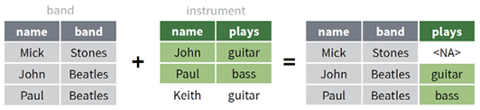
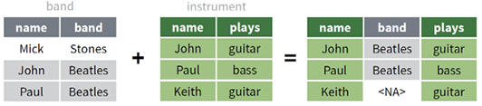
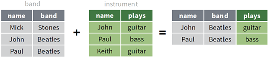

```{r setup, include=FALSE}
knitr::opts_chunk$set(
  echo = TRUE, collapse = TRUE, comment = "#>",
  fig.width = 8, fig.height = 4.3, fig.align = "center",
  warning = FALSE, message = FALSE
)
library(tidyverse)
set.seed(2023)

# 所有姓名、学号和成绩均为课堂合成数据。
students <- tribble(
  ~student_id, ~class, ~name, ~gender, ~chinese, ~math, ~english,
  "S01", "A班", "晨曦", "女", 86, 92, 88,
  "S02", "A班", "远航", "男", 79, 75, NA,
  "S03", "A班", "星河", "女", 91, 89, 95,
  "S04", "B班", "青禾", "男", 68, 72, 74,
  "S05", "B班", "知夏", "女", 88, NA, 90,
  "S06", "B班", "景明", "男", 77, 81, 79
)

majors <- tribble(
  ~student_id, ~major,
  "S01", "统计学", "S02", "经济学", "S03", "数据科学",
  "S05", "统计学", "S07", "数学"
)

sales_wide <- tribble(
  ~store, ~`2024_Q1`, ~`2024_Q2`, ~`2024_Q3`,
  "东区", 120, 138, 145,
  "西区", 105, 111, 126,
  "南区", 98, 114, 119
)
```

class: inverse, center, middle

# 本章真正要学的是什么？

## 把复杂任务拆成可读、可查、可复现的基本操作

<p class="big">先认清<span class="gold">观测单位</span>，再操作行、列、组与表。</p>

???
请同学想一个最近处理过的数据表：一行代表什么？哪一列是键？如果答不出来，任何操作都可能只是“代码能跑”。

---

# 学习目标

完成本章后，你能：

- 用管道表达从输入到输出的数据流
- 可靠读写文件并诊断中文编码
- 检查键、连接关系与未匹配记录
- 在长表、宽表和嵌套列表之间重塑
- 组合 dplyr 五个基本动词与分组
- 使用按行、窗口、滑窗和整洁计算
- 读懂 `data.table::DT[i, j, by]`

---

# 教材第 2 章路线图

<div class="data-map">
<div><b>2.1</b><span>tidyverse<br>与管道</span></div>
<div><b>2.2</b><span>数据<br>读写</span></div>
<div><b>2.3</b><span>数据<br>连接</span></div>
<div><b>2.4</b><span>数据<br>重塑</span></div>
<div><b>2.5</b><span>基本<br>操作</span></div>
<div><b>2.6</b><span>其他<br>操作</span></div>
<div><b>2.7</b><span>data.table</span></div>
</div>

<div class="callout" style="margin-top:1em">贯穿线索：分解 → 对单元应用规则 → 重新组合 → 检查结果。</div>

---

class: inverse, center, middle

# 2.1 tidyverse 与管道

## 一套一致的“数据动词”

---

# tidyverse 不只是“一组包”

<div class="three compact-cards">
<div class="card"><h3>一致结构</h3><p>tibble 与整洁数据</p></div>
<div class="card"><h3>一致接口</h3><p>数据通常是第 1 个参数</p></div>
<div class="card"><h3>一致流程</h3><p>管道连接小步骤</p></div>
</div>

<div class="function-layers">
<div><b>向量化</b><span>一次处理一整列</span></div>
<div class="arrow">＋</div>
<div><b>函数式</b><span>把规则交给 across / map</span></div>
<div class="arrow">＝</div>
<div><b>数据思维</b><span>按列、按组、按表分解</span></div>
</div>

---

# group_by + across：双重分解

```{r slide-functional}
# 目标：同一个均值函数，应用到“每个班 × 每门课”。
students |>
  group_by(class) |>                       # 先拆成两个班级组
  summarise(
    across(
      chinese:english,                     # 再选择三门成绩列
      \(x) mean(x, na.rm = TRUE),          # 只写一次单列汇总规则
      .names = "avg_{.col}"
    ),
    .groups = "drop"                       # 结果不再保留分组状态
  )
```

<div class="callout small">我们负责描述一个小单元怎样计算，dplyr 负责拆分与合并。</div>

---

# 管道不是装饰，而是阅读顺序

<div class="pipe-line">
<span>mtcars</span><b>›</b><span>按 cyl 分组</span><b>›</b><span>计算均值</span><b>›</b><span>降序排列</span>
</div>

```{r slide-pipe}
# 从上到下读：取数据 → 分组 → 汇总 → 排序。
mtcars |>
  as_tibble() |>
  group_by(cyl) |>
  summarise(avg_mpg = mean(mpg), .groups = "drop") |>
  arrange(desc(avg_mpg))
```

---

# `|>` 与 `%>%` 怎样选择？

| 情形 | 建议 |
|---|---|
| 新课程、新项目 | 以 R 原生 `|>` 为主 |
| 教材、旧代码 | 能读懂 `%>%` |
| 数据不是下个函数第 1 个参数 | 用匿名函数明确位置 |

```{r slide-pipe-position}
letters[1:3] |>
  (\(x) str_c("变量：", x))()  # x 明确放到 str_c 的第二个位置
```

<div class="warning small">长管道先在关键位置保存中间对象；不要只在最后一行猜错误来自哪里。</div>

---

# 读代码：注释应解释决策

```{r slide-comment-style, results='hide'}
# 目标：只用三门成绩都完整的记录计算个人均分。
complete_scores <- students |>
  filter(if_all(chinese:english, \(x) !is.na(x))) # 改变行数：排除任一科缺失者

glimpse(complete_scores)                         # 检查行数和列类型

complete_scores |>
  mutate(avg_score = rowMeans(pick(chinese:english))) |>
  select(student_id, name, avg_score)             # 输出只保留交付需要的列
```

<div class="two small">
<div class="callout"><b>有价值</b><br>解释筛选依据、数据形状和业务假设</div>
<div class="warning"><b>无价值</b><br>“调用 filter”“使用管道”这类重复代码字面的注释</div>
</div>

---

class: inverse, center, middle

# 2.2 数据读写

## 读入时就决定类型、缺失值与编码

---

# 格式决定工具

| 输入 | 包 | 常用函数 |
|---|---|---|
| CSV / TSV | readr | `read_csv()`, `read_tsv()` |
| Excel | readxl | `read_xlsx()` |
| SPSS / Stata / SAS | haven | `read_sav()`, `read_dta()`, `read_sas()` |
| JSON | jsonlite | `fromJSON()` |
| 文本文档集合 | readtext | `readtext()` |
| R 对象 | readr / base | `read_rds()`, `readRDS()` |

<div class="callout small">先保真地导入，再整洁地整理；不要为了“读进来”而丢掉标签、日期或前导零。</div>

---

# read_csv：关键列不要完全依赖猜测

```{r slide-read-csv}
csv_text <- I(
  "student_id,name,exam_date,score\nS01,晨曦,2024-06-01,92\nS02,远航,2024-06-01,缺考"
)

exam <- read_csv(
  csv_text,
  na = "缺考",                              # 业务缺失标记 → NA
  col_types = cols(
    student_id = col_character(),           # 编码保留为字符
    name = col_character(),
    exam_date = col_date("%Y-%m-%d"),       # 让日期可排序、可计算
    score = col_double()
  )
)

glimpse(exam)                               # 检查“类型”，不只检查打印值
```

---

# 批量读取：保留来源

```{r slide-batch-read, eval=FALSE}
# 找出同结构的所有月度文件。
files <- fs::dir_ls("data/monthly", glob = "*.csv")

monthly <- read_csv(
  files,
  id = "source_file",                      # 每行保留来源文件路径
  show_col_types = FALSE
)

count(monthly, source_file)                 # 核对每个文件贡献的行数
```

<div class="source-flow">
<span>01.csv</span><span>02.csv</span><span>03.csv</span><b>→</b><span class="result">一张长表<br><small>含 source_file</small></span>
</div>

---

# Excel 批量读取：先列举，再迭代

```{r slide-batch-excel, eval=FALSE}
book_path <- "data/sales.xlsx"

sheet_data <- readxl::excel_sheets(book_path) |>
  set_names() |>                              # 名称成为 map_dfr 的来源 ID
  map_dfr(
    \(sheet) readxl::read_xlsx(book_path, sheet = sheet),
    .id = "sheet"
  )
```

<div class="callout small">批处理的最小审计：文件/工作表数量、每个来源行数、合并后的列类型是否一致。</div>

---

# 写出什么格式？

<div class="three compact-cards">
<div class="card"><h3>CSV</h3><p>跨软件交换<br>类型信息较少</p></div>
<div class="card"><h3>XLSX</h3><p>面向办公用户<br>支持多工作表</p></div>
<div class="card"><h3>RDS</h3><p>保留 R 类型<br>适合中间对象</p></div>
</div>

```{r slide-write, eval=FALSE}
write_csv(result, "output/result.csv")
write_excel_csv(result, "output/result_excel.csv") # UTF-8 BOM
write_rds(result, "output/result.rds")              # 保留 R 类型
```

<div class="warning small">写出不是终点：重新读入，核对行数、列名、关键类型和缺失值。</div>

---

# 数据库：计算尽量靠近数据

<div class="db-flow">
<span>R / dplyr</span><b>生成 SQL</b><span>数据库执行</span><b>只取结果</b><span>collect()</span>
</div>

```{r slide-db}
con <- DBI::dbConnect(RSQLite::SQLite(), ":memory:")
DBI::dbWriteTable(con, "students", students, overwrite = TRUE)

query <- tbl(con, "students") |>
  filter(math >= 80) |>                       # 先形成延迟查询
  select(student_id, name, math)

show_query(query)                            # 看翻译后的 SQL
collect(query)                               # 到这里才取回本地
DBI::dbDisconnect(con)
```

---

# 凭据永远不进入代码仓库

```{r slide-db-secret, eval=FALSE}
con <- DBI::dbConnect(
  RMariaDB::MariaDB(),
  host = Sys.getenv("DB_HOST"),
  user = Sys.getenv("DB_USER"),
  password = Sys.getenv("DB_PASSWORD")       # 本地环境变量，不是明文
)
```

<div class="two">
<div class="card"><h3>教材概念保留</h3><p>DBI 连接、dbplyr 翻译、collect 收集、disconnect 释放。</p></div>
<div class="card"><h3>课堂安全更新</h3><p>用 SQLite 演示；真实服务凭据不写入 Rmd、脚本或 Git。</p></div>
</div>

---

# 中文乱码：编码规则不匹配

<div class="encoding-diagram">
<span>文件字节</span><b>＋</b><span class="bad">错误解码规则</span><b>→</b><span class="bad">乱码</span>
</div>

```{r slide-encoding, eval=FALSE}
legacy <- read_csv(
  "data/legacy_gbk.csv",
  locale = locale(encoding = "GB18030") # 与文件实际编码一致
)

guess_encoding("data/legacy_gbk.csv")   # 只能辅助判断，还要人工核对
```

<div class="callout small">项目内部统一 UTF-8；交付 Excel 时可选 .xlsx 或 `write_excel_csv()`。</div>

---

class: inverse, center, middle

# 2.3 数据连接

## 先问键与关系，再写 join

---

# 键：让两张表谈论同一个对象

<div class="relation-diagram">
<div class="table-box"><b>students</b><span>S01　晨曦</span><span>S02　远航</span><span>S03　星河</span></div>
<div class="key-link"><code>student_id</code><br>匹配</div>
<div class="table-box"><b>majors</b><span>S01　统计学</span><span>S02　经济学</span><span>S07　数学</span></div>
</div>

连接前回答：

1. 哪些列构成键？
2. 键在左表、右表是否唯一？
3. 一对一、一对多还是多对多？
4. 未匹配记录要保留还是排除？

---

# 教材中的关系数据模型

<div class="two wide-left">
<div class="textbook-model">

<p class="caption">原书图 2.10：flights 与 airports、planes、weather、airlines 的关系</p>
</div>
<div class="card small">
<h3>沿连线寻找键</h3>
<ul>
<li><code>tailnum</code>：航班 → 飞机</li>
<li><code>carrier</code>：航班 → 航空公司</li>
<li><code>origin / dest</code>：航班 → 机场</li>
<li>日期、小时和机场共同连接天气表</li>
</ul>
</div>
</div>

<div class="callout small">键可以由多列组成；同一张表的不同列也可以指向另一张表的同一主键。</div>

---

# 先检查重复键与未匹配键

```{r slide-key-audit}
# 若返回 0 行，说明 majors 的 student_id 没有重复。
majors |>
  count(student_id) |>
  filter(n > 1)

# 哪些学生在 majors 中没有匹配记录？
students |>
  anti_join(majors, by = join_by(student_id)) |>
  select(student_id, name)
```

<div class="warning small">`anti_join()` 是数据质量工具：它把“连接失败”从沉默的 NA 变成可检查的清单。</div>

---

# bind_rows 与 bind_cols 不做键匹配

<div class="two">
<div class="card">
<h3>bind_rows()</h3>
<p>根据列名向下堆叠</p>
<p class="small">行数相加，变量含义应一致</p>
</div>
<div class="card">
<h3>bind_cols()</h3>
<p>根据当前位置向右拼接</p>
<p class="small">必须确认行数与行序一致</p>
</div>
</div>

```{r slide-bind}
spring <- tibble(id = c("S01", "S02"), term = "春季")
autumn <- tibble(id = c("S01", "S03"), term = "秋季")

bind_rows(spring, autumn, .id = "source") # .id 保留来源表
```

---

# 六种连接：先看“保留哪些行”

<div class="join-grid">
<div><b>left</b><span>左表全部</span></div>
<div><b>right</b><span>右表全部</span></div>
<div><b>full</b><span>两表并集</span></div>
<div><b>inner</b><span>两表交集</span></div>
<div><b>semi</b><span>左表匹配者<br>不添列</span></div>
<div><b>anti</b><span>左表未匹配者<br>不添列</span></div>
</div>

---

# 修改连接：四张图放在一起看

<div class="textbook-join-grid four-joins">
<figure><figcaption><code>left_join()</code> · 左表全部</figcaption></figure>
<figure><figcaption><code>right_join()</code> · 右表全部</figcaption></figure>
<figure><figcaption><code>full_join()</code> · 两表并集</figcaption></figure>
<figure><figcaption><code>inner_join()</code> · 两表交集</figcaption></figure>
</div>

<p class="source-note center">教材原书图 2.11–2.14。灰色来自左表，绿色来自右表；未匹配的新增值显示为 &lt;NA&gt;。</p>

---

# 过滤连接：只决定左表哪些行留下

<div class="textbook-join-grid filter-joins">
<figure><figcaption><code>semi_join()</code> · 右表能找到 → 保留</figcaption></figure>
<figure><figcaption><code>anti_join()</code> · 右表找不到 → 保留</figcaption></figure>
</div>

<div class="two small">
<div class="callout"><b>共同点</b><br>结果只包含左表的列，不把 plays 添进来。</div>
<div class="warning"><b>关键差异</b><br>semi 保留匹配者；anti 保留未匹配者。</div>
</div>

<p class="source-note center">教材原书图 2.15–2.16。</p>

---

# left_join：给主表补充属性

```{r slide-left-join}
student_profile <- students |>
  left_join(
    majors,
    by = join_by(student_id)                  # 明确写出连接键
  )

student_profile |>
  select(student_id, name, major)
```

<div class="callout small">左表 6 名学生全部保留；右表的 S07 不会进入结果；左表未匹配者的 major 为 NA。</div>

---

# inner / semi / anti：三个不同问题

```{r slide-filter-joins, results='hide'}
# 两边都有，并把 major 列带进来。
students |>
  inner_join(majors, by = join_by(student_id))

# 哪些学生有专业记录？只筛 students，不添列。
students |>
  semi_join(majors, by = join_by(student_id))

# 哪些学生没有专业记录？只筛 students，不添列。
students |>
  anti_join(majors, by = join_by(student_id))
```

---

# 连接后必须审计行数

```{r slide-join-audit}
joined <- students |>
  left_join(majors, by = join_by(student_id))

tibble(
  stage = c("before", "after"),
  rows = c(nrow(students), nrow(joined)),
  unique_ids = c(n_distinct(students$student_id),
                 n_distinct(joined$student_id))
)
```

<div class="warning">预期一对一却出现行数增长：检查两边重复键。不要用 `distinct()` 悄悄掩盖连接错误。</div>

---

# 集合运算：把整行视为元素

```{r slide-set-ops}
x <- tibble(id = c("A", "B", "C"))
y <- tibble(id = c("B", "C", "D"))

intersect(x, y)  # 共同出现
union(x, y)      # 任一边出现，自动去重
setdiff(x, y)    # x 有、y 没有；有方向
setequal(x, y)   # 忽略行序判断是否相同
```

---

class: inverse, center, middle

# 2.4 数据重塑

## 变量一列、观测一行、值一格

---

# 先说清“每一行代表什么”

<div class="tidy-principles">
<div><b>变量</b><span>每个变量一列</span></div>
<div><b>观测</b><span>每个观测一行</span></div>
<div><b>值</b><span>每个值一个单元格</span></div>
</div>

<div class="mini-table">
<div class="head">store</div><div class="head">quarter</div><div class="head">sales</div>
<div>东区</div><div>Q1</div><div>120</div>
<div>东区</div><div>Q2</div><div>138</div>
</div>

<div class="callout small">整洁不是“看起来整齐”，而是数据形状与研究问题一致。</div>

---

# 宽表中的列名藏着变量值

```{r slide-wide}
sales_wide
```

<div class="wide-hint">
<span>2024_Q1</span><span>2024_Q2</span><span>2024_Q3</span>
<b>这些不是三个变量，而是 year 与 quarter 的取值</b>
</div>

---

# pivot_longer：列名 → 值

```{r slide-pivot-long}
sales_long <- sales_wide |>
  pivot_longer(
    starts_with("2024_"),                     # 要收拢的季度列
    names_to = c("year", "quarter"),         # 新建两个变量
    names_sep = "_",                          # 2024_Q1 按 _ 拆开
    values_to = "sales"                       # 单元格值进入 sales
  ) |>
  mutate(year = as.integer(year))             # 解析列名后修正类型

sales_long
```

<div class="shape-change"><span>3 行 × 4 列</span><b>→</b><span>9 行 × 4 列</span></div>

---

# `.value`：列名里藏着多个测量变量

```{r slide-pivot-value}
survey_wide <- tribble(
  ~site, ~A_count, ~A_height, ~B_count, ~B_height,
  "北区", 7, 100, 2, 110,
  "南区", 5, 95, 8, 90
)

survey_wide |>
  pivot_longer(
    -site,
    names_to = c("species", ".value"), # count/height 继续做列名
    names_sep = "_"
  )
```

---

# pivot_wider：值 → 列名

```{r slide-pivot-wide}
sales_long |>
  unite(period, year, quarter, sep = "_") |>  # 先构造新列名来源
  pivot_wider(
    names_from = period,
    values_from = sales
  )
```

<div class="callout small">宽表常适合报表阅读；长表通常更适合分组、绘图与建模。</div>

---

# pivot_wider 的唯一性陷阱

```{r slide-pivot-duplicate}
sales_detail <- tribble(
  ~store, ~quarter, ~sales,
  "东区", "Q1", 50,
  "东区", "Q1", 70,
  "东区", "Q2", 138
)

sales_detail |>
  pivot_wider(
    names_from = quarter,
    values_from = sales,
    values_fn = sum,                           # 两个 Q1 如何进入一个单元格？
    values_fill = 0
  )
```

<div class="warning small">不写 `values_fn` 时出现列表列，通常说明 ID + 新列名不能唯一识别一个值。</div>

---

# 拆列、合列与拆行

```{r slide-separate}
events <- tibble(location = c("北京-海淀", "上海-浦东"))

events |>
  separate(
    location,
    into = c("city", "district"),
    sep = "-"
  )

tibble(course = "R语言", topics = "对象,管道,函数") |>
  separate_rows(topics, sep = ",")           # 一个单元格的多项 → 多行
```

---

# 方形化：把嵌套列表变成行列

```{r slide-rectangle}
nested <- tibble(
  profile = list(
    list(name = "甲", dept = "统计系"),
    list(name = "乙", dept = "数据科学系")
  ),
  courses = list(c("R语言", "统计计算"), "数据可视化")
)

nested |>
  unnest_wider(profile) |>                    # 命名成分横向展开
  unnest_longer(courses)                     # 不等长向量纵向展开
```

<div class="callout small">JSON 常给你嵌套列表；`unnest_wider()`、`unnest_longer()` 与 `hoist()`负责驯服它。</div>

---

class: inverse, center, middle

# 2.5 基本数据操作

## 五个动词，组合出大多数任务

---

# 五个基本动词

<div class="verb-grid">
<div><b>select</b><span>要哪些列？</span></div>
<div><b>filter / slice</b><span>要哪些行？</span></div>
<div><b>arrange</b><span>行序如何？</span></div>
<div><b>mutate</b><span>怎样产生新列？</span></div>
<div><b>summarise</b><span>怎样压缩成摘要？</span></div>
</div>

<div class="callout">`group_by()` 改变这些动词的作用范围：整表一次，还是每组一次。</div>

---

# select：表达列的语义

```{r slide-select, results='hide'}
score_cols <- c("chinese", "math", "english")

students |>
  select(
    student_id,
    name,
    all_of(score_cols)                        # 字符向量列名必须显式注入
  ) |>
  relocate(name, .after = student_id)
```

| 助手 | 用途 |
|---|---|
| `starts_with()`, `ends_with()` | 按列名前后缀 |
| `where(is.numeric)` | 按列类型 |
| `all_of(names)` | 所有列必须存在 |
| `any_of(names)` | 容忍可选列缺失 |

---

# mutate：新列可以引用前面刚创建的列

```{r slide-mutate}
student_scores <- students |>
  mutate(
    known_subjects = rowSums(!is.na(pick(chinese:english))),
    total_score = rowSums(pick(chinese:english), na.rm = TRUE),
    avg_score = total_score / known_subjects,  # 使用本次 mutate 新建的列
    level = case_when(
      avg_score >= 90 ~ "优秀",
      avg_score >= 80 ~ "良好",
      avg_score >= 60 ~ "及格",
      TRUE ~ "需改进"
    )
  )

student_scores |> select(name, known_subjects, avg_score, level)
```

---

# 缺失值不是自动等于 0

```{r slide-missing-choice}
students |>
  mutate(
    known_subjects = rowSums(!is.na(pick(chinese:english))),
    known_total = rowSums(pick(chinese:english), na.rm = TRUE),
    known_average = known_total / known_subjects
  ) |>
  select(name, known_subjects, known_total, known_average)
```

<div class="warning">`na.rm = TRUE` 是业务决定：它表示“忽略未知值计算已有信息”，不是“缺失等于零”。</div>

---

# across：把规则应用到多列

```{r slide-across}
students |>
  summarise(
    across(
      chinese:english,
      list(
        mean = \(x) mean(x, na.rm = TRUE),
        sd = \(x) sd(x, na.rm = TRUE)
      ),
      .names = "{.col}_{.fn}"
    )
  )
```

<div class="callout small">当前写法把 `na.rm = TRUE` 放入匿名函数；读者能一眼看出额外参数何时生效。</div>

---

# filter：条件；slice：位置或排名

```{r slide-filter, results='hide'}
# 所有科目都有成绩且均不低于 75。
students |>
  filter(if_all(chinese:english, \(x) !is.na(x) & x >= 75)) |>
  select(name, chinese:english)               # 课堂只展示判断所需字段

# 任意一门达到 90。
students |>
  filter(if_any(chinese:english, \(x) x >= 90)) |>
  select(name, chinese:english)

# 数学最高的两位，明确不保留并列。
students |>
  slice_max(math, n = 2, with_ties = FALSE) |>
  select(name, math)
```

---

# arrange：窗口计算前的前置条件

```{r slide-arrange}
students |>
  arrange(
    class,                                     # 班级升序
    desc(math)                                 # 班内数学降序
  ) |>
  select(class, name, math)
```

<div class="callout small">排序改变行序，不改变行数。`lag()`、累计和与滑窗依赖行序，先排序再计算。</div>

---

# group_by + mutate：组内比较，行数不变

```{r slide-group-mutate}
students |>
  group_by(class) |>
  mutate(
    class_avg = mean(math, na.rm = TRUE),      # 每组得到一个均值，再回填组内各行
    diff = math - class_avg
  ) |>
  ungroup() |>
  select(class, name, math, class_avg, diff)
```

<div class="shape-change"><span>6 名学生</span><b>→</b><span>仍是 6 行</span></div>

---

# group_by + summarise：每组压缩

```{r slide-group-summary}
students |>
  group_by(class) |>
  summarise(
    n = n(),
    avg_math = mean(math, na.rm = TRUE),
    .groups = "drop"
  )
```

<div class="shape-change"><span>6 名学生</span><b>→</b><span>2 个班级</span></div>

```{r slide-summary-by}
# 只需要一次分组汇总时，.by 不会留下持续分组状态。
students |>
  summarise(n = n(), avg_math = mean(math, na.rm = TRUE), .by = class)
```

---

class: inverse, center, middle

# 2.6 其他数据操作

## 行、窗口与可编程列名

---

# 按行：优先向量化，再考虑 rowwise

```{r slide-rowwise, results='hide'}
# 快：专门的向量化行函数。
students |>
  mutate(avg = rowMeans(pick(chinese:english), na.rm = TRUE))

# 灵活：每一行视为一组，c_across 取得当前行的多列。
students |>
  rowwise(student_id) |>
  mutate(best = max(c_across(chinese:english), na.rm = TRUE)) |>
  ungroup()                                  # 防止后续继续逐行工作
```

---

# 窗口函数：n 个输入 → n 个输出

```{r slide-window}
daily_sales <- tibble(
  day = as.Date("2024-01-01") + 0:5,
  store = rep(c("东区", "西区"), each = 3),
  sales = c(10, 14, 13, 8, 12, 18)
)

daily_sales |>
  arrange(store, day) |>
  group_by(store) |>
  mutate(
    previous = lag(sales),                    # 上一期
    change = sales - previous,                # 环比变化
    cumulative = cumsum(sales),               # 组内累计
    rank = min_rank(desc(sales))              # 组内排名
  ) |>
  ungroup()
```

---

# 滑窗：逐“邻域”重复函数

<div class="window-strip">
<span class="dim">10</span><span class="active">14</span><span class="active">13</span><span class="active">8</span><span class="dim">12</span>
<b>当前窗口：最近 3 个位置</b>
</div>

```{r slide-slider, eval=FALSE}
library(slider)

daily_sales |>
  arrange(store, day) |>
  group_by(store) |>
  mutate(
    moving_avg_3 = slide_dbl(
      sales, \(x) mean(x, na.rm = TRUE),
      .before = 2, .complete = TRUE
    )
  )
```

<div class="warning small">连续 3 行 ≠ 连续 3 天。日期有缺口时用 `slide_index_*()`。</div>

---

# 整洁计算：先判断参数是什么

<div class="tidyeval-grid">
<div><b>裸列名</b><span><code>{{ var }}</code></span><small>调用：math</small></div>
<div><b>字符串列名</b><span><code>.data[[var]]</code></span><small>调用："math"</small></div>
<div><b>多列选择</b><span><code>{{ cols }}</code></span><small>调用：chinese:english</small></div>
<div><b>字符向量</b><span><code>all_of(cols)</code></span><small>调用：c("math", ...)</small></div>
</div>

---

# 自定义一个 dplyr 风格函数

```{r slide-tidy-eval}
group_mean <- function(data, group_var, value_var) {
  data |>
    summarise(
      n = sum(!is.na({{ value_var }})),       # 注入调用者传入的汇总列
      mean = mean({{ value_var }}, na.rm = TRUE),
      .by = {{ group_var }}                   # 注入调用者传入的分组列
    )
}

group_mean(students, class, math)
```

```{r slide-data-pronoun}
mean_string <- function(data, value_name) {
  data |> summarise(mean = mean(.data[[value_name]], na.rm = TRUE))
}

mean_string(students, "english")
```

---

# `...`：让包装函数接收可变数量的参数

```{r slide-dots, results='hide'}
# .value 是固定的汇总列；... 接收任意数量的分组列。
grouped_mean_dots <- function(.data, .value, ...) {
  .data |>
    group_by(...) |>                         # 原样转交 class、gender 等表达式
    summarise(
      n = sum(!is.na({{ .value }})),
      mean = mean({{ .value }}, na.rm = TRUE),
      .groups = "drop"
    )
}

grouped_mean_dots(students, math, class, gender)
```

<div class="three compact-cards">
<div class="card"><h3>直接转交</h3><p><code>group_by(...)</code></p></div>
<div class="card"><h3>捕获多个</h3><p><code>enquos(...)</code></p></div>
<div class="card"><h3>展开多个</h3><p><code>!!!args</code></p></div>
</div>

<div class="warning small">常用参数显式写入函数签名；只有真正可扩展的部分才放进 <code>...</code>。</div>

---

class: inverse, center, middle

# 2.7 data.table

## 用 `DT[i, j, by]` 读懂另一套数据语法

---

# 一句话读懂 `DT[i, j, by]`

<div class="dt-grid">
<div><b>i</b><span>要哪些行？</span></div>
<div><b>j</b><span>返回或修改什么？</span></div>
<div><b>by</b><span>按什么分组？</span></div>
</div>

```{r slide-dt-core}
DT <- data.table::as.data.table(students)

DT[!is.na(math) & math >= 80,                 # i：筛行
   .(n = .N, avg_math = mean(math)),          # j：计算结果
   by = class]                                # by：班级内分别执行
```

---

# `:=` 按引用修改

```{r slide-dt-reference}
DT_scores <- data.table::copy(DT)             # 先创建独立副本

DT_scores[
  , avg_score := rowMeans(.SD, na.rm = TRUE), # := 直接修改 DT_scores
  .SDcols = c("chinese", "math", "english")
]

DT_scores[, .(student_id, name, avg_score)]
```

<div class="warning small">`DT2 <- DT1` 可能仍共享底层对象；不希望原表受影响时使用 `copy()`。</div>

---

# data.table 的读写、连接与重塑

```{r slide-dt-io, eval=FALSE}
DT <- data.table::fread("data/large.csv")      # 快速读取分隔文件
data.table::fwrite(DT, "output/clean.csv")    # 快速写出
```

```{r slide-dt-join, results='hide'}
DT_students <- data.table::as.data.table(students)
DT_majors <- data.table::as.data.table(majors)

merge(DT_students, DT_majors,
      by = "student_id", all.x = TRUE)        # all.x = TRUE：左连接
```

```{r slide-dt-reshape, results='hide'}
DT_sales <- data.table::as.data.table(sales_wide)
data.table::melt(DT_sales, id.vars = "store",
                 variable.name = "period", value.name = "sales")
```

---

# tidyverse 与 data.table：选择依据

| 维度 | tidyverse | data.table |
|---|---|---|
| 核心语法 | 动词 + 管道 | `DT[i, j, by]` |
| 修改方式 | 默认返回新对象 | `:=` 按引用修改 |
| 多列操作 | `across()` + tidy-select | `.SD` + `.SDcols` |
| 优势 | 一致、可读、生态完整 | 紧凑、高性能、内存友好 |

<div class="callout">先写对并建立验证，再根据数据规模、团队习惯与维护成本选择。</div>

---

class: inverse, center, middle

# 综合工作流

## 连接 → 修改 → 分组汇总 → 排序 → 审计

---

# 第 1 步：把未匹配记录变成清单

```{r slide-capstone-audit}
unmatched <- students |>
  anti_join(majors, by = join_by(student_id)) |>
  select(student_id, name)

unmatched
```

<div class="callout">连接前先知道会丢什么、会产生什么 NA，后面的统计结果才有解释基础。</div>

---

# 第 2 步：学生层数据

```{r slide-capstone-student}
student_analysis <- students |>
  left_join(majors, by = join_by(student_id)) |> # 保留所有学生
  mutate(
    known_n = rowSums(!is.na(pick(chinese:english))),
    avg_score = rowSums(pick(chinese:english), na.rm = TRUE) / known_n,
    major = replace_na(major, "专业信息缺失")    # 缺失单独成组，不静默丢弃
  )

student_analysis |> select(student_id, name, major, avg_score)
```

---

# 第 3 步：专业层结果

```{r slide-capstone-summary}
major_summary <- student_analysis |>
  summarise(
    n_students = n(),
    avg_score = mean(avg_score),
    min_score = min(avg_score),
    max_score = max(avg_score),
    .by = major                               # 从一人一行压缩为一专业一行
  ) |>
  arrange(desc(avg_score))

major_summary
```

<div class="shape-change"><span>学生层：6 行</span><b>→</b><span>专业层：若干行</span></div>

---

# 课堂挑战：先预测，再改代码

1. 若 `majors` 中 S01 出现两次，`student_analysis` 会有多少行？
2. 怎样找出所有存在任一科缺失成绩的学生？
3. 怎样输出“每班数学最高者”，并保留并列？
4. 怎样把 `major_summary` 变成一行、各专业均分为列？
5. 如果日期不连续，过去 7 天均值应使用哪个滑窗函数？

<div class="warning">要求：每段答案至少写一条解释“数据形状或业务假设”的注释。</div>

---

# 本章判断框架

<div class="decision-flow">
<div><b>1</b><span>一行代表什么？</span></div>
<div><b>2</b><span>键与关系是什么？</span></div>
<div><b>3</b><span>操作行、列、组还是表？</span></div>
<div><b>4</b><span>形状怎样变化？</span></div>
<div><b>5</b><span>怎样验证？</span></div>
</div>

---

# 一页总结

- 管道把任务拆成可检查的小步骤
- 读写时明确类型、缺失值、来源与编码
- join 前查键，join 后查行数和未匹配
- 重塑先区分变量、观测与值
- 五个 dplyr 动词 + 分组覆盖大多数操作
- 窗口按行序，滑窗按位置或索引
- 自定义函数先分清裸列名、选择式与字符串
- data.table 的核心是 `DT[i, j, by]` 与按引用修改

---

# 官方资料与课后阅读

- [dplyr：across](https://dplyr.tidyverse.org/reference/across.html)
- [dplyr：join_by 与 joins](https://dplyr.tidyverse.org/reference/join_by.html)
- [readr：read_delim](https://readr.tidyverse.org/reference/read_delim.html)
- [tidyr：pivot_longer / pivot_wider](https://tidyr.tidyverse.org/reference/pivot_longer.html)
- [data.table 官方文档](https://rdatatable.gitlab.io/data.table/)

<div class="callout small">讲义中包含更完整的参数解释、连接审计、编码排查、滑窗索引与综合练习。</div>

---

class: inverse, center, middle

# 下一章：可视化与建模技术

## 把整理好的数据转化为图形、模型与可解释结果
