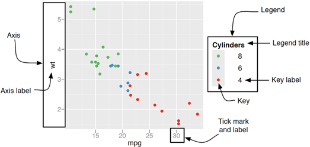
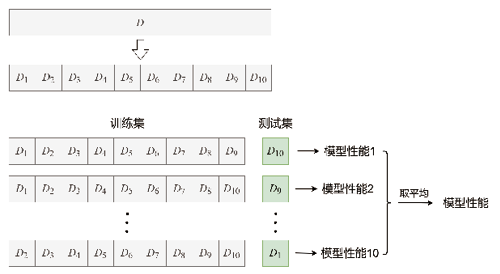

```{r setup, include=FALSE}
knitr::opts_chunk$set(
  echo = TRUE, collapse = TRUE, comment = "#>",
  fig.width = 8, fig.height = 4.2, fig.align = "center",
  warning = FALSE, message = FALSE
)

required_ch03 <- c("tidyverse", "patchwork", "broom", "modelr", "lubridate")
missing_ch03 <- required_ch03[
  !vapply(required_ch03, requireNamespace, logical(1), quietly = TRUE)
]
if (length(missing_ch03)) {
  stop("第 3 章缺少 R 包：", paste(missing_ch03, collapse = ", "))
}

library(tidyverse)
library(patchwork)
library(broom)
library(modelr)
library(lubridate)

source("../R/chinese-font.R")
chinese_font <- setup_course_chinese_font(quiet = TRUE)

theme_set(
  theme_minimal(base_family = chinese_font, base_size = 12) +
    theme(
      plot.title.position = "plot",
      legend.position = "bottom",
      panel.grid.minor = element_blank()
    )
)

load("../data/ch03/ecostats.rda")
load("../data/ch03/stocks.rda")
load("../data/ch03/gapminder.rda")

# 教材用于动态交互图的七大区域分类。
ecostats_interactive <- ecostats |>
  mutate(
    Area = case_when(
      Region %in% c("黑龙江", "吉林", "辽宁") ~ "东北",
      Region %in% c("北京", "天津", "河北", "山西", "内蒙古") ~ "华北",
      Region %in% c("河南", "湖北", "湖南") ~ "华中",
      Region %in% c("广东", "广西", "海南") ~ "华南",
      Region %in% c("陕西", "甘肃", "宁夏", "青海", "新疆") ~ "西北",
      Region %in% c("四川", "贵州", "云南", "重庆", "西藏") ~ "西南",
      TRUE ~ "华东"
    )
  )
```

class: title-slide, inverse, center, middle

# 第 3 章 · 可视化与建模技术

## 从图形语法到整洁的批量模型

### 王芝皓 · 统计与数据科学学院

---

class: inverse, center, middle

# 本章真正要学的是什么？

## 把图形与模型变成一条可复现的数据管道

<p class="big">看见模式 → 提出问题 → 建立模型 → 检查结果 → 清楚表达</p>

???
请学生回忆见过的“漂亮但看不懂”的图。问题通常不在颜色，而在没有明确回答什么问题。

---

# 学习目标

完成本章后，你能：

- 用图形语法解释一张 `ggplot2` 图
- 区分映射与设置、全局与局部映射
- 根据比较、关系、分布、时间和空间任务选图
- 用 `showtext_auto()`稳定渲染中文
- 用 `broom`整理系数、指标、拟合值与残差
- 用训练/测试集和交叉验证评估模型
- 用嵌套数据框与 `map()`批量建模

---

# 教材第 3 章路线图

<div class="chapter-map">
<div><b>3.1</b><span>ggplot2<br>基础语法</span></div>
<div><b>3.2</b><span>图形<br>示例</span></div>
<div><b>3.3</b><span>统计<br>建模技术</span></div>
</div>

<div class="callout" style="margin-top:1.2em">贯穿线索：图形与模型的输出都应当能继续进入 tidyverse 数据管道。</div>

---

# 先解决中文字体

<div class="font-flow">
<span>系统已有中文字体</span><b>›</b><span>sysfonts 注册</span><b>›</b><span>showtext_auto()</span><b>›</b><span>ggplot / PNG / PDF</span>
</div>

```{r slide-font-check, fig.width=7.2, fig.height=3.4}
ggplot(mpg, aes(displ, hwy, color = drv)) +
  geom_point(alpha = .65) +
  labs(
    title = "中文标题、坐标轴与图例检查",
    x = "发动机排量（升）", y = "高速燃油效率（mpg）",
    color = "驱动方式"
  )
```

---

# 课程项目中的字体设置

```{r slide-font-code, eval=FALSE}
source("../R/chinese-font.R")

# 自动寻找 macOS / Windows / Linux 已有中文字体，
# 注册为 course-cn，并调用 showtext_auto(enable = TRUE)。
chinese_font <- setup_course_chinese_font(quiet = FALSE)

# 让后续所有 ggplot 继承相同的中文字体。
theme_set(theme_minimal(base_family = chinese_font))
```

<div class="warning small">“屏幕能看见”不等于“导出一定正确”。课程交付前同时检查 HTML、PNG 和 PDF。</div>

---

class: inverse, center, middle

# 3.1 ggplot2 基础语法

## 用同一套语法逐层构造图形

---

# 图形语法：从数据到图

<div class="textbook-figure">

<p>教材图：数据、映射与几何对象是最基本的三个部件</p>
</div>

---

# 一张 ggplot 的十个部件

<div class="grammar-grid">
<div><b>data</b><span>画哪张表</span></div>
<div><b>mapping</b><span>变量控制什么</span></div>
<div><b>geom</b><span>点、线还是柱</span></div>
<div><b>scale</b><span>值怎样变成视觉</span></div>
<div><b>stat</b><span>先计算什么</span></div>
<div><b>coord</b><span>怎样投影</span></div>
<div><b>position</b><span>怎样处理重叠</span></div>
<div><b>facet</b><span>是否拆成小图</span></div>
<div><b>theme</b><span>怎样排版</span></div>
<div><b>output</b><span>怎样保存</span></div>
</div>

---

# 最小可运行模板

```{r slide-template, eval=FALSE}
ggplot(
  data = mpg,                         # 1. 选择整洁数据
  mapping = aes(x = displ, y = hwy)  # 2. 建立变量与位置的映射
) +
  geom_point(                         # 3. 使用点表达观测
    aes(color = drv),                 # 局部映射：颜色随 drv 改变
    alpha = 0.7                       # 常量设置：所有点同一透明度
  ) +
  labs(
    x = "发动机排量（升）",
    y = "高速燃油效率（mpg）",
    color = "驱动方式"
  )
```

<div class="callout small">加号表示继续添加图层，应放在上一行末尾。</div>

---

# 映射与设置：有没有图例？

```{r slide-map-set, fig.width=8, fig.height=3.5}
p_map <- ggplot(mpg, aes(displ, hwy, color = drv)) +
  geom_point() +
  labs(title = "aes(color = drv)：映射", color = "驱动")

p_set <- ggplot(mpg, aes(displ, hwy)) +
  geom_point(color = "#2d719b") +
  labs(title = "color = '#2d719b'：设置")

p_map | p_set
```

---

# 全局映射与局部映射

```{r slide-global-local, fig.width=8, fig.height=3.5}
p_group <- ggplot(mpg, aes(displ, hwy, color = drv)) +
  geom_point(alpha = .45) +
  geom_smooth(se = FALSE) +
  labs(title = "全局 color：分组拟合", color = "驱动")

p_overall <- ggplot(mpg, aes(displ, hwy)) +
  geom_point(aes(color = drv), alpha = .45) +
  geom_smooth(se = FALSE, color = "#b04a3f") +
  labs(title = "局部 color：整体拟合", color = "驱动")

p_group | p_overall
```

---

# 折线图必须知道“谁和谁相连”

```{r slide-group, fig.width=7.4, fig.height=3.8}
ecostats |>
  ggplot(aes(Year, gdpPercap)) +
  geom_line(
    aes(group = Region),              # 每个地区是一条独立轨迹
    color = "#2d719b", alpha = .18
  ) +
  geom_smooth(
    se = FALSE, color = "#d89512",    # 全部地区的总体趋势
    linewidth = 1.1
  ) +
  labs(x = "年份", y = "人均 GDP", title = "地区轨迹与总体趋势")
```

---

# 标度：坐标轴与图例的共同来源

<div class="textbook-figure compact">

<p>位置标度形成坐标轴；颜色、填充和大小标度通常形成图例</p>
</div>

---

# 标度控制标签、颜色和刻度

```{r slide-scales, fig.width=7.2, fig.height=3.6}
ggplot(mpg, aes(drv, fill = drv)) +
  geom_bar(width = .68) +
  scale_x_discrete(
    labels = c("4" = "四驱", "f" = "前驱", "r" = "后驱")
  ) +
  scale_fill_brewer(
    palette = "Dark2",
    labels = c("4" = "四驱", "f" = "前驱", "r" = "后驱")
  ) +
  labs(x = "驱动方式", y = "车型数量", fill = "驱动方式")
```

---

# 变焦还是删除数据？

```{r slide-coord-limits, fig.width=8, fig.height=3.5}
p <- ggplot(mpg, aes(displ, hwy)) +
  geom_point(alpha = .4) +
  geom_smooth(se = FALSE, color = "#b04a3f")

(p + coord_cartesian(xlim = c(4, 6), ylim = c(15, 35)) +
   labs(title = "coord_cartesian：只放大")) |
  (p + scale_x_continuous(limits = c(4, 6)) +
   labs(title = "scale limits：先删数据"))
```

<div class="warning tiny">若只是观察局部，优先使用 coord_cartesian()；删除数据可能改变拟合结果。</div>

---

# 对数标度：让数量级可以比较

```{r slide-log, fig.width=7.3, fig.height=3.7}
gapminder |>
  filter(year == 2007) |>
  ggplot(aes(gdpPercap, lifeExp, color = continent, size = pop)) +
  geom_point(alpha = .68) +
  scale_x_log10() +
  scale_size(range = c(1.5, 8), guide = "none") +
  labs(
    x = "人均 GDP（对数标度）", y = "预期寿命",
    color = "洲", title = "收入与预期寿命"
  )
```

---

# 统计变换：图层可能先做计算

| 图层 | 默认统计变换 | 得到什么 |
|---|---|---|
| `geom_bar()` | `stat_count()` | 每类频数 |
| `geom_histogram()` | `stat_bin()` | 每个区间频数 |
| `geom_boxplot()` | `stat_boxplot()` | 分位数与异常点 |
| `geom_smooth()` | `stat_smooth()` | 拟合值与区间 |

```{r slide-stat, fig.width=7.2, fig.height=2.5}
ggplot(mpg, aes(class, hwy)) +
  geom_violin(fill = "#b9ded8", color = "#168f84") +
  stat_summary(fun = mean, geom = "point", color = "#b04a3f", size = 2.5) +
  labs(x = "车型", y = "高速燃油效率（mpg）")
```

---

# 位置调整与坐标系回答不同问题

```{r slide-position-coord, fig.width=8, fig.height=3.5}
p_flip <- ggplot(mpg, aes(class, hwy)) +
  geom_boxplot(fill = "#b9ded8") +
  coord_flip() +
  labs(title = "coord_flip：水平比较")

p_dodge <- ggplot(mpg, aes(class, fill = drv)) +
  geom_bar(position = "dodge") +
  labs(title = "position_dodge：并排比较", fill = "驱动")

p_flip | p_dodge
```

---

# 分面：同一语法下的小多图

```{r slide-facet, fig.width=7.6, fig.height=3.6}
ggplot(mpg, aes(displ, hwy)) +
  geom_point(color = "#2d719b", alpha = .58) +
  geom_smooth(se = FALSE, color = "#d89512", linewidth = .8) +
  facet_wrap(vars(drv), nrow = 1) +
  labs(x = "发动机排量（升）", y = "高速燃油效率（mpg）")
```

<div class="callout tiny">分面共享一套语法并强调可比较性；拼图工具适合组合彼此独立的图。</div>

---

# 主题不改变数据含义

.pull-left[

### 主题控制

- 字体与字号
- 网格与背景
- 图例位置
- 标题对齐
- 边距与留白

]

.pull-right[

```{r slide-theme, eval=FALSE}
p +
  theme_bw(base_family = chinese_font) +
  theme(
    legend.position = "top",
    panel.grid.minor = element_blank()
  )
```

]

<div class="warning small">主题不能把错误的图形选择变正确，也不应掩盖异常值或不确定性。</div>

---

# 输出：尺寸先于分辨率

```{r slide-save, eval=FALSE}
p <- last_plot()

# 位图：适合网页和一般文档。
ggsave(
  "output/figure.png", plot = p,
  width = 8, height = 5, units = "in", dpi = 300
)

# 矢量 PDF：文字和线条可缩放；用 cairo 检查中文。
ggsave(
  "output/figure.pdf", plot = p,
  width = 8, height = 5, device = cairo_pdf
)
```

<div class="callout small">明确传入 plot = p，避免保存错图；导出后必须实际打开检查。</div>

---

class: inverse, center, middle

# 3.2 ggplot2 图形示例

## 从“想画什么”转向“要回答什么”

---

# 选图的四个判断

<div class="decision-flow four-step">
<div><b>1</b><span>明确分析问题</span></div>
<div><b>2</b><span>识别变量类型</span></div>
<div><b>3</b><span>选择视觉通道</span></div>
<div><b>4</b><span>确认静态是否足够</span></div>
</div>

<div class="chart-tasks">
<span>类别比较</span><span>数据关系</span><span>分布</span><span>时间</span><span>局部整体</span><span>空间</span><span>动态交互</span>
</div>

---

# 类别比较：先比较位置与长度

<div class="gallery-layout">

<div>
<h3>常见选择</h3>
<ul>
<li>条形图：类别少、精确比较</li>
<li>点图/棒棒糖：减少墨水</li>
<li>哑铃/坡度图：强调变化</li>
<li>热图：两个类别维度</li>
</ul>
</div>
</div>

---

# 热图：二维类别组合

```{r slide-heatmap, fig.width=7.2, fig.height=3.8}
heat_df <- mpg |>
  count(class, drv, name = "车型数", .drop = FALSE)

ggplot(heat_df, aes(drv, class, fill = 车型数)) +
  geom_tile(color = "white", linewidth = .7) +
  geom_text(aes(label = 车型数), family = chinese_font, size = 3.3) +
  scale_fill_gradient(low = "#e7f3f1", high = "#11796f") +
  labs(x = "驱动方式", y = "车型", fill = "车型数", title = "车型 × 驱动方式") +
  theme(panel.grid = element_blank())
```

---

# 数据关系：散点还是网络？

<div class="gallery-layout">

<div>
<h3>先看数据结构</h3>
<ul>
<li>连续变量对：散点图</li>
<li>多个变量：相关矩阵/平行坐标</li>
<li>节点 + 边：网络图</li>
</ul>
<p class="tiny muted">第三、第四变量可映射到颜色与大小，但视觉通道越多，解释成本越高。</p>
</div>
</div>

---

# 分布：中心、离散、形状与异常值

<div class="gallery-layout">

<div>
<h3>一图一个重点</h3>
<ul>
<li>直方图：分箱后的频数</li>
<li>密度图：平滑后的形状</li>
<li>箱线图：分位数与异常值</li>
<li>小提琴图：组间形状</li>
<li>人口金字塔：左右构成</li>
</ul>
</div>
</div>

---

# 人口金字塔：镜像条形图

```{r slide-pyramid, fig.width=7, fig.height=4.2}
population_long <- read_csv(
  "../data/ch03/hljPops.csv", show_col_types = FALSE
) |>
  pivot_longer(c(男, 女), names_to = "性别", values_to = "人口") |>
  mutate(绘图人口 = if_else(性别 == "男", -人口, 人口))

ggplot(population_long, aes(Age, 绘图人口, fill = 性别)) +
  geom_col(width = .86) +
  coord_flip() +
  scale_y_continuous(labels = function(x) abs(x)) +
  scale_fill_manual(values = c("男" = "#2d719b", "女" = "#d86d8c")) +
  labs(x = "年龄组", y = "人口", fill = "性别", title = "人口金字塔")
```

---

# 时间序列：顺序不能打乱

<div class="gallery-layout">

<div>
<h3>折线是默认起点</h3>
<ul>
<li>时间置于横轴并排序</li>
<li>折线看变化方向</li>
<li>面积强调总量</li>
<li>多个系列需明确 group</li>
</ul>
</div>
</div>

---

# 同一时间序列的两种表达

```{r slide-time, fig.width=8, fig.height=3.5}
economics_recent <- economics |>
  filter(date >= as.Date("2000-01-01"))

p_line <- ggplot(economics_recent, aes(date, unemploy / 1000)) +
  geom_line(color = "#2d719b", linewidth = .75) +
  labs(title = "折线：变化方向", x = NULL, y = "失业人数（百万）")

p_area <- ggplot(economics_recent, aes(date, unemploy / 1000)) +
  geom_area(fill = "#76b7b2", alpha = .72) +
  labs(title = "面积：总量", x = NULL, y = "失业人数（百万）")

p_line | p_area
```

---

# 局部—整体：饼图并非总是最优

<div class="gallery-layout">

<div>
<h3>饼图适合</h3>
<ul>
<li>类别很少</li>
<li>差异明显</li>
<li>只需粗略看构成</li>
</ul>
<p class="tiny muted">精确比较时，按占比排序的条形图通常更易读。</p>
</div>
</div>

---

# 饼图与排序条形图

```{r slide-pie-bar, fig.width=8, fig.height=3.6}
class_share <- mpg |>
  count(class, name = "车型数") |>
  mutate(占比 = 车型数 / sum(车型数)) |>
  mutate(class = forcats::fct_reorder(class, 占比))

p_pie <- ggplot(class_share, aes("", 占比, fill = class)) +
  geom_col(width = 1) + coord_polar(theta = "y") +
  labs(title = "构成", fill = "车型") + theme_void(base_family = chinese_font)

p_bar <- ggplot(class_share, aes(占比, class)) +
  geom_col(fill = "#2d719b") +
  scale_x_continuous(labels = scales::label_percent()) +
  labs(title = "比较", x = "占比", y = NULL)

p_pie | p_bar
```

---

# 地理空间图

- 地理空间图把数据与经度、纬度等位置信息联系起来。
- 简单要素（Simple Features）用点、线、多边形及其集合表示地理矢量数据。
- `sf` 数据框的属性存放在普通列中，空间几何存放在 `geometry` 列中。
- 有了 `sf` 对象，可以使用 `geom_sf()` 和 `coord_sf()` 绘制地图。

---

# 动态交互图：plotly

```{r slide-interactive-result, fig.width=7.5, fig.height=4}
ecostats_interactive |>
  filter(Year == 2017) |>
  ggplot(aes(Consumption, Investment, color = Area)) +
  geom_point() +
  theme_bw()
```

---

# 教材中的交互转换

```{r slide-interactive, eval=FALSE}
# 加载 plotly 包。
library(plotly)

# 先生成教材中的 2017 年静态散点图。
p <- ecostats_interactive |>
  filter(Year == 2017) |>
  ggplot(aes(Consumption, Investment, color = Area)) +
  geom_point() +
  theme_bw()

# 把 ggplot 对象转换为动态可交互图形。
ggplotly(p)
```

<div class="callout tiny">`ggplotly()` 是教材给出的实现：鼠标移动到图形元素上时会显示对应数值。</div>

---

class: inverse, center, middle

# 3.3 统计建模技术

## 模型结果也应该是整洁数据

---

# 从图形问题到模型问题

<div class="model-pipeline">
<span>准备数据</span><b>›</b><span>探索图形</span><b>›</b><span>拟合模型</span><b>›</b><span>整理输出</span><b>›</b><span>评估诊断</span><b>›</b><span>沟通结果</span>
</div>

<div class="callout" style="margin-top:1em">模型不是 print(summary(model)) 后的终点，而是数据分析工作流中的一个对象。</div>

---

# broom 的三个视角

<div class="broom-grid">
<div><b>tidy()</b><span>每个系数一行</span><small>估计值、标准误、区间、p 值</small></div>
<div><b>glance()</b><span>每个模型一行</span><small>R²、AIC、样本量、sigma</small></div>
<div><b>augment()</b><span>每个观测一行</span><small>拟合值、残差、影响度</small></div>
</div>

---

# tidy + glance：模型输出回到表格

```{r slide-broom}
mt_model <- lm(mpg ~ wt, data = mtcars)

# 每个模型项一行。
tidy(mt_model, conf.int = TRUE)

# 整个模型一行。
glance(mt_model) |>
  select(r.squared, adj.r.squared, sigma, AIC, nobs)
```

---

# augment：拟合值与残差可视化

```{r slide-augment, fig.width=8, fig.height=3.5}
mt_aug <- augment(mt_model, data = mtcars)

p_fit <- ggplot(mt_aug, aes(wt, mpg)) +
  geom_point(color = "#2d719b") +
  geom_line(aes(y = .fitted), color = "#b04a3f") +
  labs(title = "拟合关系", x = "车重", y = "燃油效率")

p_resid <- ggplot(mt_aug, aes(.fitted, .resid)) +
  geom_hline(yintercept = 0, color = "grey55") +
  geom_point(color = "#d89512") +
  labs(title = "残差诊断", x = "拟合值", y = "残差")

p_fit | p_resid
```

---

# 训练集与测试集的职责

<div class="train-test">
<div class="all-data">全部数据</div>
<div class="arrow-down">↓ 随机划分</div>
<div class="split"><span><b>训练集</b><small>估计参数、选择模型</small></span><span><b>测试集</b><small>模拟新数据表现</small></span></div>
</div>

<div class="warning small">必须先划分，再建模。看过测试结果后反复调参，会让测试误差过于乐观。</div>

---

# modelr：划分、拟合与评价

```{r slide-train-test}
set.seed(20230824)
split_mpg <- resample_partition(mtcars, c(train = .8, test = .2))

train_data <- as_tibble(split_mpg$train)
test_data  <- as_tibble(split_mpg$test)

# 只在训练集拟合。
train_model <- lm(mpg ~ wt + hp, data = train_data)

tibble(
  metric = c("RMSE", "MAE", "R²"),
  value = c(
    rmse(train_model, test_data),
    mae(train_model, test_data),
    rsquare(train_model, test_data)
  )
)
```

---

# 10 折交叉验证

<div class="textbook-figure compact cv-figure">

<p>每一轮用不同的一折验证，其余九折训练；最后汇总十次误差</p>
</div>

---

# 交叉验证也是 map 工作流

```{r slide-cv}
set.seed(20230824)
cv10 <- crossv_kfold(mtcars, k = 10)

cv_result <- cv10 |>
  mutate(
    model = map(train, function(s) lm(mpg ~ wt + hp, data = s)),
    rmse = map2_dbl(model, test, rmse)
  )

cv_result |>
  summarise(
    平均RMSE = mean(rmse),
    标准差 = sd(rmse),
    最小值 = min(rmse),
    最大值 = max(rmse)
  )
```

---

# 为什么要批量建模？

<div class="two">
<div class="warning">
<b>复制粘贴 31 次 lm()</b>
<ul class="small">
<li>容易漏改地区名</li>
<li>结果难以汇总</li>
<li>公式变动要改 31 次</li>
</ul>
</div>
<div class="callout">
<b>一个公式 + 一次 map()</b>
<ul class="small">
<li>规则只写一次</li>
<li>每组结构一致</li>
<li>结果可直接画图</li>
</ul>
</div>
</div>

---

# 嵌套数据框：每组数据放进一个单元格

<div class="textbook-figure compact nested-figure">

<p>列表列可以保存数据框、模型对象和整理后的结果</p>
</div>

---

# group_nest + map：三步批量建模

```{r slide-nested-code}
region_models <- ecostats |>
  group_nest(Region) |>                   # 1. 每个地区一行
  mutate(
    model = map(                         # 2. 每组拟合同一公式
      data,
      function(df) lm(Consumption ~ gdpPercap, data = df)
    ),
    coefficients = map(                  # 3. 每个模型整理成表
      model,
      function(fit) tidy(fit, conf.int = TRUE)
    ),
    fit_stats = map(model, glance)
  )
```

---

# unnest：把模型结果展开

```{r slide-unnest}
region_slopes <- region_models |>
  select(Region, coefficients) |>
  unnest(coefficients) |>
  filter(term == "gdpPercap") |>
  arrange(estimate)

region_slopes |>
  select(Region, estimate, conf.low, conf.high) |>
  slice_head(n = 6)
```

<div class="callout small">一个模型一行适合比较拟合指标；一个系数一行适合比较效应估计。</div>

---

# 批量模型最终要回答问题

```{r slide-slopes, fig.width=7.2, fig.height=4.3}
ggplot(region_slopes,
       aes(estimate, forcats::fct_reorder(Region, estimate))) +
  geom_vline(xintercept = 0, color = "grey65") +
  geom_errorbar(
    aes(xmin = conf.low, xmax = conf.high),
    orientation = "y", width = .2, color = "#76b7b2"
  ) +
  geom_point(color = "#b04a3f", size = 2) +
  labs(
    x = "人均 GDP 系数", y = "地区",
    title = "各地区消费—人均 GDP 回归斜率"
  )
```

---

# 滚动回归：固定窗口沿时间移动

<div class="rolling-strip">
<span class="dim">t−4</span><span class="active">t−2</span><span class="active">t−1</span><span class="focus">t</span><span class="active">t+1</span><span class="active">t+2</span><span class="dim">t+4</span>
<b>每个位置拟合一次 Amazon ~ Google</b>
</div>

<div class="two small">
<div class="callout"><b>短窗口</b><br>更灵敏，但系数更不稳定</div>
<div class="warning"><b>长窗口</b><br>更平滑，但可能掩盖局部变化</div>
</div>

---

# slider：把窗口交给建模函数

```{r slide-rolling-code, eval=FALSE}
stocks_wide <- stocks |>
  pivot_wider(names_from = Stock, values_from = Close) |>
  arrange(Date)

# 前 2 天 + 当天 + 后 2 天，共 5 个交易日。
rolling_fit <- slider::slide(
  stocks_wide,
  .f = function(window) lm(Amazon ~ Google, data = window),
  .before = 2,
  .after = 2,
  .complete = TRUE
)
```

<div class="warning tiny">slider 是扩展示例；未安装时不影响本章主体编译。</div>

---

# 建模工作流的检查点

<div class="check-grid">
<div><b>数据</b><span>观测单位、缺失值、异常值是否明确？</span></div>
<div><b>模型</b><span>公式是否对应研究问题？</span></div>
<div><b>评估</b><span>测试数据是否真正独立？</span></div>
<div><b>诊断</b><span>残差、非线性和影响点如何？</span></div>
<div><b>不确定性</b><span>是否报告区间而非只报点估计？</span></div>
<div><b>表达</b><span>图表能否让读者复核结论？</span></div>
</div>

---

# 课堂练习：从图到模型

1. 用 `mpg`比较三种驱动方式的 `hwy`分布：箱线图 + 抖动点。
2. 用 `gapminder`的 2007 年数据比较普通横轴与对数横轴。
3. 对 `mtcars`运行 5 折交叉验证；更换随机种子并比较 RMSE。
4. 按地区拟合 `Investment ~ gdpPercap`，整理斜率与调整后 R²。
5. 导出一张含中文标题、图例和标注的 PNG 与 PDF，并逐项检查。

---

# 本章小结

- `ggplot2`用可组合部件表达图形，而不是为每种图记一套语法
- 选图从分析问题和变量类型出发，静态图应当先成立
- `showtext_auto()`让中文在屏幕、PNG 与 PDF 中稳定渲染
- `broom`把模型系数、指标、拟合值和残差整理成数据
- 训练/测试划分与交叉验证用于评估泛化能力
- 嵌套数据框 + `map()`把重复建模变成函数式工作流

---

class: inverse, center, middle

# 从“画一张图”到“完成一次分析”

## 问题清楚 · 代码可读 · 中文可见 · 结果可验证
