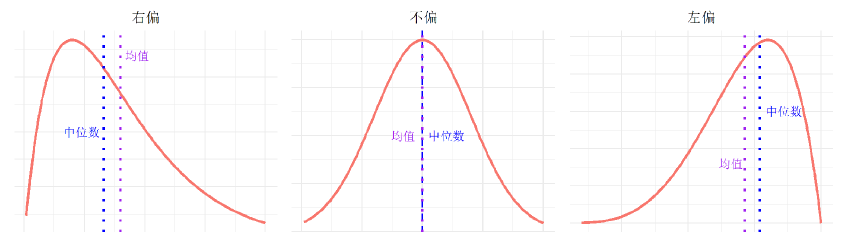
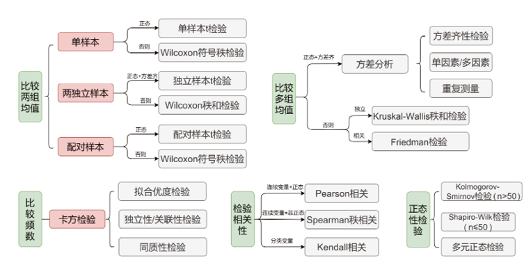
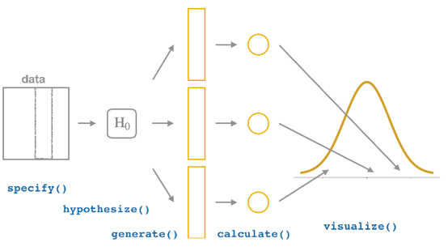
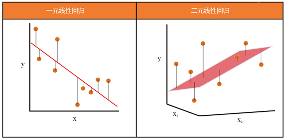
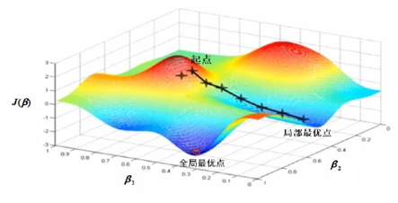

```{r setup, include=FALSE}
knitr::opts_chunk$set(
  echo = TRUE, collapse = TRUE, comment = "#>",
  fig.width = 7.7, fig.height = 4.0, fig.align = "center",
  warning = FALSE, message = FALSE
)

required_ch04 <- c(
  "tidyverse", "rstatix", "infer", "readxl", "car",
  "modelr", "lmtest", "broom", "patchwork"
)
missing_ch04 <- required_ch04[
  !vapply(required_ch04, requireNamespace, logical(1), quietly = TRUE)
]
if (length(missing_ch04)) {
  stop("第 4 章缺少 R 包：", paste(missing_ch04, collapse = ", "))
}

library(tidyverse)
library(rstatix)
library(infer)
library(readxl)
library(modelr)
library(broom)
library(patchwork)

source("../R/chinese-font.R")
chinese_font <- setup_course_chinese_font(quiet = TRUE)
theme_set(
  theme_minimal(base_family = chinese_font, base_size = 12) +
    theme(
      plot.title.position = "plot",
      legend.position = "bottom",
      panel.grid.minor = element_blank()
    )
)
```

class: title-slide, inverse, center, middle

# 第 4 章 · 应用统计

## 描述、估计、检验与回归

### 王芝皓 · 统计与数据科学学院

---

# 学习目标

完成本章后，你能：

- 选择统计量和统计图描述样本
- 用标准误与 Bootstrap 构造置信区间
- 解释最小二乘估计与最大似然估计
- 区分假设检验的两类错误，理解检验功效
- 完成方差分析、卡方检验与重排检验
- 建立、诊断、改进并预测多元线性回归模型
- 理解梯度下降法的更新过程

---

# 教材第 4 章路线图

<div class="chapter-map four-chapters">
<div><b>4.1</b><span>描述性统计</span></div>
<div><b>4.2</b><span>参数估计</span></div>
<div><b>4.3</b><span>假设检验</span></div>
<div><b>4.4</b><span>回归分析</span></div>
</div>

<div class="callout" style="margin-top:1.3em">核心链条：先看清样本，再由样本推断总体，最后用模型解释与预测。</div>

---

# 五个基本概念

<div class="concept-grid">
<div><b>随机变量</b><span>随机现象可能结果的数值表示</span></div>
<div><b>概率分布</b><span>随机变量表现出的规律性</span></div>
<div><b>总体</b><span>研究对象的全部数据</span></div>
<div><b>样本</b><span>从总体中抽取的一部分数据</span></div>
<div><b>参数 / 统计量</b><span>总体特征 / 样本计算结果</span></div>
</div>

---

# 同一种分布，不同参数

```{r slide-normal-distribution}
# 生成横坐标，并分别计算四组正态概率密度。
tibble(
  x = seq(-4, 4, length.out = 100),
  `μ=0, σ=0.5` = dnorm(x, 0, 0.5),
  `μ=0, σ=1` = dnorm(x, 0, 1),
  `μ=0, σ=2` = dnorm(x, 0, 2),
  `μ=-2, σ=1` = dnorm(x, -2, 1)
) |>
  # 转成长表，使参数组合映射为曲线颜色。
  pivot_longer(-x, names_to = "参数", values_to = "概率密度") |>
  ggplot(aes(x, 概率密度, color = 参数)) +
  geom_line(linewidth = 0.9)
```

---

# 统计方法从识别数据类型开始

<div class="textbook-figure">

<p>教材图 4.2：常见的数据类型</p>
</div>

---

class: inverse, center, middle

# 4.1 描述性统计

## 用统计量和统计图概括样本

---

# 位置、分散程度与形状

| 目的 | 统计量 | R 函数 |
|---|---|---|
| 中心位置 | 均值、中位数、众数 | `mean()`、`median()`、`get_mode()` |
| 相对位置 | 分位数 | `quantile()` |
| 分散程度 | 极差、四分位距 | `max()-min()`、`IQR()` |
| 分散程度 | 方差、标准差、变异系数 | `var()`、`sd()`、`100*sd()/mean()` |
| 分布形状 | 偏度、峰度 | `skewness()`、`kurtosis()` |

<div class="warning small">均值容易受极端值影响；中位数和四分位距对极端值更稳健。</div>

---

# 偏度：尾巴拖向哪一侧？

<div class="textbook-figure compact">

<p>教材图 4.3：负偏、对称与正偏分布</p>
</div>

---

# 一次汇总多个变量

```{r slide-summary-stats}
iris |>
  # 按鸢尾花种类分组。
  group_by(Species) |>
  # full 返回样本量、均值、中位数、标准差、分位数等完整统计量。
  get_summary_stats(type = "full") |>
  # 幻灯片只展示前 6 行，避免输出拥挤。
  slice_head(n = 6) |>
  select(Species, variable, n, mean, median, sd, min, max)
```

---

# 分类数据：先汇总，再画图

```{r slide-bar-plot, fig.height=3.7}
skin_summary <- starwars |>
  # 只保留出现频数最高的五类，其余合并为 Other。
  mutate(skin_color = fct_lump(skin_color, n = 5)) |>
  count(skin_color, sort = TRUE) |>
  # 将频数转换为占比。
  mutate(p = n / sum(n))

ggplot(skin_summary, aes(fct_reorder(skin_color, p), p)) +
  # 数据已经汇总，因此使用 geom_col()。
  geom_col(fill = "steelblue") +
  scale_y_continuous(labels = scales::label_percent()) +
  labs(x = "皮肤颜色", y = "占比") +
  coord_flip()
```

---

# 连续数据：直方图与密度

```{r slide-histogram, fig.height=3.7}
set.seed(123)
height_data <- tibble(
  # 按教材参数模拟 10,000 个身高数据。
  heights = rnorm(10000, 170, 2.5)
)

ggplot(height_data, aes(heights)) +
  geom_histogram(fill = "steelblue", color = "black", binwidth = 0.5) +
  # 密度乘以“组距 × 样本量”，才能叠加到频数直方图上。
  stat_function(
    fun = function(x) dnorm(x, 170, 2.5) * 0.5 * 10000,
    color = "red", linewidth = 0.9
  ) +
  labs(x = "身高", y = "频数")
```

---

# 连续变量分组比较：箱线图

```{r slide-boxplot, fig.height=3.7}
ggplot(mpg, aes(drv, hwy)) +
  # x 是驱动方式，y 是高速燃油效率。
  geom_boxplot(fill = "#76b7b2", alpha = 0.72) +
  labs(x = "驱动方式", y = "高速燃油效率")
```

<div class="callout small">箱体：$Q_1$ 到 $Q_3$；箱内横线：中位数；箱外点：按箱线图规则识别的异常值。</div>

---

# 列联表：分类变量之间的关系

```{r slide-contingency, eval=FALSE}
library(janitor)

mpg |>
  # 统计 drv × cyl 的二维频数表。
  tabyl(drv, cyl) |>
  # 在每一列内部计算百分比。
  adorn_percentages("col") |>
  # 把小数格式化为百分数字符。
  adorn_pct_formatting(digits = 2) |>
  # 在百分比后附加原始频数。
  adorn_ns()
```

<div class="warning small">理论频数过小时，卡方近似可能不可靠，需要合并单元格、校正或使用 Fisher 精确检验。</div>

---

class: inverse, center, middle

# 4.2 参数估计

## 点估计、区间估计与估计准则

---

# 点估计与区间估计

<div class="two">
<div class="card"><h3>点估计</h3><p>用一个样本统计量估计总体参数。</p><p class="big center">$\bar{x}\rightarrow\mu$</p></div>
<div class="card"><h3>区间估计</h3><p>给出可能包含总体参数的范围。</p><p class="big center">估计值 $\pm$ 临界值 $\times SE$</p></div>
</div>

<div class="callout">置信水平越高，区间越宽；样本量越大，标准误越小，区间越窄。</div>

---

# 用标准误构造 95% 置信区间

```{r slide-standard-error-ci}
# 教材中的 20 名学生身高样本。
height_sample <- tibble(height = c(
  167,155,166,161,168,163,179,164,178,156,
  161,163,168,163,163,169,162,174,172,172
))

# 样本均值作为点估计；样本标准差除以 sqrt(n) 得到标准误。
mu_hat <- mean(height_sample$height)
se_hat <- sd(height_sample$height) / sqrt(nrow(height_sample))

# 双侧 95% 区间使用标准正态分位数 qnorm(0.975)。
ci <- mu_hat + c(-1, 1) * qnorm(0.975) * se_hat
tibble(点估计 = mu_hat, 下限 = ci[1], 上限 = ci[2])
```

---

# Bootstrap：让样本模拟重复抽样

<div class="textbook-figure compact">

<p>教材图 4.9：specify → generate → calculate → get_ci / visualize</p>
</div>

---

# Bootstrap 置信区间

```{r slide-bootstrap}
set.seed(123)

boot_means <- height_sample |>
  # 指定研究变量。
  specify(response = height) |>
  # 有放回地生成 1,000 个重抽样样本。
  generate(reps = 1000, type = "bootstrap") |>
  # 每个样本计算一次均值。
  calculate(stat = "mean")

# 用 Bootstrap 均值分布的两个分位数构造区间。
boot_ci <- boot_means |>
  get_ci(level = 0.95, type = "percentile")
boot_ci
```

---

# Bootstrap 结果要“看见”

```{r slide-bootstrap-plot, echo=FALSE, fig.height=4.2}
visualize(boot_means) +
  # 标出 95% 置信区间端点之间的区域。
  shade_ci(endpoints = boot_ci)
```

---

# 最小二乘：让残差平方和最小

$$
(\hat\beta_0,\hat\beta_1)=\arg\min_{\beta_0,\beta_1}
\sum_{i=1}^{n}[y_i-(\beta_0+\beta_1x_i)]^2
$$

```{r slide-sales-ols, fig.height=3.2}
sales <- tibble(
  cost = c(30,40,40,50,60,70,70,70,80,90),
  sale = c(143.5,192.2,204.7,266,318.2,457,333.8,312.1,386.4,503.9)
)

# lm() 按最小二乘准则估计截距和斜率。
sales_model <- lm(sale ~ cost, data = sales)

ggplot(sales, aes(cost, sale)) +
  geom_point() +
  # se = FALSE 只绘制拟合直线，不绘制置信带。
  geom_smooth(method = "lm", se = FALSE) +
  labs(x = "广告费用", y = "销售额")
```

---

# 非线性最小二乘：Logistic 曲线

```{r slide-logistic, fig.height=3.7}
box_office <- read_xlsx("../data/ch04/历年累计票房.xlsx") |>
  # 让 2003 年成为第 1 年。
  mutate(年份 = 年份 - 2002)

# 先用 Logit 变换后的线性回归给 nls() 提供初值。
initial_fit <- lm(car::logit(累计票房 / 800) ~ 年份, data = box_office)
logistic_fit <- nls(
  累计票房 ~ phi1 / (1 + exp(-(phi2 + phi3 * 年份))),
  data = box_office,
  start = list(phi1 = 800, phi2 = coef(initial_fit)[1], phi3 = coef(initial_fit)[2])
)

# 在原始散点上直接显示模型拟合曲线。
ggplot(box_office, aes(年份, 累计票房)) +
  geom_point(color = "red") +
  geom_line(aes(y = fitted(logistic_fit)), color = "steelblue", linewidth = 1.1)
```

---

# 最大似然：哪组参数最支持当前样本？

$$
\ell(\theta)=\sum_{i=1}^{n}\log f(x_i\mid\theta),\qquad
\hat\theta=\arg\max_{\theta}\ell(\theta)
$$

```{r slide-maxlik, eval=FALSE}
library(maxLik)

# 10 次抛硬币出现 3 次正面时的对数似然（忽略常数项）。
loglik_bernoulli <- function(p) {
  3 * log(p) + 7 * log(1 - p)
}

# 从 p=0.5 出发寻找最大值；教材估计结果为 p=0.3。
coin_fit <- maxLik(loglik_bernoulli, start = 0.5)
coef(coin_fit)
```

---

class: inverse, center, middle

# 4.3 假设检验

## 在原假设下判断观察结果是否足够极端

---

# 双侧、左侧与右侧检验

<div class="textbook-figure compact">

<p>教材图 4.16：备择假设决定拒绝域位于哪一侧</p>
</div>

---

# P 值到底回答什么？

<div class="flow test-flow">
<span>提出 $H_0$</span><b>›</b>
<span>选择统计量</span><b>›</b>
<span>得到零分布</span><b>›</b>
<span>计算 P 值</span><b>›</b>
<span>作出判断</span>
</div>

<blockquote>在 $H_0$ 为真的条件下，观察到当前结果或更极端结果的概率。</blockquote>

<div class="warning small">P 值小：拒绝 $H_0$；P 值不小：只能说“不能拒绝 $H_0$”，不能证明 $H_0$ 正确。</div>

---

# 两类错误与检验功效

| 真实情况 | 不拒绝 $H_0$ | 拒绝 $H_0$ |
|---|---|---|
| $H_0$ 为真 | 正确 | Ⅰ型错误，概率 $\alpha$ |
| $H_1$ 为真 | Ⅱ型错误，概率 $\beta$ | 正确 |

<div class="callout center big">检验功效 $=1-\beta$</div>

教材通常要求功效不低于 80%；功效受到效应量、显著水平和样本量影响。

---

# 怎样选择检验方法？

<div class="textbook-figure">

<p>教材图 4.17：满足参数检验条件时优先使用参数检验</p>
</div>

---

# 双因素方差分析：先检查条件

```{r slide-anova-assumptions}
tooth_data <- ToothGrowth |>
  # dose 的三个取值作为实验因素水平，而不是连续数值。
  mutate(dose = factor(dose))

# H0：len 服从正态分布。
shapiro_test(tooth_data, len)

# H0：六个 supp × dose 组合的方差相等。
levene_test(tooth_data, len ~ supp * dose)
```

---

# 双因素方差分析：主效应与交互效应

```{r slide-anova}
# supp * dose 展开为两个主效应及一个交互效应。
anova_result <- anova_test(
  tooth_data,
  len ~ supp * dose
)
anova_result
```

```{r slide-tukey}
# 对显著的水平组合做 Tukey 多重比较并校正 P 值。
tukey_hsd(tooth_data, len ~ supp * dose) |>
  slice_head(n = 5)
```

---

# 卡方独立性检验

```{r slide-chisq, eval=FALSE}
titanic <- read_rds("../data/ch04/titanic.rds")
library(janitor)

# 构造“是否生存 × 船舱等级”二维列联表。
titanic_table <- titanic |>
  tabyl(Survived, Pclass)

# H0：是否生存与船舱等级相互独立。
rstatix::chisq_test(titanic$Survived, titanic$Pclass)
```

<div class="callout small">教材结果：$\chi^2=102.9$，$df=2$，$p&lt;0.001$，拒绝独立性原假设。</div>

---

# 重排检验：在零假设下打乱标签

<div class="textbook-figure compact">

<p>教材图 4.18：specify → hypothesize → generate → calculate</p>
</div>

---

# 爱情片与动作片评分是否相同？

```{r slide-permutation}
load("../data/ch04/movies_sample.rda")
set.seed(123)

null_distribution <- movies_sample |>
  specify(rating ~ genre) |>
  # 原假设：评分与电影类型相互独立。
  hypothesize(null = "independence") |>
  # 随机重排类型标签 1,000 次。
  generate(reps = 1000, type = "permute") |>
  # 每次计算 Romance 均值减去 Action 均值。
  calculate(stat = "diff in means", order = c("Romance", "Action"))

observed_difference <- tibble(stat = 1.047)
get_p_value(null_distribution, obs_stat = observed_difference, direction = "both")
```

---

# 重排零分布与双侧 P 值

```{r slide-permutation-plot, echo=FALSE, fig.height=4.2}
visualize(null_distribution, bins = 15) +
  # 阴影表示与观测均值差同样或更极端的区域。
  shade_p_value(obs_stat = observed_difference, direction = "both")
```

<div class="callout small">教材结果约为 $p=0.006$，拒绝两类电影平均评分相同的原假设。</div>

---

class: inverse, center, middle

# 4.4 回归分析

## 解释影响、检查假设并进行预测

---

# 从一条直线到一个超平面

<div class="two wide-right">
<div>
<p>一元线性回归：</p>
<p>$$y_i=\beta_0+\beta_1x_i+\varepsilon_i$$</p>
<p>多元线性回归：</p>
<p>$$\mathbf y=\mathbf X\boldsymbol\beta+\boldsymbol\varepsilon$$</p>
</div>
<div class="textbook-figure compact">

<p>教材图 4.20：寻找最接近样本点的超平面</p>
</div>
</div>

---

# 一个成功模型，残差应该“没故事”

<div class="textbook-figure">

<p>教材图 4.21：残差中的结构提示模型假设可能不成立</p>
</div>

---

# 企鹅数据：准备与探索

```{r slide-penguins-data}
penguins <- read_csv(
  "../data/ch04/penguins.csv",
  show_col_types = FALSE
) |>
  # species 是分类解释变量，明确转换为因子。
  mutate(species = factor(species))

glimpse(penguins)
```

```{r slide-penguins-histogram, echo=FALSE, fig.width=5.5, fig.height=2.4}
ggplot(penguins, aes(body_mass)) +
  geom_histogram(bins = 20, fill = "steelblue", color = "black") +
  labs(x = "体重", y = "频数")
```

---

# 完整模型、VIF 与逐步回归

```{r slide-penguins-model}
# 点号表示除 body_mass 外的全部变量进入完整模型。
mdl0 <- lm(body_mass ~ ., data = penguins)

# VIF 用于识别解释变量之间的多重共线性。
car::vif(mdl0)

# 从完整模型开始向后逐步剔除变量。
mdl1 <- step(mdl0, direction = "backward", trace = 0)

# 输出模型层面的评价指标。
glance(mdl1) |>
  select(r.squared, adj.r.squared, sigma, AIC, nobs)
```

---

# 模型系数也要整理成数据框

```{r slide-penguins-coefficients}
# tidy() 返回系数、标准误、t 统计量、P 值和置信区间。
tidy(mdl1, conf.int = TRUE) |>
  slice_head(n = 8)
```

```{r slide-penguins-rmse}
# 在教材训练数据上计算均方根误差。
rmse(mdl1, penguins)
```

---

# 分类变量如何进入回归模型？

```{r slide-dummy-variables}
# 不含截距：三个物种各生成一列 0-1 指示变量。
model_matrix(penguins, ~ species - 1) |>
  slice_head(n = 4)

# 含截距：以 Adelie 为参照，只保留其余两列。
model_matrix(penguins, ~ species) |>
  slice_head(n = 4)
```

<div class="callout small">含 $k$ 个水平的分类变量，在含截距模型中通常使用 $k-1$ 个虚拟变量。</div>

---

# 加入二次项和交互项改进模型

```{r slide-improved-model}
mdl2 <- lm(
  body_mass ~ species + sex * island +
    bill_length + I(bill_length^2) +
    bill_depth + I(bill_depth^2) +
    flipper_length + I(flipper_length^2),
  data = penguins
) |>
  # 从扩展模型开始向后筛选。
  step(direction = "backward", trace = 0)

# 比较两个嵌套模型：复杂模型是否带来显著改进？
anova(mdl1, mdl2)
```

---

# 回归诊断：三个正式检验

```{r slide-diagnostics}
# H0：残差服从正态分布。
shapiro.test(residuals(mdl2))

# H0：残差不存在一阶正自相关。
lmtest::dwtest(mdl2)

# H0：残差不存在异方差。
lmtest::bptest(mdl2)
```

---

# 回归诊断：图形不能省略

<div class="textbook-figure compact">

<p>教材图 4.23：残差、正态 Q-Q、影响点等诊断信息</p>
</div>

---

# 对新数据进行区间预测

```{r slide-prediction}
set.seed(123)

# 去掉因变量 body_mass，再随机抽取 5 行作为新数据。
new_penguins <- penguins[, -6] |>
  slice_sample(n = 5)

# confidence 返回条件均值的预测值和置信区间。
predict(
  mdl2,
  newdata = new_penguins,
  interval = "confidence"
)
```

---

# 梯度下降：沿负梯度方向更新

<div class="two wide-left">
<div class="textbook-figure compact">

<p>教材图 4.24：逐步走向损失函数最低点</p>
</div>
<div>
<p class="big">$$\boldsymbol\beta^{(t+1)}=\boldsymbol\beta^{(t)}-\eta\nabla J(\boldsymbol\beta^{(t)})$$</p>
<ul>
<li>$\eta$ 过大：可能越过最小值</li>
<li>$\eta$ 过小：收敛缓慢</li>
<li>变量量级差异大：先缩放</li>
</ul>
</div>
</div>

---

# 梯度下降函数：核心循环

```{r slide-gradient-function, eval=FALSE}
gd <- function(X, y, init, eta = 1e-3, err = 1e-3, maxit = 1000) {
  # 添加截距列，并用给定初值开始迭代。
  X <- cbind(Intercept = 1, X)
  beta <- init
  tol <- 1
  iter <- 1

  while (tol > err && iter < maxit) {
    # 计算预测值与残差平方和的梯度。
    linear_predictor <- X %*% beta
    gradient <- t(X) %*% (linear_predictor - y)

    # 沿负梯度方向更新参数，并检查最大参数变化。
    beta_new <- beta - eta * gradient
    tol <- max(abs(beta_new - beta))
    beta <- beta_new
    iter <- iter + 1
  }
  beta
}
```

---

# 线性回归还可以继续推广

<div class="three compact-cards">
<div class="card"><h3>Logistic 回归</h3><p>二分类因变量</p></div>
<div class="card"><h3>泊松回归</h3><p>计数型因变量</p></div>
<div class="card"><h3>负二项回归</h3><p>过度离散的计数数据</p></div>
</div>

```{r slide-glm, eval=FALSE}
# glm() 通过 family 指定因变量分布与连接函数。
glm(y ~ x1 + x2, data = dat, family = binomial())
```

<div class="callout">这些模型都属于广义线性模型；选择模型时必须考虑因变量的数据类型。</div>

---

# 本章小结

<div class="summary-grid">
<div><b>描述</b><span>统计量 · 统计图 · 列联表</span></div>
<div><b>估计</b><span>标准误 · Bootstrap · OLS · MLE</span></div>
<div><b>检验</b><span>P 值 · 功效 · ANOVA · 卡方 · 重排</span></div>
<div><b>回归</b><span>建模 · 诊断 · 改进 · 预测 · 梯度下降</span></div>
</div>

<div class="warning" style="margin-top:1em">统计方法不是函数清单。每次分析都要说明：变量类型、方法条件、结果含义和结论边界。</div>

---

class: inverse, center, middle

# 课堂练习

## 选一个教材示例，完整说出：问题 → 方法 → 条件 → 代码 → 结果 → 结论
