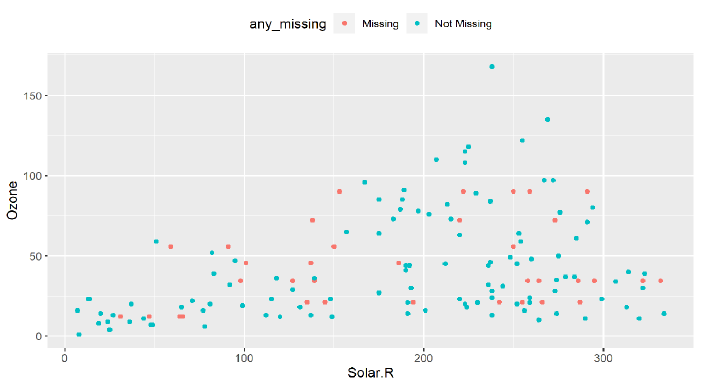

```{r setup, include=FALSE}
knitr::opts_chunk$set(
  echo = TRUE, collapse = TRUE, comment = "#>",
  fig.width = 7.7, fig.height = 3.8, fig.align = "center",
  warning = FALSE, message = FALSE
)

required_ch05 <- c("tidyverse", "naniar", "rstatix", "patchwork", "readxl")
missing_ch05 <- required_ch05[
  !vapply(required_ch05, requireNamespace, logical(1), quietly = TRUE)
]
if (length(missing_ch05)) {
  stop("第 5 章缺少 R 包：", paste(missing_ch05, collapse = ", "))
}

library(tidyverse)
library(naniar)
library(rstatix)
library(patchwork)
library(readxl)

source("../R/chinese-font.R")
chinese_font <- setup_course_chinese_font(quiet = TRUE)
theme_set(
  theme_minimal(base_family = chinese_font, base_size = 12) +
    theme(
      plot.title.position = "plot",
      legend.position = "bottom",
      panel.grid.minor = element_blank()
    )
)
```

class: title-slide, inverse, center, middle

# 第 5 章 · 探索性数据分析

## 数据清洗、特征工程与变量关系

### 王芝皓 · 统计与数据科学学院

---

class: inverse, center, middle

# EDA 是一个迭代循环

## 问题 → 可视化 / 变换 / 建模 → 结果 → 新问题

---

# 教材第 5 章路线图

<div class="chapter-map three-chapters">
<div><b>5.1</b><span>数据清洗<br>缺失值 · 异常值</span></div>
<div><b>5.2</b><span>特征工程<br>缩放 · 变换 · 降维</span></div>
<div><b>5.3</b><span>变量关系<br>分类 · 连续</span></div>
</div>

<div class="callout" style="margin-top:1.2em">教材主线：先提高数据质量，再构造适合分析的特征，最后按变量类型探索关系。</div>

---

# 学习目标

完成本章后，你能：

- 区分 MCAR、MAR 与 MNAR
- 统计、可视化并比较缺失数据
- 选择删除、单重插补、多重插补或时间序列插值
- 用单变量与多变量方法识别异常值
- 完成标准化、归一化、平滑、变换和主成分降维
- 根据变量类型选择图形、汇总统计量和检验方法

---

class: inverse, center, middle

# 5.1 数据清洗

## 缺失值与异常值会直接影响模型结果

---

# `NA` 会参与运算并传播

```{r slide-na-propagation}
# NA 参与一般数值计算，结果仍为 NA。
mean(c(1, 2, NA, 4))

# na.rm = TRUE 表示计算前移除缺失值。
mean(c(1, 2, NA, 4), na.rm = TRUE)
```

<div class="callout small">`NA` 占据元素位置但值未知；`NULL` 表示空对象，不占据向量中的元素位置。</div>

---

# 三种缺失模式

<div class="three compact-cards">
<div class="card"><h3>MCAR</h3><p>与自身和其他变量都无关</p></div>
<div class="card"><h3>MAR</h3><p>与自身无关，但与其他变量有关</p></div>
<div class="card"><h3>MNAR</h3><p>与变量自身有关</p></div>
</div>

```{r slide-mcar-test}
# Little's MCAR 检验的原假设：数据属于完全随机缺失。
mcar_test(airquality)
```

<div class="warning small">教材结果 $p\approx0.00142$：拒绝 MCAR 原假设。</div>

---

# 先看完整的缺失位置

```{r slide-vis-miss, echo=FALSE, fig.height=4.4}
# 深色单元格表示缺失，图中同时给出整体缺失比例。
vis_miss(airquality)
```

---

# 缺失值总体统计

```{r slide-missing-overview}
tibble(
  指标 = c("缺失值总数", "完整值总数", "含缺失行占比", "含缺失列占比"),
  结果 = c(
    n_miss(airquality),
    n_complete(airquality),
    prop_miss_case(airquality),
    prop_miss_var(airquality)
  )
)
```

---

# 按行与按列回答不同问题

```{r slide-missing-tables}
# 每行缺失几个值？有多少行属于这种情况？
miss_case_table(airquality)

# 哪些变量存在缺失？缺失比例是多少？
miss_var_summary(airquality)
```

---

# 每个变量缺失多少？

```{r slide-gg-miss-var, echo=FALSE, fig.height=4.4}
# Ozone 缺失 37 个，Solar.R 缺失 7 个。
gg_miss_var(airquality)
```

---

# 影子矩阵：把“是否缺失”变成变量

```{r slide-shadow-matrix}
# 为每个变量添加 _NA 结尾的缺失状态变量。
aq_shadow <- bind_shadow(airquality)

# 显示前 6 行，观察原始变量和影子变量如何对应。
aq_shadow |>
  slice_head(n = 6)
```

---

# 缺失组与非缺失组是否不同？

```{r slide-shadow-summary}
aq_shadow |>
  # 根据 Ozone 是否缺失分组。
  group_by(Ozone_NA) |>
  # 比较两组 Solar.R 的描述统计量。
  summarise(
    mean = mean(Solar.R, na.rm = TRUE),
    sd = sd(Solar.R, na.rm = TRUE),
    var = var(Solar.R, na.rm = TRUE),
    min = min(Solar.R, na.rm = TRUE),
    max = max(Solar.R, na.rm = TRUE),
    .groups = "drop"
  )
```

---

# 用分布图继续比较

```{r slide-shadow-density, fig.height=4.2}
aq_shadow |>
  ggplot(aes(Temp, color = Ozone_NA)) +
  # 分别绘制 Ozone 缺失与非缺失观测的温度密度。
  geom_density(linewidth = 1) +
  labs(x = "温度", y = "概率密度", color = "Ozone 是否缺失")
```

---

# 删除缺失值：必须检查损失了多少数据

```{r slide-drop-na}
# 删除任意变量存在缺失的观测。
airquality_complete <- airquality |>
  drop_na()

# 输出删除前后的行数。
tibble(
  数据 = c("原始数据", "删除缺失行后"),
  行数 = c(nrow(airquality), nrow(airquality_complete))
)
```

---

# 分组均值插补

```{r slide-mean-imputation}
aq_mean_imputed <- airquality |>
  group_by(Month) |>
  # 在每个月内部，用该月均值替换 Ozone 缺失值。
  mutate(Ozone = naniar::impute_mean(Ozone)) |>
  ungroup()

# 检查插补前后的缺失数。
tibble(
  数据 = c("插补前", "插补后"),
  Ozone缺失数 = c(
    sum(is.na(airquality$Ozone)),
    sum(is.na(aq_mean_imputed$Ozone))
  )
)
```

---

# 模型单重插补：教材接口

```{r slide-simputation, eval=FALSE}
library(simputation)

# 用 Solar.R、Wind、Temp 建立线性模型插补 Ozone，
# 并加入正态随机误差，避免所有插补值都落在回归线上。
impute_lm(
  airquality,
  Ozone ~ Solar.R + Wind + Temp,
  add_residual = "normal"
)

# 决策树插补使用相同的公式接口。
impute_cart(airquality, Ozone ~ Solar.R + Wind + Temp)
```

<div class="warning small">`simputation` 接受 `data.frame`；教材提醒，配合影子矩阵时 `as.data.frame()` 不能省略。</div>

---

# 决策树插补的结果反馈

<div class="textbook-figure compact">

<p>教材图 5.4：颜色区分原始观测和插补观测</p>
</div>

---

# 多重插补：生成多个完整数据集

```{r slide-mice, eval=FALSE}
library(mice)

aq_imp <- mice(
  airquality,
  # 生成 5 个数据副本，每个最多迭代 10 次。
  m = 5, maxit = 10,
  # 连续变量使用预测均值匹配。
  method = "pmm",
  seed = 1, print = FALSE
)

# 提取整合后的完整数据。
aq_dat <- mice::complete(aq_imp)
naniar::n_miss(aq_dat)
```

---

# 时间序列：样条插值

```{r slide-imputets, eval=FALSE}
library(imputeTS)

# 使用样条插值补齐 tsAirgap。
imp <- na_interpolation(tsAirgap, option = "spline")

# 与完整真实序列并列绘制，检查插补位置。
ggplot_na_imputations(tsAirgap, imp, tsAirgapComplete)
```

<div class="textbook-figure compact">

<p>教材图 5.5：红点为插补值，蓝点为完整数据中的真实值</p>
</div>

---

class: inverse, center, middle

# 异常值

## 先识别，再判断它是错误还是研究对象

---

# 单变量异常值的三种规则

| 方法 | 默认阈值 | 适用说明 |
|---|---|---|
| 标准差法 | $\bar{x}\pm3s$ | 数据近似正态 |
| 百分位数法 | 2.5% 与 97.5% | 直接按分位点截取 |
| 箱线图法 | $Q_1-1.5IQR$、$Q_3+1.5IQR$ | 不要求正态 |

---

# 教材自编异常值函数

```{r slide-univ-function}
univ_outliers <- function(x, method = "boxplot", k = NULL,
                          coef = NULL, lp = NULL, up = NULL) {
  switch(method,
    "sd" = {
      if (is.null(k)) k <- 3
      mu <- mean(x, na.rm = TRUE); sigma <- sd(x, na.rm = TRUE)
      LL <- mu - k * sigma; UL <- mu + k * sigma
    },
    "boxplot" = {
      if (is.null(coef)) coef <- 1.5
      Q1 <- quantile(x, .25, na.rm = TRUE); Q3 <- quantile(x, .75, na.rm = TRUE)
      LL <- Q1 - coef * (Q3 - Q1); UL <- Q3 + coef * (Q3 - Q1)
    },
    "percentiles" = {
      if (is.null(lp)) lp <- .025; if (is.null(up)) up <- .975
      LL <- quantile(x, lp, na.rm = TRUE); UL <- quantile(x, up, na.rm = TRUE)
    })
  idx <- which(x < LL | x > UL)
  list(outliers = x[idx], outlier_idx = idx, outlier_num = length(idx))
}
```

---

# 三种规则给出不同答案

```{r slide-univ-results}
x <- mpg$hwy

# 分别运行箱线图法、标准差法和百分位数法。
box_result <- univ_outliers(x)
sd_result <- univ_outliers(x, method = "sd")
pct_result <- univ_outliers(x, method = "percentiles")

tibble(
  方法 = c("箱线图法", "标准差法", "百分位数法"),
  异常值个数 = c(box_result$outlier_num, sd_result$outlier_num, pct_result$outlier_num),
  异常值 = c(toString(box_result$outliers), toString(sd_result$outliers),
             toString(pct_result$outliers))
)
```

---

# 多变量异常值：教材的四类方法

<div class="four-methods">
<div><b>LOF</b><span>比较局部密度</span></div>
<div><b>聚类</b><span>按异常概率排序</span></div>
<div><b>回归模型</b><span>检查学生化残差</span></div>
<div><b>随机森林</b><span>比较袋外预测误差</span></div>
</div>

```{r slide-model-outlier}
# 教材对 mtcars 的回归模型执行 Bonferroni 异常值检验。
model_outlier <- lm(mpg ~ wt, data = mtcars)
car::outlierTest(model_outlier)
```

---

# 随机森林异常值得分

```{r slide-outforest, eval=FALSE}
library(outForest)

# 在 iris 中生成异常值，再对多个连续变量检测异常。
iris_with_out <- generateOutliers(iris, p = 0.02, seed = 123)
out <- outForest(
  iris_with_out, . - Sepal.Length ~ .,
  max_n_outliers = 3, verbose = 0
)

outliers(out)              # 输出异常值表
plot(out, what = "scores") # 输出异常得分图
```

<div class="textbook-figure mini-result">

</div>

---

class: inverse, center, middle

# 5.2 特征工程

## 缩放、变换与降维

---

# 标准化：检查均值与标准差

```{r slide-scale}
x <- mpg$hwy

# 默认标准化：减去均值，再除以标准差。
standardized_x <- scale(x)

tibble(
  指标 = c("均值", "标准差"),
  结果 = c(mean(standardized_x), sd(standardized_x))
)
```

<div class="callout center">标准化后：均值约为 0，标准差约为 1。</div>

---

# 归一化到指定区间

```{r slide-rescale}
rescale <- function(x, type = "pos", a = 0, b = 1) {
  # 取得原数据范围。
  rng <- range(x, na.rm = TRUE)
  switch(type,
    "pos" = (b - a) * (x - rng[1]) / (rng[2] - rng[1]) + a,
    "neg" = (b - a) * (rng[2] - x) / (rng[2] - rng[1]) + a)
}

iris |>
  as_tibble() |>
  # 把全部数值列映射到 [0, 100]。
  mutate(across(where(is.numeric), rescale, b = 100)) |>
  slice_head(n = 5)
```

---

# 行规范化：每个样本长度变成 1

```{r slide-row-normalize}
iris_rows <- iris[1:3, -5] |>
  # 每次取一行，用这一行的 L2 范数除整行。
  pmap_dfr(~ {
    values <- c(...)
    values / norm(as.matrix(values), "2")
  })

iris_rows
```

---

# 数据平滑：五点移动平均

```{r slide-smoothing, eval=FALSE}
library(slider)

economics |>
  # 当前观测前后各取两个值，共五点计算均值。
  mutate(uempmed = slide_dbl(
    uempmed, mean, .before = 2, .after = 2
  )) |>
  ggplot(aes(date, uempmed)) +
  geom_line()
```

<div class="textbook-figure compact">

<p>教材图 5.7：原始序列与五点移动平均序列</p>
</div>

---

# 多项式特征

```{r slide-polynomial, eval=FALSE}
library(tidymodels)

recipe(hwy ~ displ + cty, data = mpg) |>
  # 为两个预测变量生成一次项和二次项。
  step_poly(
    all_predictors(), degree = 2,
    options = list(raw = TRUE)
  ) |>
  prep() |>
  # 返回转换后的训练数据。
  bake(new_data = NULL)
```

<div class="callout small">教材输出包含 `displ_poly_1`、`displ_poly_2`、`cty_poly_1`、`cty_poly_2`；第一行 $1.8^2=3.24$。</div>

---

# 对数变换让右偏分布更接近对称

```{r slide-log-transform, eval=FALSE}
housing <- mlr3data::kc_housing

p1 <- ggplot(housing, aes(price)) + geom_histogram()
p2 <- ggplot(housing, aes(log10(price))) + geom_histogram()

# 并排比较原始价格和对数价格分布。
p1 | p2
```

<div class="textbook-figure compact">

<p>教材图 5.8：变换前后的房价分布</p>
</div>

---

# Yeo–Johnson 变换与逆变换

```{r slide-yj, eval=FALSE}
library(bestNormalize)
set.seed(123)

# 教材从 Gamma 分布生成非正态数据。
x <- rgamma(100, 1, 1)
yj_obj <- yeojohnson(x)
yj_obj$lambda       # 教材结果约为 -1.0336

p <- predict(yj_obj)                               # 正向变换
x2 <- predict(yj_obj, newdata = p, inverse = TRUE) # 逆变换
```

---

# 连续变量离散化

```{r slide-rbin, eval=FALSE}
library(rbin)

hyper <- read_xlsx("../data/ch05/hyper.xlsx")

# 将 age 等距分成 3 组。
bins <- hyper |>
  rbin_equal_length(hyper, age, bins = 3)

# 创建年龄组和对应的 0–1 指示变量。
rbin_create(hyper, age, bins) |>
  head(3)
```

<div class="callout small">教材前三行年龄为 58、50、56，输出同时包含年龄组和三个虚拟变量。</div>

---

# PCA：从四个测量变量到两个主成分

```{r slide-pca, eval=FALSE}
library(tidymodels)

recipe(~ ., data = iris) |>
  # PCA 前先标准化数值变量。
  step_normalize(all_numeric()) |>
  # 保留累计解释方差达到 85% 的主成分。
  step_pca(all_numeric(), threshold = 0.85) |>
  prep() |>
  bake(new_data = NULL)
```

<div class="callout">教材结果保留 `Species`、`PC1` 和 `PC2` 三列。</div>

---

class: inverse, center, middle

# 5.3 探索变量间的关系

## 变量类型决定图形、汇总与检验

---

# 两个分类变量：Titanic

```{r slide-titanic-plot, fig.height=4.1}
# 读取教材个体级 Titanic 数据。
titanic <- read_rds("../data/ch05/titanic.rds")

titanic |>
  ggplot(aes(Pclass, fill = Survived)) +
  # 生存与未生存人数并排显示。
  geom_bar(position = "dodge") +
  labs(x = "船舱等级", y = "人数", fill = "是否生存")
```

---

# 列联表、关联强度与显著性

```{r slide-categorical-tests}
# 生成船舱等级 × 是否生存列联表。
titanic_table <- table(titanic$Pclass, titanic$Survived)
titanic_table

# Cramer's V 衡量关联强度；卡方检验判断关联是否显著。
rstatix::cramer_v(titanic_table)
rstatix::chisq_test(titanic_table)
```

<div class="callout small">教材结果：Cramer’s V 约 0.340，卡方检验 $p&lt;0.001$。</div>

---

# 分类变量与连续变量：先看分布

```{r slide-group-density, fig.height=4.1}
mpg |>
  ggplot(aes(displ, color = drv)) +
  # 三种驱动方式各绘制一条发动机排量密度曲线。
  geom_density(linewidth = 1) +
  labs(x = "发动机排量", y = "概率密度", color = "驱动方式")
```

---

# 再看五数汇总与方差分析

```{r slide-group-summary}
mpg |>
  group_by(drv) |>
  # 返回每组最小值、Q1、中位数、Q3 和最大值。
  get_summary_stats(displ, type = "five_number")
```

```{r slide-group-anova}
mpg |>
  # 检验三组平均排量是否相同。
  anova_test(displ ~ drv)
```

---

# 两个连续变量：相关系数矩阵

```{r slide-correlation}
iris[-5] |>
  # 计算相关系数和 P 值。
  cor_mat() |>
  # 移除重复的下三角和对角线。
  replace_triangle(by = NA) |>
  # 整理成长表，再按相关系数绝对值降序排列。
  cor_gather() |>
  arrange(-abs(cor))
```

---

# 散点图矩阵同时展示分布与关系

```{r slide-ggpairs, eval=FALSE}
library(GGally)

# 对角线显示单变量分布；非对角线显示散点、相关或分类比较。
ggpairs(iris, columns = names(iris))
```

<div class="textbook-figure compact">

<p>教材图 5.11：iris 数据的散点图矩阵</p>
</div>

---

# 本章小结

<div class="summary-grid">
<div><b>清洗</b><span>缺失模式 · 删除与插补 · 异常值</span></div>
<div><b>缩放</b><span>标准化 · 归一化 · 行规范化 · 平滑</span></div>
<div><b>变换</b><span>多项式 · 正态化 · 离散化 · PCA</span></div>
<div><b>关系</b><span>分类×分类 · 分类×连续 · 连续×连续</span></div>
</div>

<div class="warning" style="margin-top:1em">EDA 不是一次性步骤。每个结果都可能要求回到数据、调整问题，再开始下一轮探索。</div>

---

class: inverse, center, middle

# 从数据问题开始

## 清洗 → 变换 → 探索关系 → 改进问题
