```{r setup, include=FALSE}
knitr::opts_chunk$set(
  echo = TRUE, collapse = TRUE, comment = "#>",
  fig.width = 7.7, fig.height = 3.8, fig.align = "center",
  warning = FALSE, message = FALSE
)

required_ch06 <- c("tidyverse", "knitr", "rmarkdown", "shiny", "testthat")
missing_ch06 <- required_ch06[
  !vapply(required_ch06, requireNamespace, logical(1), quietly = TRUE)
]
if (length(missing_ch06)) {
  stop("第 6 章缺少 R 包：", paste(missing_ch06, collapse = ", "))
}
library(tidyverse)
```

class: title-slide, inverse, center, middle

# 第 6 章 · 文档沟通

## 可重复研究、版本控制、网页交互与 R 包

### 王芝皓 · 统计与数据科学学院

---

# 教材第 6 章路线图

<div class="chapter-map five-chapters">
<div><b>6.1</b><span>R Markdown</span></div>
<div><b>6.2</b><span>R 与 LaTeX</span></div>
<div><b>6.3</b><span>R 与 Git</span></div>
<div><b>6.4</b><span>R Shiny</span></div>
<div><b>6.5</b><span>开发 R 包</span></div>
</div>

<div class="callout" style="margin-top:1.2em">教材主线：把分析过程写成可重复文档，再扩展到协作、交互应用与软件发布。</div>

---

# “文档沟通”连接什么？

<div class="flow-row">
<span>数据</span><b>→</b><span>代码</span><b>→</b><span>结果</span><b>→</b><span>叙述</span>
</div>

- R Markdown：把四者放入同一源文件
- Git：记录文件如何变化
- Shiny：让浏览器用户与分析交互
- R 包：把成熟方法组织成可复用软件

---

class: inverse, center, middle

# 6.1 R Markdown

## 从纯文本到可重复报告

---

# Markdown：用符号表达结构

<div class="two">
<div>

- `#`：标题层级
- `-` 或 `*`：无序列表
- `1.`：有序列表
- `>`：引用
- `**文字**`：加粗
- `$...$`：行内公式
- 三枚反引号：代码块

</div>
<div class="textbook-figure compact">
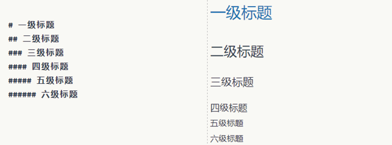
<p>教材图 6.1：标题语法与预览</p>
</div>
</div>

---

# 列表与文字格式

<div class="two">
<div class="textbook-figure compact">
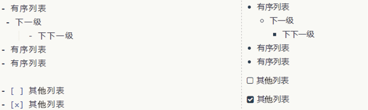
<p>教材图 6.2：无序列表</p>
</div>
<div class="textbook-figure compact">
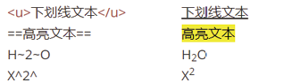
<p>教材图 6.5：下划线、高亮、上下标</p>
</div>
</div>

---

# 公式与代码块

<div class="two">
<div class="textbook-figure compact">
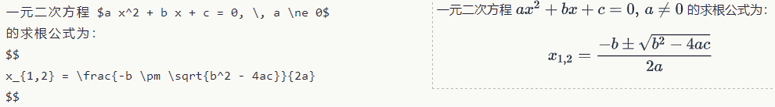
<p>教材图 6.6：LaTeX 数学公式</p>
</div>
<div class="textbook-figure compact">
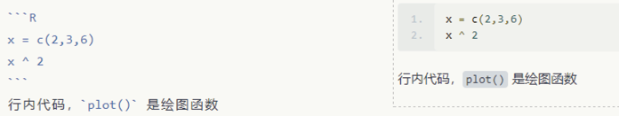
<p>教材图 6.7：高亮代码块</p>
</div>
</div>

---

# 表格、交叉引用与脚注

<div class="two">
<div class="textbook-figure compact">
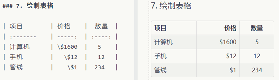
<p>教材图 6.8：Markdown 表格</p>
</div>
<div class="textbook-figure compact">
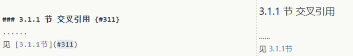
<p>教材图 6.9：交叉引用</p>
</div>
</div>

---

# R Markdown 的编译链

<div class="textbook-figure wide">

<p>教材图 6.11：knitr 执行代码，Pandoc 转换格式</p>
</div>

<div class="callout small">同一份 `.Rmd` 保存数据分析的文字、代码和结果生成规则。</div>

---

# 创建最小 R Markdown 文档

<div class="two">
<div class="textbook-figure compact">
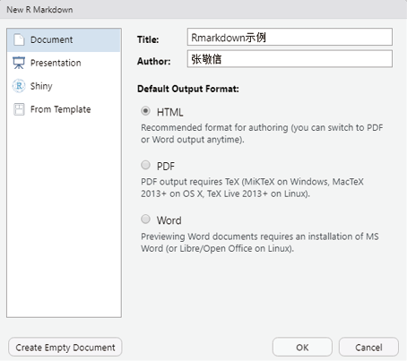
<p>教材图 6.12：New File → R Markdown</p>
</div>
<div class="textbook-figure compact">
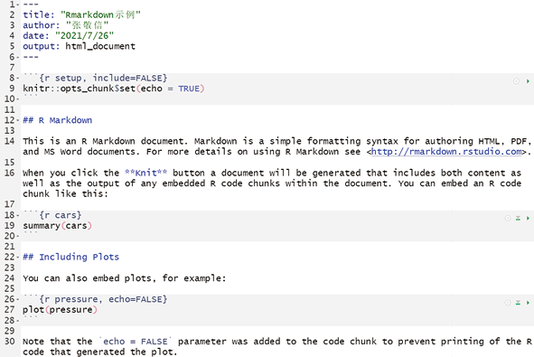
<p>教材图 6.13：默认模板</p>
</div>
</div>

---

# YAML 决定“输出成什么”

```yaml
---
title: "R Markdown 示例"
author: "王芝皓"
date: "`r Sys.Date()`"
output:
  html_document:
    toc: true
    toc_depth: 2
---
```

<div class="callout small">教材列出的输出包括 HTML、Markdown、PDF、Word、PowerPoint、Beamer、ioslides 与 slidy。</div>

---

# 代码块选项控制“显示什么”

| 选项 | 作用 |
|:---|:---|
| `eval = FALSE` | 显示代码但不运行 |
| `echo = FALSE` | 运行但不显示代码 |
| `include = FALSE` | 运行，代码和结果都隐藏 |
| `message = FALSE` | 隐藏消息 |
| `warning = FALSE` | 隐藏警告 |
| `cache = TRUE` | 缓存结果 |
| `fig.cap` | 设置图题 |

---

# 行内代码：结果写进句子

```{r slide-inline-model}
# 用 mtcars 建立教材中的回归模型。
mdl_ch06 <- lm(mpg ~ disp, data = mtcars)

# 提取截距和斜率。
b_ch06 <- coef(mdl_ch06)
b_ch06
```

<div class="callout small">编译后：斜率为 <code>`r round(b_ch06[2], 4)`</code>；数据或模型变化时，正文数值同步更新。</div>

---

# `kable()`：数据框直接变成表格

```{r slide-kable}
# 选取教材指定的前 3 行、前 7 列。
mtcars_table <- mtcars[1:3, 1:7]

# 设置小数位、列名与表题，再显示实际结果。
knitr::kable(
  mtcars_table,
  digits = 2,
  col.names = stringr::str_c("x", 1:7),
  caption = "教材表 6.1：mtcars 部分数据"
)
```

---

# 精美表格：教材中的包

<div class="three compact-cards">
<div class="card"><h3>kableExtra</h3><p>扩展 kable；HTML / LaTeX</p></div>
<div class="card"><h3>huxtable</h3><p>多格式，尤其是 LaTeX</p></div>
<div class="card"><h3>flextable</h3><p>HTML / PDF / Word / PPT</p></div>
</div>

<div class="three compact-cards">
<div class="card"><h3>gt</h3><p>整洁语法组合表格</p></div>
<div class="card"><h3>DT</h3><p>HTML 交互表格</p></div>
<div class="card"><h3>reactable</h3><p>React 交互表格</p></div>
</div>

---

# `flextable`：导出三线表

```{r slide-flextable, eval=FALSE}
iris[1:5, ] |>
  # 转换为可定制表格。
  flextable::flextable() |>
  flextable::set_caption("定制表格示例") |>
  # 增加跨列题头。
  flextable::add_header_row(
    colwidths = c(2, 2, 1),
    values = c("Sepal", "Petal", "")
  ) |>
  # 设置表头与条件高亮。
  flextable::color(color = "red", part = "header") |>
  flextable::highlight(
    i = ~ Sepal.Length < 5,
    j = 1, color = "yellow"
  )
```

---

# `flextable`：Word 输出结果

<div class="textbook-figure wide">

<p>教材图 6.15：Word 中的结果</p>
</div>

---

# 模型结果表：从模型对象到论文表格

```{r slide-modelsummary, eval=FALSE}
# 两个模型放入带名称列表。
models <- list(
  "OLS" = lm(
    Donations ~ Literacy + Clergy,
    data = df
  ),
  "Poisson" = glm(
    Donations ~ Literacy + Commerce,
    family = poisson,
    data = df
  )
)

# 定制模型项名称、星号和小数位。
modelsummary::modelsummary(
  models,
  output = "huxtable",
  stars = TRUE,
  fmt = "%.2f"
)
```

---

# 模型结果表：PDF 输出结果

<div class="textbook-figure wide">
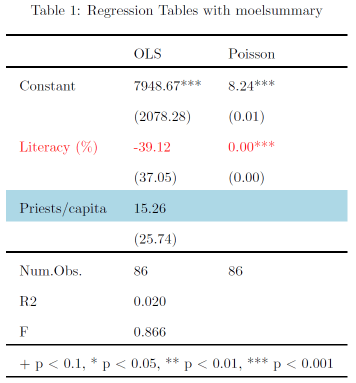
<p>教材图 6.16：导出 PDF 的模型表</p>
</div>

---

# 参数化报告：模板不变，数据改变

```yaml
params:
  name: "input your data name"
```

```{r slide-batch-render, eval=FALSE}
# 用同一模板处理三个数据集。
names <- c("iris", "mtcars", "CO2")

purrr::walk(names, \(data_name) {
  rmarkdown::render(
    "Reproducible.Rmd",
    params = list(name = data_name),
    output_file = paste0(data_name, "分析报告.html")
  )
})
```

---

class: inverse, center, middle

# 6.2 R 与 LaTeX

## 从 R Markdown 到高质量 PDF

---

# PDF 编译路径

<div class="flow-row">
<span>.Rmd</span><b>→</b><span>.md</span><b>→</b><span>.tex</span><b>→</b><span>.pdf</span>
</div>

- TinyTeX：轻量 LaTeX 环境
- `tinytex`：在 R 中安装、管理和编译
- `xelatex`：适合涉及系统中文字体的文档

---

# 先选择一个 LaTeX 发行版

| 使用情形 | Windows | macOS |
|:---|:---|:---|
| 本课程中文 LaTeX 教学 | **CTeX 中文套装** | MacTeX |
| 轻量编译 R Markdown | TinyTeX | TinyTeX |
| 完整 TeX Live 环境 | TeX Live | MacTeX |
| 单独使用 MiKTeX | MiKTeX | — |

<div class="callout small">课程环境建议：Windows 使用 CTeX 中文套装；macOS 使用 MacTeX。TinyTeX 保留为轻量替代。</div>

<div class="warning small">选择一种发行版即可；初学者同时安装多套发行版，容易造成 IDE 找错可执行文件。</div>

---

# Windows 推荐：CTeX 中文套装

- [CTeX 套装官方页面](https://ctex.org/CTeX/)
- [CTeX 官方下载中心](https://ctex.org/ctex/download/)
- 基于 MiKTeX，集成 WinEdt、Ghostscript、GSview
- 增加中文宏包、模板以及 CJK、xeCJK 等支持
- 官方页面当前列出的最新版为 v3.1

<div class="callout small">一般 64 位 Windows 可从“最新版本”选择带 <code>_x64.exe</code> 的基础版。</div>

<div class="warning small">CTeX 官方版权说明限定套装用于科研与学术目的，不得用于商业目的。</div>

---

# Windows：CTeX 安装注意事项

1. 从[下载中心](https://ctex.org/ctex/download/)选择最新版本
2. 基础版：包含 MiKTeX 基本安装和中文常用宏包
3. 完整版：同时下载 `_Full.exe` 与同名 `_Full.nsisbin`
4. 把两个完整版文件放在同一目录，再运行 `.exe`
5. CTeX 2.9.2 或更旧版本不能直接升级到 3.x：先卸载旧版
6. 安装后打开 MiKTeX Console 检查更新
7. 重启 RStudio / Positron，再检查 `xelatex`

<div class="callout small">完成后运行 <code>Sys.which("xelatex")</code>，并编译本节的最小中文 PDF。</div>

---

# Windows：其他可选发行版

### 轻量 R Markdown 环境

- [TinyTeX 官方安装页](https://yihui.org/tinytex/)
- `install.packages("tinytex")`
- `tinytex::install_tinytex()`

### 完整或独立发行版

- [TeX Live Windows 官方页](https://tug.org/texlive/windows.html)
- [TeX Live 网络安装器](https://mirror.ctan.org/systems/texlive/tlnet/install-tl-windows.exe)
- [MiKTeX 官方下载页](https://miktex.org/download)

<div class="callout small">只选择一种发行版；安装完成后重启 IDE，避免仍使用旧的 PATH。</div>

---

# macOS：安装网址与步骤

### 推荐：TinyTeX

- [TinyTeX 官方安装页](https://yihui.org/tinytex/)
- 在 R Console 运行 `tinytex::install_tinytex()`
- 默认安装在用户的 `~/Library/TinyTeX`

### 完整发行版：MacTeX

- [MacTeX 官方下载页](https://tug.org/mactex/mactex-download.html)
- 下载并双击 `MacTeX.pkg`
- 安装包较大，应预留足够磁盘空间
- 安装后重启 RStudio / Positron

<div class="callout small">MacTeX 安装 TeX Live，并提供 TeXShop、TeX Live Utility 等 macOS 工具。</div>

---

# 安装后必须验证

```{r slide-latex-verify, eval=FALSE}
# R 能否找到 XeLaTeX 和 pdfLaTeX？
Sys.which(c("xelatex", "pdflatex"))

# TinyTeX 用户检查当前发行版。
tinytex::is_tinytex()

# 真正启动 XeLaTeX，并查看版本信息。
system2("xelatex", "--version", stdout = TRUE) |>
  head(1)

# 最后编译一份使用 xelatex 的最小 Rmd。
rmarkdown::render("latex-check.Rmd")
```

<div class="warning small">若路径为空：完全退出并重启 IDE；仍为空，再检查安装是否完成及 PATH 配置。</div>

<div class="source-note">官方页面核对日期：2026 年 8 月。</div>

---

# TinyTeX：教材中的环境命令

```{r slide-tinytex, eval=FALSE}
library(tinytex)

# 从本地压缩包安装。
tinytex:::install_prebuilt(pkg = "D:/TinyTeX.zip")

# 查看安装位置和宏包。
tinytex_root()
tl_pkgs()

# 解析日志、补装中文宏包并编译。
parse_packages("test.log")
tlmgr_install("ctex")
xelatex("test.tex")
```

<div class="warning small">安装、卸载和镜像设置会改变本机环境，课堂演示前应确认路径和权限。</div>

---

# 在 RStudio 中编译 LaTeX

<div class="textbook-figure wide">
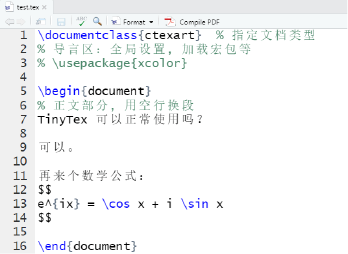
<p>教材图 6.18：保存为 .tex，使用 Compile PDF</p>
</div>

---

# LaTeX 公式嵌入 R Markdown

```latex
$$
\begin{aligned}
\int_a^b f(x)\,\mathrm{d}x
&\approx \sum_{k=1}^n \frac{h}{2}
  [f(x_{i-1})+f(x_i)] \\
&= \frac{h}{2}[f(a)+f(b)]
  + h\sum_{k=1}^{n-1}f(x_i)
\end{aligned}
$$
```

$$
\int_a^b f(x)\,\mathrm{d}x
\approx \sum_{k=1}^n \frac{h}{2}[f(x_{i-1})+f(x_i)]
$$

---

# 论文、幻灯片和书籍模板

<div class="two">
<div class="textbook-figure compact">
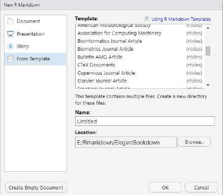
<p>教材图 6.19：rticles 期刊模板</p>
</div>
<div class="textbook-figure compact">
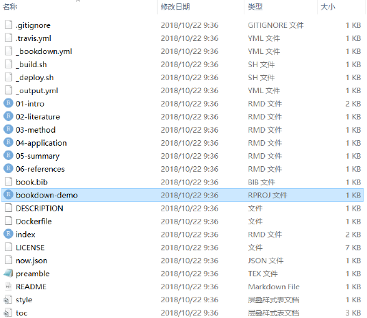
<p>教材图 6.20：bookdown 源文件</p>
</div>
</div>

---

class: inverse, center, middle

# 6.3 R 与 Git 版本控制

## 记录改动，支持协作

---

# Git 与远程平台

<div class="two">
<div>

### Git

- 保存项目在不同时间点的状态
- 比较修改并恢复历史版本
- 用分支隔离不同任务

### GitHub / GitLab / Gitee

- 托管远程 Git 仓库
- 发起 pull request
- 进行协作审查与合并

</div>
<div class="callout">
R Markdown 是纯文本：文字、代码和结果生成规则都能被 Git 跟踪。
</div>
</div>

---

# 配置身份与 SSH

```{r slide-git-config, eval=FALSE}
# 写入每次提交使用的姓名和邮箱。
usethis::use_git_config(
  user.name = "your-name",
  user.email = "your-email@example.com"
)
```

<div class="textbook-figure compact">
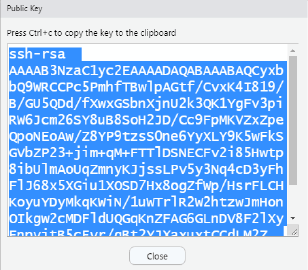
<p>教材图 6.21：创建并查看 RSA Key</p>
</div>

<div class="warning small">私钥、令牌和密码不得写入讲义或公开仓库；远程平台只添加公钥。</div>

---

# 从远程仓库创建 R 项目

<div class="two">
<div class="textbook-figure compact">
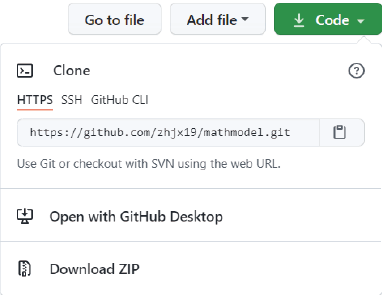
<p>教材图 6.24：复制 HTTPS / SSH 地址</p>
</div>
<div class="textbook-figure compact">
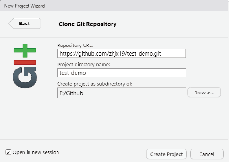
<p>教材图 6.25：Version Control → Git</p>
</div>
</div>

---

# 分支：隔离一组工作

<div class="textbook-figure wide">

<p>教材图 6.26：创建并查看 Collect_Datas 分支</p>
</div>

---

# Staged → Commit → Push

<div class="three">
<div class="textbook-figure compact">
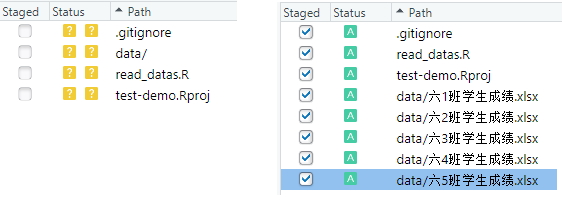
<p>Staged：选择文件</p>
</div>
<div class="textbook-figure compact">
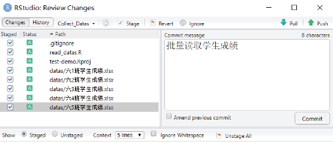
<p>Commit：记录说明</p>
</div>
<div class="textbook-figure compact">
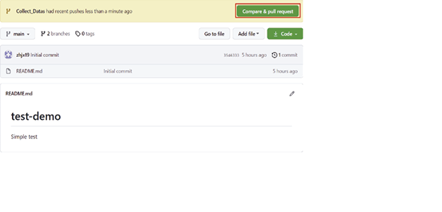
<p>Push：发送到远程</p>
</div>
</div>

---

# 项目工作流与历史

<div class="two">
<div class="textbook-figure compact">
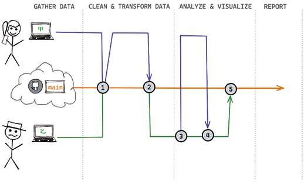
<p>教材图 6.30：一般工作流程</p>
</div>
<div class="textbook-figure compact">
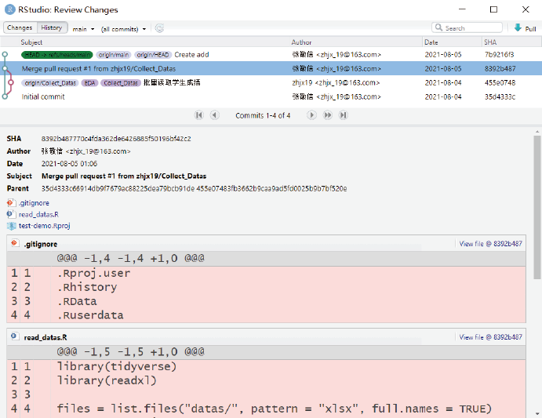
<p>教材图 6.31：查看提交历史</p>
</div>
</div>

---

class: inverse, center, middle

# 6.4 R Shiny

## 输入变化，结果自动响应

---

# Shiny app 的两个部分

```{r slide-shiny-structure, eval=FALSE}
library(shiny)

# ui：定义输入控件和输出位置。
ui <- fluidPage(
  # ...界面元素...
)

# server：读取 input，更新 output。
server <- function(input, output, session) {
  # ...响应逻辑...
}

# 组合并运行。
shinyApp(ui = ui, server = server)
```

---

# 常用输入控件

<div class="two">
<div>

- `actionButton()`：按钮
- `checkboxInput()`：复选框
- `radioButtons()`：单选按钮
- `selectInput()`：下拉选择
- `sliderInput()`：滑块
- `textInput()`：文本输入
- `dateInput()`：日期输入

</div>
<div class="textbook-figure compact">
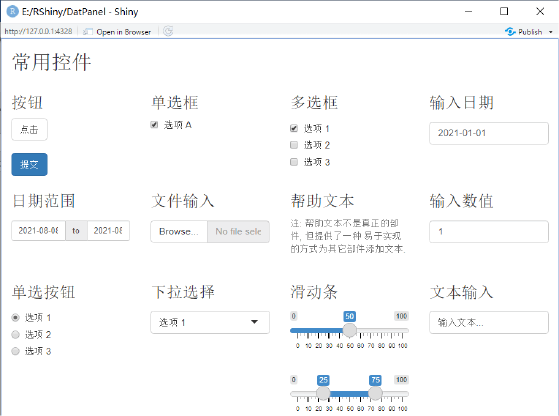
<p>教材图 6.33：常用控件面板</p>
</div>
</div>

---

# server：把输入连接到输出

```{r slide-shiny-greeting, eval=FALSE}
ui <- fluidPage(
  # input$name 从输入框取得姓名。
  textInput("name", "请输入您的姓名："),
  textOutput("greeting")
)

server <- function(input, output, session) {
  output$greeting <- renderText({
    # 姓名改变时，自动重新生成问候语。
    paste0("您好 ", input$name, "！")
  })
}
```

<div class="textbook-figure compact">

<p>教材图 6.34：运行结果</p>
</div>

---

# 响应表达式：共享中间结果

```{r slide-reactive-code, eval=FALSE}
Xbar <- reactive({
  # 读取输入值。
  n <- input$samples
  m <- input$nsim

  # 生成数据并计算样本均值。
  xs <- runif(m * n)
  data.frame(
    x = rowMeans(matrix(xs, ncol = n))
  )
})

output$plot <- renderPlot({
  # 响应对象用 Xbar() 取得。
  ggplot(Xbar(), aes(x)) +
    geom_histogram(bins = input$bins)
})
```

---

# 响应表达式：依赖关系

<div class="textbook-figure wide">
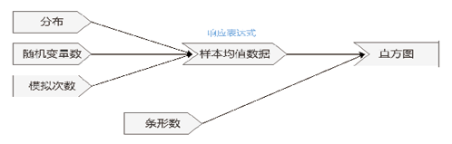
<p>教材图 6.35：输入 → Xbar → 图形</p>
</div>

---

# 中心极限定理 Shiny app

<div class="two">
<div>

- 分布：均匀、二项、泊松、指数
- `samples`：每个样本的随机变量数
- `nsim`：模拟样本量
- `bins`：直方图条形数
- `reactive()`：重新生成样本均值
- `renderPlot()`：更新直方图

</div>
<div class="textbook-figure compact">
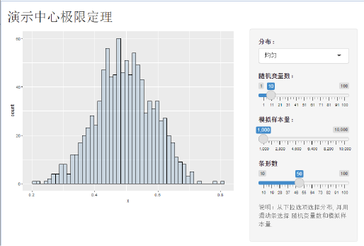
<p>教材图 6.36：应用运行结果</p>
</div>
</div>

---

# 探索性数据展板

<div class="two">
<div class="textbook-figure compact">
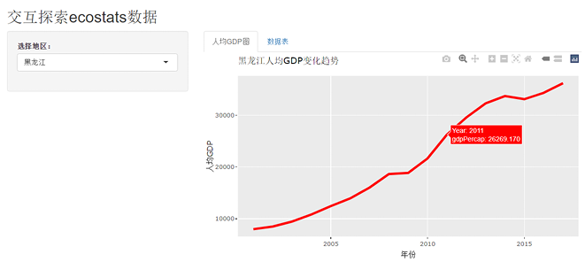
<p>教材图 6.37：Plotly 图形页</p>
</div>
<div class="textbook-figure compact">
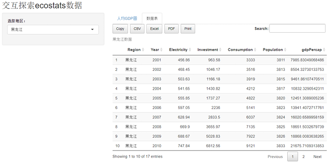
<p>教材图 6.38：DT 数据表页</p>
</div>
</div>

<div class="callout small"><code>selected()</code> 根据地区筛选数据；Plotly 与 DT 两个输出共同使用该响应对象。</div>

---

class: inverse, center, middle

# 6.5 开发 R 包

## 函数 + 文档 + 数据 + 测试 + 元数据

---

# R 包源码结构

<div class="two">
<div>

- `DESCRIPTION`：包元数据与依赖
- `NAMESPACE`：导入和导出规则
- `R/`：函数和数据文档源文件
- `man/`：生成的帮助文档
- `data/`：包数据集
- `tests/`：单元测试
- `vignettes/`：长篇使用指南

</div>
<div class="textbook-figure compact">

<p>教材图 6.39：源码文件</p>
</div>
</div>

---

# 教材函数：AHP

```{r slide-ahp-function}
AHP <- function(A) {
  # 计算最大特征值及其特征向量。
  rlt <- eigen(A)
  Lmax <- Re(rlt$values[1])
  W <- Re(rlt$vectors[, 1]) / sum(Re(rlt$vectors[, 1]))

  # 计算一致性指标与一致性比率。
  n <- nrow(A)
  CI <- (Lmax - n) / (n - 1)
  RI <- c(0, 0, 0.58, 0.90, 1.12, 1.24, 1.32, 1.41, 1.45, 1.49, 1.51)
  CR <- CI / RI[n]

  list(W = W, CR = CR, Lmax = Lmax, CI = CI)
}
```

---

# 运行函数，检查反馈

```{r slide-ahp-result}
# 教材测试使用的 2 × 2 成对比较矩阵。
A_test <- matrix(
  c(1, 1 / 2, 2, 1),
  byrow = TRUE,
  nrow = 2
)

# 返回权重、一致性比率、最大特征值和 CI。
AHP(A_test)
```

---

# roxygen2：注释生成帮助文档

```r
#' @title AHP: Analytic Hierarchy Process
#' @description Calculate AHP weights and consistency measures.
#' @param A A numeric pairwise comparison matrix.
#' @return A list containing W, CR, Lmax and CI.
#' @export
#' @examples
#' A <- matrix(c(1, 1/2, 2, 1), byrow = TRUE, nrow = 2)
#' AHP(A)
```

<div class="textbook-figure compact">
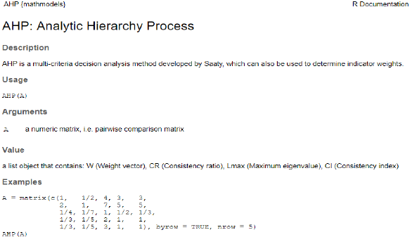
<p>教材图 6.40：document() 生成的帮助页面</p>
</div>

---

# 单元测试：把预期写成代码

```{r slide-ahp-test}
testthat::test_that("AHP weights and type", {
  A <- matrix(c(1, 1 / 2, 2, 1), byrow = TRUE, nrow = 2)
  rlt <- AHP(A)

  # 检查权重数值。
  testthat::expect_equal(
    rlt$W,
    c(0.3333, 0.6667),
    tolerance = 0.001
  )

  # 检查返回类型。
  testthat::expect_type(rlt, "list")
})
```

---

# 包开发检查链

<div class="flow-row">
<span>document()</span><b>→</b><span>test()</span><b>→</b><span>check()</span><b>→</b><span>install()</span>
</div>

- `document()`：更新帮助与 NAMESPACE
- `test()`：运行单元测试
- `check()`：执行完整 R CMD check
- `install()`：安装检查通过的包

---

# 发布到 CRAN

<div class="three">
<div class="textbook-figure compact">
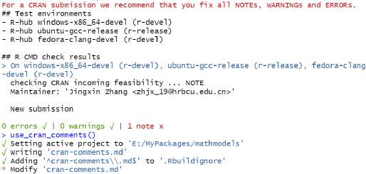
<p>教材图 6.41：检测摘要</p>
</div>
<div class="textbook-figure compact">
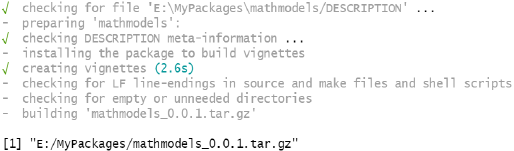
<p>教材图 6.42：源码包捆绑</p>
</div>
<div class="textbook-figure compact">
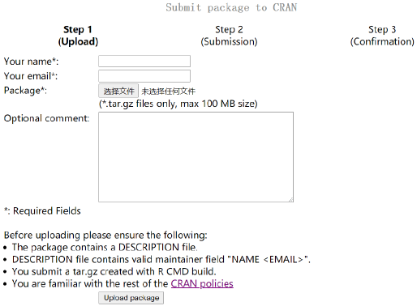
<p>教材图 6.43：提交页面</p>
</div>
</div>

---

# 第 6 章总结

<div class="summary-grid">
<div><b>R Markdown</b><span>可重复文档</span></div>
<div><b>Git</b><span>版本与协作</span></div>
<div><b>Shiny</b><span>网页交互</span></div>
<div><b>R 包</b><span>复用与发布</span></div>
</div>

<div class="callout" style="margin-top:1.4em">教材的共同原则：让数据分析的过程、结果和实现方式能够被复现、检查与分享。</div>

---

class: inverse, center, middle

# 本课程主体章节完成

## 下一步：附录专题与课程综合实践
